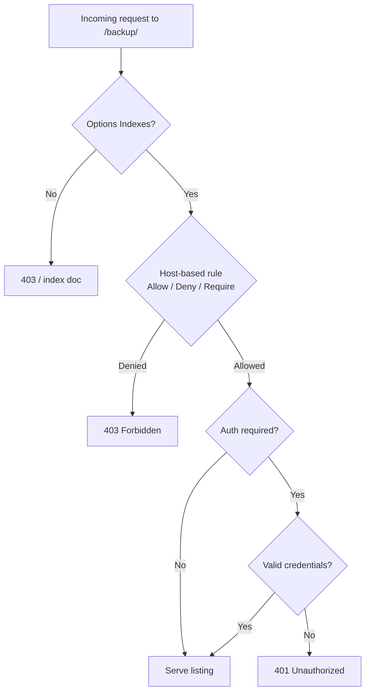

# Apache Directory Listing and Access Control

## Overview

By default the Apache HTTP Server (`httpd`) will auto-generate a browsable index of any directory that lacks an index document (via `mod_autoindex`). On a production host this leaks the full contents of a directory — backups, source archives, uploaded files — to anyone who can reach the URL. This note covers how to:

- Disable directory listing globally with `Options -Indexes`.
- Selectively re-enable listing for a single directory.
- Restrict access to a directory by client IP address.
- Protect a directory with HTTP Basic Authentication, both via `.htaccess` and directly in the vhost.

All examples target a RHEL/CentOS-style layout (`/etc/httpd/…`, `apache` service user) fronting a WordPress document root at `/var/www/html/wordpress/`.

> [!WARNING]
> **Autoindex is a data-exposure risk**
> An exposed listing on a directory such as `uploads/` or `backup/` is a classic web-enumeration finding. Treat `Options -Indexes` as the default posture and opt directories *in* to listing only when there is a deliberate reason.

## Concepts

| Directive | Purpose |
|---|---|
| `Options -Indexes` | Disable automatic directory index generation (recommended default). |
| `Options Indexes` | Explicitly enable auto-index for a directory. |
| `DirectoryIndex` | The document served when a directory is requested (e.g. `index.php`). |
| `AllowOverride AuthConfig` | Permit a directory's `.htaccess` to define authentication. |
| `Order` / `Allow` / `Deny` | Legacy (Apache 2.2) host-based access control. |
| `Require ip` / `Require not ip` | Modern (Apache 2.4+) host-based access control. |

> [!TIP]
> **A missing index becomes a listing**
> Placing an (even empty) index document in a directory suppresses the auto-generated listing regardless of `Options`. This is why the first step below drops an `index.php` into `uploads/`.

## Change Directory and Create an Empty File

Dropping an index file into a sensitive directory is the simplest defence — Apache serves the file instead of a generated listing.

```bash
cd /var/www/html/wordpress/wp-content/uploads
```

```bash
touch index.php
```

## Disable Directory Listing for All Directories

Edit the main Apache configuration file and set `Options -Indexes` on the document root's `<Directory>` block.

```bash
vim /etc/httpd/conf/httpd.conf
```

```apache
<VirtualHost 192.168.1.35:443>
    SSLEngine on
    SSLCertificateFile /etc/pki/tls/certs/localhost.crt
    SSLCertificateKeyFile /etc/pki/tls/private/localhost.key
    DocumentRoot /var/www/html/wordpress/
    DirectoryIndex index.php

    <Directory /var/www/html/wordpress>
        Options -Indexes
    </Directory>
</VirtualHost>
```

Restart Apache to apply:

```bash
systemctl restart httpd.service
```

### Edit Site-Specific Configuration (Optional)

The same control can live in a drop-in vhost file under `conf.d/` instead of the monolithic `httpd.conf`.

```bash
vim /etc/httpd/conf.d/wp-site.conf
```

```apache
<VirtualHost 192.168.1.35:443>
    SSLEngine on
    SSLCertificateFile /etc/pki/tls/certs/localhost.crt
    SSLCertificateKeyFile /etc/pki/tls/private/localhost.key
    ServerName armour.local
    DocumentRoot /var/www/html/wordpress/
    DirectoryIndex index.php
    ServerAlias www.armour.local

    <Directory /var/www/html/wordpress>
        Options -Indexes
    </Directory>
</VirtualHost>
```

Restart Apache again:

```bash
systemctl restart httpd.service
```

## Enable Directory Listing for a Selected Directory

Sometimes a single directory (e.g. a public download area) should remain browsable. Nest a more specific `<Directory>` block with `Options Indexes` inside the vhost while keeping the parent locked down.

Create the directory and set ownership to the Apache service account:

```bash
mkdir /var/www/html/wordpress/backup
```

```bash
chown -R apache:apache /var/www/html/wordpress/backup
```

Update the Apache configuration:

```bash
vim /etc/httpd/conf/httpd.conf
```

```apache
<VirtualHost 192.168.1.35:443>
    SSLEngine on
    SSLCertificateFile /etc/pki/tls/certs/localhost.crt
    SSLCertificateKeyFile /etc/pki/tls/private/localhost.key
    DocumentRoot /var/www/html/wordpress/
    DirectoryIndex index.php

    <Directory /var/www/html/wordpress/backup>
        Options Indexes
    </Directory>

    <Directory /var/www/html/wordpress>
        Options -Indexes
    </Directory>
</VirtualHost>
```

Restart Apache:

```bash
systemctl restart httpd.service
```

> [!NOTE]
> **More specific paths win**
> Apache merges `<Directory>` sections shortest-path-first, so the block for `…/backup` overrides the parent `…/wordpress` block for that sub-tree. Order the blocks from most specific to least specific for readability.

## Access Control by IP Address

The following diagram shows how Apache evaluates a request once listing is enabled — first host-based access rules, then (optionally) authentication.



### Allow Selected IP Addresses

Restrict the browsable `backup/` directory to two trusted hosts.

```bash
vim /etc/httpd/conf/httpd.conf
```

```apache
<VirtualHost 192.168.1.35:443>
    SSLEngine on
    SSLCertificateFile /etc/pki/tls/certs/localhost.crt
    SSLCertificateKeyFile /etc/pki/tls/private/localhost.key
    DocumentRoot /var/www/html/wordpress/
    DirectoryIndex index.php

    <Directory /var/www/html/wordpress/backup>
        Options Indexes
        Order allow,deny
        Allow from 192.168.1.7 192.168.1.51
    </Directory>

    <Directory /var/www/html/wordpress>
        Options -Indexes
    </Directory>
</VirtualHost>
```

Restart Apache:

```bash
systemctl restart httpd.service
```

### Deny Selected IP Addresses

Allow everyone except a specific host.

```bash
vim /etc/httpd/conf/httpd.conf
```

```apache
<VirtualHost 192.168.1.35:443>
    SSLEngine on
    SSLCertificateFile /etc/pki/tls/certs/localhost.crt
    SSLCertificateKeyFile /etc/pki/tls/private/localhost.key
    DocumentRoot /var/www/html/wordpress/
    DirectoryIndex index.php

    <Directory /var/www/html/wordpress/backup>
        Options Indexes
        Order allow,deny
        Allow from all
        Deny from 192.168.1.51
    </Directory>

    <Directory /var/www/html/wordpress>
        Options -Indexes
    </Directory>
</VirtualHost>
```

Restart Apache:

```bash
systemctl restart httpd.service
```

> [!IMPORTANT]
> **Prefer the Apache 2.4 syntax**
> `Order`/`Allow`/`Deny` come from `mod_access_compat` and are deprecated. On Apache 2.4+, use the `Require` directives shown in [Best Practices](#best-practices). Mixing both styles in one directory leads to confusing evaluation order.

## Secure Directory Hosting with User Authentication

### Using `.htaccess`

With `AllowOverride AuthConfig` set on the directory, authentication can be declared in a per-directory `.htaccess` file.

Edit `.htaccess`:

```bash
vim /var/www/html/wordpress/backup/.htaccess
```

```apache
AuthName "Armour Infosec"
AuthType Basic
AuthUserFile /etc/httpd/htpasswd
Require valid-user
```

Create the password file and users (`-c` creates the file — use it only for the first user):

```bash
htpasswd -c /etc/httpd/htpasswd user1
```

```bash
htpasswd /etc/httpd/htpasswd user2
```

Secure the password file so only root and the Apache group can read it:

```bash
chmod 640 /etc/httpd/htpasswd
```

```bash
chown root:apache /etc/httpd/htpasswd
```

Inspect the generated hashes:

```bash
cat /etc/httpd/htpasswd
```

Example output:

```text
user1:$apr1$KTRQrDKN$GMStvuFhhOmRMDYl4D5V8/
user2:$apr1$3BaCfSJa$r2Ljfq9Q3dK/qt5l3l6P50
```

Update the Apache configuration to permit the override:

```bash
vim /etc/httpd/conf/httpd.conf
```

```apache
<VirtualHost 192.168.1.35:443>
    SSLEngine on
    SSLCertificateFile /etc/pki/tls/certs/localhost.crt
    SSLCertificateKeyFile /etc/pki/tls/private/localhost.key
    DocumentRoot /var/www/html/wordpress/
    DirectoryIndex index.php
  
    <Directory /var/www/html/wordpress/backup>
        Options Indexes
        AllowOverride AuthConfig
    </Directory>

    <Directory /var/www/html/wordpress>
        Options -Indexes
    </Directory>
</VirtualHost>
```

Restart Apache:

```bash
systemctl restart httpd.service
```

> [!NOTE]
> **📸 Screenshot**
> _Capture: Browser HTTP Basic Auth dialog prompting for the "Armour Infosec" realm username and password when opening /backup/_

### User Authentication Without `.htaccess`

Declaring authentication directly in the vhost avoids a per-request `.htaccess` lookup and is the faster, recommended approach.

Edit the Apache configuration:

```bash
vim /etc/httpd/conf/httpd.conf
```

```apache
<VirtualHost 192.168.1.35:443>
    SSLEngine on
    SSLCertificateFile /etc/pki/tls/certs/localhost.crt
    SSLCertificateKeyFile /etc/pki/tls/private/localhost.key
    DocumentRoot /var/www/html/wordpress/
    DirectoryIndex index.php

    <Directory /var/www/html/wordpress/backup>
        AuthName "Private"
        AuthType Basic
        AuthBasicProvider file
        AuthUserFile /etc/httpd/htpasswd
        Require valid-user
        Options +Indexes
    </Directory>

    <Directory /var/www/html/wordpress>
        Options -Indexes
    </Directory>
</VirtualHost>
```

Remove the now-redundant `.htaccess`:

```bash
rm -f /var/www/html/wordpress/backup/.htaccess
```

Restart Apache:

```bash
systemctl restart httpd.service
```

## Verification Commands

Confirm access, redirects, and authentication behave as configured.

```bash
curl -I http://armour.local/wordpress/uploads/
```

```bash
curl -I http://armour.local/wordpress/backup/
```

```bash
curl -u user1:password https://armour.local/wordpress/backup/
```

## Best Practices

- Always serve Basic Auth over **HTTPS** — the credentials are only Base64-encoded, so plaintext HTTP exposes them on the wire.
- Keep `Options -Indexes` as the global default and enable `Indexes` per directory only when browsing is intentional.
- Prefer the Apache **2.4+** `Require` syntax over `Order`/`Allow`/`Deny`:

```apache
Require ip 192.168.1.7
Require not ip 192.168.1.51
```

- Secure the password file so only root and the Apache group can read it:

```bash
chmod 640 /etc/httpd/htpasswd
```

```bash
chown root:apache /etc/httpd/htpasswd
```

- Disable `.htaccess` where it is not required — per-directory file lookups add latency compared with directives baked into the vhost, and `AllowOverride None` is the CIS-recommended default.
- Store `htpasswd` files and backups **outside** the document root so they can never be served or listed.

## Security Considerations

- **Information disclosure (OWASP A01/A05):** an exposed autoindex reveals filenames, sizes, and timestamps that aid an attacker's enumeration. Audit every document root for stray browsable directories.
- **Weak Basic Auth hashes:** `htpasswd` defaults to the Apache MD5 (`$apr1$`) variant. For stronger storage use `htpasswd -B` (bcrypt).
- **Defence in depth:** combine IP allow-listing *and* authentication for administrative areas rather than relying on either alone.

## Troubleshooting

| Symptom | Likely cause | Fix |
|---|---|---|
| Listing still appears after `-Indexes` | Change made in wrong `<Directory>` / not restarted | Confirm the correct block, run `httpd -t`, then restart. |
| `.htaccess` auth ignored | `AllowOverride` is `None` | Set `AllowOverride AuthConfig` on the directory. |
| 500 error on the directory | Malformed `.htaccess` or missing auth module | Check `journalctl -u httpd` and `/var/log/httpd/error_log`. |
| Credentials rejected | Wrong `AuthUserFile` path or permissions | Verify the path and that `apache` can read the file. |

## References

- Apache HTTP Server Documentation — `mod_autoindex`, `mod_authn_file`, `mod_authz_host`.
- CIS Apache HTTP Server Benchmark — directory listing and `AllowOverride` guidance.
- OWASP Testing Guide — Review Old, Backup and Unreferenced Files.

## Related

- [Apache-Web-Server-Setup-and-Configuration](Apache-Web-Server-Setup-and-Configuration.md) — base httpd setup these directives extend.
- [Enable-Apache-User-Home-Directories](Enable-Apache-User-Home-Directories.md) — per-user directories governed by the same access controls.
- [Binding-with-Type(SSL-TLS)](Binding-with-Type(SSL-TLS).md) — the HTTPS/TLS layer that should front any Basic Auth.
- Web-Enumeration — misconfigured listing/ACL is a web-enumeration finding.
- [Linux Administration & Server Hardening](../Readme.md) — Linux administration & server hardening hub.
