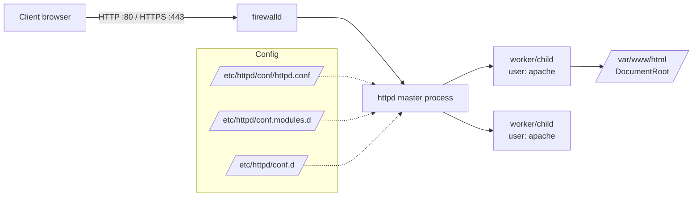

# Apache Web Server Setup and Configuration

## Overview

This note documents installing, configuring, and managing the Apache HTTP Server (`httpd`) on a RHEL/CentOS-family Linux host using the `yum` and `rpm` package managers. It walks through verifying the install, inspecting the packaged files, managing the `systemd` service, opening the firewall with `firewalld`, checking the running processes and service account, and publishing a first website (including loading a CSS template).

> [!NOTE]
> **Distro scope**
> The `httpd` package name, `/etc/httpd/…` layout, and `apache` service user shown here are Red Hat / CentOS / Fedora conventions. On Debian/Ubuntu the package is `apache2`, the config lives under `/etc/apache2/`, and the service user is `www-data` — see [Apache2-Setup-on-Debian](Apache2-Setup-on-Debian.md).

## Architecture



## Check if Apache is Installed

Use the following command to check if Apache (`httpd`) is already installed:

```bash
rpm -qa | grep httpd
```

## Install Apache Web Server

Install Apache using `yum`:

```bash
yum install httpd
```

Install all related Apache packages:

```bash
yum install httpd*
```

## Verify Apache Installation

The `rpm` query flags below reveal everything the package placed on disk.

| Command | Shows |
|---|---|
| `rpm -qi httpd` | Package metadata (version, summary, vendor). |
| `rpm -ql httpd` | Every file installed by the package. |
| `rpm -qc httpd` | Configuration files only. |
| `rpm -qd httpd` | Documentation files only. |

Check package information:

```bash
rpm -qi httpd
```

List installed files:

```bash
rpm -ql httpd
```

List configuration files:

```bash
rpm -qc httpd
```

List documentation files:

```bash
rpm -qd httpd
```

## Apache Configuration

### View Apache Configuration

Check the main configuration file:

```bash
cat /etc/httpd/conf/httpd.conf
```

```bash
tail /etc/httpd/conf/httpd.conf
```

Find the `conf.modules.d` directive:

```bash
grep conf\.modules\.d /etc/httpd/conf/httpd.conf
```

Find the `conf.d` directive:

```bash
grep conf\.d /etc/httpd/conf/httpd.conf
```

## Manage Apache Service

Manage the daemon through `systemd`.

| Action | Command |
|---|---|
| Show status | `systemctl status httpd.service` |
| Start now | `systemctl start httpd.service` |
| Start at boot | `systemctl enable httpd.service` |
| Restart | `systemctl restart httpd.service` |

Check if the Apache service is running:

```bash
systemctl status httpd.service
```

Start the Apache service:

```bash
systemctl start httpd.service
```

Enable Apache to start on system boot:

```bash
systemctl enable httpd.service
```

Restart the Apache service:

```bash
systemctl restart httpd.service
```

## Network and Port Verification

Check open ports and services:

```bash
netstat -nltup
```

Check if port 80 is open:

```bash
netstat -nltup | grep 80
```

Check if Apache is listening:

```bash
netstat -nltup | grep httpd
```

## Firewall Configuration

### Firewalld Configuration for Apache Web Server

Steps to configure `firewalld` to allow Apache Web Server traffic. `firewalld` is a firewall management tool that dynamically manages firewall rules on Linux systems.

Check if `firewalld` is running:

```bash
systemctl status firewalld
```

Start the `firewalld` service:

```bash
systemctl start firewalld
```

Enable `firewalld` to start automatically at boot:

```bash
systemctl enable firewalld
```

Check all active zones and their associated rules:

```bash
firewall-cmd --list-all
```

List all services and ports currently open:

```bash
firewall-cmd --list-services
```

```bash
firewall-cmd --list-ports
```

Allow HTTP (port 80) and HTTPS (port 443) traffic:

```bash
firewall-cmd --permanent --add-service=http
```

```bash
firewall-cmd --permanent --add-service=https
```

Reload `firewalld` to apply the changes:

```bash
firewall-cmd --reload
```

Verify that HTTP and HTTPS are allowed:

```bash
firewall-cmd --list-services
```

If HTTP is not defined as a service, open port 80 manually:

```bash
firewall-cmd --permanent --add-port=80/tcp
```

If HTTPS is not defined as a service, open port 443 manually:

```bash
firewall-cmd --permanent --add-port=443/tcp
```

For example, to open port 8080 for a custom Apache configuration:

```bash
firewall-cmd --permanent --add-port=8080/tcp
```

Reload the firewall to apply changes:

```bash
firewall-cmd --reload
```

Verify open ports:

```bash
firewall-cmd --list-ports
```

> [!TIP]
> **`--permanent` needs a reload**
> A `--permanent` rule is written to disk but does not affect the running firewall until `firewall-cmd --reload`. To change both the running and permanent rule sets at once, issue the command twice (with and without `--permanent`).

### Remove Rules (Optional)

#### Remove HTTP and HTTPS Services

If you want to remove HTTP and HTTPS services:

```bash
firewall-cmd --permanent --remove-service=http
```

```bash
firewall-cmd --permanent --remove-service=https
```

#### Remove Open Ports

If you want to remove specific open ports:

```bash
firewall-cmd --permanent --remove-port=80/tcp
```

```bash
firewall-cmd --permanent --remove-port=443/tcp
```

#### Reload Firewalld After Removing Rules

Reload to apply the changes:

```bash
firewall-cmd --reload
```

### Configure Firewalld Zones (Optional)

#### List Available Zones

Check available zones:

```bash
firewall-cmd --get-zones
```

#### Assign Apache Traffic to a Specific Zone

For example, to allow HTTP traffic in the `public` zone:

```bash
firewall-cmd --zone=public --add-service=http --permanent
```

```bash
firewall-cmd --zone=public --add-service=https --permanent
```

#### Reload to Apply Zone Settings

Reload the firewall:

```bash
firewall-cmd --reload
```

### Enable Logging (Optional)

Enable logging for dropped packets:

```bash
firewall-cmd --set-log-denied=all
```

View firewall logs:

```bash
journalctl -f -u firewalld
```

## Apache Process and User Management

### Check Running Processes

Check Apache processes:

```bash
ps -aux | grep httpd
```

```bash
lsof | grep httpd
```

### Check Apache User and Group

Find the Apache user:

```bash
cat /etc/passwd | grep apache
```

Find the Apache group:

```bash
cat /etc/group | grep apache
```

> [!NOTE]
> **Least privilege**
> The master `httpd` process starts as `root` (to bind port 80/443) and drops its worker children to the unprivileged `apache` user. Content in the document root should be owned appropriately — writable by the deployer, readable by `apache` — never world-writable.

## Configure Website Files

### Create or Edit Web Files

Navigate to the document root:

```bash
cd /var/www/html
```

Create or edit an `index.html` file:

```bash
vim /var/www/html/index.html
```

```text
Test123...
```

### Remove Existing File

Remove the existing file:

```bash
rm -f /var/www/html/index.html
```

### Set Ownership of Web Files

Set ownership of the website files to Apache user:

```bash
chown -Rv apache:apache /var/www/html/*
```

## Load CSS Files

### Download and Extract Template Files

Download template:

```bash
wget https://templatemo.com/tm-zip-files-2020/templatemo_571_hexashop.zip
```

Unzip the template:

```bash
unzip templatemo_571_hexashop.zip
```

Remove the zip file:

```bash
rm -rf templatemo_571_hexashop.zip
```

Move the extracted folder to a new directory:

```bash
mv -v templatemo_571_hexashop site1
```

Copy site files to the Apache document root:

```bash
cp -vr /root/site1/* /var/www/html
```

```bash
chown -Rv apache:apache /var/www/html/*
```

### Configure Apache to Load CSS Files

Add the following line to `httpd.conf` on line 311:

```bash
vim /etc/httpd/conf/httpd.conf
```

```apache
AddType text/html .shtml
AddType text/css .css
AddOutputFilter INCLUDES .shtml
```

Restart Apache:

```bash
systemctl restart httpd.service
```

Set ownership:

```bash
chown -Rv apache:apache /var/www/html/*
```

> [!WARNING]
> **Diagnosing "CSS not applied"**
> If a page renders unstyled, the stylesheet is usually being sent with the wrong MIME type. Confirm the server returns `Content-Type: text/css` for `.css` files (`curl -I http://host/style.css`); the `AddType text/css .css` directive above ensures this.

## Test Apache Setup

### Test Configuration

Create a test file:

```text
Test123...
```

### Check if Apache is Running

Use `curl` to test if Apache is responding:

```bash
curl http://192.168.1.34
```

### Apache Web Server Installation and Configuration Completed

You should now have a working Apache Web Server with a sample HTML file and CSS loading correctly.

## Best Practices

- Run `httpd -t` (config syntax test) before every restart to avoid taking the service down with a typo.
- Serve real content over **HTTPS**; keep port 80 only to redirect to 443.
- Set `Options -Indexes` on the document root — see [Apache-Directory-Listing-and-Access-Control](Apache-Directory-Listing-and-Access-Control.md).
- Remove default/test pages (`index.html`, `phpinfo`) before going to production.
- Keep the firewall closed to everything except the ports the site actually needs.

## Troubleshooting

| Symptom | Check |
|---|---|
| `curl` connection refused | Is `httpd` running (`systemctl status httpd`) and is the port open in `firewalld`? |
| Service won't start | Run `httpd -t` and read `journalctl -u httpd` / `/var/log/httpd/error_log`. |
| Page reachable locally but not remotely | Firewall/zone rules — verify with `firewall-cmd --list-all`. |
| 403 Forbidden | Ownership/permissions on the document root, or a `<Directory>` `Require` rule. |

## References

- Apache HTTP Server Documentation — installation and `httpd.conf` reference.
- Red Hat Enterprise Linux — Deploying web servers and reverse proxies.
- CIS Apache HTTP Server Benchmark.

## Related

- [Apache2-Setup-on-Debian](Apache2-Setup-on-Debian.md) — Debian/`apache2` counterpart of this setup.
- [Types-of-Binding](Types-of-Binding.md) — how to bind the configured vhosts.
- [PHP-and-Mysql-Installation-and-Configuration](PHP-and-Mysql-Installation-and-Configuration.md) — add a dynamic app stack to the server.
- [Apache-Directory-Listing-and-Access-Control](Apache-Directory-Listing-and-Access-Control.md) — secure the served directories.
- Web-Enumeration — offensive enumeration of the resulting web service.
- [Linux Administration & Server Hardening](../Readme.md) — Linux administration & server hardening hub.
