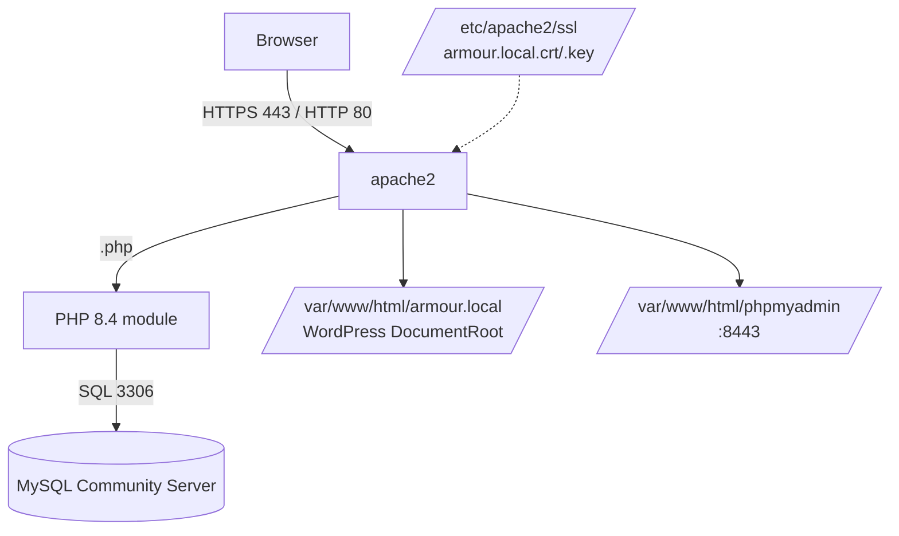

# Apache2 Setup on Debian

## Overview

This end-to-end guide installs and configures a full LAMP-style stack on a Debian-based host: the Apache2 web server, PHP 8.4, MySQL Community Server, a self-signed SSL certificate, phpMyAdmin, name-based HTTPS virtual hosting for `armour.local`, and finally WordPress. It is suited to building a local lab or a small production web server.

> [!NOTE]
> **Debian conventions**
> On Debian/Ubuntu the package is `apache2`, config lives under `/etc/apache2/`, sites are toggled with `a2ensite`/`a2dissite`, modules with `a2enmod`, and the service account is `www-data`. This differs from the RHEL layout in [Apache-Web-Server-Setup-and-Configuration](Apache-Web-Server-Setup-and-Configuration.md).

## Architecture



## Update the System

Ensure your system is up-to-date before beginning.

```bash
apt update
```

```bash
apt upgrade
```

## Install Apache and Networking Tools

Install the Apache web server and networking tools.

```bash
apt install apache2
```

```bash
apt install apache2*
```

```bash
apt install net-tools
```

Verify Apache installation — check listening services and ensure Apache is running:

```bash
netstat -nltup
```

```bash
dpkg -l | grep apache
```

## Configure Apache

Edit the Apache configuration file:

```bash
vim /etc/apache2/apache2.conf
```

> [!NOTE]
> **Ensure these include lines are present**
> They pull in the enabled config snippets and virtual hosts from `conf-enabled/` and `sites-enabled/`.

```apache
# Include generic snippets of statements
IncludeOptional conf-enabled/*.conf

# Include the virtual host configurations:
IncludeOptional sites-enabled/*.conf
```

Restart and enable the Apache service:

```bash
systemctl restart apache2.service
```

```bash
systemctl enable apache2.service
```

Confirm Apache is listening:

```bash
netstat -nltup
```

Disable directory listing — improve security by removing the directory listing option:

```bash
sed -i "s/Options Indexes FollowSymLinks/Options FollowSymLinks/" /etc/apache2/apache2.conf
```

Restart Apache to apply changes:

```bash
systemctl restart apache2.service
```

> [!WARNING]
> **Directory listing exposes files**
> Removing `Indexes` prevents Apache from auto-generating a browsable file index for directories that lack an index document. See [Apache-Directory-Listing-and-Access-Control](Apache-Directory-Listing-and-Access-Control.md) for finer-grained control.

## Installing PHP

Search for PHP versions:

```bash
apt search php | grep "php/stable"
```

Install PHP and extensions:

```bash
apt install php php8.4 php8.4-common php8.4-mbstring php8.4-xmlrpc php8.4-soap php8.4-gd php8.4-xml php8.4-intl php8.4-mysql php8.4-cli php8.4-ldap php8.4-zip php8.4-curl php-xml composer
```

Configure PHP — edit the configuration file:

```bash
vim /etc/php/8.4/apache2/php.ini
```

> [!TIP]
> **Recommended settings**
> Tune these to your workload. Large `upload_max_filesize`/`post_max_size` values suit media-heavy WordPress sites but increase the resource cost of a single request — size them to real need.

```ini
memory_limit = 512M
max_execution_time = 500
max_input_vars = 10000
upload_max_filesize = 2048M
post_max_size = 2048M
allow_url_fopen = On
```

Restart Apache after configuration:

```bash
systemctl restart apache2.service
```

Create a PHP info page:

```bash
vim /var/www/html/phpinfo.php
```

Insert:

```php
<?php
    phpinfo();
?>
```

Set file ownership:

```bash
chown -Rv www-data:www-data /var/www/html/phpinfo.php
```

> [!WARNING]
> **Remove `phpinfo()` before production**
> A reachable `phpinfo.php` discloses PHP version, loaded modules, paths, and environment variables — valuable reconnaissance for an attacker. Delete it once you have confirmed PHP works.

## Installing MySQL Server

### Download MySQL APT Config Package

Install prerequisites:

```bash
apt install wget
```

Download package:

```bash
wget https://dev.mysql.com/get/mysql-apt-config_0.8.24-1_all.deb
```

Install it:

```bash
apt install ./mysql-apt-config_0.8.24-1_all.deb
```

Update packages:

```bash
apt update
```

Install MySQL:

```bash
apt install mysql-community-server
```

Enable and start MySQL:

```bash
systemctl restart mysql.service
```

```bash
systemctl enable mysql.service
```

### Verify MySQL is Running

```bash
netstat -nltup
```

```bash
netstat -nltup | grep 3306
```

### Secure and Access MySQL

Run the secure setup:

```bash
mysql_secure_installation
```

Access MySQL:

```bash
mysql -u root -p
```

Inside MySQL:

```sql
show databases;
```

Optional — create a remote root user:

```sql
CREATE USER 'root'@'%' IDENTIFIED WITH caching_sha2_password BY 'your_password';
GRANT ALL PRIVILEGES ON *.* TO 'root'@'%' WITH GRANT OPTION;
```

> [!WARNING]
> **Avoid a remote root user in production**
> Granting `root@'%'` all privileges exposes full database control to any host that can reach port 3306. Prefer a least-privilege, application-scoped account bound to a specific host, and keep 3306 behind the firewall.

## Enabling SSL on Apache

Enable the SSL module:

```bash
a2enmod ssl
```

Restart Apache:

```bash
systemctl restart apache2.service
```

Enable the default SSL site:

```bash
a2ensite default-ssl
```

Reload Apache:

```bash
systemctl reload apache2
```

```bash
service apache2 reload
```

Check services:

```bash
netstat -nltup
```

## Creating a Self-Signed SSL Certificate

Create the SSL directory:

```bash
mkdir /etc/apache2/ssl
```

Generate the certificate:

```bash
openssl req -x509 -nodes -days 365 -newkey rsa:2048 -keyout /etc/apache2/ssl/armour.local.key -out /etc/apache2/ssl/armour.local.crt
```

Verify:

```bash
cat /etc/apache2/ssl/armour.local.key
```

```bash
cat /etc/apache2/ssl/armour.local.crt
```

Update the hosts file:

```bash
vim /etc/hosts
```

Example entry:

```text
192.168.1.28    armour.local www.armour.local
```

> [!NOTE]
> **Self-signed vs CA-issued**
> A self-signed certificate is fine for a lab, but browsers will warn on it. For anything public, use a CA-issued certificate (e.g. Let's Encrypt via `certbot`).

## phpMyAdmin Installation

Download and unzip:

```bash
wget https://files.phpmyadmin.net/phpMyAdmin/5.2.0/phpMyAdmin-5.2.0-all-languages.zip
```

```bash
unzip phpMyAdmin-5.2.3-all-languagess.zip
```

Move files:

```bash
mv -v phpMyAdmin-5.2.3-all-languages /var/www/html/phpmyadmin
```

Set ownership:

```bash
chown -Rv www-data:www-data /var/www/html/phpmyadmin
```

Create the config file:

```bash
cp -v /var/www/html/phpmyadmin/config.sample.inc.php /var/www/html/phpmyadmin/config.inc.php
```

```bash
chown -Rv www-data:www-data /var/www/html/phpmyadmin/config.inc.php
```

Generate a blowfish secret:

```bash
pwgen 32 -1
```

Edit the config:

```bash
vim /var/www/html/phpmyadmin/config.inc.php
```

Insert the secret:

```php
$cfg['blowfish_secret'] = 'ophixah6ufooshae9veipahK4dae4gah';
```

Create the SSL config:

```bash
vim /etc/apache2/sites-available/phpmyadmin-ssl.conf
```

Insert:

```apache
<VirtualHost 192.168.1.35:8443>
    DocumentRoot /var/www/html/phpmyadmin/
    SSLEngine on
    SSLCertificateFile /etc/apache2/ssl/armour.local.crt
    SSLCertificateKeyFile /etc/apache2/ssl/armour.local.key
    <Directory /var/www/html/phpmyadmin/>
        Options FollowSymLinks
        AllowOverride All
        Order allow,deny
        allow from all
    </Directory>
    ErrorLog /var/log/apache2/phpmyadmin-error_log
    CustomLog /var/log/apache2/phpmyadmin-access_log common
</VirtualHost>
```

> [!IMPORTANT]
> **Lock down phpMyAdmin**
> phpMyAdmin is a prime brute-force and exploit target. Restrict it by IP (`Require ip …`), keep it on HTTPS, and never expose it to the public internet unauthenticated.

## Configure Apache Virtual Host for HTTPS

Create the web root:

```bash
mkdir -p /var/www/html/armour.local
```

Create the virtual host file:

```bash
vim /etc/apache2/sites-available/armour.local-ssl.conf
```

Insert configuration:

```apache
<VirtualHost 192.168.1.28:80>
    ServerAdmin webmaster@armour.local
    ServerName armour.local
    ServerAlias www.armour.local
    DocumentRoot /var/www/html/armour.local
    <Directory /var/www/html/armour.local>
        Options Indexes FollowSymLinks
        AllowOverride All
        Require all granted
    </Directory>
    ErrorLog ${APACHE_LOG_DIR}/armour.local-error.log
    CustomLog ${APACHE_LOG_DIR}/armour.local-access.log combined
</VirtualHost>

<VirtualHost 192.168.1.28:443>
    ServerAdmin webmaster@armour.local
    ServerName armour.local
    ServerAlias www.armour.local
    DocumentRoot /var/www/html/armour.local
    SSLEngine on
    SSLCertificateFile /etc/apache2/ssl/armour.local.crt
    SSLCertificateKeyFile /etc/apache2/ssl/armour.local.key
    <Directory /var/www/html/armour.local>
        Options Indexes FollowSymLinks
        AllowOverride All
        Require all granted
    </Directory>
    ErrorLog ${APACHE_LOG_DIR}/armour.local-error.log
    CustomLog ${APACHE_LOG_DIR}/armour.local-access.log combined
</VirtualHost>
```

Enable the site:

```bash
a2ensite armour.local-ssl.conf
```

Disable the default sites:

```bash
a2dissite 000-default.conf
```

```bash
a2dissite default-ssl.conf
```

Reload and restart:

```bash
systemctl reload apache2
```

```bash
systemctl restart apache2
```

Optional — provide the certificate for download:

```bash
cp -v /etc/apache2/ssl/armour.local.crt /var/www/html
```

Access via browser:

```text
http://192.168.1.45/armour.local.crt
```

## Install WordPress

Download and unzip:

```bash
wget https://wordpress.org/latest.zip
```

```bash
unzip latest.zip
```

Move WordPress files:

```bash
mv -v wordpress/* /var/www/html/armour.local
```

Set permissions:

```bash
chown -Rv www-data:www-data /var/www/html/armour.local
```

## Best Practices

- Run `apache2ctl configtest` (or `apache2ctl -t`) before restarting after every config change.
- Redirect all HTTP (`:80`) traffic to HTTPS (`:443`) and disable weak TLS protocols/ciphers.
- Delete `phpinfo.php` and any test files before production.
- Give WordPress a dedicated least-privilege MySQL user, not `root`.
- Keep phpMyAdmin, MySQL (3306), and the SSL private key inaccessible from untrusted networks.

## Troubleshooting

| Symptom | Check |
|---|---|
| `a2ensite` reports "does not exist" | Confirm the `.conf` filename in `/etc/apache2/sites-available/`. |
| SSL site not reachable | Is `mod_ssl` enabled (`a2enmod ssl`) and port 443 open? Run `apache2ctl -t`. |
| PHP downloads instead of executing | PHP module not enabled/loaded for Apache — reinstall `libapache2-mod-php`/restart. |
| MySQL access denied | Re-run `mysql_secure_installation`; verify user/host and auth plugin. |
| Browser TLS warning | Expected for the self-signed cert — import it or use a CA-issued cert. |

## References

- Apache HTTP Server Documentation (Debian layout).
- Debian Wiki — Apache and PHP.
- MySQL and phpMyAdmin official documentation.
- WordPress.org — Hardening WordPress.

## Related

- [Apache-Web-Server-Setup-and-Configuration](Apache-Web-Server-Setup-and-Configuration.md) — CentOS/httpd counterpart of this setup.
- [PHP-and-Mysql-Installation-and-Configuration](PHP-and-Mysql-Installation-and-Configuration.md) — deeper PHP/MySQL configuration.
- [Binding-with-Type(SSL-TLS)](Binding-with-Type(SSL-TLS).md) — the TLS/SSL binding concepts used here.
- [Multiple-Web-Sites-with-SSL](Multiple-Web-Sites-with-SSL.md) — host several TLS sites on one server.
- Web-Enumeration — enumerate the deployed web server.
- [Linux Administration & Server Hardening](../Readme.md) — Linux administration & server hardening hub.
