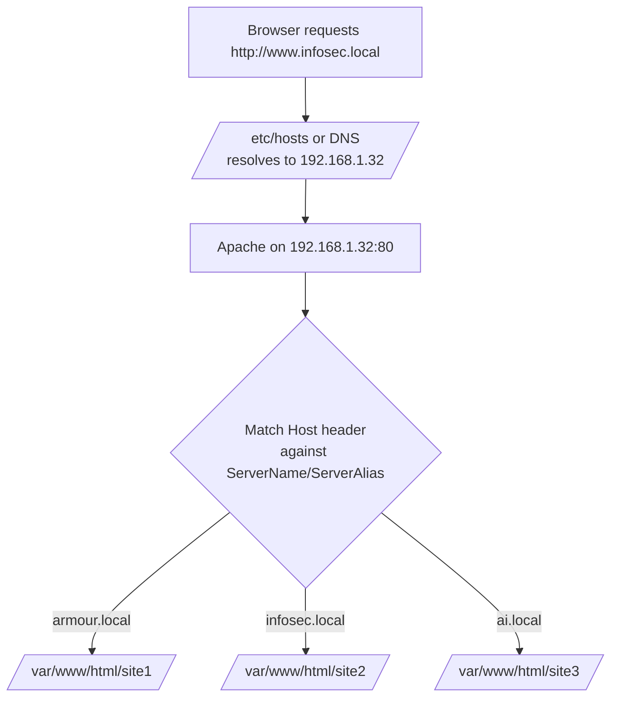

# Binding with Domain Name

## Overview

Apache can serve different websites based on the **domain name** in the request using the `ServerName` and `ServerAlias` directives inside `<VirtualHost>` blocks. This is **name-based virtual hosting**: multiple sites share a single IP address and port, and Apache selects the right document root by matching the HTTP `Host:` header. This note configures `armour.local`, `infosec.local`, and `ai.local` on `192.168.1.32`, then extends the setup to bind the same names on alternate ports.

> [!NOTE]
> **Name-based vs IP-based**
> Name-based hosting keys off the `Host:` header, so many domains can live on one IP. IP-based hosting ([Binding-with-IP-Add-in-Apache](Binding-with-IP-Add-in-Apache.md)) gives each site its own IP. Port-based hosting ([Binding-with-Port-No.-in-Apache](Binding-with-Port-No.-in-Apache.md)) separates sites by port.

## How Name-Based Resolution Works



## Configure Hostnames (DNS or /etc/hosts)

To simulate DNS resolution, define the domain names in the `/etc/hosts` file.

### Edit `/etc/hosts`

```bash
vim /etc/hosts
```

Add the following entries:

```text
127.0.0.1   localhost ns1 ns1.armour.local
::1         localhost localhost6 ns1 ns1.armour.local
192.168.1.32 ns1 ns1.armour.local armour.local www.armour.local ai.local www.ai.local infosec.local www.infosec.local
```

This will resolve the domain names to the local IP (`192.168.1.32`).

## Test DNS Resolution

Use `dig` to confirm that the domain names resolve to the correct IP:

```bash
dig www.armour.local +short
```

Example output:

```text
armour.local.
192.168.1.32
```

Repeat for other domains:

```bash
dig www.infosec.local +short
```

```bash
dig www.ai.local +short
```

## Create Apache Virtual Host Files

Define virtual hosts for each domain. Apache will route incoming requests based on the `ServerName` and `ServerAlias`.

### Main Virtual Host

Create a default virtual host file:

```bash
vim /etc/httpd/conf/httpd.conf
```

Example:

```apache
<VirtualHost 192.168.1.32:80>
    DocumentRoot /var/www/html/site1/
    DirectoryIndex index.html
</VirtualHost>
```

> [!TIP]
> **The first vhost is the default**
> When no `ServerName` matches the `Host:` header, Apache serves the **first** `<VirtualHost>` for that IP:port. Define an explicit default (as above) so unmatched requests land somewhere predictable.

### Virtual Host for `armour.local`

Create a virtual host file for `armour.local`:

```bash
vim /etc/httpd/conf.d/armour.conf
```

Example:

```apache
<VirtualHost 192.168.1.32:80>
    ServerName armour.local
    ServerAlias www.armour.local
    DocumentRoot /var/www/html/site1/
    DirectoryIndex index.html
</VirtualHost>
```

### Virtual Host for `infosec.local`

Create a virtual host file for `infosec.local`:

```bash
vim /etc/httpd/conf.d/infosec.conf
```

Example:

```apache
<VirtualHost 192.168.1.32:80>
    ServerName infosec.local
    ServerAlias www.infosec.local
    DocumentRoot /var/www/html/site2/
    DirectoryIndex index.html
</VirtualHost>
```

### Virtual Host for `ai.local`

Create a virtual host file for `ai.local`:

```bash
vim /etc/httpd/conf.d/ai.conf
```

Example:

```apache
<VirtualHost 192.168.1.32:80>
    ServerName ai.local
    ServerAlias www.ai.local
    DocumentRoot /var/www/html/site3/
    DirectoryIndex index.html
</VirtualHost>
```

### Check Apache Configuration

Validate the Apache configuration:

```bash
httpd -t
```

Example output:

```text
Syntax OK
```

### Restart Apache

Apply the changes:

```bash
systemctl restart httpd.service
```

### Confirm Ports and Bindings

Use `netstat` or `ss` to check if Apache is listening on the expected ports:

```bash
netstat -nltup | grep httpd
```

Configure the firewall:

```bash
firewall-cmd --permanent --add-port=80/tcp
firewall-cmd --permanent --add-port=8080/tcp
firewall-cmd --permanent --add-port=8081/tcp
firewall-cmd --permanent --add-port=8082/tcp
firewall-cmd --reload
```

## Binding Domains with Different Ports

You can also bind the same domains to different ports using `Listen`.

### Bind `armour.local` on Port 8080

Edit the Apache config:

```bash
vim /etc/httpd/conf.d/armour-8080.conf
```

Example:

```apache
Listen 8080

<VirtualHost 192.168.1.32:8080>
    ServerName armour.local
    ServerAlias www.armour.local
    DocumentRoot /var/www/html/site4/
    DirectoryIndex index.html
</VirtualHost>
```

### Bind `infosec.local` on Port 8080

Create a virtual host file for `infosec.local` on port 8080:

```bash
vim /etc/httpd/conf.d/infosec-8080.conf
```

Example:

```apache
Listen 8080

<VirtualHost 192.168.1.31:8080>
    ServerName infosec.local
    ServerAlias www.infosec.local
    DocumentRoot /var/www/html/site3/
    DirectoryIndex index.html
</VirtualHost>
```

> [!WARNING]
> **Declare each `Listen` port only once**
> Apache reads a `Listen 8080` directive globally. If two included files both declare `Listen 8080`, Apache fails to start with "Address already in use". Put shared `Listen` lines in one place (e.g. `httpd.conf`) rather than repeating them per site.

### Bind `ai.local` on Port 8081

Create a virtual host file for `ai.local` on port 8081:

```bash
vim /etc/httpd/conf.d/ai-8081.conf
```

Example:

```apache
Listen 8081

<VirtualHost 192.168.1.31:8081>
    ServerName ai.local
    ServerAlias www.ai.local
    DocumentRoot /var/www/html/site4/
    DirectoryIndex index.html
</VirtualHost>
```

### Check Apache Configuration

Validate the Apache configuration:

```bash
httpd -t
```

Example output:

```text
Syntax OK
```

### Restart Apache

Apply the changes:

```bash
systemctl restart httpd.service
```

### Confirm Ports and Bindings

Use `netstat` or `ss` to check if Apache is listening on the expected ports:

```bash
netstat -nltup | grep httpd
```

Example output:

```text
tcp 0 0 192.168.1.31:80        0.0.0.0:*        LISTEN   1234/httpd
tcp 0 0 192.168.1.31:8080      0.0.0.0:*        LISTEN   1234/httpd
tcp 0 0 192.168.1.31:8081      0.0.0.0:*        LISTEN   1234/httpd
```

### Test in Browser

You should be able to access the sites by their domain names:

| Domain | Port | Expected Output |
|---|---|---|
| `http://armour.local` | 80 | `site1` homepage |
| `http://www.armour.local` | 80 | `site1` homepage |
| `http://infosec.local` | 80 | `site2` homepage |
| `http://www.infosec.local` | 80 | `site2` homepage |
| `http://ai.local` | 80 | `site3` homepage |
| `http://www.ai.local` | 80 | `site3` homepage |
| `http://armour.local:8080` | 8080 | `armour` homepage |
| `http://infosec.local:8080` | 8080 | `armour` homepage |
| `http://ai.local:8081` | 8081 | `armour` homepage |

## Example: Complete Apache Virtual Host Configuration

Example of a complete Apache configuration using different domain names and ports:

```apache
Listen 80
Listen 8080
Listen 8081

<VirtualHost 192.168.1.32:80>
    DocumentRoot /var/www/html/site1/
    DirectoryIndex index.html
</VirtualHost>

<VirtualHost 192.168.1.32:80>
    ServerName armour.local
    ServerAlias www.armour.local
    DocumentRoot /var/www/html/site2/
    DirectoryIndex index.html
</VirtualHost>

<VirtualHost 192.168.1.32:80>
    ServerName infosec.local
    ServerAlias www.infosec.local
    DocumentRoot /var/www/html/site3/
    DirectoryIndex index.html
</VirtualHost>

<VirtualHost 192.168.1.32:8080>
    ServerName armour.local
    ServerAlias www.armour.local
    DocumentRoot /var/www/html/site2/
    DirectoryIndex index.html
</VirtualHost>

<VirtualHost 192.168.1.32:8081>
    ServerName ai.local
    ServerAlias www.ai.local
    DocumentRoot /var/www/html/site4/
    DirectoryIndex index.html
</VirtualHost>
```

## Best Practices

- Always run `httpd -t` before restarting to catch typos and duplicate `Listen` errors.
- Give every vhost an explicit `ServerName` so request routing is unambiguous.
- Set a deliberate default vhost to control what unmatched `Host:` headers receive.
- For production, front name-based hosting with **HTTPS** and per-site certificates (SNI) — see [Binding-with-Type(SSL-TLS)](Binding-with-Type(SSL-TLS).md).
- Open only the ports you actually serve in the firewall.

## Troubleshooting

| Symptom | Likely cause | Fix |
|---|---|---|
| All domains show the same site | Missing/incorrect `ServerName`, so the default vhost answers | Set `ServerName`/`ServerAlias` correctly; run `httpd -S` to see the vhost map. |
| Domain doesn't resolve | `/etc/hosts` or DNS entry missing | Add the entry; verify with `dig <name> +short`. |
| Apache won't start on alt port | Duplicate `Listen` or firewall/SELinux block | Declare `Listen` once; open the port; check `journalctl -u httpd`. |
| Wrong document root served | vhost order — first match wins | Reorder blocks; use `httpd -S` to confirm which vhost matches. |

## References

- Apache HTTP Server Documentation — Name-based Virtual Host Support.
- Apache `mod_core` — `ServerName`, `ServerAlias`, `Listen`, `VirtualHost`.

## Related

- [Types-of-Binding](Types-of-Binding.md) — parent overview of binding methods.
- [Binding-with-IP-Add-in-Apache](Binding-with-IP-Add-in-Apache.md) — sibling name-vs-IP binding.
- [Binding-with-Port-No.-in-Apache](Binding-with-Port-No.-in-Apache.md) — sibling port-based binding.
- Web-Enumeration — vhost names matter for web enumeration.
- [Linux Administration & Server Hardening](../Readme.md) — Linux administration & server hardening hub.
