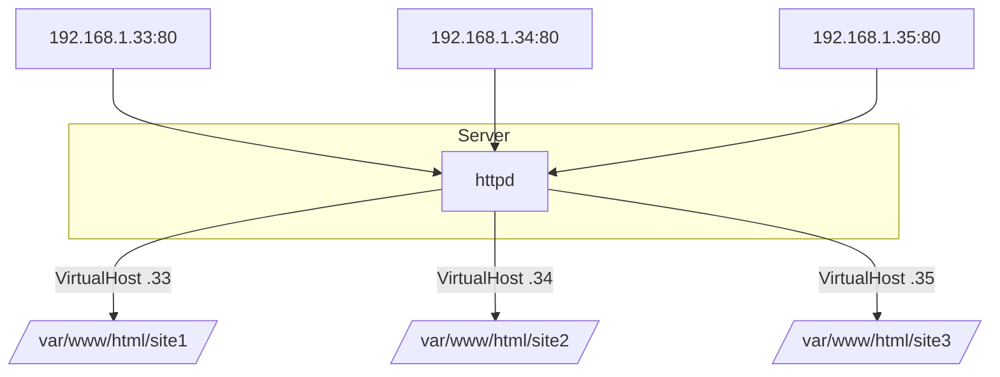

# Binding with IP Add in Apache

## Overview

Apache can bind its `<VirtualHost>` blocks to specific IP addresses (and ports), letting a single server host multiple websites — each answering on its own IP. This is **IP-based virtual hosting**. This note creates several site directories, points Apache at specific IPs via drop-in config files under `/etc/httpd/conf.d/`, and validates the result. The examples use the `httpd` (RHEL/CentOS) layout and IPs in the `192.168.1.0/24` range.

> [!NOTE]
> **Choosing a binding style**
> IP-based hosting gives each site a dedicated address (useful for distinct SSL certs pre-SNI, or hard network separation). If sites should share one IP, use name-based hosting ([Binding-with-Domain-Name](Binding-with-Domain-Name.md)); to separate by port, see [Binding-with-Port-No.-in-Apache](Binding-with-Port-No.-in-Apache.md).

## Binding Model



## 1. Create Website Directories

Navigate to the document root:

```bash
cd /var/www/html/
```

Create directories for each website:

```bash
mkdir site1 site2 site3
```

Set permissions:

```bash
chown -Rv apache:apache site1/ site2/ site3/
```

```bash
chown -Rv apache:apache site*
```

## 2. Modify Apache Configuration

Open the main Apache configuration file:

```bash
vim /etc/httpd/conf/httpd.conf
```

Define multiple virtual hosts, one per IP address:

```apache
IncludeOptional conf.d/*.conf

<VirtualHost 192.168.1.34:80>
    DocumentRoot /var/www/html/site1/
    DirectoryIndex index.html
</VirtualHost>

<VirtualHost 192.168.1.35:80>
    DocumentRoot /var/www/html/site2/
    DirectoryIndex index.html
</VirtualHost>

<VirtualHost 192.168.1.36:80>
    DocumentRoot /var/www/html/site3/
    DirectoryIndex index.html
</VirtualHost>

<VirtualHost 192.168.1.37:80>
    DocumentRoot /var/www/html/site4/
    DirectoryIndex index.html
</VirtualHost>

```

Ensure the following line is present to allow virtual hosts:

```apache
IncludeOptional conf.d/*.conf
```

Save and exit.

> [!IMPORTANT]
> **The IP must exist on the host**
> Apache can only bind to an address the machine actually owns. Assign each IP to an interface (e.g. `ip addr add 192.168.1.34/24 dev eth0`) before binding a vhost to it, or `httpd` will fail with "could not bind to address".

## 3. Create Virtual Host Files

Create individual virtual host configuration files under `/etc/httpd/conf.d/`.

### 3.1. Single IP Binding

Bind Apache to a specific IP address (`192.168.1.33`) for a single site:

```bash
vim /etc/httpd/conf.d/site1.conf
```

Example:

```apache
<VirtualHost 192.168.1.33:80>
    DocumentRoot /var/www/html/site1/
    DirectoryIndex index.html
</VirtualHost>
```

### 3.2. Multiple IP Bindings

You can bind Apache to different IP addresses for multiple sites.

1. `site1.conf`:

```bash
vim /etc/httpd/conf.d/site1.conf
```

Example:

```apache
<VirtualHost 192.168.1.33:80>
    DocumentRoot /var/www/html/site1/
    DirectoryIndex index.html
</VirtualHost>
```

2. `site2.conf`:

```bash
vim /etc/httpd/conf.d/site2.conf
```

Example:

```apache
<VirtualHost 192.168.1.34:80>
    DocumentRoot /var/www/html/site2/
    DirectoryIndex index.html
</VirtualHost>
```

3. `site3.conf`:

```bash
vim /etc/httpd/conf.d/site3.conf
```

Example:

```apache
<VirtualHost 192.168.1.35:80>
    DocumentRoot /var/www/html/site3/
    DirectoryIndex index.html
</VirtualHost>
```

### 3.3. Binding to All IP Addresses

If you want Apache to listen on all available IP addresses:

```bash
vim /etc/httpd/conf.d/site1.conf
```

Example:

```apache
<VirtualHost *:80>
    DocumentRoot /var/www/html/site1/
    DirectoryIndex index.html
</VirtualHost>
```

> [!WARNING]
> **Don't mix `*:80` with specific IPs on the same port**
> Apache disallows combining a wildcard `<VirtualHost *:80>` with `<VirtualHost 192.168.1.x:80>` blocks for the same port — it produces "mixing * ports and non-* ports" warnings and unpredictable matching. Pick one scheme per port.

## Validate Configuration

Check if the Apache configuration is valid:

```bash
httpd -t
```

Example output:

```text
Syntax OK
```

## Restart Apache

Apply the changes by restarting the Apache service:

```bash
systemctl restart httpd.service
```

## Test the Configuration

Use `netstat` to confirm Apache is listening on the correct ports:

```bash
netstat -nltup | grep httpd
```

Example output:

```text
tcp        0      0 192.168.1.31:80        0.0.0.0:*               LISTEN      1234/httpd
tcp        0      0 192.168.1.32:80        0.0.0.0:*               LISTEN      1234/httpd
tcp        0      0 192.168.1.33:80        0.0.0.0:*               LISTEN      1234/httpd
```

You can also confirm the parsed vhost-to-IP mapping directly:

```bash
httpd -S
```

## Summary

| Type of Binding | Example Configuration | Use Case |
|---|---|---|
| Bind to All IPs | `<VirtualHost *:80>` | Use when you want Apache to listen on all interfaces |
| Bind to Specific IP | `<VirtualHost 192.168.1.31:80>` | Use to host multiple sites on different IPs |
| Bind to Multiple IPs | Multiple `<VirtualHost>` blocks | Use to configure several virtual hosts |

## Best Practices

- Assign and verify each IP on an interface before binding a vhost to it.
- Keep one drop-in `.conf` per site under `conf.d/` for maintainability rather than a monolithic file.
- Run `httpd -t` and `httpd -S` after every change to validate syntax and the resulting vhost map.
- Set `Options -Indexes` per document root — see [Apache-Directory-Listing-and-Access-Control](Apache-Directory-Listing-and-Access-Control.md).
- Open only the required IP:port combinations in the firewall.

## Troubleshooting

| Symptom | Likely cause | Fix |
|---|---|---|
| `could not bind to address 192.168.1.x:80` | IP not assigned to any interface, or already in use | Add the IP (`ip addr add …`); check `ss -tlnp` for conflicts. |
| Wrong site served for an IP | Overlapping/duplicate vhost or `*:80` mixing | Review `httpd -S`; avoid mixing wildcard and specific IPs. |
| Config test fails | Syntax error in a `conf.d/*.conf` file | Read the exact line from `httpd -t` output and fix. |
| Site unreachable remotely | Firewall/SELinux blocking the port | Open the port; check `journalctl -u httpd`. |

## References

- Apache HTTP Server Documentation — IP-based Virtual Host Support.
- Apache `mod_core` — `VirtualHost`, `Listen`, `DocumentRoot`.

## Related

- [Types-of-Binding](Types-of-Binding.md) — parent overview of binding methods.
- [Binding-with-Domain-Name](Binding-with-Domain-Name.md) — sibling name-based binding.
- [Binding-with-Port-No.-in-Apache](Binding-with-Port-No.-in-Apache.md) — sibling port-based binding.
- Web-Enumeration — IP/vhost mapping aids web enumeration.
- [Linux Administration & Server Hardening](../Readme.md) — Linux administration & server hardening hub.
