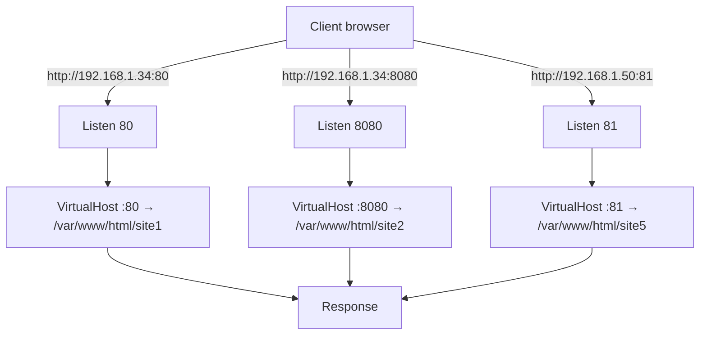

# Binding with Port No. in Apache

## Overview

Apache HTTPD can bind its listeners to one or more TCP ports, letting a single server host multiple websites that are separated by port number rather than by IP address or hostname. This is the simplest form of virtual hosting and is especially useful for lab work, staging environments, and internal tooling where you want to serve several distinct document roots from the same machine.

This note walks through adding `Listen` directives, defining port-based `VirtualHost` blocks, opening the matching firewall ports, and validating that Apache is bound where you expect.

> [!NOTE]
> Paths in this note (`/etc/httpd/…`, `httpd.service`, the `apache` user) follow the **RHEL / CentOS / Rocky / AlmaLinux** layout. On Debian/Ubuntu the equivalents are `/etc/apache2/…`, `apache2.service`, and the `www-data` user.

## Concepts

| Term | Meaning |
|---|---|
| `Listen` | Global directive that tells Apache which IP/port (and optionally protocol) to bind a socket to. At least one is required. |
| `VirtualHost` | A container that maps an IP:port (and/or hostname) to a `DocumentRoot` and its settings. |
| `DocumentRoot` | Filesystem directory whose contents are served for that virtual host. |
| `DirectoryIndex` | Default file served when a directory is requested (e.g. `index.html`). |
| Port-based vhost | Virtual hosts distinguished purely by the port in the request, e.g. `:80` vs `:8080`. |

> [!IMPORTANT]
> Every non-default port referenced by a `VirtualHost` must have a matching `Listen` directive **and** be opened in the firewall, or the site will be unreachable.

## Architecture



## Configuration

### Modify the Main Apache Configuration

Open the main Apache configuration file:

```bash
vim /etc/httpd/conf/httpd.conf
```

### Add Listen Directives for New Ports

The `Listen` directive tells Apache which ports to bind to. Add the following lines so Apache listens on ports `80`, `81`, `82`, `8080`, `8081`, and `8082`, followed by a complete set of port-based virtual hosts:

```apache
Listen 80
Listen 81
Listen 82
Listen 8080
Listen 8081
Listen 8082

<VirtualHost 192.168.1.34:80>
    DocumentRoot /var/www/html/site1/
    DirectoryIndex index.html
</VirtualHost>

<VirtualHost 192.168.1.33:80>
    DocumentRoot /var/www/html/site1/
    DirectoryIndex index.html
</VirtualHost>

<VirtualHost 192.168.1.33:8080>
    DocumentRoot /var/www/html/site2/
    DirectoryIndex index.html
</VirtualHost>

<VirtualHost 192.168.1.33:8081>
    DocumentRoot /var/www/html/site3/
    DirectoryIndex index.html
</VirtualHost>

<VirtualHost 192.168.1.34:8082>
    DocumentRoot /var/www/html/site4/
    DirectoryIndex index.html
</VirtualHost>

<VirtualHost 192.168.1.34:81>
    DocumentRoot /var/www/html/site5/
    DirectoryIndex index.html
</VirtualHost>

<VirtualHost 192.168.1.34:82>
    DocumentRoot /var/www/html/site6/
    DirectoryIndex index.html
</VirtualHost>
```

> [!TIP]
> Save and exit the editor before continuing.

### Configure the Firewall

Open the custom TCP ports so external clients can reach the new listeners:

```bash
firewall-cmd --permanent --add-port=8080/tcp
firewall-cmd --permanent --add-port=8081/tcp
firewall-cmd --permanent --add-port=8082/tcp
firewall-cmd --reload
```

### Apply the Changes

```bash
systemctl restart httpd.service
```

## Create Virtual Host Files

Rather than keeping every vhost in `httpd.conf`, you can split them into individual files under `/etc/httpd/conf.d/` — Apache includes this directory automatically, which keeps each site self-contained and easier to manage.

### Default HTTP Port (80)

```bash
vim /etc/httpd/conf.d/site1.conf
```

```apache
<VirtualHost 192.168.1.34:80>
    DocumentRoot /var/www/html/site1/
    DirectoryIndex index.html
</VirtualHost>
```

### Virtual Host for Port 8080

```bash
vim /etc/httpd/conf.d/site2.conf
```

```apache
Listen 8080
<VirtualHost 192.168.1.34:8080>
    DocumentRoot /var/www/html/site2/
    DirectoryIndex index.html
</VirtualHost>
```

### Virtual Host for Port 8081

```bash
vim /etc/httpd/conf.d/site3.conf
```

```apache
Listen 8081
<VirtualHost 192.168.1.34:8081>
    DocumentRoot /var/www/html/site3/
    DirectoryIndex index.html
</VirtualHost>
```

### Virtual Host for Port 8082

```bash
vim /etc/httpd/conf.d/site4.conf
```

```apache
Listen 8082
<VirtualHost 192.168.1.34:8082>
    DocumentRoot /var/www/html/site4/
    DirectoryIndex index.html
</VirtualHost>
```

### Virtual Host for Alternate IP and Port

To bind to another IP (`192.168.1.50`) on custom ports `81` and `82`:

**Port 81:**

```bash
vim /etc/httpd/conf.d/site5.conf
```

```apache
Listen 81
<VirtualHost 192.168.1.50:81>
    DocumentRoot /var/www/html/site5/
    DirectoryIndex index.html
</VirtualHost>
```

**Port 82:**

```bash
vim /etc/httpd/conf.d/site6.conf
```

```apache
Listen 82
<VirtualHost 192.168.1.50:82>
    DocumentRoot /var/www/html/site6/
    DirectoryIndex index.html
</VirtualHost>
```

> [!WARNING]
> Declare each `Listen` directive **once**. If the same port is listed both in `httpd.conf` and in a `conf.d/*.conf` file, Apache fails to start with `Address already in use: make_sock`.

## Commands

### Configure the Firewall

```bash
firewall-cmd --permanent --add-port=8080/tcp
firewall-cmd --permanent --add-port=8081/tcp
firewall-cmd --permanent --add-port=8082/tcp
firewall-cmd --reload
```

### Validate the Apache Configuration

Always test the syntax before restarting a live service:

```bash
httpd -t
```

Example output:

```text
Syntax OK
```

### Restart Apache

```bash
systemctl restart httpd.service
```

### Verify Listening Ports

Use `netstat` to confirm Apache is bound to the correct addresses and ports:

```bash
netstat -nltup | grep httpd
```

Example output:

```text
tcp        0      0 192.168.1.34:80        0.0.0.0:*               LISTEN      1234/httpd
tcp        0      0 192.168.1.34:8080      0.0.0.0:*               LISTEN      1234/httpd
tcp        0      0 192.168.1.34:8081      0.0.0.0:*               LISTEN      1234/httpd
tcp        0      0 192.168.1.34:8082      0.0.0.0:*               LISTEN      1234/httpd
tcp        0      0 192.168.1.50:81        0.0.0.0:*               LISTEN      1234/httpd
tcp        0      0 192.168.1.50:82        0.0.0.0:*               LISTEN      1234/httpd
```

> [!NOTE]
> **📸 Screenshot**
> _Capture: Terminal showing netstat output with httpd bound to ports 80, 8080, 8081, 8082 on 192.168.1.34 and ports 81, 82 on 192.168.1.50_

## Summary

| Port | Virtual Host Configuration | Purpose |
|---|---|---|
| 80 | `<VirtualHost 192.168.1.34:80>` | Main site |
| 8080 | `<VirtualHost 192.168.1.34:8080>` | Test site 1 |
| 8081 | `<VirtualHost 192.168.1.34:8081>` | Test site 2 |
| 8082 | `<VirtualHost 192.168.1.34:8082>` | Test site 3 |
| 81 | `<VirtualHost 192.168.1.50:81>` | Alternate site 1 |
| 82 | `<VirtualHost 192.168.1.50:82>` | Alternate site 2 |

## Best Practices

- Keep one virtual host per file under `conf.d/` for clarity and easier rollback.
- Run `httpd -t` after every change; never restart a production listener on an untested config.
- Reserve well-known ports for the services that expect them and use the registered dynamic/private range (49152–65535) for ad-hoc test ports where possible.
- Document which port maps to which site — port-based hosting has no self-describing hostname, so a mapping table like the one above is essential.

## Security Considerations

> [!WARNING]
> Non-standard ports are **not** a security control. Attackers routinely scan the full port range, and running services on `8080`/`8081` simply expands your attack surface. Treat every extra listener as another host to patch and monitor.

- Only open a firewall port for a listener you actually use; close ports for retired sites.
- Bind test/administrative sites to an internal IP or `127.0.0.1` rather than exposing them on all interfaces.
- Consider fronting multiple internal sites with a single reverse proxy on `80`/`443` instead of publishing many raw ports, per CIS Apache Benchmark guidance to minimize exposed services.

## Troubleshooting

| Symptom | Likely Cause | Fix |
|---|---|---|
| `httpd` fails to start, `Address already in use` | Duplicate `Listen` for the same port | Remove the duplicate `Listen` line |
| Site unreachable from another host | Firewall port not opened | Add the port with `firewall-cmd` and reload |
| `httpd -t` warns about no matching vhost | `Listen` present but no `VirtualHost` for that IP:port | Add the corresponding `VirtualHost` block |
| Connection refused on expected port | Apache not bound (see `netstat`) or SELinux blocking non-standard port | Check `netstat`, and allow the port with `semanage port -a -t http_port_t -p tcp <port>` |

## References

- Apache HTTP Server — [Listen Directive](https://httpd.apache.org/docs/current/mod/mpm_common.html#listen)
- Apache HTTP Server — [Virtual Host documentation](https://httpd.apache.org/docs/current/vhosts/)
- CIS Apache HTTP Server Benchmark — minimize exposed listeners

## Related

- [Types-of-Binding](Types-of-Binding.md) — parent overview of binding methods
- [Binding-with-IP-Add-in-Apache](Binding-with-IP-Add-in-Apache.md) — sibling IP-based binding
- [Binding-with-Domain-Name](Binding-with-Domain-Name.md) — sibling name-based binding
- [Binding-with-Type(SSL-TLS)](Binding-with-Type(SSL-TLS).md) — add TLS on top of these listeners
- [Apache-Web-Server-Setup-and-Configuration](Apache-Web-Server-Setup-and-Configuration.md) — base httpd install this builds on
- Web-Enumeration — non-standard ports surface during web enumeration
- [Linux Administration & Server Hardening](../Readme.md) — Linux administration & server hardening hub
