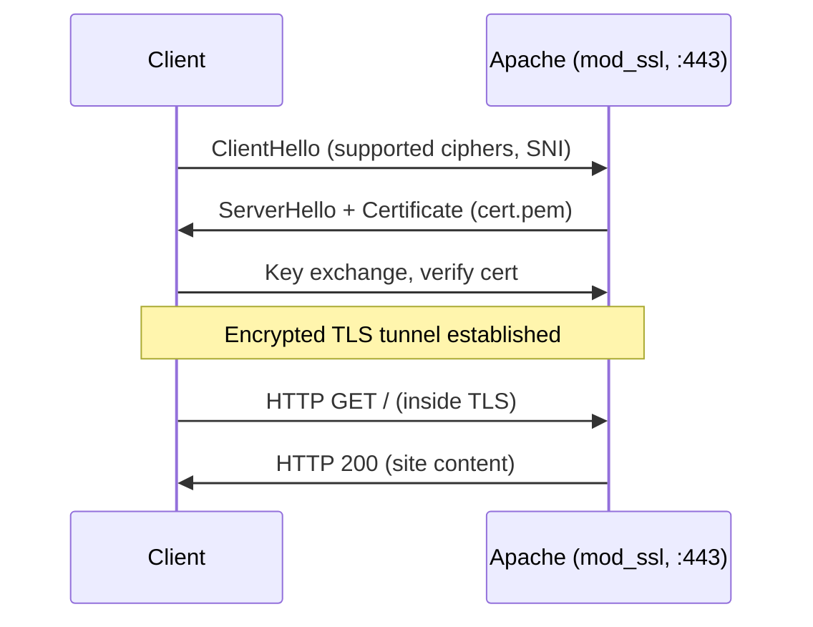

# Binding with Type (SSL / TLS)

## Overview

Binding "by type" means serving a virtual host over an encrypted **SSL/TLS** listener (port `443`) instead of, or in addition to, plain HTTP. On RHEL-family systems this is provided by the `mod_ssl` module, which adds the `SSLEngine`, `SSLCertificateFile`, and related directives that terminate TLS inside Apache.

This note covers installing `mod_ssl`, wiring up certificate files, generating self-signed certificates (and an optional custom Certificate Authority), and defining HTTP + HTTPS virtual hosts side by side.

> [!NOTE]
> Paths here follow the **RHEL / CentOS / Rocky / AlmaLinux** layout (`/etc/httpd/…`, `httpd.service`, `/etc/pki/tls/…`). On Debian/Ubuntu use `a2enmod ssl`, `/etc/apache2/…`, and `/etc/ssl/…`.

## Concepts

| Directive | Purpose |
|---|---|
| `SSLEngine on` | Enables TLS for the enclosing virtual host. |
| `SSLCertificateFile` | Path to the PEM-encoded server (or CA) certificate. |
| `SSLCertificateKeyFile` | Path to the matching private key. |
| `SSLCipherSuite` | Ciphers the client may negotiate (here delegated to the system crypto policy). |
| `SSLProxyCipherSuite` | Cipher list used when Apache acts as a TLS client (proxy). |



## Install and Configure SSL/TLS in Apache

### Install mod_ssl

`mod_ssl` is an Apache module that provides SSL and TLS support.

```bash
yum install mod_ssl
```

### Verify mod_ssl Installation

Check that the module package is installed and inspect its files, config, and docs:

```bash
rpm -qi mod_ssl
```

```bash
rpm -ql mod_ssl
```

```bash
rpm -qc mod_ssl
```

```bash
rpm -qd mod_ssl
```

> [!TIP]
> `rpm -qi` shows package info, `-ql` lists installed files, `-qc` lists config files, and `-qd` lists documentation — a quick way to locate `ssl.conf` and the bundled man pages.

### Configure SSL in Apache

Edit the SSL configuration file:

```bash
vim /etc/httpd/conf.d/ssl.conf
```

Make sure that SSL is enabled by setting appropriate certificate files:

```apache
SSLCertificateFile /etc/pki/tls/certs/localhost.crt
```

```apache
SSLCertificateKeyFile /etc/pki/tls/private/localhost.key
```

### Restart Apache

Restart Apache to apply the SSL configuration, then confirm the certificate and key files exist:

```bash
systemctl restart httpd.service
```

```bash
ls -lh /etc/pki/tls/certs/localhost.crt
```

```bash
ls -lh /etc/pki/tls/private/localhost.key
```

### Verify Apache Listening on SSL Port

Check if Apache is listening on port 443 (SSL):

```bash
netstat -nltup | grep httpd
```

### Update Firewall for SSL

Edit the firewall rules to allow SSL traffic (port 443):

```bash
firewall-cmd --permanent --add-port=443/tcp
```

```bash
firewall-cmd --permanent --add-port=8080/tcp
```

```bash
firewall-cmd --reload
```

## Create Self-Signed SSL Certificates

> [!WARNING]
> Self-signed certificates trigger browser trust warnings and are appropriate only for labs and internal testing. For anything public-facing, use a certificate from a trusted CA (e.g. Let's Encrypt).

### Create SSL Directory

Create a directory to store SSL certificates:

```bash
mkdir /opt/ssl
```

```bash
cd /opt/ssl
```

### Generate SSL Certificate and Key

Generate a self-signed SSL certificate and key valid for 365 days:

```bash
openssl req -x509 -newkey rsa:2048 -keyout key.pem -out cert.pem -days 365
```

### Check the Generated Files

Verify the files:

```bash
ls -lh
```

```bash
file key.pem
```

```bash
file cert.pem
```

### Copy SSL Files to Appropriate Directories

Copy the certificate and key to the proper directories:

```bash
cp -v /opt/ssl/cert.pem /etc/pki/tls/certs/cert.pem
```

```bash
cp -v /opt/ssl/key.pem /etc/pki/tls/private/key.pem
```

### Update Apache Configuration with SSL Certificates

Edit the Apache configuration to point to the newly created certificates:

```bash
vim /etc/httpd/conf.d/ssl.conf
```

Add these lines to enable SSL:

```apache
#   SSL Cipher Suite:
#   List the ciphers that the client is permitted to negotiate.
#   See the mod_ssl documentation for a complete list.
#   The OpenSSL system profile is configured by default.  See
#   update-crypto-policies(8) for more details.
SSLCipherSuite PROFILE=SYSTEM
SSLProxyCipherSuite PROFILE=SYSTEM

#   Point SSLCertificateFile at a PEM encoded certificate.  If
#   the certificate is encrypted, then you will be prompted for a
#   pass phrase.  Note that restarting httpd will prompt again.  Keep
#   in mind that if you have both an RSA and a DSA certificate you
#   can configure both in parallel (to also allow the use of DSA
#   ciphers, etc.)
#   Some ECC cipher suites (http://www.ietf.org/rfc/rfc4492.txt)
#   require an ECC certificate which can also be configured in
#   parallel.
#SSLCertificateFile /etc/pki/tls/certs/localhost.crt
SSLCertificateFile /etc/pki/tls/certs/cert.pem

#   Server Private Key:
#   If the key is not combined with the certificate, use this
#   directive to point at the key file.  Keep in mind that if
#   you've both a RSA and a DSA private key you can configure
#   both in parallel (to also allow the use of DSA ciphers, etc.)
#   ECC keys, when in use, can also be configured in parallel
#SSLCertificateKeyFile /etc/pki/tls/private/localhost.key
SSLCertificateKeyFile /etc/pki/tls/private/key.pem

```

Restart Apache again:

```bash
systemctl restart httpd.service
```

### Verify SSL Binding in Apache

Check if Apache is listening on both HTTP (port 80) and HTTPS (port 443):

```bash
netstat -nltup | grep httpd
```

### Update Firewall for SSL/TLS Ports

Ensure that port 443 is open in your firewall configuration:

```bash
firewall-cmd --permanent --add-port=443/tcp
```

```bash
firewall-cmd --permanent --add-port=8080/tcp
```

```bash
firewall-cmd --reload
```

## Configure Apache Virtual Hosts with SSL/TLS

You can now create virtual hosts with SSL/TLS enabled. Below are example configurations for both HTTP and HTTPS.

```bash
vim /etc/httpd/conf/httpd.conf
```

Example of Apache virtual hosts for HTTP and HTTPS:

```apache
<VirtualHost 192.168.1.41:80>
    DocumentRoot /var/www/html/site1/
    DirectoryIndex index.html
</VirtualHost>

<VirtualHost 192.168.1.41:443>
    SSLEngine on
    SSLCertificateFile /etc/pki/tls/certs/cert.pem
    SSLCertificateKeyFile /etc/pki/tls/private/key.pem
    DocumentRoot /var/www/html/site1/
    DirectoryIndex index.html
</VirtualHost>

<VirtualHost 192.168.1.42:80>
    ServerName ai.local
    DocumentRoot /var/www/html/site2/
    DirectoryIndex index.html
    ServerAlias www.ai.local
</VirtualHost>

<VirtualHost 192.168.1.42:443>
    SSLEngine on
    SSLCertificateFile /etc/pki/tls/certs/cert.pem
    SSLCertificateKeyFile /etc/pki/tls/private/key.pem
    ServerName ai.local
    DocumentRoot /var/www/html/site2/
    DirectoryIndex index.html
    ServerAlias www.ai.local
</VirtualHost>
```

In the above configuration:

> The first block listens on HTTP (port 80) for `site1`.
> The second block enables SSL (port 443) for `site1`.
> Similarly, the third and fourth blocks handle HTTP and HTTPS for `ai.local`.

Restart Apache again:

```bash
systemctl restart httpd.service
```

## Advanced Configuration with Custom CA (Certificate Authority)

If you want to use a self-generated Certificate Authority (CA):

- **Generate the Private Key for the CA**

```bash
cd /opt/ssl
```

```bash
openssl genrsa -out ca.key 2048
```

- **Generate the Certificate Signing Request (CSR)**

```bash
openssl req -new -key ca.key -out ca.csr
```

- **Create the Self-Signed Certificate for the CA**

```bash
openssl x509 -req -days 365 -in ca.csr -signkey ca.key -out ca.crt
```

- **Copy the CA Certificate and Key to the Appropriate Directories**

```bash
cp -v /opt/ssl/ca.crt /etc/pki/tls/certs/ca.crt
```

```bash
cp -v /opt/ssl/ca.key /etc/pki/tls/private/ca.key
```

### Configure Apache Virtual Hosts with the CA Certificate

You can now create virtual hosts with SSL/TLS enabled. Below are example configurations for both HTTP and HTTPS.

```bash
vim /etc/httpd/conf/httpd.conf
```

Example of Apache virtual hosts for HTTP and HTTPS:

```apache
<VirtualHost 192.168.1.41:80>
    DocumentRoot /var/www/html/site1/
    DirectoryIndex index.html
</VirtualHost>

<VirtualHost 192.168.1.41:443>
    SSLEngine on
    SSLCertificateFile /etc/pki/tls/certs/ca.crt
    SSLCertificateKeyFile /etc/pki/tls/private/ca.key
    DocumentRoot /var/www/html/site1/
    DirectoryIndex index.html
</VirtualHost>

<VirtualHost 192.168.1.42:80>
    ServerName ai.local
    DocumentRoot /var/www/html/site2/
    DirectoryIndex index.html
    ServerAlias www.ai.local
</VirtualHost>

<VirtualHost 192.168.1.42:443>
    SSLEngine on
    SSLCertificateFile /etc/pki/tls/certs/ca.crt
    SSLCertificateKeyFile /etc/pki/tls/private/ca.key
    ServerName ai.local
    DocumentRoot /var/www/html/site2/
    DirectoryIndex index.html
    ServerAlias www.ai.local
</VirtualHost>
```

After configuring your virtual hosts and SSL certificates, restart Apache and check the ports once again:

```bash
systemctl restart httpd.service
```

```bash
netstat -nltup | grep httpd
```

Test your websites using both HTTP and HTTPS URLs:

| Domain | Port | Expected Output |
|---|---|---|
| `http://ai.local` | 80 | `site2` homepage |
| `https://ai.local` | 443 | `site2` (SSL-enabled) homepage |

> [!NOTE]
> **📸 Screenshot**
> _Capture: Browser address bar showing https://ai.local with a padlock and the site2 homepage rendered over TLS_

## Best Practices

- Prefer a CA-issued or Let's Encrypt certificate for anything reachable outside the lab; reserve self-signed certs for testing.
- Keep private keys in `/etc/pki/tls/private/` with `600` permissions and root ownership.
- Let the system crypto policy drive ciphers (`PROFILE=SYSTEM`) so TLS hardening stays centrally managed via `update-crypto-policies`.
- Add an HTTP→HTTPS redirect for production sites so plaintext requests never serve sensitive content.

## Security Considerations

> [!WARNING]
> Disable legacy protocols (SSLv3, TLS 1.0/1.1) and weak ciphers. Modern guidance (NIST SP 800-52r2, Mozilla "Intermediate") recommends TLS 1.2+ with forward-secret cipher suites.

- Never reuse a CA private key across environments; a leaked `ca.key` compromises every certificate it signed.
- Enable HSTS (`Strict-Transport-Security`) on production HTTPS vhosts to prevent protocol downgrade.
- Regularly rotate certificates before expiry and monitor with a tool such as `openssl x509 -enddate -noout -in cert.pem`.

## Troubleshooting

| Symptom | Likely Cause | Fix |
|---|---|---|
| Apache prompts for a passphrase on restart | Encrypted private key | Remove passphrase with `openssl rsa` or supply it via `SSLPassPhraseDialog` |
| `SSL certificate and private key do not match` | Mismatched cert/key pair | Compare `openssl x509 -modulus` and `openssl rsa -modulus` hashes |
| Not listening on 443 | `mod_ssl` not loaded or `ssl.conf` error | `httpd -M | grep ssl`; run `httpd -t` |
| Browser `NET::ERR_CERT_AUTHORITY_INVALID` | Self-signed / untrusted CA | Import the CA cert into the client trust store (expected in labs) |

## References

- Apache HTTP Server — [mod_ssl documentation](https://httpd.apache.org/docs/current/mod/mod_ssl.html)
- Mozilla — [Server Side TLS configuration guidelines](https://wiki.mozilla.org/Security/Server_Side_TLS)
- NIST SP 800-52 Rev. 2 — Guidelines for TLS Implementations

## Related

- [Types-of-Binding](Types-of-Binding.md) — parent overview of binding methods
- [Multiple-Web-Sites-with-SSL](Multiple-Web-Sites-with-SSL.md) — extends SSL binding to many vhosts
- [Binding-with-Domain-Name](Binding-with-Domain-Name.md) — name-based binding combined with SSL
- Web-Enumeration — TLS certs/SNI reveal hostnames in enumeration
- [Linux Administration & Server Hardening](../Readme.md) — Linux administration & server hardening hub
