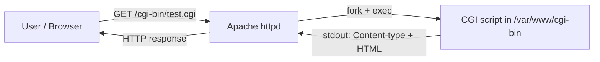

# CGI Scripts (Common Gateway Interface)

## Overview

CGI (Common Gateway Interface) is a standard protocol used to run external programs or scripts on a web server to generate dynamic web content. These scripts can be written in various languages like Python, Perl, PHP, or Shell, and are commonly used to deliver dynamic content based on user input.

This note covers enabling CGI in Apache on a RHEL-family host, writing and deploying scripts in the `cgi-bin` directory, and locking that directory down with HTTP authentication.

> [!NOTE]
> Paths and package names here follow the **RHEL / CentOS / Rocky / AlmaLinux** layout (`/etc/httpd/…`, `/var/www/cgi-bin`, the `apache` user, `yum`). On Debian/Ubuntu use `/usr/lib/cgi-bin`, the `www-data` user, and `apt`.

## Concepts

### How CGI Works



- **Client Request** — A user accesses a CGI-enabled URL by clicking a link or submitting a form.
- **Server Execution** — The web server runs the CGI script located in the `cgi-bin` directory.
- **Dynamic Response** — The script processes any input and sends a dynamically generated HTML response to the client.

### Supported Technologies

CGI scripts can be written in several languages:

| Language | Notes |
|---|---|
| `Perl` | Historically common for web scripting. |
| `Python` | Readable and easy to maintain. |
| `PHP` | Widely used for web development (though not strictly CGI). |
| `Ruby` | Flexible and dynamic. |
| `Shell Scripts` | Useful for small utilities and server-side tasks. |

## Installation and Configuration

### Install Apache and the Perl CGI Module

```bash
yum install httpd*
```

```bash
yum install perl-CGI perl
```

```bash
yum groups install "Development Tools"
```

### Verify the CGI Module is Enabled in Apache

```bash
httpd -M
```

```bash
httpd -M | grep cgi
```

### Check SELinux Status

```bash
sestatus
```

> [!IMPORTANT]
> When SELinux is enforcing, CGI scripts must carry the `httpd_sys_script_exec_t` type to execute. If a script returns `500` and the audit log shows an AVC denial, restore contexts with `restorecon -Rv /var/www/cgi-bin`.

### Edit the Apache Configuration

Edit the main Apache config file:

```bash
vim /etc/httpd/conf/httpd.conf
```

```apache
# CGI Scripts(Common Gateway Interface)
# "/var/www/cgi-bin" should be changed to whatever your ScriptAliased
# CGI directory exists, if you have that configured.
#
<Directory "/var/www/cgi-bin">
    AllowOverride None
    Options +ExecCGI
    AddHandler cgi-script .cgi .pl .py .sh
    Require all granted
</Directory>
```

| Directive | Effect |
|---|---|
| `Options +ExecCGI` | Permits execution of CGI scripts in this directory. |
| `AddHandler cgi-script .cgi .pl .py .sh` | Treats files with these extensions as executable CGI programs. |
| `AllowOverride None` | Ignores `.htaccess` overrides for tighter control. |
| `Require all granted` | Grants access to all clients (tighten this in production — see below). |

## Creating and Deploying CGI Scripts

### Create a Simple CGI Script (Perl)

```bash
vim /var/www/cgi-bin/test.cgi
```

```perl
#!/usr/bin/perl
print "Content-type: text/html\n\n";
print "<h1>Server Memory Usage</h1>";
print "<pre>";
exec("free -h");
print "</pre>";
```

Set ownership and permissions:

```bash
chown apache:apache /var/www/cgi-bin/test.cgi
```

```bash
chmod 755 /var/www/cgi-bin/test.cgi
```

```bash
ls -lh /var/www/cgi-bin/test.cgi
```

Restart Apache:

```bash
systemctl restart httpd.service
```

Access the script:

```text
http://192.168.1.32/cgi-bin/test.cgi
```

## Create Additional CGI Scripts

### mem.cgi (Shell Script for Memory Usage)

```bash
vim /var/www/cgi-bin/mem.cgi
```

```bash
#!/bin/bash  
echo  
echo "<h1>Server Memory Usage</h1>"  
echo "<pre>"  
free -h  
echo "</pre>"
```

Set permissions:

```bash
chown apache:apache /var/www/cgi-bin/mem.cgi
```

```bash
chmod 755 /var/www/cgi-bin/mem.cgi
```

```bash
ls -lh /var/www/cgi-bin/mem.cgi
```

Access the script:

```text
http://192.168.1.32/cgi-bin/mem.cgi
```

### ping.cgi (Shell Script for Ping Test)

```bash
vim /var/www/cgi-bin/ping.cgi
```

```bash
#!/bin/bash  
echo  
echo "Ping the Server"  
ping -c 4 8.8.8.8
```

Set permissions:

```bash
chmod 755 /var/www/cgi-bin/ping.cgi
```

```bash
chown apache:apache /var/www/cgi-bin/ping.cgi
```

```bash
ls -lh /var/www/cgi-bin/ping.cgi
```

Access:

```text
http://192.168.1.32/cgi-bin/ping.cgi
```

> [!WARNING]
> Scripts like `ping.cgi` that pass data to a shell are a classic **command-injection** risk. These examples use hard-coded arguments; never build a shell command from user-supplied query parameters without strict validation and escaping.

### hello.cgi (Perl Script for Hello World)

```bash
vim /var/www/cgi-bin/hello.cgi
```

```perl
#!/usr/bin/perl  
print "Content-type: text/html\n\n";  
print "<html><head><title>CGI Script</title></head><body>";  
print "<h1>Hello, World!</h1>";  
print "</body></html>";
```

```bash
chmod +x /var/www/cgi-bin/hello.cgi
```

```bash
ls -lh /var/www/cgi-bin/hello.cgi
```

Access:

```text
http://192.168.1.32/cgi-bin/hello.cgi
```

### hello2.cgi (Python3 Script for Hello World)

```bash
vim /var/www/cgi-bin/hello2.cgi
```

```python
#!/usr/bin/python3  
print("Content-type: text/html\n\n")  
print("<html><head><title>CGI Script</title></head><body>")  
print("<h1>Hello, CGI World!</h1>")  
print("</body></html>")
```

```bash
chmod +x /var/www/cgi-bin/hello2.cgi
```

```bash
ls -lh /var/www/cgi-bin/hello2.cgi
```

Access:

```text
http://192.168.1.32/cgi-bin/hello2.cgi
```

## Securing the cgi-bin Directory

### Restrict Access to Authenticated Users

Edit the Apache config:

```bash
vim /etc/httpd/conf/httpd.conf
```

Example secure block that requires HTTP Basic authentication:

```apache
#
# "/var/www/cgi-bin" should be changed to whatever your ScriptAliased
# CGI directory exists, if you have that configured.
#
<Directory "/var/www/cgi-bin">
    AllowOverride None
    Options +ExecCGI
    AddHandler cgi-script .cgi .pl .py .sh
    AuthType Basic
    AuthName "Armour CGI"
    AuthUserFile /etc/httpd/htpasswd
    Require valid-user
</Directory>
```

> [!TIP]
> Create the password file referenced by `AuthUserFile` with `htpasswd -c /etc/httpd/htpasswd <username>`. Omit `-c` when adding subsequent users so you don't overwrite the file.

Restart Apache:

```bash
systemctl restart httpd.service
```

Access the script (you will now be prompted for credentials):

```text
http://192.168.1.32/cgi-bin/test.cgi
```

> [!NOTE]
> **📸 Screenshot**
> _Capture: Browser HTTP Basic auth dialog titled "Armour CGI" prompting for username and password before the CGI script loads_

## Best Practices

- Keep CGI enabled only on the specific directory that needs it; never set `+ExecCGI` on a general document root.
- Own scripts as `apache:apache` and set mode `755` (or `750`) — writable-by-web CGI scripts are a code-execution foothold.
- Prefer modern application servers (WSGI/FastCGI, PHP-FPM, reverse-proxied app frameworks) over classic CGI for new work; CGI forks a new process per request and scales poorly.

## Security Considerations

> [!WARNING]
> The `cgi-bin` directory is one of the most heavily probed paths in web attacks (recall Shellshock, CVE-2014-6271, which weaponized Bash CGI). Treat every script as remotely reachable code execution.

- Never pass unsanitized request data to `exec`, `system`, backticks, or a shell.
- Front CGI with authentication (as shown) and, where possible, restrict by source IP with `Require ip`.
- Keep Bash, Perl, Python, and `httpd` patched — CGI turns interpreter vulnerabilities into remote exploits.
- Log and monitor CGI access; anomalous requests to `cgi-bin` are a strong indicator of scanning.

## Troubleshooting

| Symptom | Likely Cause | Fix |
|---|---|---|
| `500 Internal Server Error` | Missing `Content-type` header, bad shebang, or non-executable script | Check the first lines and `chmod +x` the script |
| `403 Forbidden` | SELinux context or `Require` rule blocking access | `restorecon -Rv /var/www/cgi-bin`; review `Require` directive |
| Script source displayed instead of running | `AddHandler`/`Options +ExecCGI` not applied to that path | Confirm the `<Directory>` block and restart httpd |
| Works locally, fails remotely | Firewall blocking port 80 | `firewall-cmd --permanent --add-port=80/tcp && firewall-cmd --reload` |

## References

- Apache HTTP Server — [Dynamic Content with CGI](https://httpd.apache.org/docs/current/howto/cgi.html)
- Apache HTTP Server — [mod_cgi documentation](https://httpd.apache.org/docs/current/mod/mod_cgi.html)
- OWASP — Testing for command injection in CGI-driven applications

## Related

- [Apache-Web-Server-Setup-and-Configuration](Apache-Web-Server-Setup-and-Configuration.md) — enable CGI on the base httpd config
- [WebDAV-with-Apache](WebDAV-with-Apache.md) — another Apache module/feature
- Web-Enumeration — CGI paths are a classic web-enum attack surface
- [Linux Administration & Server Hardening](../Readme.md) — Linux administration & server hardening hub
