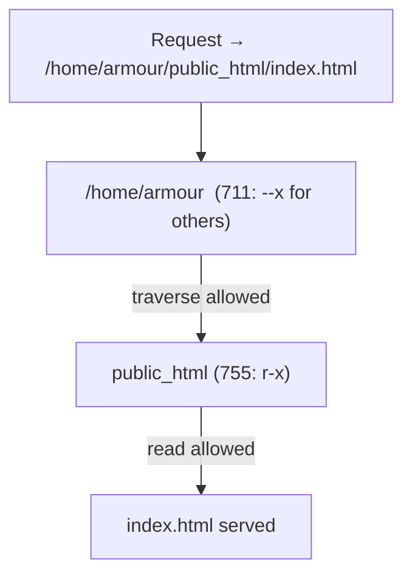

# Enable Apache User Home Directories

## Overview

Apache allows individual users to host web content from their home directories using the `mod_userdir` module. Each user's site lives in a `public_html` folder inside their home directory and is reached at a per-user URL, which is useful for development, personal websites, or segregated hosting on a shared server.

This note enables `UserDir`, sets the permissions Apache needs to traverse into user homes, and defines per-user virtual hosts (HTTP and HTTPS).

> [!NOTE]
> Paths and the `apache` service user here follow the **RHEL / CentOS / Rocky / AlmaLinux** layout (`/etc/httpd/conf.d/`, `httpd`). On Debian/Ubuntu use `a2enmod userdir`, `/etc/apache2/`, and the `www-data` user.

## Concepts

| Directive / Item | Purpose |
|---|---|
| `mod_userdir` | Apache module that maps a URL to a directory inside each user's home. |
| `UserDir enabled` | Turns per-user directories on. |
| `UserDir public_html` | Names the sub-directory served from each home (`~user` → `/home/user/public_html`). |
| `711` on `/home/<user>` | Lets the Apache process **traverse** into the home without **listing** it. |
| `755` on `public_html` | Lets Apache read and serve the web content. |



> [!IMPORTANT]
> The permission split is the crux of this setup: `711` on the home directory lets Apache pass **through** it without being able to list private files, while `755` on `public_html` exposes only the intended web content.

## Enable UserDir in Apache Configuration

Edit the `userdir.conf` file:

```bash
vim /etc/httpd/conf.d/userdir.conf
```

Sample configuration:

```apache
<IfModule mod_userdir.c>
    UserDir enabled
    UserDir public_html
</IfModule>

<Directory "/home/*/public_html">
    AllowOverride FileInfo AuthConfig Limit Indexes
    Options MultiViews Indexes SymLinksIfOwnerMatch IncludesNoExec
    Require method GET POST OPTIONS
</Directory>
```

This configuration:

- Enables `public_html` inside each user's home directory.
- Allows basic options like indexing, symbolic links, and overrides.
- Limits requests to safe HTTP methods.

## Configure Home Directory for User: armour

### Create Public Web Directory

```bash
mkdir /home/armour/public_html
```

### Set Correct Permissions

```bash
chmod 711 /home/armour/
```

```bash
chown -R armour:armour /home/armour/public_html/
```

```bash
chmod -R 755 /home/armour/public_html/
```

> [!NOTE]
> `711` on the home folder ensures the Apache process can enter it, while `755` on the web folder allows content access.

## Create VirtualHost for armour

Edit the VirtualHost file:

```bash
vim /etc/httpd/conf.d/armour.conf
```

Example VirtualHost configuration:

```apache
<Virtualhost 192.168.1.41:80>
    DocumentRoot /home/armour/public_html
    DirectoryIndex index.html
</virtualhost>
```

> This binds the site to the server IP in the `VirtualHost` line and serves content from `armour`'s public directory.

## Configure Home Directory for Another User: infosec

### Create infosec user

```bash
useradd infosec
```

### Create Public Web Directory

```bash
mkdir /home/infosec/public_html
```

### Set Correct Permissions

```bash
chmod 711 /home/infosec/
```

```bash
chown -R infosec:infosec /home/infosec/public_html/
```

```bash
chmod -R 755 /home/infosec/public_html/
```

## Create VirtualHost for infosec

Edit the VirtualHost file:

```bash
vim /etc/httpd/conf.d/infosec.conf
```

Example HTTP VirtualHost:

```apache
<Virtualhost 192.168.1.42:80>
    DocumentRoot /home/infosec/public_html/
    DirectoryIndex index.html
</virtualhost>
```

Example HTTPS VirtualHost:

```apache
<Virtualhost 192.168.1.37:443>
    SSLEngine on
    SSLCertificateFile /etc/pki/tls/certs/ca.crt
    SSLCertificateKeyFile /etc/pki/tls/private/ca.key
    ServerName armour.com
    DocumentRoot /home/infosec/public_html/
    DirectoryIndex index.html
    ServerAlias www.armour.com
    <Directory /home/infosec/public_html/ >
        Options -Indexes
    </Directory>
</virtualhost>
```

- The HTTP VirtualHost serves `infosec.com`.
- The HTTPS VirtualHost uses SSL to serve `armour.com` from the same directory (can be adjusted per site).

> [!TIP]
> `Options -Indexes` in the HTTPS block disables automatic directory listing, so a missing `index.html` returns `403` instead of exposing the folder contents — a small but worthwhile hardening step.

## Restart Apache to Apply Changes

Copy starter content into each user's web root, then restart the service:

```bash
cp -vr site1/* /home/armour/public_html
```

```bash
cp -vr site2/* /home/infosec/public_html
```

```bash
systemctl restart httpd
```

## Best Practices

- Grant `public_html` no more than `755`, and never make it group- or world-writable.
- Disable directory indexing (`Options -Indexes`) unless a browsable listing is genuinely intended.
- Restrict allowed methods (`Require method GET POST OPTIONS`) so write methods like `PUT`/`DELETE` are rejected.
- Consider disabling `UserDir` for privileged accounts (e.g. `UserDir disabled root`) so system users cannot publish content.

## Security Considerations

> [!WARNING]
> User home directories widen the attack surface: any user who can write to their own `public_html` can publish content served by the web server. On multi-tenant hosts this can enable one user to host phishing pages or leak files.

- Ensure SELinux is configured to permit home-directory serving: `setsebool -P httpd_enable_homedirs on` and `chcon -R -t httpd_sys_content_t /home/<user>/public_html`.
- Keep `IncludesNoExec` (as in the sample) so server-side includes cannot execute commands.
- Audit `public_html` contents periodically — the `~user` URL pattern is a well-known enumeration vector.

## Troubleshooting

| Symptom | Likely Cause | Fix |
|---|---|---|
| `403 Forbidden` on user site | Home directory not traversable, or SELinux boolean off | `chmod 711 /home/<user>`; `setsebool -P httpd_enable_homedirs on` |
| Content served but listing shown | `Indexes` enabled and no index file | Add `Options -Indexes` or create `index.html` |
| `mod_userdir` not active | Module not loaded | `httpd -M | grep userdir`; ensure `userdir.conf` is included |
| HTTPS vhost not reachable | Port 443 closed or cert path wrong | Open `443/tcp` in the firewall; verify `SSLCertificateFile` path |

## Notes

- Make sure SELinux (if enabled) is configured to allow home directory access by Apache.
- Ensure `mod_userdir` is loaded in Apache (enabled by default on most systems).
- Consider firewall rules or DNS mappings to test domain-based VirtualHosts on a local network.

## References

- Apache HTTP Server — [mod_userdir documentation](https://httpd.apache.org/docs/current/mod/mod_userdir.html)
- Apache HTTP Server — [Per-user web directories (public_html)](https://httpd.apache.org/docs/current/howto/public_html.html)

## Related

- [Apache-Web-Server-Setup-and-Configuration](Apache-Web-Server-Setup-and-Configuration.md) — base httpd config this builds on
- [Apache-Directory-Listing-and-Access-Control](Apache-Directory-Listing-and-Access-Control.md) — control access to the user dirs
- Web-Enumeration — ~user paths are an enumeration vector
- [Linux Administration & Server Hardening](../Readme.md) — Linux administration & server hardening hub
