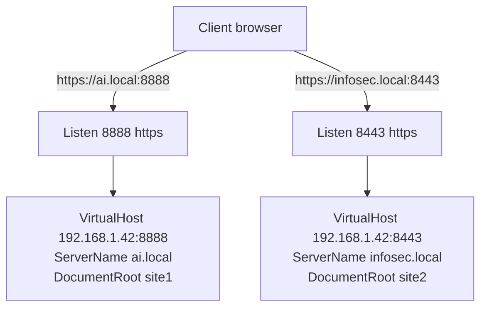

# Multiple Web Sites with SSL

## Overview

This note extends single-site TLS to **multiple SSL-enabled websites on the same server**, each bound to its own custom HTTPS port. Two independent sites — `ai.local` on port `8888` and `infosec.local` on port `8443` — are defined in separate files under `/etc/httpd/conf.d/`, the matching ports are opened in the firewall, and Apache is validated to be listening on both.

> [!NOTE]
> Paths and the `httpd` service name follow the **RHEL / CentOS / Rocky / AlmaLinux** layout. On Debian/Ubuntu use `/etc/apache2/sites-available/` with `a2ensite` and the `apache2` service.

## Concepts

| Item | Role |
|---|---|
| `Listen 8888 https` | Binds a socket on port `8888` and tells Apache to speak TLS on it. |
| `SSLEngine on` | Enables TLS termination for the enclosing virtual host. |
| Per-port SSL vhost | Each site is isolated on its own port and certificate-backed listener. |
| One file per site | `site1.conf` and `site2.conf` keep each virtual host self-contained. |



> [!IMPORTANT]
> Every custom HTTPS port needs three things in agreement: a `Listen <port> https` directive, a matching `VirtualHost` with `SSLEngine on`, and an open firewall port. If any one is missing the site will not load.

## Editing the Virtual Host Configurations

Edit the configuration files under `/etc/httpd/conf.d/` to define the SSL virtual hosts. Each site gets its own file and its own `Listen` directive.

### Virtual Host for Port 8888

```bash
vim /etc/httpd/conf.d/site1.conf
```

```apache
Listen 8888 https

<VirtualHost 192.168.1.42:8888>
    SSLEngine on
    SSLCertificateFile /etc/pki/tls/certs/ca.crt
    SSLCertificateKeyFile /etc/pki/tls/private/ca.key
    ServerName ai.local
    DocumentRoot /var/www/html/site1/
    DirectoryIndex index.html
    ServerAlias www.ai.local
</VirtualHost>
```

### Virtual Host for Port 8443

```bash
vim /etc/httpd/conf.d/site2.conf
```

```apache
Listen 8443 https

<VirtualHost 192.168.1.42:8443>
    SSLEngine on
    SSLCertificateFile /etc/pki/tls/certs/ca.crt
    SSLCertificateKeyFile /etc/pki/tls/private/ca.key
    ServerName infosec.local
    DocumentRoot /var/www/html/site2/
    DirectoryIndex index.html
    ServerAlias www.infosec.local
</VirtualHost>
```

Save and close the configuration files after making the changes.

## Firewall Configuration

Make sure the firewall is configured to allow traffic on the custom SSL ports.

1. **Allow traffic on port 8080 (SSL)**:

```bash
firewall-cmd --permanent --add-port=8080/tcp
```

2. **Allow traffic on port 8443 (SSL)**:

```bash
firewall-cmd --permanent --add-port=8443/tcp
```

3. **Reload the firewall** to apply the changes:

```bash
firewall-cmd --reload
```

> [!WARNING]
> The listeners above use ports `8888` and `8443`. Make sure the firewall opens the **exact** ports your virtual hosts bind to — if you serve on `8888`, add `--add-port=8888/tcp` as well, otherwise that site will be blocked at the firewall.

## Restart Apache

After editing the configuration and updating the firewall, restart Apache to apply the changes.

```bash
systemctl restart httpd.service
```

## Verify Ports Are Open

Check that Apache is properly listening on the new SSL ports.

```bash
netstat -nltup | grep httpd
```

> Look for output showing Apache listening on `8888` and `8443` (it should look something like `tcp6 0 0 :::8080 :::* LISTEN`).

> [!NOTE]
> **📸 Screenshot**
> _Capture: Terminal netstat output showing httpd listening on ports 8888 and 8443 bound to 192.168.1.42_

## Final Checks

- **Test Access** — You should now be able to access the sites via:
    - `https://ai.local:8888` (for port 8888)
    - `https://infosec.local:8443` (for port 8443)

    Check if SSL is active by ensuring the padlock icon is visible in the browser for `https`.

- **Verify Certificates** — Make sure your certificates are correctly installed and valid.

| Site | URL | Port | Certificate |
|---|---|---|---|
| `ai.local` | `https://ai.local:8888` | 8888 | `/etc/pki/tls/certs/ca.crt` |
| `infosec.local` | `https://infosec.local:8443` | 8443 | `/etc/pki/tls/certs/ca.crt` |

## Best Practices

- Keep one virtual host per file under `conf.d/` so each site can be enabled, disabled, or rolled back independently.
- Run `httpd -t` before every restart to catch a bad `Listen`/`SSL` directive before it takes the service down.
- Give each site a distinct `ServerName` so SNI and logging clearly separate the two hosts.
- Where clients expect standard HTTPS, prefer front-ending these sites with a reverse proxy on `443` rather than publishing many raw high ports.

## Security Considerations

> [!WARNING]
> Non-standard ports (`8888`, `8443`) are not obscurity you can rely on — port scanners find them immediately. Each extra HTTPS listener is another TLS endpoint to keep patched, correctly configured, and monitored.

- Open only the firewall ports actually in use; remove rules for retired ports.
- Use per-site certificates (or a proper SAN/wildcard) rather than reusing one CA cert across unrelated hostnames in production.
- Enforce TLS 1.2+ and strong ciphers via the system crypto policy, per NIST SP 800-52r2.
- Protect the CA private key (`ca.key`) — its compromise undermines every certificate it signed.

## Troubleshooting

| Symptom | Likely Cause | Fix |
|---|---|---|
| Site unreachable on `8888` | Firewall opened `8080` instead of `8888` | `firewall-cmd --permanent --add-port=8888/tcp && firewall-cmd --reload` |
| `httpd` fails to start | Duplicate `Listen` for the same port across files | Ensure each port has exactly one `Listen` directive |
| Not listening on the SSL port | `mod_ssl` missing or `SSLEngine`/cert path wrong | `httpd -M | grep ssl`; run `httpd -t` |
| SELinux blocks the port | Non-standard port not labeled `http_port_t` | `semanage port -a -t http_port_t -p tcp 8888` |

## References

- Apache HTTP Server — [SSL/TLS How-To](https://httpd.apache.org/docs/current/ssl/ssl_howto.html)
- Apache HTTP Server — [Virtual Host documentation](https://httpd.apache.org/docs/current/vhosts/)
- NIST SP 800-52 Rev. 2 — Guidelines for TLS Implementations

## Related

- [Binding-with-Type(SSL-TLS)](Binding-with-Type(SSL-TLS).md) — single-site SSL binding this scales up
- [Types-of-Binding](Types-of-Binding.md) — parent overview of binding methods
- [Binding-with-Domain-Name](Binding-with-Domain-Name.md) — name-based vhosts behind the certs
- Web-Enumeration — SNI/cert SANs enumerate hosted sites
- [Linux Administration & Server Hardening](../Readme.md) — Linux administration & server hardening hub
