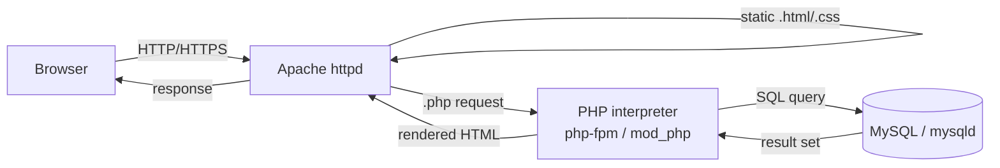

# PHP and MySQL Installation and Configuration

## Overview

This note walks through building a complete **LAMP application stack** on a RHEL / Enterprise Linux 9 host: PHP (from the Remi repository), the MySQL Community Server, the phpMyAdmin database GUI, a WordPress deployment, and the Apache Virtual Hosts that publish them. Each step explains *why* before showing the command so the workflow can be reproduced and audited rather than copied blindly.

The target host in the examples is `192.168.1.33` (PHP info page) with WordPress served on `192.168.1.37` (HTTPS) and `192.168.1.31` (HTTP) for the `armour.local` domain.

> [!NOTE]
> Commands use `yum`, `/etc/httpd/`, and the `apache` service user — the RHEL / CentOS / Rocky / AlmaLinux convention. On Debian/Ubuntu the equivalents are `apt`, `/etc/apache2/`, and the `www-data` user. See [Apache2-Setup-on-Debian](Apache2-Setup-on-Debian.md) for the Debian variant.

## Concepts

The LAMP stack layers four independent services. Understanding the role of each clarifies where a request succeeds or fails.

| Layer | Component | Role in the stack | Config / data location |
|---|---|---|---|
| **L**inux | RHEL / EL 9 | Host OS, package management, SELinux, firewall | `/etc/`, `systemctl` |
| **A**pache | `httpd` | Serves static files, hands `.php` to the interpreter | `/etc/httpd/conf/httpd.conf` |
| **M**ySQL | `mysqld` | Relational data store for the application | `/var/lib/mysql/`, `/var/log/mysqld.log` |
| **P**HP | `php` + modules | Executes dynamic application code | `/etc/php.ini`, `/etc/php.d/` |

> [!TIP]
> The **Remi repository** is the community-maintained source for current PHP builds on Enterprise Linux, where the base OS repos often ship an older PHP. **EPEL** (Extra Packages for Enterprise Linux) supplies supporting packages such as `pwgen`. Enabling both is the standard prerequisite for a modern PHP install.

## Architecture

How a browser request for a WordPress page flows through the stack:



## PHP Installation and Configuration

### Install Required Repositories

- Before installing PHP, we must enable the Extra Packages for Enterprise Linux (EPEL) repository and the Remi repository, which provides updated PHP versions.

- Run the following command to install EPEL and YUM utilities:

```bash
yum install epel-release yum-utils mod_ssl
```

- After installation, verify the available repositories by running:

```bash
yum repolist all
```

- Visit the official Remi repository to get the appropriate repository package:

[Remi Repository](https://rpms.remirepo.net/wizard/)

- Now, install the Remi repository for Enterprise Linux 9:

```bash
yum install http://rpms.remirepo.net/enterprise/remi-release-9.rpm
```

- Verify that the repository has been added by listing all available repositories again:

```bash
yum repolist all
```

- To check configuration files related to the `remi-release` package, run:

```bash
rpm -qc remi-release
```

- To view all files installed by the `remi-release` package, use:

```bash
rpm -ql remi-release
```

- If necessary, edit the repository configuration file manually:

```bash
vim /etc/yum.repos.d/remi.repo
```

### Search for Available PHP Versions

- Before installing PHP, check available PHP versions in the repository:

```bash
yum search php
```

- For more detailed information about the default PHP package, run:

```bash
yum info php.x86_64
```

- To check the details of PHP 8.1 and PHP 8.4, use:

```bash
yum info php81.x86_64
```

```bash
yum info php84.x86_64
```

### Install PHP and Required Extensions

- Once we have identified the PHP version to install, proceed with the installation of PHP and essential extensions. This command installs PHP and commonly used modules such as MySQL support, XML processing, multibyte string handling, and more:

```bash
yum install php php-common.x86_64 php-cli.x86_64 php-opcache.x86_64 php-gd.x86_64 php-curl php-mysqlnd.x86_64 php-xml.x86_64 php-mbstring.x86_64 php-pear php-mbstring php-pecl-http php-session
```

The key extensions and what each provides:

| Extension | Purpose |
|---|---|
| `php-common` | Core files shared by all PHP modules |
| `php-cli` | Command-line PHP interpreter |
| `php-opcache` | Bytecode cache — major performance gain |
| `php-gd` | Image creation and manipulation |
| `php-mysqlnd` | Native MySQL driver (required for WordPress/phpMyAdmin) |
| `php-xml` | XML/DOM parsing |
| `php-mbstring` | Multibyte (UTF-8) string handling |
| `php-pecl-http` | HTTP client/message handling |
| `php-session` | Server-side session support |

### Verify PHP Installation

- After installation, confirm that PHP has been successfully installed by checking the version:

```bash
php -v
```

### Restart Apache

- To apply PHP changes, restart the Apache web server:

```bash
systemctl restart httpd.service
```

### Create a PHP Info Page

- To verify that PHP is working correctly with Apache, create a `phpinfo.php` file inside the web root directory:

```bash
vim /var/www/html/phpinfo.php
```

> Inside the file, add the following PHP script:

```php
<?php
    phpinfo();
?>
```

> Save the file and access it in your browser at:

[http://192.168.1.33/phpinfo.php](http://192.168.1.33/phpinfo.php)

> [!NOTE]
> **📸 Screenshot**
> _Capture: Browser rendering of the PHP phpinfo() page showing PHP version, loaded modules table, and server configuration values_

> [!WARNING]
> A live `phpinfo()` page leaks the PHP version, loaded modules, absolute paths, and environment variables — valuable reconnaissance for an attacker (see Web-Enumeration). Use it only to confirm the install, then **delete it immediately**:
> ```bash
> rm -f /var/www/html/phpinfo.php
> ```

## MySQL Installation and Configuration

### Download and Install MySQL Repository

- To install MySQL, first, download the official MySQL repository package:

```bash
wget https://dev.mysql.com/get/mysql84-community-release-el9-2.noarch.rpm
```

- Now install the downloaded repository package:

```bash
yum install ./mysql84-community-release-el9-2.noarch.rpm
```

- Verify that the MySQL repository has been added:

```bash
yum repolist all
```

### Enable and Disable MySQL Versions

- Enable MySQL 8.0 repository:

```bash
yum-config-manager --enable mysql80-community
```

- (Optional) Enable MySQL 5.7 repository if required:

```bash
yum-config-manager --enable mysql80-community
```

- If you mistakenly enabled MySQL 5.7, disable it:

```bash
yum-config-manager --disable mysql57.community
```

### Search and Install MySQL

- Search for available MySQL packages:

```bash
yum search mysql
```

- Install MySQL server and development libraries:

```bash
yum install mysql-community-server mysql-community-devel
```

### Start and Enable MySQL Service

- Start the MySQL service:

```bash
systemctl start mysqld.service
```

- Enable MySQL to start automatically on boot:

```bash
systemctl enable mysqld.service
```

- Check if MySQL is running:

```bash
systemctl status mysqld.service
```

### Retrieve Temporary Root Password

- After MySQL installation, a temporary root password is generated. Retrieve it using:

```bash
grep 'temporary password' /var/log/mysqld.log
```

### Secure MySQL Installation

- Run the MySQL secure installation script to set a new root password and remove insecure default settings:

```bash
mysql_secure_installation
```

- Example new password:

```text
p@ssW0rd@1234
```

- Now, log into MySQL using the new password:

```bash
mysql -u root -pp@ssW0rd@1234
```

> [!WARNING]
> Passing a password inline with `-p<password>` writes it into your shell history and the process list (`ps aux`), where any local user can read it. Prefer the interactive prompt (`mysql -u root -p`) on shared or production systems. The example password above is a **lab placeholder** — never reuse it.

### Change Root Password (If Needed)

- If you want to manually update the MySQL root password, log in and run:

```sql
ALTER USER root@localhost IDENTIFIED WITH mysql_native_password BY 'Armour@123';
SHOW DATABASES;
EXIT;
```

## phpMyAdmin Installation and Configuration

phpMyAdmin is a web-based tool used for managing MySQL databases. It provides an intuitive graphical interface for performing database operations without needing to use the command line.

### Download and Extract phpMyAdmin

- First, navigate to the official phpMyAdmin website to get the latest version:

[phpMyAdmin](https://www.phpmyadmin.net/)

- Now, download the phpMyAdmin package:

```bash
wget https://files.phpmyadmin.net/phpMyAdmin/5.1.0/phpMyAdmin-5.1.0-all-languages.zip
```

- Extract the downloaded package:

```bash
unzip phpMyAdmin-5.1.0-all-languages.zip
```

- Move the extracted files to the Apache web directory:

```bash
mkdir /var/www/html/phpmyadmin
```

```bash
cp -vr phpMyAdmin-5.1.0-all-languages/* /var/www/html/phpmyadmin/
```

- Navigate to the web root directory:

```bash
cd /var/www/html/
```

### Configure phpMyAdmin

- Copy the sample configuration file to make it active:

```bash
cp -v /var/www/html/phpmyadmin/config.sample.inc.php /var/www/html/phpmyadmin/config.inc.php
```

- Edit the configuration file:

```bash
vim /var/www/html/phpmyadmin/config.inc.php
```

- Generate a random secret passphrase to enhance security:

```bash
pwgen 32 -1
```

> [!TIP]
> The generated 32-character string is the value for `$cfg['blowfish_secret']` in `config.inc.php`. phpMyAdmin uses it to encrypt the cookie-auth session; leaving it blank triggers a warning and weakens session security.

- Set proper ownership to ensure Apache can access the phpMyAdmin files:

```bash
chown -Rv apache:apache /var/www/html/phpmyadmin
```

- Restart Apache to apply changes:

```bash
systemctl restart httpd.service
```

> [!WARNING]
> phpMyAdmin at a predictable path (`/phpmyadmin`) is a constant target for credential-stuffing bots. In production, restrict it by source IP, place it behind HTTP auth, rename the path, and never expose it to the public internet.

## WordPress Installation and Configuration

- WordPress is a popular content management system (CMS) used to create and manage websites.

### Download and Extract WordPress

- Download the latest version of WordPress from the official website:

```bash
wget https://wordpress.org/latest.zip
```

- Extract the downloaded package:

```bash
unzip latest.zip
```

- Move WordPress files to the Apache web directory:

```bash
cp -vr wordpress/ /var/www/html/
```

- Navigate to the web root directory:

```bash
cd /var/www/html/
```

- Set the correct ownership to allow Apache to manage WordPress files:

```bash
chown -Rv apache:apache /var/www/html/wordpress/
```

- Navigate to the WordPress directory:

```bash
cd wordpress/
```

- Set proper permissions for essential WordPress directories:

```bash
chmod -Rv 0755 wp-includes/ wp-admin/js/ wp-content/themes/ wp-content/plugins/
```

### Configure Apache for WordPress

- Open the Apache configuration file for editing:

```bash
vim /etc/httpd/conf/httpd.conf
```

```apache
<VirtualHost 192.168.1.37:443>
    SSLEngine on
    SSLCertificateFile /etc/pki/tls/certs/localhost.crt
    SSLCertificateKeyFile /etc/pki/tls/private/localhost.key
    DocumentRoot /var/www/html/wordpress/
    DirectoryIndex index.php
</VirtualHost>
```

- Restart Apache to apply changes:

```bash
systemctl restart httpd.service
```

- Restart DNS service if applicable:

```bash
systemctl restart named.service
```

## Apache VirtualHost Configuration

A VirtualHost configuration allows Apache to serve multiple websites from the same server.

### Configure VirtualHost for SSL

- To enable HTTPS support for your website, add the following configuration in the Apache Virtual Host file:

```apache
<VirtualHost 192.168.1.37:443>
    SSLEngine on
    SSLCertificateFile /etc/pki/tls/certs/localhost.crt
    SSLCertificateKeyFile /etc/pki/tls/private/localhost.key
    ServerName armour.local
    DocumentRoot /var/www/html/armour-wp/
    DirectoryIndex index.php
    ServerAlias www.armour.local
</VirtualHost>
```

- Test domain resolution to ensure WordPress is accessible:

```bash
dig armour.local
```

### Configure VirtualHost for HTTP

- If you want your site to be accessible over HTTP (non-secure), use this configuration:

```apache
<VirtualHost 192.168.1.31:80>
    ServerName armour.local
    DocumentRoot /var/www/html/armour-wp/
    DirectoryIndex index.php
    ServerAlias www.armour.local
</VirtualHost>
```

> [!TIP]
> Rather than serving the site over plain HTTP, configure the port 80 VirtualHost to **redirect** to HTTPS so credentials and session cookies are never sent in clear text:
> ```apache
> <VirtualHost 192.168.1.31:80>
>     ServerName armour.local
>     Redirect permanent / https://armour.local/
> </VirtualHost>
> ```

## Best Practices

- Install PHP and MySQL from **trusted repositories only** (Remi, official MySQL) and keep them patched; unpatched CMS/PHP stacks are the most common web compromise vector.
- Run `mysql_secure_installation` on **every** new MySQL instance — it removes the anonymous user, the test database, and remote root login.
- Own web content as `apache:apache` with directories `0755` and files `0644`; never `chmod 777` a web root.
- Store WordPress database credentials in `wp-config.php` with `0640` permissions and a dedicated, least-privilege MySQL account — not the `root` account.
- Terminate application traffic over TLS; redirect HTTP to HTTPS.

## Security Considerations

| Risk | Mitigation |
|---|---|
| `phpinfo()` / debug pages left online | Delete after verification; never ship to production |
| Password on the command line (`-p<pw>`) | Use the interactive prompt or a protected `~/.my.cnf` (mode `0600`) |
| phpMyAdmin exposed publicly | IP allow-list, HTTP auth, rename path, keep updated |
| Clear-text HTTP login | Force HTTPS; enable `SSLEngine on` and HSTS |
| MySQL `root` used by the app | Create a per-application least-privilege DB user |
| Outdated WordPress core/plugins | Enable auto-updates; audit plugins |

## Troubleshooting

| Symptom | Likely cause | Check / fix |
|---|---|---|
| `.php` files download instead of executing | PHP handler not loaded | Confirm the PHP module is installed, then `systemctl restart httpd.service` |
| WordPress can't write files / upload | Ownership or SELinux context | `chown -Rv apache:apache`; label with `chcon -R -t httpd_sys_content_t` |
| MySQL login fails after install | Using the expired temporary password | `grep 'temporary password' /var/log/mysqld.log`, then `mysql_secure_installation` |
| Apache won't start after edits | Syntax error in `httpd.conf` | `httpd -t` (or `apachectl configtest`) to pinpoint the line |
| Site reachable by IP but not domain | DNS not resolving | `dig armour.local`; restart `named.service` |

## References

- [Remi Repository](https://rpms.remirepo.net/wizard/) — current PHP builds for Enterprise Linux
- [phpMyAdmin](https://www.phpmyadmin.net/) — MySQL/MariaDB web administration
- [WordPress](https://wordpress.org/) — CMS used in the deployment example
- [MySQL Community Downloads](https://dev.mysql.com/downloads/) — official server packages

## Related

- [Apache-Web-Server-Setup-and-Configuration](Apache-Web-Server-Setup-and-Configuration.md) — base httpd install these services run on
- [Apache2-Setup-on-Debian](Apache2-Setup-on-Debian.md) — Debian/Ubuntu variant of the LAMP stack
- [Binding-with-Type(SSL-TLS)](Binding-with-Type(SSL-TLS).md) — TLS setup behind the HTTPS VirtualHost
- [Multiple-Web-Sites-with-SSL](Multiple-Web-Sites-with-SSL.md) — hosting several SSL sites on one server
- Web-Enumeration — how attackers fingerprint the resulting dynamic app
- [Linux Administration & Server Hardening](../Readme.md) — Linux administration & server hardening hub
