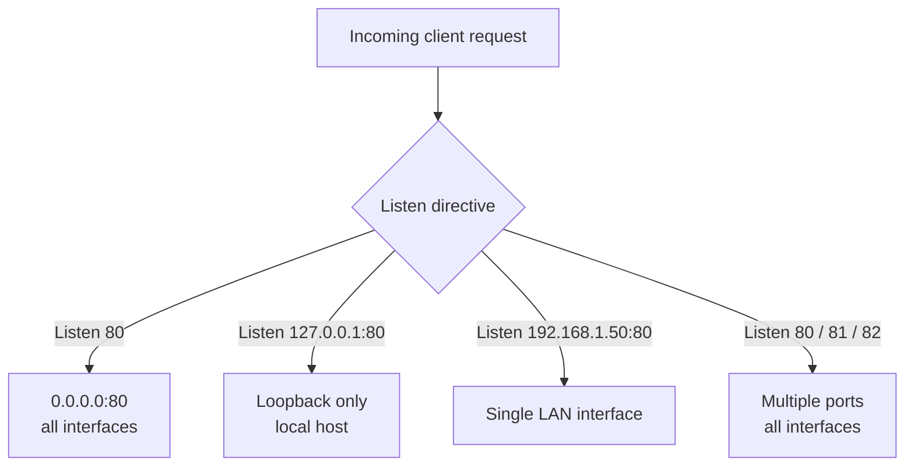

# Types of Binding in Apache Web Server

## Overview

**Binding** is how Apache (`httpd`) decides *which* network interfaces and *which* ports it accepts connections on. The `Listen` directive controls this: it can attach the server to every interface on the host, to a single IP address, to a private LAN address only, or to several ports at once. Choosing the right binding is a first-line hardening control — a service that only listens where it needs to has a smaller attack surface than one bound to `0.0.0.0`.

This note covers verifying SELinux (a prerequisite on RHEL-family systems), the four common binding modes, how to confirm each with `netstat`, and the firewall changes that must accompany non-default ports.

> [!NOTE]
> Examples use the RHEL / CentOS / Rocky / AlmaLinux layout — `/etc/httpd/conf/httpd.conf` and the `httpd` service. On Debian/Ubuntu the equivalent directive lives in `/etc/apache2/ports.conf` and the service is `apache2`. See [Apache2-Setup-on-Debian](Apache2-Setup-on-Debian.md).

## Concepts

| Term | Meaning |
|---|---|
| `Listen` directive | Tells Apache the IP:port combinations to accept connections on |
| `0.0.0.0` | Wildcard address — bind to **all** IPv4 interfaces on the host |
| `::` (`:::` in `netstat`) | Wildcard address for **all** IPv6 interfaces |
| `127.0.0.1` | Loopback — reachable only from the local host |
| LAN IP (e.g. `192.168.1.50`) | A specific interface address, reachable only from that network segment |

> [!TIP]
> A `Listen` directive with **no IP** (`Listen 80`) binds the port on every interface. Add an IP (`Listen 192.168.1.50:80`) to restrict the port to a single interface — the principle of least exposure applied to the network layer.

## SELinux Prerequisite

On Enterprise Linux, SELinux mediates which ports and files `httpd` may use. Confirm its state before changing bindings, and be aware that binding to a **non-standard port** may require an SELinux port label (`semanage port`) even when the firewall is open.

### Check Current SELinux Status

```bash
sestatus
```

### Modify SELinux Configuration

Edit the SELinux configuration file:

```bash
vim /etc/sysconfig/selinux
```

Example configuration:

```bash
# This file controls the state of SELinux on the system.
# SELINUX= can take one of these three values:
#     enforcing - SELinux security policy is enforced.
#     permissive - SELinux prints warnings instead of enforcing.
#     disabled - No SELinux policy is loaded.
SELINUX=disabled

# SELINUXTYPE= can take one of three two values:
#     targeted - Targeted processes are protected,
#     minimum - Modification of targeted policy. Only selected processes are protected.
#     mls - Multi Level Security protection.
SELINUXTYPE=targeted
```

> [!WARNING]
> Setting `SELINUX=disabled` is shown here because the lab requires it, but it removes a major layer of host protection and is **discouraged in production** (CIS Benchmarks recommend `enforcing`). Prefer `permissive` for troubleshooting, or add the correct port label instead of disabling SELinux entirely — for example `semanage port -a -t http_port_t -p tcp 81`.

Apply the change (a full reboot is required to move in or out of `disabled`):

```bash
reboot
```

After the system comes back, verify the change took effect:

```bash
sestatus
```

## Types of Apache Binding

Apache can be configured to bind to:

- A specific IP address
- All available IP addresses
- Multiple ports

The following diagram shows how each `Listen` directive maps onto the host's interfaces:



### Binding to All Available IP Addresses

By default, Apache listens on all available IP addresses:

```apache
Listen 80
```

Apache will listen on port `80` on all available network interfaces.

Example output from `netstat`:

```bash
netstat -nltup | grep httpd
```

Output:

```text
tcp        0      0 0.0.0.0:80            0.0.0.0:*               LISTEN      1234/httpd
```

```text
tcp6       0      0 :::80                   :::*                    LISTEN      792/httpd
```

`0.0.0.0` indicates that Apache is listening on all available IPv4 addresses; `:::80` is the equivalent for IPv6.

### Binding to a Specific IP Address

To bind Apache to a specific IP address:

1. Open the Apache configuration file:

```bash
vim /etc/httpd/conf/httpd.conf
```

2. Modify the `Listen` directive:

```apache
Listen 127.0.0.1:80
```

This restricts Apache to only listen on `127.0.0.1` (localhost).

After modifying the configuration, restart Apache:

```bash
systemctl restart httpd.service
```

Example output from `netstat`:

```bash
netstat -nltup | grep httpd
```

Output:

```text
tcp        0      0 127.0.0.1:80          0.0.0.0:*               LISTEN      1234/httpd
```

> [!TIP]
> Binding to `127.0.0.1` is the correct choice for a backend that should only be reachable by a local reverse proxy (e.g. Nginx or an SSL-terminating front end) — the application is never directly exposed to the network.

### Binding to a LAN IP Address

To bind Apache to a LAN IP address (e.g., `192.168.1.50`):

1. Open the Apache configuration file:

```bash
vim /etc/httpd/conf/httpd.conf
```

2. Modify the `Listen` directive:

```apache
Listen 192.168.1.50:80
```

This allows Apache to listen only on the LAN IP `192.168.1.50`.

After modifying the configuration, restart Apache:

```bash
systemctl restart httpd.service
```

Example output from `netstat`:

```bash
netstat -nltup | grep httpd
```

Output:

```text
tcp        0      0 192.168.1.50:80       0.0.0.0:*               LISTEN      1234/httpd
```

### Binding to Multiple Ports

Apache can also listen on multiple ports simultaneously:

1. Open the Apache configuration file:

```bash
vim /etc/httpd/conf/httpd.conf
```

2. Add multiple `Listen` directives:

```apache
Listen 80
Listen 81
Listen 82
```

Apache will listen on ports `80`, `81`, and `82`.

After modifying the configuration, restart Apache:

```bash
systemctl restart httpd.service
```

Example output from `netstat`:

```bash
netstat -nltup | grep httpd
```

Output:

```text
tcp        0      0 0.0.0.0:80            0.0.0.0:*               LISTEN      1234/httpd
tcp        0      0 0.0.0.0:81            0.0.0.0:*               LISTEN      1234/httpd
tcp        0      0 0.0.0.0:82            0.0.0.0:*               LISTEN      1234/httpd
```

> [!IMPORTANT]
> A new listening port is useless until the firewall permits it. Open the extra ports with `firewalld` and reload:

```bash
firewall-cmd --permanent --add-port=81/tcp
firewall-cmd --permanent --add-port=82/tcp
firewall-cmd --reload
```

## Verify Binding

Use `netstat` to confirm that Apache is listening on the configured ports:

```bash
netstat -nltup | grep httpd
```

> [!TIP]
> `netstat` is deprecated on modern systems; `ss -nltup | grep httpd` is the current `iproute2` equivalent and produces the same information. Either confirms the actual sockets `httpd` has bound.

## Summary

| Type of Binding | Configuration Example | Use Case |
|---|---|---|
| Bind to All IPs | `Listen 80` | Default setting, accessible from all interfaces |
| Bind to Specific IP | `Listen 127.0.0.1:80` | Restrict to localhost or specific IP |
| Bind to LAN IP | `Listen 192.168.1.50:80` | Restrict to LAN interface |
| Bind to Multiple Ports | `Listen 80`, `Listen 81` | Allow listening on multiple ports |

## Security Considerations

- **Bind narrowly.** Only listen on `0.0.0.0` when the service is genuinely meant for every interface. Backends and admin panels should bind to `127.0.0.1` or a management VLAN address.
- **Firewall parity.** Every non-standard port opened in `httpd.conf` must have a matching `firewall-cmd` rule and, under enforcing SELinux, a `semanage port` label — otherwise the socket binds but connections are dropped.
- **Keep SELinux enforcing** where possible; disabling it to make a port work masks the real fix (a missing port label).
- **Audit listeners regularly** with `ss -nltup` so no forgotten `Listen` directive silently exposes the host.

## Troubleshooting

| Symptom | Likely cause | Check / fix |
|---|---|---|
| Apache won't start after adding a `Listen` | Port already in use or syntax error | `httpd -t`; `ss -nltup` to find the conflicting process |
| Port bound but connection refused remotely | Firewall closed | `firewall-cmd --add-port=<n>/tcp --permanent && firewall-cmd --reload` |
| Bind fails only on a non-standard port | SELinux port label missing | `semanage port -a -t http_port_t -p tcp <n>` |
| Site unreachable after binding to one IP | Bound to the wrong interface | Confirm the IP with `ip a`; correct the `Listen` line |

## References

- [Apache `Listen` directive](https://httpd.apache.org/docs/current/bind.html) — official binding documentation
- [Apache MPM & core directives](https://httpd.apache.org/docs/current/mod/mpm_common.html#listen) — `Listen` reference
- CIS Apache HTTP Server Benchmark — network exposure and SELinux guidance

## Related

- [Binding-with-IP-Add-in-Apache](Binding-with-IP-Add-in-Apache.md) — IP-based binding child note
- [Binding-with-Port-No.-in-Apache](Binding-with-Port-No.-in-Apache.md) — port-based binding child note
- [Binding-with-Domain-Name](Binding-with-Domain-Name.md) — name-based binding child note
- [Binding-with-Type(SSL-TLS)](Binding-with-Type(SSL-TLS).md) — SSL/TLS binding child note
- [Apache-Web-Server-Setup-and-Configuration](Apache-Web-Server-Setup-and-Configuration.md) — server config these bindings live in
- [Linux Administration & Server Hardening](../Readme.md) — Linux administration & server hardening hub
