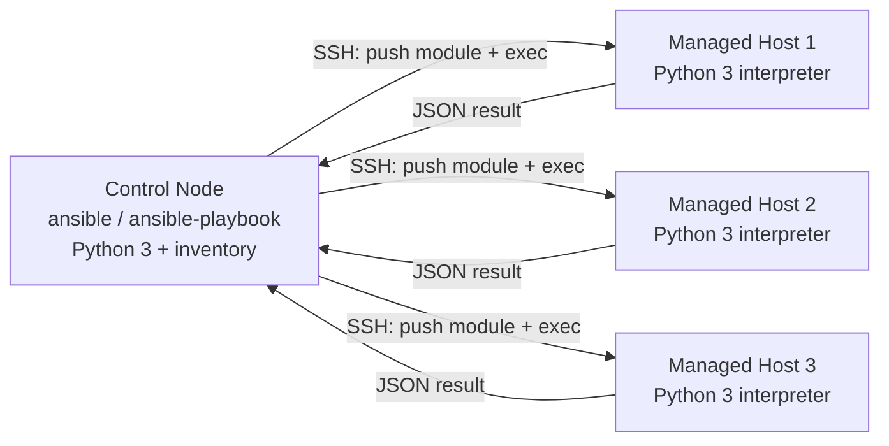

# Ansible Introduction

## Overview

Ansible is an **agentless** configuration-management and automation tool: it pushes tasks to managed hosts over plain [SSH](../SSH-Secure-Shell-Server/Readme.md) (or WinRM for Windows) and requires no daemon, agent, or database on the target. A single **control node** reads an [inventory](Ansible-Playbooks.md) of hosts, connects with an ordinary user account plus `sudo`, and runs Python-based **modules** that describe *desired state* rather than a sequence of shell commands. This note covers the control-node/inventory model, ad-hoc one-off commands, and the idempotency guarantee that lets you re-run automation safely — the foundation before moving to [Ansible-Playbooks](Ansible-Playbooks.md) and [Ansible-Roles](Ansible-Roles.md) for repeatable, version-controlled automation.

> [!TIP]
> **Why Ansible over raw SSH loops**
> Ansible's module layer inspects current state before acting, so re-running the same command against an already-configured host reports `ok` (no change) instead of blindly re-applying it or erroring out. That idempotency is what separates configuration management from a `for host in ...; do ssh ...; done` script.

## Concepts

| Term | Meaning |
|---|---|
| **Control node** | The machine running `ansible`/`ansible-playbook`; needs Python 3 and SSH client access to targets. Cannot be Windows. |
| **Managed node** | A target host reachable over SSH (or WinRM) with Python 3 present for module execution. |
| **Inventory** | A file (INI or YAML) listing hosts and groups Ansible can act against. |
| **Module** | A discrete unit of work (`apt`, `yum`, `copy`, `service`, `user`, …) that is idempotent and reports `changed`/`ok`/`failed`. |
| **Ad-hoc command** | A single `ansible` invocation running one module against one or more hosts, for quick one-off tasks. |
| **Playbook** | A YAML file of ordered plays/tasks — the repeatable alternative to ad-hoc commands. See [Ansible-Playbooks](Ansible-Playbooks.md). |
| **Role** | A packaged, reusable directory structure of tasks/handlers/templates/variables. See [Ansible-Roles](Ansible-Roles.md). |
| **Facts** | Auto-gathered host variables (`ansible_facts`) such as OS family, IP addresses, and memory, collected via the `setup` module. |
| **Idempotency** | Property of a module: running it N times produces the same end state as running it once. |

## Architecture

Ansible has no server component in the managed-node sense: the control node connects out, transfers small Python module payloads over SSH, executes them, and removes the temporary files. There is no listening agent to patch, no message bus, and no persistent daemon footprint on managed hosts (unlike Puppet/Chef agents or Salt minions).



> [!NOTE]
> **Agentless in practice**
> "Agentless" means no *persistent* agent — Ansible still needs an SSH login and a Python interpreter on the target for module execution (raw shell/`command` modules can bypass the Python requirement for bootstrapping).

## Installation

**RHEL-family (RHEL/Rocky/AlmaLinux/CentOS Stream):**

```bash
# ansible-core is in AppStream; the full 'ansible' community package needs EPEL
sudo dnf install -y epel-release
sudo dnf install -y ansible-core          # minimal, or:
sudo dnf install -y ansible               # ansible-core + curated collections
ansible --version
```

**Debian-family (Debian/Ubuntu):**

```bash
sudo apt update
sudo apt install -y ansible
ansible --version
```

**Via pip (any distro, isolated environment — recommended for pinned versions):**

```bash
python3 -m venv ~/venvs/ansible
source ~/venvs/ansible/bin/activate
pip install --upgrade pip
pip install ansible-core
ansible --version
```

## Configuration

Ansible reads settings from (in order of precedence) `ANSIBLE_CONFIG` env var → `./ansible.cfg` → `~/.ansible.cfg` → `/etc/ansible/ansible.cfg`.

```ini
; ansible.cfg — project-local, checked into version control
[defaults]
inventory      = ./inventory.ini
remote_user    = ansadmin
host_key_checking = True
retry_files_enabled = False
forks          = 10
roles_path     = ./roles

[privilege_escalation]
become         = True
become_method  = sudo
become_ask_pass = False
```

**Static INI inventory** (`inventory.ini`):

```ini
[webservers]
web01.example.internal
web02.example.internal ansible_host=10.0.1.12

[dbservers]
db01.example.internal ansible_user=dbadmin ansible_port=2222

[production:children]
webservers
dbservers

[production:vars]
ansible_python_interpreter=/usr/bin/python3
```

**YAML inventory** (`inventory.yml`) — preferred for larger environments and dynamic-inventory compatibility:

```yaml
all:
  children:
    webservers:
      hosts:
        web01.example.internal:
        web02.example.internal:
          ansible_host: 10.0.1.12
    dbservers:
      hosts:
        db01.example.internal:
          ansible_user: dbadmin
          ansible_port: 2222
```

Establish trust once with key-based SSH auth (see [Readme](../SSH-Secure-Shell-Server/Readme.md)) before running Ansible at scale:

```bash
ssh-copy-id ansadmin@web01.example.internal
```

## Commands

| Command | Purpose |
|---|---|
| `ansible <group> -m ping` | Connectivity/auth check (Python-based, not ICMP). |
| `ansible <group> -a "<cmd>"` | Run a raw shell command via the default `command` module. |
| `ansible <group> -m <module> -a "<args>"` | Run a specific module with arguments. |
| `ansible <group> -b -K` | Run with privilege escalation (`sudo`), prompting for the become password. |
| `ansible-inventory --list` | Dump the resolved inventory as JSON — verify group membership. |
| `ansible-doc -l` | List all installed modules. |
| `ansible-doc <module>` | Show a module's parameters and examples. |
| `ansible-config dump --only-changed` | Show effective config that differs from defaults. |
| `ansible-galaxy collection install <name>` | Install a collection (e.g. `community.general`). |

## Examples

Test connectivity to every host in inventory:

```bash
ansible all -m ping
```

```text
web01.example.internal | SUCCESS => {
    "ansible_facts": { "discovered_interpreter_python": "/usr/bin/python3" },
    "changed": false,
    "ping": "pong"
}
```

Run an uptime check as an ad-hoc raw command:

```bash
ansible webservers -a "uptime"
```

Ensure a package is installed (idempotent — reports `changed=false` on re-run once satisfied):

```bash
# Debian-family
ansible webservers -b -m apt -a "name=nginx state=present update_cache=yes"

# RHEL-family
ansible webservers -b -m dnf -a "name=nginx state=present"
```

Ensure a service is enabled and running:

```bash
ansible webservers -b -m service -a "name=nginx state=started enabled=yes"
```

Copy a file with defined ownership/permissions:

```bash
ansible dbservers -b -m copy -a "src=./pg_hba.conf dest=/etc/postgresql/pg_hba.conf owner=postgres group=postgres mode=0640"
```

Gather and filter facts for a single host:

```bash
ansible db01.example.internal -m setup -a "filter=ansible_distribution*"
```

Limit an inventory-wide command to one host or pattern:

```bash
ansible all --limit "web*" -m ping
```

## Best Practices

- Keep inventory and `ansible.cfg` under version control alongside playbooks/roles; never hand-edit inventory on the control node in production.
- Prefer YAML inventory and group_vars/host_vars directories once past a handful of hosts — flat INI does not scale cleanly.
- Use ad-hoc commands only for one-off diagnostics or emergency fixes; anything repeated twice belongs in a [playbook](Ansible-Playbooks.md).
- Always dry-run with `--check --diff` before applying against production groups.
- Use `--limit` and `-l` liberally to avoid accidentally running against `all`.
- Pin module/collection versions (`ansible-galaxy collection install name:==X.Y.Z`) to keep runs reproducible across the fleet.

## Security Considerations

- **Least privilege**: run as an unprivileged `ansible` service account with `sudo` granted only for the specific commands needed (CIS-aligned least-privilege access control), not blanket `NOPASSWD: ALL`.
- **SSH key hygiene**: use dedicated, passphrase-protected keys for the control node; never share the control-node private key across administrators — rotate on personnel changes.
- **Secrets management**: never store passwords or API keys in plaintext inventory/vars files — use `ansible-vault encrypt` for any file containing secrets, and keep the vault password out of version control.
- **`host_key_checking`**: keep it `True` (the default) in production; disabling it removes MITM protection on first connect. Pre-populate `known_hosts` via a controlled bootstrap step instead.
- **Log and audit**: enable `ansible.cfg` logging (`log_path`) and forward control-node logs to central [syslog](../Monitoring/Logging-with-rsyslog.md) so configuration changes are auditable, matching NIST AC-6/AU-2 change-tracking expectations.
- **Control node hardening**: the control node effectively holds root-equivalent access to every managed node — treat it as a Tier-0 asset, patch it aggressively, and restrict interactive login to it.

> [!WARNING]
> **Don't disable host key checking fleet-wide**
> Setting `host_key_checking = False` in `ansible.cfg` is a common "fix" for first-connection prompts, but it silently accepts any host key presented — removing SSH's built-in MITM detection across your entire automation surface.

> [!NOTE]
> **📸 Screenshot**
> _Capture: terminal output of `ansible webservers -m ping` showing SUCCESS/pong results across multiple hosts in the inventory._

## References

- Ansible official documentation — [docs.ansible.com](https://docs.ansible.com/)
- `ansible-doc` — offline module reference (run `ansible-doc <module>` locally)
- CIS Benchmarks — least-privilege and access-control guidance referenced above
- NIST SP 800-53 — AC-6 (Least Privilege), AU-2 (Audit Events)

## Related Notes

- [Ansible-Playbooks](Ansible-Playbooks.md) — writing repeatable, ordered task automation in YAML
- [Ansible-Roles](Ansible-Roles.md) — packaging playbooks into reusable, shareable structures
- [Readme](../SSH-Secure-Shell-Server/Readme.md) — the transport Ansible relies on
- [Linux Administration & Server Hardening](../Readme.md) — course hub and map of content
