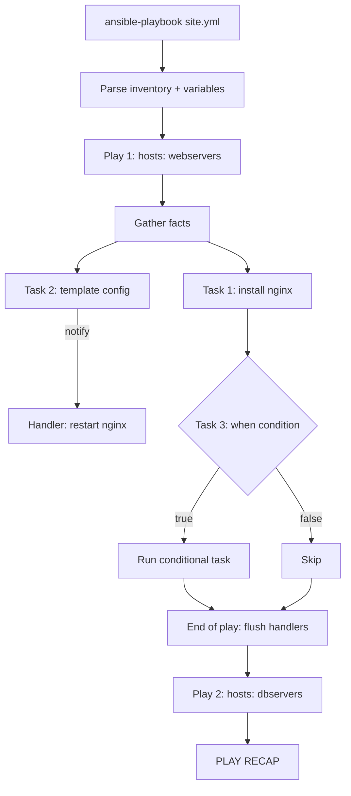

# Ansible Playbooks

## Overview

A playbook is Ansible's automation script: a YAML file that describes a desired system state as an ordered list of **plays**, each targeting a group of hosts and running a list of **tasks** against them. Playbooks build on the concepts introduced in [Ansible-Introduction](Ansible-Introduction.md) — inventory, modules, and ad-hoc commands — but add repeatability, idempotency, and version control by expressing multi-step configuration as code. Once a playbook grows past a handful of related tasks, that logic is usually extracted into a reusable [role](Ansible-Roles.md).

> [!NOTE]
> **Idempotency is the point**
> A well-written playbook can be run against a host repeatedly with no unintended side effects. Ansible modules report `changed` only when they actually alter state — this is what makes playbooks safe to re-run as drift-correction, not just first-time installers.

## Concepts

| Term | Meaning |
|---|---|
| **Play** | Maps a group of hosts to a set of tasks/roles; a playbook is a list of one or more plays |
| **Task** | A single module invocation with a name and arguments (e.g. `package`, `copy`, `service`) |
| **Handler** | A task that only runs when notified by another task, deduplicated and run once at the end of a play |
| **Variable** | A named value (`vars`, `host_vars`, `group_vars`, `-e`, registered) used to parameterize tasks |
| **Fact** | Auto-discovered host data (`ansible_facts`) gathered via the `setup` module at play start |
| **Conditional** | `when:` clause that gates a task on a fact, variable, or registered result |
| **Loop** | `loop:` (or legacy `with_items`) that repeats a task once per list item |
| **Play/Task result** | `register:` captures a task's return data (stdout, rc, changed) into a variable for later use |

## Architecture



## Installation

Ansible is agentless — install the control node package only; managed nodes just need Python and SSH access.

```bash
# RHEL / Rocky / AlmaLinux (control node)
sudo dnf install -y ansible-core

# Debian / Ubuntu (control node)
sudo apt update && sudo apt install -y ansible

# Verify
ansible --version
ansible-playbook --version
```

> [!TIP]
> **Managed node prerequisite**
> Target hosts need `python3` installed and an SSH user with either passwordless sudo or a `--ask-become-pass` prompt. Verify reachability first with `ansible all -m ping`.

## Configuration

Minimal project layout for a playbook-driven setup:

```text
project/
├── ansible.cfg
├── inventory.ini
├── site.yml
├── group_vars/
│   └── webservers.yml
└── templates/
    └── nginx.conf.j2
```

```ini
# inventory.ini
[webservers]
web01.example.internal
web02.example.internal

[dbservers]
db01.example.internal

[webservers:vars]
ansible_user=deploy
```

```ini
# ansible.cfg
[defaults]
inventory = inventory.ini
remote_user = deploy
host_key_checking = True
retry_files_enabled = False
```

## Examples

Full example playbook covering plays, tasks, handlers, variables, facts, a conditional, and a loop:

```yaml
---
# site.yml
- name: Configure and harden web servers
  hosts: webservers
  become: true
  vars:
    app_port: 8443
    allowed_packages:
      - nginx
      - fail2ban
      - unattended-upgrades

  tasks:
    - name: Install required packages
      ansible.builtin.package:
        name: "{{ item }}"
        state: present
      loop: "{{ allowed_packages }}"

    - name: Deploy nginx configuration from template
      ansible.builtin.template:
        src: templates/nginx.conf.j2
        dest: /etc/nginx/nginx.conf
        owner: root
        group: root
        mode: "0644"
      notify: Restart nginx

    - name: Ensure nginx is enabled and running
      ansible.builtin.service:
        name: nginx
        state: started
        enabled: true

    - name: Apply extra hardening on RHEL family only
      ansible.builtin.lineinfile:
        path: /etc/ssh/sshd_config
        regexp: '^PermitRootLogin'
        line: 'PermitRootLogin no'
      when: ansible_facts['os_family'] == "RedHat"
      notify: Restart sshd

    - name: Check disk usage on root filesystem
      ansible.builtin.command: df -h /
      register: disk_usage
      changed_when: false

    - name: Show disk usage result
      ansible.builtin.debug:
        var: disk_usage.stdout_lines

  handlers:
    - name: Restart nginx
      ansible.builtin.service:
        name: nginx
        state: restarted

    - name: Restart sshd
      ansible.builtin.service:
        name: sshd
        state: restarted
```

Key mechanics illustrated above:

- **Facts** (`ansible_facts['os_family']`) drive the RHEL-only hardening task without a separate `when` per distro branch.
- **`loop`** installs a variable list of packages with a single task instead of repeating the module.
- **`register` + `changed_when: false`** captures command output for reporting without ever reporting a false `changed` state.
- **`notify`** defers handler execution to end-of-play and collapses duplicate notifications into one restart.

## Commands

| Command | Purpose |
|---|---|
| `ansible-playbook site.yml` | Run a playbook against the default inventory |
| `ansible-playbook -i inventory.ini site.yml` | Run with an explicit inventory file |
| `ansible-playbook site.yml --check` | Dry run — report changes without applying them |
| `ansible-playbook site.yml --diff` | Show file/content diffs for changed tasks |
| `ansible-playbook site.yml --limit web01` | Restrict the run to one host or group |
| `ansible-playbook site.yml --tags nginx` | Run only tasks tagged `nginx` |
| `ansible-playbook site.yml -e "app_port=9443"` | Override a variable at runtime |
| `ansible-playbook site.yml -v` / `-vvv` | Increase verbosity for debugging |
| `ansible-playbook site.yml --ask-become-pass` | Prompt for the sudo password interactively |
| `ansible-playbook --syntax-check site.yml` | Validate YAML/module syntax only |
| `ansible-lint site.yml` | Static analysis against Ansible best-practice rules |

```bash
# Typical safe workflow before touching production
ansible-playbook --syntax-check site.yml
ansible-playbook --check --diff -i inventory.ini site.yml
ansible-playbook -i inventory.ini site.yml --limit web01
```

## Best Practices

- Name every play and task descriptively — names appear in `PLAY RECAP` output and make failures self-explanatory.
- Use `become: true` at the play or task level rather than running the control node as root.
- Prefer `loop` over the deprecated `with_*` loop styles in new playbooks.
- Set `changed_when`/`failed_when` explicitly on `command`/`shell` tasks — they otherwise always report `changed`.
- Keep secrets out of plaintext `vars` — use `ansible-vault encrypt` for anything sensitive.
- Extract repeated task blocks into [Ansible-Roles](Ansible-Roles.md) once a playbook exceeds ~50-100 lines or is reused across projects.
- Always run `--check --diff` against an unfamiliar playbook before a real run.

## Security Considerations

- **Least privilege**: scope `become` narrowly (task-level, not blanket play-level) when only a few tasks need root, per CIS access-control guidance.
- **Secrets management**: encrypt credentials, API keys, and passwords with `ansible-vault`; never commit plaintext secrets to the playbook repo.
- **SSH hardening**: pair playbook-driven config with key-based auth and `PermitRootLogin no`, consistent with CIS Benchmark SSH controls.
- **Control node integrity**: the control node holds SSH keys/vault passwords for the entire fleet — treat it as Tier-0 and restrict access accordingly (NIST SP 800-53 AC-6).
- **Idempotent auditing**: run playbooks with `--check` on a schedule as a lightweight configuration-drift/compliance check.
- **Log review**: enable `log_path` in `ansible.cfg` to retain an audit trail of what was changed, when, and by whom.

> [!WARNING]
> **Avoid `shell`/`command` when a module exists**
> Raw `shell`/`command` tasks bypass idempotency checks and Ansible's built-in state validation. Use a purpose-built module (`package`, `service`, `lineinfile`, `template`, …) whenever one covers the need.

> [!NOTE]
> **📸 Screenshot**
> _Capture: terminal output of `ansible-playbook -i inventory.ini site.yml --diff` showing the PLAY RECAP with ok/changed/failed counts per host._

## Troubleshooting

| Symptom | Likely Cause | Fix |
|---|---|---|
| `UNREACHABLE` for a host | SSH connectivity/host key issue | Test with `ansible <host> -m ping`; check inventory hostname and keys |
| Task always reports `changed` | `command`/`shell` module with no `changed_when` | Add `changed_when` based on `rc` or `stdout` |
| Handler never fires | `notify` name mismatch with handler `name` | Ensure exact string match (case-sensitive) |
| `Missing sudo password` | `become: true` without privilege escalation configured | Re-run with `--ask-become-pass` or configure passwordless sudo |
| Variable undefined error | Typo or wrong precedence (`group_vars` vs `-e`) | Run with `-vvv` and check `ansible-inventory --list` for resolved vars |
| Facts not available | `gather_facts: false` set on the play | Remove the override or add `setup:` task explicitly |

## References

- Ansible Playbooks Documentation — https://docs.ansible.com/ansible/latest/playbook_guide/index.html
- Ansible Built-in Modules Index — https://docs.ansible.com/ansible/latest/collections/ansible/builtin/index.html
- CIS Benchmarks — https://www.cisecurity.org/cis-benchmarks
- NIST SP 800-53 Rev. 5 — https://csrc.nist.gov/pubs/sp/800/53/r5/upd1/final

## Related Notes

- [Ansible Introduction](Ansible-Introduction.md)
- [Ansible Roles](Ansible-Roles.md)
- [Linux Administration & Server Hardening](../Readme.md) — course hub and map of content
