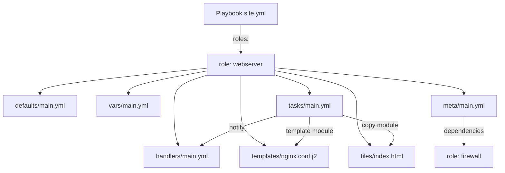

# Ansible Roles

## Overview

A role is Ansible's unit of reuse — a self-contained bundle of tasks, variables, templates, handlers, and files that implements one piece of configuration (install nginx, harden SSH, deploy an app) and can be dropped into any [playbook](Ansible-Playbooks.md) without rewriting logic. Roles follow a fixed directory layout that Ansible auto-loads by convention, so a well-built role travels between projects, teams, and even public sharing via Ansible Galaxy with zero changes. Sensitive role variables (API keys, service passwords) belong in [Ansible-Vault](Ansible-Vault.md)-encrypted files, never in plaintext `vars/` or `defaults/`.

> [!TIP]
> **Why roles over monolithic playbooks**
> A single 2000-line playbook is unmaintainable and untestable. Splitting it into roles (`common`, `webserver`, `firewall`, `monitoring`) gives you independently testable, independently versioned building blocks that different playbooks and teams can mix and match.

## Concepts

| Concept | Purpose |
|---|---|
| Role | A namespaced, reusable bundle of automation content with a standard directory layout |
| `defaults/` | Lowest-precedence variables — safe fallback values meant to be overridden by the caller |
| `vars/` | Higher-precedence variables — role-internal constants not meant to be overridden casually |
| `tasks/main.yml` | Entry point of the role's task list; can `include_tasks`/`import_tasks` other files |
| `handlers/main.yml` | Handlers notified by tasks (e.g. `restart nginx`), run once at end of play |
| `templates/` | Jinja2 (`.j2`) files rendered with the `template` module |
| `files/` | Static files copied verbatim with the `copy` module |
| `meta/main.yml` | Role metadata: author, license, platform support, role dependencies |
| `library/`, `filter_plugins/` | Optional custom modules/filters scoped to this role only |

Variable precedence (lowest to highest, roles-relevant subset): role `defaults` → inventory group_vars → inventory host_vars → play `vars` → role `vars` → task `vars` → extra-vars (`-e`) on the CLI. This is why role-tunable knobs go in `defaults/main.yml` and role-internal constants go in `vars/main.yml`.

## Architecture



### Standard directory layout

```text
roles/
└── webserver/
    ├── defaults/
    │   └── main.yml        # overridable defaults, e.g. webserver_port: 80
    ├── vars/
    │   └── main.yml        # internal constants
    ├── tasks/
    │   └── main.yml        # the work: install, configure, enable
    ├── handlers/
    │   └── main.yml        # restart/reload triggers
    ├── templates/
    │   └── nginx.conf.j2   # Jinja2 config templates
    ├── files/
    │   └── index.html      # static files copied as-is
    ├── meta/
    │   └── main.yml        # author, dependencies, galaxy_info
    ├── tests/
    │   ├── inventory
    │   └── test.yml        # standalone test playbook
    └── README.md
```

Every subdirectory is optional — Ansible only loads what exists — but `tasks/main.yml` is required for the role to do anything.

## Installation

Scaffold the layout with `ansible-galaxy` rather than hand-creating directories:

```bash
# From the project's roles/ directory (or roles_path)
ansible-galaxy init webserver

# Install a role from Ansible Galaxy
ansible-galaxy role install geerlingguy.nginx

# Install into a project-local roles/ path (recommended over global install)
ansible-galaxy role install geerlingguy.nginx -p ./roles

# Install a pinned version from a requirements file
ansible-galaxy role install -r requirements.yml
```

`requirements.yml` example (pin versions for reproducible builds):

```yaml
---
roles:
  - name: geerlingguy.nginx
    version: "3.1.4"
  - name: geerlingguy.firewall
    version: "2.9.0"
  - src: https://github.com/example-org/ansible-role-hardening.git
    scm: git
    version: main
    name: hardening
```

## Configuration

`roles/webserver/defaults/main.yml`:

```yaml
---
webserver_port: 80
webserver_worker_processes: auto
webserver_document_root: /var/www/html
webserver_enable_tls: false
```

`roles/webserver/vars/main.yml`:

```yaml
---
webserver_service_name_rhel: nginx
webserver_service_name_debian: nginx
webserver_config_path: /etc/nginx/nginx.conf
```

`roles/webserver/tasks/main.yml`:

```yaml
---
- name: Install nginx (RHEL family)
  ansible.builtin.dnf:
    name: nginx
    state: present
  when: ansible_os_family == "RedHat"

- name: Install nginx (Debian family)
  ansible.builtin.apt:
    name: nginx
    state: present
    update_cache: true
  when: ansible_os_family == "Debian"

- name: Deploy nginx configuration
  ansible.builtin.template:
    src: nginx.conf.j2
    dest: "{{ webserver_config_path }}"
    owner: root
    group: root
    mode: "0644"
    validate: "nginx -t -c %s"
  notify: reload nginx

- name: Deploy static index page
  ansible.builtin.copy:
    src: index.html
    dest: "{{ webserver_document_root }}/index.html"
    mode: "0644"

- name: Ensure nginx is enabled and running
  ansible.builtin.service:
    name: nginx
    state: started
    enabled: true
```

`roles/webserver/handlers/main.yml`:

```yaml
---
- name: reload nginx
  ansible.builtin.service:
    name: nginx
    state: reloaded

- name: restart nginx
  ansible.builtin.service:
    name: nginx
    state: restarted
```

`roles/webserver/templates/nginx.conf.j2` (Jinja2, using role variables):

```jinja
worker_processes {{ webserver_worker_processes }};

events {
    worker_connections 1024;
}

http {
    server {
        listen {{ webserver_port }};
        root {{ webserver_document_root }};

        location / {
            index index.html;
        }
    }
}
```

`roles/webserver/meta/main.yml` — declares Galaxy metadata and role dependencies:

```yaml
---
galaxy_info:
  author: your_name
  description: Installs and configures nginx
  license: MIT
  min_ansible_version: "2.15"
  platforms:
    - name: EL
      versions: [8, 9]
    - name: Ubuntu
      versions: [22.04, 24.04]

dependencies:
  - role: firewall
    vars:
      firewall_allowed_tcp_ports: ["{{ webserver_port }}"]
```

## Commands

| Command | Purpose |
|---|---|
| `ansible-galaxy init <name>` | Scaffold a new role's directory layout |
| `ansible-galaxy role install <name>` | Install a role from Galaxy or a `requirements.yml` |
| `ansible-galaxy role list` | List installed roles and their versions |
| `ansible-galaxy role remove <name>` | Uninstall a role |
| `ansible-galaxy collection install <namespace.collection>` | Install a Collection (roles + modules + plugins bundle) |
| `ansible-playbook site.yml --syntax-check` | Validate YAML/syntax without running |
| `ansible-playbook site.yml --list-tasks` | Preview the resolved task list, including role tasks |
| `ansible-lint roles/webserver` | Lint a role against best-practice rules |
| `molecule test` | Run a role's isolated test suite (requires `molecule` + a driver, e.g. Docker) |

## Examples

Consuming a role from a playbook — the `roles:` keyword and variable overrides at call time:

```yaml
---
- name: Configure web tier
  hosts: webservers
  become: true
  roles:
    - role: firewall
    - role: webserver
      vars:
        webserver_port: 8080
        webserver_enable_tls: true
```

Equivalent, more flexible modern syntax using `import_role`/`include_role` inside `tasks:` (allows loops and conditionals a static `roles:` list cannot express):

```yaml
tasks:
  - name: Apply webserver role only on tagged hosts
    ansible.builtin.include_role:
      name: webserver
    when: "'edge' in group_names"
    vars:
      webserver_port: 443
      webserver_enable_tls: true
```

## Best Practices

- Keep `tasks/main.yml` thin: `include_tasks` per OS family or feature (`install.yml`, `configure.yml`, `service.yml`) instead of one giant file.
- Put every user-tunable knob in `defaults/main.yml` with a sane default; reserve `vars/` for values the role owner controls (OS-specific package/service names).
- Namespace role variables with the role name prefix (`webserver_port`, not `port`) to avoid collisions when multiple roles run in the same play.
- Use `meta/main.yml` `dependencies` sparingly — prefer explicit ordering in the playbook's `roles:` list for readability; heavy dependency chains become hard to reason about.
- Ship a `tests/test.yml` or `molecule/` scenario with every role so it can be validated in isolation, not only inside a full playbook run.
- Pin role versions in `requirements.yml` for anything pulled from Galaxy or Git — untagged `main` branches break reproducibility.
- One role, one responsibility. A role that installs a database *and* configures a firewall *and* schedules backups should be three roles composed by a playbook.

## Security Considerations

- **Never commit secrets in `defaults/` or `vars/`.** Encrypt secret-bearing variable files with `ansible-vault encrypt roles/webserver/vars/secrets.yml` — see [Ansible-Vault](Ansible-Vault.md).
- Set explicit `mode:` (least privilege) on every `template`/`copy` task that writes config or credential files — do not rely on umask defaults.
- Use `validate:` on `template` tasks for services with a config-test binary (`nginx -t`, `sshd -t`, `visudo -cf`) to catch syntax errors before they land on a running service.
- Audit third-party Galaxy roles before use: review `tasks/`, `meta/main.yml` dependency chain, and any `library/` custom modules for unexpected `become: true` escalation or outbound network calls.
- Pin role and collection versions (`requirements.yml`); an unpinned `main` branch can silently introduce a supply-chain change on the next `ansible-galaxy install`.
- Run `ansible-lint` and, where available, `ansible-playbook --check --diff` against roles before applying to production to catch unintended drift or destructive changes.

> [!WARNING]
> **CIS/NIST alignment**
> Hardening roles (SSH, sudoers, auditd, firewall) should map each task to a specific CIS Benchmark or NIST 800-53 control ID in a task `name:` or comment — this turns the role into an auditable control implementation, not just "some config changes."

> [!NOTE]
> **📸 Screenshot**
> _Capture: `ansible-galaxy init webserver` output followed by `tree roles/webserver` showing the generated directory layout._

## Troubleshooting

| Symptom | Likely Cause | Fix |
|---|---|---|
| `ERROR! the role 'X' was not found` | Role not in `roles_path` or `requirements.yml` not installed | Check `ansible.cfg` `roles_path`; run `ansible-galaxy role install -r requirements.yml` |
| Variable not overriding as expected | Set in `vars/` (high precedence) instead of `defaults/` | Move the tunable to `defaults/main.yml` |
| Handler never fires | `notify:` name doesn't exactly match handler `name:` | Match strings exactly; handler names are case-sensitive |
| Template renders empty/wrong values | Variable typo or wrong scope (task var vs role var) | Run `ansible-playbook --extra-vars` debug, or add a `debug: var=` task |
| Role runs on wrong hosts | `hosts:` in the calling play doesn't match inventory group | Verify inventory groups with `ansible-inventory --graph` |
| Galaxy install fails with SSL/cert error | Corporate proxy or outdated CA bundle | Use `--server` with an internal Galaxy/Automation Hub mirror, or update `ca-certificates` |

## References

- Ansible Documentation — Roles: https://docs.ansible.com/ansible/latest/playbook_guide/playbooks_reuse_roles.html
- Ansible Galaxy user guide: https://docs.ansible.com/ansible/latest/galaxy/user_guide.html
- Ansible Documentation — Variable precedence: https://docs.ansible.com/ansible/latest/playbook_guide/playbooks_variables.html#variable-precedence-where-should-i-put-a-variable
- Molecule testing framework: https://ansible.readthedocs.io/projects/molecule/

## Related Notes

- [Ansible-Playbooks](Ansible-Playbooks.md) — playbooks that consume roles via `roles:`/`include_role`
- [Ansible-Vault](Ansible-Vault.md) — encrypting role secrets in `vars/`/`defaults/`
- [Linux Administration & Server Hardening](../Readme.md) — course hub and map of content
