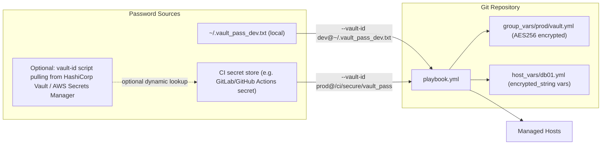

# Ansible Vault

## Overview

Ansible Vault is the encryption layer built into [Ansible](Ansible-Roles.md) that lets you commit secrets — API tokens, database passwords, TLS private keys, SSH keys — directly into version control alongside the playbooks and roles that consume them. Instead of keeping `secrets.yml` out-of-band (or worse, in plaintext in a private repo), Vault encrypts the file with AES256 so it is safe to store in Git; only holders of the vault password can decrypt it at run time. It integrates transparently with `ansible-playbook`, `ansible-pull`, and CI/CD pipelines via `--ask-vault-pass`, `--vault-password-file`, or the newer multi-secret `vault-id` mechanism.

> [!IMPORTANT]
> Ansible Vault protects data **at rest**, not in memory or in logs. A task that prints a decrypted variable with `debug` or fails with `no_log: false` can leak the secret into console output or CI logs even though the source file stays encrypted. Always pair Vault with `no_log: true` on tasks that handle sensitive values.

## Concepts

| Term | Meaning |
|---|---|
| **Vault password** | The passphrase (or key derived from a script/file) used to encrypt/decrypt content. Anyone with it can read the secret. |
| **Vault ID** | A label (e.g. `prod`, `dev`) attached to a password source, allowing multiple independent secrets/passwords in the same project. |
| **Encrypted file** | A whole YAML/JSON file encrypted in place — content is unreadable until decrypted (`ansible-vault create/encrypt`). |
| **Encrypted string** | A single scalar value encrypted inline inside an otherwise plaintext YAML file (`ansible-vault encrypt_string`). |
| **Vault password file** | A file (or executable script) that returns the password, referenced with `--vault-password-file` to avoid interactive prompts — required for CI. |
| **Rekey** | Rotating the vault password without changing the plaintext content (`ansible-vault rekey`). |

## Architecture



Vault-encrypted files/strings are decrypted **in memory** at playbook run time and never written back to disk unencrypted — `ansible-playbook` streams the plaintext directly into the templating engine.

## Installation

Ansible Vault ships as part of the `ansible-core` package — no separate install is required.

```bash
# RHEL / Rocky / AlmaLinux
sudo dnf install -y ansible-core

# Debian / Ubuntu
sudo apt update && sudo apt install -y ansible-core

# Verify
ansible-vault --version
```

## Configuration

Set a default vault identity so playbooks and ad-hoc commands don't need `--vault-id` on every invocation. Add to `ansible.cfg`:

```ini
[defaults]
vault_identity_list = dev@~/.vault_pass_dev.txt, prod@/etc/ansible/secure/vault_pass_prod

# Optional: point at a script instead of a static file for prod
# so the password is fetched from a secrets manager at run time.
```

A vault password file can be static plaintext (mode `0600`, never committed) or an **executable script** that prints the password to stdout — useful for pulling from Vault/AWS Secrets Manager/1Password CLI:

```bash
#!/usr/bin/env bash
# vault_pass_prod.sh — fetch password from a secrets backend
aws secretsmanager get-secret-value \
  --secret-id ansible/vault-prod \
  --query SecretString --output text
```

```bash
chmod 700 vault_pass_prod.sh
```

## Commands

| Command | Purpose |
|---|---|
| `ansible-vault create secrets.yml` | Create a new encrypted file (opens `$EDITOR`) |
| `ansible-vault edit secrets.yml` | Decrypt, open in `$EDITOR`, re-encrypt on save |
| `ansible-vault view secrets.yml` | Print decrypted contents to stdout (read-only) |
| `ansible-vault encrypt vars.yml` | Encrypt an existing plaintext file in place |
| `ansible-vault decrypt vars.yml` | Permanently decrypt a file (dangerous — use `--output` to avoid clobbering) |
| `ansible-vault encrypt_string 'S3cr3t!' --name 'db_password'` | Produce a single inline `!vault` YAML block |
| `ansible-vault rekey secrets.yml` | Change the password used to encrypt a file |
| `ansible-vault view --vault-id prod@prompt secrets.yml` | Decrypt using a specific named vault-id, prompted interactively |

## Examples

Create a new encrypted variables file:

```bash
ansible-vault create group_vars/prod/vault.yml
```

Encrypt a single string for inline use in a normally-plaintext playbook or `group_vars/all.yml`:

```bash
ansible-vault encrypt_string 'SuperSecretDBPass123!' --name 'db_password' \
  --vault-id prod@~/.vault_pass_prod.txt
```

Resulting inline block, safe to commit next to plaintext vars:

```yaml
db_password: !vault |
          $ANSIBLE_VAULT;1.2;AES256;prod
          66386439653236336462626566653063336164663966303231363934653561363437633331
          3765386535396563373966386261303539356163363438610a626438346331306439303531
          6537303561633138366630303064393835333131323736616264386133393965383866313961
          6633656266323330390a326566303939326566653063396630303530616438653530353a3236
```

Recommended layout so you can rekey/rotate `prod` without touching `dev`:

```text
group_vars/
├── dev/
│   ├── vars.yml          # plaintext, non-sensitive
│   └── vault.yml         # encrypted with dev vault-id
└── prod/
    ├── vars.yml
    └── vault.yml          # encrypted with prod vault-id
```

Run a playbook using multiple vault-ids simultaneously (dev vars for staging hosts, prod vars for prod hosts, both decryptable in the same run):

```bash
ansible-playbook site.yml \
  --vault-id dev@~/.vault_pass_dev.txt \
  --vault-id prod@~/.vault_pass_prod.txt
```

Rotate a compromised vault password without changing plaintext content:

```bash
ansible-vault rekey group_vars/prod/vault.yml --vault-id prod@prompt
```

### CI Usage

In CI, never prompt interactively — inject the password via a file sourced from the pipeline's secret store, then delete it immediately after the run.

```yaml
# .gitlab-ci.yml (excerpt)
deploy:
  stage: deploy
  script:
    - echo "$ANSIBLE_VAULT_PASSWORD" > /tmp/vault_pass
    - chmod 600 /tmp/vault_pass
    - ansible-playbook site.yml --vault-password-file /tmp/vault_pass
    - rm -f /tmp/vault_pass
  variables:
    ANSIBLE_VAULT_PASSWORD: $CI_VAULT_PASSWORD   # masked/protected CI variable
```

```yaml
# GitHub Actions (excerpt)
- name: Write vault password
  run: echo "${{ secrets.ANSIBLE_VAULT_PASSWORD }}" > /tmp/vault_pass && chmod 600 /tmp/vault_pass
- name: Run playbook
  run: ansible-playbook site.yml --vault-password-file /tmp/vault_pass
- name: Clean up
  if: always()
  run: rm -f /tmp/vault_pass
```

Alternatively, set the `ANSIBLE_VAULT_PASSWORD_FILE` environment variable so every `ansible-*` invocation picks it up automatically without repeating `--vault-password-file`.

## Best Practices

- Use **`vault-id` labels** (`dev`, `staging`, `prod`) from day one, even on solo projects — retrofitting multi-secret support later is painful.
- Prefer `encrypt_string` for individual credentials mixed into otherwise-readable `group_vars` files; reserve whole-file encryption (`create`/`encrypt`) for files that are entirely sensitive.
- Store the vault password itself in a dedicated secrets manager (HashiCorp Vault, AWS Secrets Manager, Bitwarden Secrets Manager) and fetch it via an executable vault-id script — never hardcode it in `ansible.cfg` or a committed file.
- Set `no_log: true` on any task that touches decrypted secrets to prevent leakage into `ansible-playbook -v` output or CI logs.
- Add a `.gitattributes` diff filter (`ansible-vault view $1`) so `git diff` shows meaningful plaintext diffs for encrypted files during code review, without ever writing plaintext to disk.
- Rekey on every team member departure and on any suspected password exposure.
- Keep vault password files at `0600`, owned by the service account running the pipeline, and never echo them to stdout in scripts.

## Security Considerations

Aligned with CIS Controls (Secure Configuration, Data Protection) and NIST SP 800-53 (SC-28 Protection of Information at Rest, IA-5 Authenticator Management):

- **AES256 at rest, not in transit or memory**: Vault only protects the file on disk. Combine with TLS for `ansible-pull`/Git transport and restrict shell history/log retention on control nodes.
- **Password strength and rotation**: treat the vault password as a long-lived credential — generate it with a CSPRNG (`openssl rand -base64 32`), rotate periodically, and rekey affected files immediately after any team member offboarding.
- **Least privilege on password files**: `0600` permissions, dedicated CI service accounts, and secret-store-backed vault-id scripts instead of static files checked out onto shared build agents.
- **Never commit the vault password itself**, and never log `ansible-vault view` output in CI — pipe directly into the task that needs it or use `no_log: true`.
- **Audit trail**: encrypted files still diff at the binary/ciphertext level in `git log`; pair with commit signing and branch protection so secret-file changes go through review even though the content is opaque.
- **Separate vault-ids by blast radius** (per environment, per team) so a leaked `dev` password cannot decrypt `prod` secrets.

> [!NOTE]
> **📸 Screenshot**
> _Capture: terminal output of `ansible-vault view group_vars/prod/vault.yml` prompting for the vault password, followed by the decrypted YAML content, alongside `ansible-playbook site.yml --vault-id prod@prompt` running successfully._

## Troubleshooting

| Symptom | Likely Cause | Fix |
|---|---|---|
| `ERROR! Decryption failed` | Wrong vault password or corrupted ciphertext | Verify correct `--vault-id`/password file; check file wasn't hand-edited |
| `ERROR! Attempting to decrypt but no vault secrets found` | Playbook references an encrypted var but no `--vault-id`/`--ask-vault-pass` supplied | Add `--vault-password-file` or set `ANSIBLE_VAULT_PASSWORD_FILE` |
| Secret appears in CI logs | Task lacks `no_log: true` or uses `-vvv` verbosity | Add `no_log: true`; avoid high verbosity on secret-handling tasks |
| Multiple vault-ids conflict (`ERROR! Vault password... not found`) | Encrypted content's vault-id label doesn't match any supplied `--vault-id` | List all needed vault-ids explicitly at runtime; check the ciphertext header (`$ANSIBLE_VAULT;1.2;AES256;<label>`) |
| `git diff` shows unreadable ciphertext | No diff filter configured | Configure `.gitattributes` with `diff=ansible-vault` and a corresponding `git config diff.ansible-vault.textconv` |

## References

- [Ansible Vault official documentation](https://docs.ansible.com/ansible/latest/vault_guide/index.html)
- [Ansible Vault CLI reference](https://docs.ansible.com/ansible/latest/cli/ansible-vault.html)
- CIS Controls v8 — Control 3 (Data Protection)
- NIST SP 800-53 Rev. 5 — SC-28, IA-5

## Related Notes

- [Ansible-Roles](Ansible-Roles.md) — role structure and reuse patterns that Vault-encrypted variables plug into
- [Linux Administration & Server Hardening](../Readme.md) — course hub and map of content
