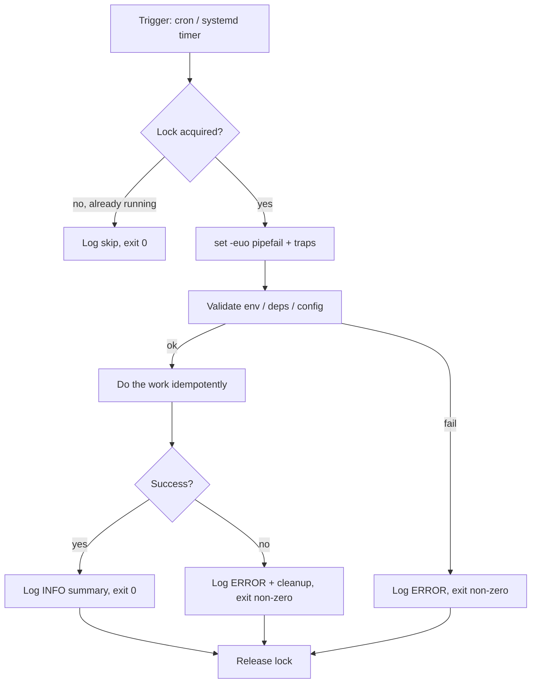

# Bash Automation

## Overview

Bash automation is the glue that turns manual sysadmin tasks — backups, log rotation, user provisioning, health checks — into repeatable, unattended jobs. This note builds on the fundamentals in [Shell Scripting](../Shell-Scripting/Readme.md) and focuses specifically on writing **production-grade** scripts: strict error handling, structured logging, correct exit codes, and safe integration with [cron and systemd timers](Cron-Automation.md). A script that works when you run it interactively is not the same as a script that is safe to run unattended at 3 AM with no one watching.

> [!IMPORTANT]
> **Production bar**
> Any script executed by cron, a timer, or a CI runner must be non-interactive-safe: no prompts, no reliance on an interactive shell's aliases/functions, explicit exit codes, and logging that lets you diagnose a 3 AM failure without re-running it by hand.

## Concepts

| Concept | Why it matters in automation |
|---|---|
| Exit codes | The only signal cron/systemd/monitoring has about success or failure |
| `set -euo pipefail` | Converts silent failures into loud, immediate ones |
| Idempotency | Re-running the script after a partial failure must not corrupt state |
| Logging | Interactive scripts can rely on a human watching; unattended ones cannot |
| Locking | Prevents overlapping runs when a job takes longer than its schedule interval |
| Environment | cron/systemd run with a minimal `$PATH` and no shell rc files sourced |

## Exit Codes

Every command and every script returns an exit code: `0` for success, `1-255` for failure. Bash exposes the last command's code in `$?`. Reserve a small, documented range of non-zero codes so monitoring (Nagios/Zabbix/systemd `OnFailure=`) can distinguish failure classes instead of treating everything as a generic "1".

```bash
#!/usr/bin/env bash
# Exit code contract for this script
readonly E_OK=0
readonly E_USAGE=64        # bad arguments (BSD sysexits convention)
readonly E_MISSING_DEP=69  # required binary/service unavailable
readonly E_CONFIG=78       # config file invalid or missing
readonly E_RUNTIME=1       # generic runtime failure

command -v rsync >/dev/null 2>&1 || { echo "rsync not found" >&2; exit "$E_MISSING_DEP"; }
```

| Range | Convention |
|---|---|
| `0` | Success |
| `1` | Generic/catch-all error |
| `2` | Misuse of shell builtins |
| `64-78` | `sysexits.h` codes (BSD convention: usage, dataerr, noinput, config, …) |
| `126` | Command found but not executable |
| `127` | Command not found |
| `128+n` | Terminated by signal `n` (e.g. `130` = SIGINT, `137` = SIGKILL) |

## `set -euo pipefail` and Strict Mode

This is the single highest-leverage habit for reliable automation. Put it on line 2 of every script that isn't a trivial one-liner.

```bash
#!/usr/bin/env bash
set -Eeuo pipefail
IFS=$'\n\t'
```

| Flag | Effect | Common gotcha |
|---|---|---|
| `-e` | Exit immediately if a command returns non-zero | Disabled inside `if`, `while`, `&&`/`\|\|`, and command substitutions used as conditions — this is by design, not a bug |
| `-u` | Treat unset variables as an error | Breaks on unset positional params (`$1`) — guard with `${1:-}` or check `$#` first |
| `-o pipefail` | A pipeline fails if *any* stage fails, not just the last | `cmd_that_fails \| grep foo` now correctly reports failure |
| `-E` | Ensures `ERR` traps propagate into functions and subshells | Pair with a `trap` handler for useful diagnostics |
| `IFS=$'\n\t'` | Word-splits only on newline/tab, not space | Prevents `for f in $(ls *.txt)` style bugs with spaces in filenames |

```bash
# Trap failures with context instead of a bare non-zero exit
trap 'echo "[FATAL] line $LINENO: command \"$BASH_COMMAND\" exited $?" >&2' ERR

# Cleanup that must run even on failure (temp files, locks)
cleanup() { rm -f "$LOCKFILE" "$TMPFILE"; }
trap cleanup EXIT
```

> [!WARNING]
> **`-e` is not a silver bullet**
> `set -e` does **not** catch failures inside `if cmd; then`, inside `cmd || true`, or the non-last command of a pipeline without `pipefail`. Always test the actual failure path, not just the happy path — a script that "looks strict" can still swallow errors.

## Architecture



## Logging

Unattended scripts must log enough to reconstruct what happened without re-running. Log to both a file (for `grep`/log rotation) and `syslog`/`journald` (for centralized aggregation and `journalctl -u`).

```bash
#!/usr/bin/env bash
set -Eeuo pipefail

readonly LOG_TAG="backup-nightly"
readonly LOG_FILE="/var/log/${LOG_TAG}.log"

log() {
    local level="$1"; shift
    local msg="$*"
    local ts
    ts="$(date '+%Y-%m-%dT%H:%M:%S%z')"
    printf '%s [%s] %s\n' "$ts" "$level" "$msg" | tee -a "$LOG_FILE"
    logger -t "$LOG_TAG" -p "user.$(level_to_priority "$level")" "$msg"
}

level_to_priority() {
    case "$1" in
        ERROR) echo err ;;
        WARN)  echo warning ;;
        *)     echo info ;;
    esac
}

log INFO "Backup job started"
log ERROR "rsync failed: destination unreachable"
```

| Sink | Command | Best for |
|---|---|---|
| Flat log file | `>> /var/log/app.log` | Simple `grep`/`tail`, `logrotate`-managed retention |
| syslog/journald | `logger -t mytag "message"` | Centralized log shipping, `journalctl -u <unit>` correlation |
| systemd journal directly | script run *as* a unit's `ExecStart` | stdout/stderr auto-captured, no manual redirection needed |

> [!TIP]
> **Prefer systemd's journal capture**
> If a script is invoked via a systemd service/timer unit, don't hand-roll file logging at all — just `echo`/`printf` to stdout/stderr. systemd captures it into the journal automatically, timestamped and queryable with `journalctl -u myjob.service`.

## Locking to Prevent Overlapping Runs

A job scheduled every 5 minutes that occasionally takes 20 minutes will otherwise stack multiple instances and corrupt shared state.

```bash
#!/usr/bin/env bash
set -Eeuo pipefail

readonly LOCKFILE="/var/run/backup-nightly.lock"
exec 200>"$LOCKFILE"
if ! flock -n 200; then
    echo "$(date): another instance is running, exiting" >&2
    exit 0
fi
# ... critical section ...
```

Alternatively, wrap the whole job with `flock` at invocation time — no code changes needed:

```bash
flock -n /var/run/backup-nightly.lock /usr/local/bin/backup-nightly.sh
```

## Configuration

Scripts run by cron inherit almost none of your interactive shell environment — no `~/.bashrc`, a minimal `$PATH` (often just `/usr/bin:/bin`), and no aliases or functions.

```bash
#!/usr/bin/env bash
set -Eeuo pipefail
export PATH="/usr/local/sbin:/usr/local/bin:/usr/sbin:/usr/bin:/sbin:/bin"

# Load an external config instead of hardcoding values
CONFIG_FILE="${CONFIG_FILE:-/etc/myapp/backup.conf}"
if [[ ! -r "$CONFIG_FILE" ]]; then
    echo "config not found or unreadable: $CONFIG_FILE" >&2
    exit 78
fi
# shellcheck source=/dev/null
source "$CONFIG_FILE"
```

```ini
# /etc/myapp/backup.conf
BACKUP_SRC=/data
BACKUP_DEST=/mnt/backup
RETENTION_DAYS=14
```

## Commands

| Task | Command |
|---|---|
| Check last exit code | `echo $?` |
| Lint a script for common bugs | `shellcheck myscript.sh` |
| Dry-run to trace execution | `bash -x myscript.sh` |
| Syntax-check without running | `bash -n myscript.sh` |
| Acquire a file lock | `flock -n /var/run/job.lock cmd` |
| Send to syslog | `logger -t mytag -p user.info "message"` |
| List a user's crontab | `crontab -l -u <user>` |
| Edit current user's crontab | `crontab -e` |
| Follow a systemd unit's logs | `journalctl -u myjob.service -f` |
| Show timer schedule/next run | `systemctl list-timers` |

## Cron/Timer Integration

Full scheduling syntax and comparison of cron vs. systemd timers lives in [Cron-Automation](Cron-Automation.md) — this section covers only what a script itself must do to be *safe* to schedule.

```bash
# /etc/cron.d/backup-nightly — system-wide cron.d format includes the user field
SHELL=/bin/bash
PATH=/usr/local/sbin:/usr/local/bin:/usr/sbin:/usr/bin:/sbin:/bin
MAILTO=root

# min hour dom mon dow user   command
15 2    *   *   *   root  flock -n /var/run/backup-nightly.lock /usr/local/bin/backup-nightly.sh >> /var/log/backup-nightly.cron.log 2>&1
```

```ini
# /etc/systemd/system/backup-nightly.service
[Unit]
Description=Nightly backup job
Wants=network-online.target
After=network-online.target

[Service]
Type=oneshot
ExecStart=/usr/local/bin/backup-nightly.sh
# Automatic serialization — no manual flock needed for a single unit
```

```ini
# /etc/systemd/system/backup-nightly.timer
[Unit]
Description=Run backup-nightly.service daily at 02:15

[Timer]
OnCalendar=*-*-* 02:15:00
Persistent=true
RandomizedDelaySec=300

[Install]
WantedBy=timers.target
```

```bash
sudo systemctl daemon-reload
sudo systemctl enable --now backup-nightly.timer
systemctl list-timers backup-nightly.timer
```

> [!NOTE]
> **A systemd `.service` unit already serializes itself**
> systemd will not start a second instance of a `Type=oneshot` unit that is still running when its timer fires again — the manual `flock` pattern above is mainly needed for **cron**, which has no such built-in protection.

## Examples

Complete nightly backup script pulling the patterns above together:

```bash
#!/usr/bin/env bash
# backup-nightly.sh — rsync-based backup with locking, logging, strict mode
set -Eeuo pipefail
IFS=$'\n\t'

readonly LOG_TAG="backup-nightly"
readonly LOCKFILE="/var/run/${LOG_TAG}.lock"
readonly SRC="/data"
readonly DEST="/mnt/backup/$(date +%F)"

log() { logger -t "$LOG_TAG" "$*"; echo "$(date '+%F %T') $*"; }
trap 'log "ERROR line $LINENO: $BASH_COMMAND exited $?"' ERR
trap 'rm -f "$LOCKFILE"' EXIT

exec 200>"$LOCKFILE"
flock -n 200 || { log "already running, skipping"; exit 0; }

[[ -d "$SRC" ]] || { log "source $SRC missing"; exit 78; }
mkdir -p "$DEST"

log "starting backup: $SRC -> $DEST"
rsync -a --delete "$SRC/" "$DEST/"
log "backup complete: $(du -sh "$DEST" | cut -f1)"

# Retention: prune backups older than 14 days
find /mnt/backup -maxdepth 1 -mtime +14 -type d -exec rm -rf {} +
log "retention pruning complete"
exit 0
```

## Best Practices

- Start every non-trivial script with `#!/usr/bin/env bash` and `set -Eeuo pipefail`.
- Quote every variable expansion (`"$var"`, not `$var`) to survive spaces/globs.
- Use `mktemp` for temp files/dirs, never a hardcoded `/tmp/foo` — avoids race conditions and predictable-name attacks.
- Run [`shellcheck`](https://www.shellcheck.net/) on every script before deploying; treat warnings as bugs.
- Make scripts idempotent — re-running after a crash should converge to the same end state, not duplicate work.
- Log a clear start/end line with timestamps so you can measure job duration over time.
- Prefer systemd timers over cron for new jobs (dependency ordering, journal integration, `Persistent=` catch-up); keep cron for legacy/simple jobs.
- Version-control automation scripts (e.g. in `/opt/scripts` under git) rather than editing them in place on production hosts.

## Security Considerations

- **Least privilege**: run automation as a dedicated service account, not `root`, unless the task genuinely requires root — align with CIS "minimize root cron jobs."
- **Absolute paths for binaries**, or an explicitly set `PATH` — never trust the inherited environment for a script that may run as root (avoids `PATH`-hijacking).
- **Validate all external input** (arguments, config files, environment variables) before use in commands — never interpolate untrusted input directly into a command string (injection risk).
- **File permissions**: scripts invoked by root via cron/systemd should be `0700`/`0750`, owned by `root`, and not writable by the executing user's group/others (CIS 5.1.x cron file permission checks apply equally to referenced scripts).
- **Secrets**: never hardcode credentials in a script; source them from `0600`-permissioned config files, environment files (`EnvironmentFile=` in systemd units), or a secrets manager.
- **Audit**: log who/what triggered a privileged automation run (`logger`, journal `_SYSTEMD_UNIT`) to support incident investigation.
- **`MAILTO`/alerting**: set `MAILTO=root` (or a monitored address) in cron so failures generate a notification rather than failing silently.

> [!NOTE]
> **📸 Screenshot**
> _Capture: `journalctl -u backup-nightly.service` output showing a successful strict-mode script run with timestamped log lines and exit status._

## Troubleshooting

| Symptom | Likely cause | Fix |
|---|---|---|
| Script works manually, fails under cron | Missing `$PATH` entries or unset env vars | Set `PATH` explicitly in script or crontab; avoid relying on rc files |
| Script exits silently with no error | `-e` not catching a failure inside `if`/`\|\|`/pipeline | Add `pipefail`; check the specific construct; add explicit `\|\| { log ...; exit 1; }` |
| `unbound variable` error | `-u` triggered on an unset positional param | Use `${1:-}` or check `$#` before referencing `$1` |
| Job appears to hang / never completes | Overlapping runs from missing lock | Add `flock`; check `ps aux \| grep script.sh` for stacked instances |
| No log output at all | Logging to a path the cron user can't write | Use `logger`/journald, or ensure log dir permissions match the running user |
| Cron job never fires | Bad cron syntax, wrong user field in `/etc/cron.d/*`, or service not running | `crontab -l`, verify `cron`/`crond` service active, validate syntax with `crontab -l \| crontab -` round-trip |

## References

- GNU Bash Reference Manual — https://www.gnu.org/software/bash/manual/bash.html
- ShellCheck — https://www.shellcheck.net/
- `man 1 bash`, `man 5 crontab`, `man 5 systemd.timer`
- CIS Distribution Independent Linux Benchmark — cron/at configuration section

## Related Notes

- [Shell Scripting](../Shell-Scripting/Readme.md) — fundamentals: variables, arrays, conditionals, functions
- [Cron-Automation](Cron-Automation.md) — cron syntax, systemd timers, and scheduling deep-dive
- [Exit-status](../Shell-Scripting/Exit-status.md) — exit status and `$?` in depth
- [Functions](../Shell-Scripting/Functions.md) — structuring reusable script logic
- [Linux Administration & Server Hardening](../Readme.md) — course hub and map of content
