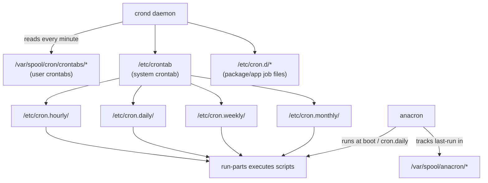

# Cron Automation

## Overview

Cron is the classic Unix time-based job scheduler that runs commands at fixed times, dates, or intervals defined by a crontab (cron table). On modern Linux distributions cron works alongside `/etc/cron.d`, the `/etc/cron.{hourly,daily,weekly,monthly}` directories, and `anacron` to guarantee periodic jobs run even on servers that reboot frequently or sleep through their scheduled window. This note covers crontab syntax, per-package job drops in `/etc/cron.d`, the environment pitfalls that cause "works in my shell but not in cron" bugs, output/logging strategy, and anacron catch-up scheduling; see [Cron-Jobs-in-Linux](../Process-Service-and-Job-Management/Cron-Jobs-in-Linux.md) for the process-management angle and [systemd-Timers](systemd-Timers.md) for the modern systemd-native alternative.

> [!TIP]
> **When to reach for cron**
> Cron is ideal for simple, standalone, time-triggered tasks (backups, log rotation, report generation) on systems that are typically always on. For jobs needing dependency ordering, resource limits, sandboxing, or reliable execution on laptops/ephemeral hosts, prefer `systemd` timers instead.

## Concepts

Cron reads job definitions from several sources, all merged into one schedule by `crond` (Vixie-cron / cronie):

| Source | Owner | Format includes user field? |
|---|---|---|
| `crontab -e` (per-user, stored in `/var/spool/cron/crontabs/<user>` or `/var/spool/cron/<user>`) | Individual user | No |
| `/etc/crontab` | root / sysadmin | Yes |
| `/etc/cron.d/*` | Packages, admins | Yes |
| `/etc/cron.{hourly,daily,weekly,monthly}/` | Packages via `run-parts` | N/A — plain executable scripts |
| `/etc/cron.allow`, `/etc/cron.deny` | root | Controls who may run `crontab` |

`crond` wakes once a minute, evaluates every table, and forks matching jobs. `anacron` is a *complementary* scheduler (not a replacement) that runs once at boot/login to catch up on daily/weekly/monthly jobs missed while the machine was powered off.

## Architecture



## Configuration

### Crontab field format

```text
# ┌───────────── minute (0-59)
# │ ┌───────────── hour (0-23)
# │ │ ┌───────────── day of month (1-31)
# │ │ │ ┌───────────── month (1-12)
# │ │ │ │ ┌───────────── day of week (0-6, Sun=0 or 7; also names)
# │ │ │ │ │
# * * * * *  command to execute
```

| Field | Range | Special characters |
|---|---|---|
| minute | 0–59 | `* , - /` |
| hour | 0–23 | `* , - /` |
| day of month | 1–31 | `* , - / ? L W` (some cron variants) |
| month | 1–12 or `jan`–`dec` | `* , - /` |
| day of week | 0–7 or `sun`–`sat` | `* , - /` |

| Operator | Meaning | Example |
|---|---|---|
| `*` | every value | `* * * * *` = every minute |
| `,` | list | `0 3,15 * * *` = 03:00 and 15:00 |
| `-` | range | `0 9-17 * * 1-5` = hourly, business hours, weekdays |
| `/` | step | `*/15 * * * *` = every 15 minutes |
| `@reboot` | nonstandard shorthand | run once at daemon startup |
| `@daily`, `@weekly`, `@monthly`, `@hourly`, `@yearly` | nonstandard shorthand | Vixie-cron convenience macros |

### `/etc/cron.d` — the difference that trips people up

Unlike a per-user crontab (`crontab -e`), files dropped in `/etc/cron.d/` **require an explicit user field** between the schedule and the command — the same format as `/etc/crontab`:

```conf
# /etc/cron.d/backup-nightly
# min hour dom month dow user   command
30   2    *   *     *   root   /usr/local/sbin/backup.sh >> /var/log/backup.log 2>&1
```

Packages (e.g., `logrotate`, `sysstat`, `certbot`) ship jobs here so they survive package upgrades without editing `/etc/crontab` directly. Files must be owned by root and not world-writable, and typically should not have a dot or backup-editor extension (`run-parts` skips names containing `.`).

### Managing crontabs

```bash
crontab -e            # edit current user's crontab (uses $EDITOR)
crontab -l             # list current user's crontab
crontab -r              # remove current user's crontab entirely (no confirmation!)
crontab -u alice -e     # edit another user's crontab (root only)
crontab -l -u alice     # view another user's crontab (root only)
```

Restrict who can use `crontab` via allow/deny lists:

```bash
# /etc/cron.allow — if present, ONLY listed users may use crontab
echo alice | sudo tee -a /etc/cron.allow

# /etc/cron.deny — if cron.allow absent, listed users are blocked
echo guest | sudo tee -a /etc/cron.deny
```

## Environment Gotchas

Cron jobs run in a **minimal, non-interactive shell environment** — this is the #1 source of "runs fine manually, fails under cron" bugs.

| Problem | Why it happens | Fix |
|---|---|---|
| `command not found` | Cron's default `PATH` is often just `/usr/bin:/bin` (no `/usr/local/bin`, no user `~/bin`, no pyenv/rbenv shims) | Set `PATH=` explicitly at the top of the crontab, or use absolute paths in commands |
| Script works interactively, fails in cron | Cron does **not** source `~/.bashrc`, `~/.bash_profile`, or `/etc/profile` | Explicitly `source` needed env files inside the script, or set vars in the crontab |
| `$HOME` wrong or unset | Cron sets `HOME` from the passwd entry, not the invoking shell | Set `HOME=/home/alice` in the crontab if scripts rely on it |
| No `%` handling | `%` in a crontab command is treated as a newline and splits stdin | Escape as `\%` when a literal percent is needed (e.g., `date +\%Y-\%m-\%d`) |
| Missing locale/timezone | Cron runs with the system's default locale/TZ, not the user's shell TZ override | Set `TZ=` in the crontab or use `CRON_TZ=` (supported by cronie) per-line |
| No controlling TTY | Programs that expect a terminal (interactive prompts, `sudo` without NOPASSWD) hang or fail silently | Run non-interactively; use `sudo -n` and configure `NOPASSWD` sudoers entries if privilege escalation is required |

Set environment variables directly in the crontab header (applies to per-user crontabs and `/etc/crontab`/`cron.d`):

```conf
SHELL=/bin/bash
PATH=/usr/local/sbin:/usr/local/bin:/usr/sbin:/usr/bin:/sbin:/bin
MAILTO=admin@example.com
HOME=/home/alice
TZ=UTC

0 3 * * * /home/alice/scripts/nightly-sync.sh
```

## Logging Output

By default, cron mails any stdout/stderr from a job to the crontab owner via `MAILTO` (local mail delivery through `sendmail`/`postfix`, often not configured on modern servers — mail silently vanishes). Two reliable strategies:

```bash
# 1. Redirect explicitly inside the crontab entry
0 3 * * * /usr/local/sbin/backup.sh >> /var/log/backup.sh.log 2>&1

# 2. Suppress mail entirely and rely on the script's own logging
MAILTO=""
0 3 * * * /usr/local/sbin/backup.sh >/dev/null 2>&1
```

Check that cron itself is dispatching jobs (distinct from whether the job succeeded):

```bash
# Debian/Ubuntu
sudo tail -f /var/log/syslog | grep CRON
sudo journalctl -u cron -f

# RHEL/Fedora/Alma/Rocky
sudo tail -f /var/log/cron
sudo journalctl -u crond -f
```

A job appearing in these logs but not producing output means the *job itself* failed (check its own log/exit code); a job never appearing means the crontab entry, syntax, or `cron.allow`/permissions is at fault.

## Commands

| Task | RHEL-family | Debian-family |
|---|---|---|
| Install cron | `sudo dnf install cronie` | `sudo apt install cron` |
| Enable + start | `sudo systemctl enable --now crond` | `sudo systemctl enable --now cron` |
| Service status | `systemctl status crond` | `systemctl status cron` |
| Restart after edits to `/etc/crontab` or `cron.d` | `sudo systemctl restart crond` | `sudo systemctl restart cron` |
| Syntax-check a script standalone | `bash -n script.sh` | `bash -n script.sh` |
| List all system cron.d jobs | `cat /etc/cron.d/*` | `cat /etc/cron.d/*` |

## Examples

```conf
# Every 5 minutes, health check with absolute paths and full logging
*/5 * * * * /usr/local/bin/healthcheck.sh >> /var/log/healthcheck.log 2>&1

# Weekdays at 08:30, send a report
30 8 * * 1-5 /usr/local/bin/daily-report.sh

# First day of every month at 04:00
0 4 1 * * /usr/local/sbin/monthly-cleanup.sh

# Every 15 minutes during business hours only
*/15 9-17 * * 1-5 /usr/local/bin/sync-inventory.sh

# Run once, at every reboot
@reboot /usr/local/bin/warm-cache.sh
```

## Best Practices

- Always use **absolute paths** for both the command and any files it touches — never rely on cron's minimal `PATH`.
- Make scripts **idempotent** and safe to re-run if a previous invocation is still in flight; wrap with `flock` to prevent overlap:
  ```bash
  */5 * * * * /usr/bin/flock -n /tmp/backup.lock /usr/local/sbin/backup.sh
  ```
- Log both stdout and stderr, and rotate those logs (`logrotate`) so they don't grow unbounded.
- Keep one job per line and one purpose per script; avoid giant multi-command one-liners that are hard to debug.
- Prefer `/etc/cron.d/<appname>` over editing `/etc/crontab` directly for anything package- or app-specific — it survives upgrades and is easy to remove cleanly.
- For anything needing dependency chains, resource limits, or richer logging/retry semantics, migrate to a [systemd timer + service unit](systemd-Timers.md) instead of stacking cron workarounds.

## Security Considerations

Aligned with CIS Linux Benchmark cron/anacron hardening controls:

- **Restrict crontab access**: prefer an `/etc/cron.allow` allowlist over relying on the absence of `/etc/cron.deny`; remove regular users from cron access unless required.
- **Lock down permissions** on cron directories and files (CIS baseline):
  ```bash
  sudo chown root:root /etc/crontab /etc/cron.hourly /etc/cron.daily /etc/cron.weekly /etc/cron.monthly /etc/cron.d
  sudo chmod 0600 /etc/crontab
  sudo chmod 0700 /etc/cron.hourly /etc/cron.daily /etc/cron.weekly /etc/cron.monthly /etc/cron.d
  ```
- **Never** put plaintext secrets (API keys, DB passwords) directly in a crontab line — crontabs are world-readable via `crontab -l` to root and stored in `/var/spool/cron`; source secrets from a permission-restricted file instead.
- **Audit `/etc/cron.d`** periodically — it is a common persistence mechanism for attackers/malware because it blends in with legitimate package-installed jobs; diff it against a known-good baseline or a package manager's file manifest (`rpm -V`, `dpkg -V`).
- **Avoid running jobs as root** when the task doesn't require it; use a dedicated service account with least-privilege `sudoers` entries (`NOPASSWD` scoped to the exact command) instead of the job running fully as root.
- **Validate scripts invoked by cron** are not world-writable — a writable script referenced by a root cron job is a privilege-escalation path.

> [!WARNING]
> **World-writable cron scripts are a classic privesc vector**
> If any script referenced from `/etc/crontab`, `/etc/cron.d/*`, or `cron.{hourly,daily,weekly,monthly}` is writable by a non-root user, that user can trivially escalate to root at the next scheduled run. Always audit with `find /etc/cron* -perm -o+w` and `find / -path /proc -prune -o -perm -o+w -print` for scripts referenced by root's crontab.

## Troubleshooting

| Symptom | Likely cause | Fix |
|---|---|---|
| Job never runs | `crond`/`cron` service not running | `systemctl status crond` / `cron`, then enable/start it |
| Job runs manually but not via cron | `PATH`/environment difference | Set explicit `PATH`/env vars in crontab; use absolute paths |
| `crontab: command not found` for a user | User not in `/etc/cron.allow` or listed in `/etc/cron.deny` | Add the user to `cron.allow` |
| `/etc/cron.d` file ignored | Missing user field, wrong permissions, or filename contains `.`/`~` | Add the user field; `chmod 644`; rename without dots |
| No mail/output received | Local MTA not configured, `MAILTO` unset/blank with no redirect | Redirect output to a log file explicitly instead of relying on mail |
| Missed job after reboot/downtime | No anacron catch-up configured for that job class | Install/enable `anacron`, or convert to a systemd timer with `Persistent=true` |
| `%` character breaks command | Cron interprets unescaped `%` as newline | Escape as `\%` |

## Anacron

Anacron complements cron on machines that are not always powered on (workstations, some VMs). It checks `/etc/anacrontab` once per day (itself typically triggered by `cron.daily` or at boot) and runs any job whose recorded last-run timestamp in `/var/spool/anacron/` is older than its period, staggering start times to avoid load spikes.

```conf
# /etc/anacrontab
# period(days) delay(minutes) job-identifier command
1              5              cron.daily     run-parts --report /etc/cron.daily
7              25             cron.weekly    run-parts --report /etc/cron.weekly
@monthly       45             cron.monthly   run-parts --report /etc/cron.monthly
```

Anacron does **not** support minute/hour-level granularity — it is strictly for daily-or-coarser jobs that must eventually run even after downtime, not a general cron replacement.

> [!NOTE]
> **📸 Screenshot**
> _Capture: `crontab -l` output for a user showing PATH/MAILTO env vars plus two scheduled jobs, alongside `systemctl status crond`/`cron` showing the service active._

## References

- `man 5 crontab` — crontab file format
- `man 8 cron` / `man 8 crond` — daemon behavior
- `man 8 anacron` and `man 5 anacrontab`
- CIS Benchmark for the relevant Linux distribution — "Configure Cron and Anacron" section
- Debian Administrator's Handbook — Task Scheduling chapter

## Related Notes

- [Cron-Jobs-in-Linux](../Process-Service-and-Job-Management/Cron-Jobs-in-Linux.md) — cron from the process/job-management angle
- [systemd-Timers](systemd-Timers.md) — modern systemd-native scheduling alternative
- [Linux Administration & Server Hardening](../Readme.md) — course hub and map of content
