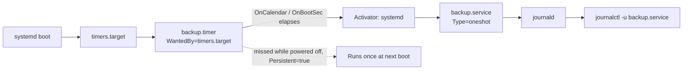

# systemd Timers

## Overview

`systemd` timers are the native scheduling mechanism built into every modern `systemd`-based distribution, giving administrators a way to trigger a unit at a calendar time or relative to an event (boot, login, or another unit's activation) without depending on the separate `crond` daemon covered in [Cron-Automation](Cron-Automation.md). A timer is always paired with a `.service` unit — the timer answers *when*, the service answers *what* — and both are managed through the same `systemctl` tooling used for every other unit in [Readme](../Process-Service-and-Job-Management/Readme.md). Because timers are ordinary systemd units, they inherit journal logging, dependency ordering, resource limits, and sandboxing for free.

> [!TIP]
> If you only need "run this script every 5 minutes" and portability to non-systemd systems matters, cron is simpler. If you need boot-relative scheduling, missed-run recovery, structured logs, or resource-constrained execution, reach for a timer.

## Concepts

| Concept | Description |
|---|---|
| `.timer` unit | Defines the schedule (`[Timer]` section) — when the paired service activates. |
| `.service` unit | Defines the work (`[Service]` section) — the command that actually runs. |
| Monotonic timers | Fire relative to an event: `OnBootSec`, `OnUnitActiveSec`, `OnUnitInactiveSec`, `OnStartupSec`. |
| Realtime timers | Fire at fixed wall-clock times using calendar syntax: `OnCalendar`. |
| `timers.target` | The special target that pulls in and starts all enabled `.timer` units at boot. |
| `Persistent=` | Tracks the last trigger time on disk so a missed run (system was off) fires once at the next boot. |

Two timer families exist and can be combined in the same unit:

- **Monotonic** — measured from a reference point (`OnBootSec=15min` fires 15 minutes after boot).
- **Realtime / calendar** — measured against the wall clock (`OnCalendar=*-*-* 02:00:00` fires at 2 AM daily).

## Architecture



## Installation

Timers require no separate package on any current distribution — they ship with `systemd` itself.

```bash
# RHEL / Rocky / Alma / Fedora
rpm -q systemd
```

```bash
# Debian / Ubuntu
dpkg -l systemd | grep ^ii
```

```bash
systemctl --version
```

## Configuration

### 1. Write the service unit

```bash
sudo vim /etc/systemd/system/backup.service
```

```ini
[Unit]
Description=Nightly backup job

[Service]
Type=oneshot
User=backup
ExecStart=/usr/local/bin/run-backup.sh
```

`Type=oneshot` is the correct type for scheduled work: systemd considers the unit active only while the command runs, then marks it inactive — unlike a long-running daemon.

### 2. Write the timer unit

```bash
sudo vim /etc/systemd/system/backup.timer
```

```ini
[Unit]
Description=Run backup.service nightly at 02:00

[Timer]
OnCalendar=*-*-* 02:00:00
RandomizedDelaySec=300
Persistent=true
Unit=backup.service

[Install]
WantedBy=timers.target
```

| Directive | Purpose |
|---|---|
| `OnCalendar=` | Wall-clock schedule expression. |
| `OnBootSec=` | Delay after boot before first activation. |
| `OnUnitActiveSec=` | Interval measured from the service's last activation (interval-style scheduling). |
| `RandomizedDelaySec=` | Adds jitter so a fleet of hosts doesn't fire in the same second. |
| `Persistent=true` | Runs a missed activation once at the next boot (like `anacron`). |
| `Unit=` | Names the service to activate; optional if the base names match. |
| `WantedBy=timers.target` | Wires the timer into boot-time activation when enabled. |

By convention, name the timer and service identically (`backup.timer` / `backup.service`) so `Unit=` can be omitted.

## Commands

```bash
sudo systemctl daemon-reload
```

```bash
sudo systemctl enable --now backup.timer
```

```bash
systemctl list-timers --all
```

| Command | Effect |
|---|---|
| `systemctl daemon-reload` | Required after creating or editing any unit file. |
| `systemctl enable --now <name>.timer` | Enables at boot and starts immediately — always enable the **timer**, never the service. |
| `systemctl list-timers --all` | Lists every timer with `NEXT`, `LEFT`, `LAST`, `PASSED`, `UNIT`, `ACTIVATES` columns. |
| `systemctl status <name>.timer` | Shows the timer's current state and last trigger. |
| `systemctl start <name>.service` | Runs the paired service on demand, outside its schedule. |
| `systemctl disable --now <name>.timer` | Stops and removes the boot-time enablement. |
| `journalctl -u <name>.service` | Job output/logs. |
| `journalctl -u <name>.timer` | Scheduling activity for the timer itself. |
| `systemd-analyze calendar "<expr>"` | Validates an `OnCalendar` expression and previews the next elapse times. |

## Examples

### Calendar expressions

```ini
# Daily at 03:15
OnCalendar=*-*-* 03:15:00
```

```ini
# Every Monday at noon
OnCalendar=Mon *-*-* 12:00:00
```

```ini
# Every 15 minutes
OnCalendar=*:0/15
```

| Shorthand | Equivalent |
|---|---|
| `minutely` | `*-*-* *:*:00` |
| `hourly` | `*-*-* *:00:00` |
| `daily` | `*-*-* 00:00:00` |
| `weekly` | `Mon *-*-* 00:00:00` |
| `monthly` | `*-*-01 00:00:00` |

### Boot-relative and interval scheduling

```ini
[Timer]
OnBootSec=5min
OnUnitActiveSec=1h
```

Fires 5 minutes after boot, then every hour thereafter — no calendar math required.

### Preview and verify

```bash
systemd-analyze calendar "Mon..Fri *-*-* 09:00:00" --iterations=5
```

```bash
systemctl list-timers backup.timer
```

## Best Practices

- Keep timer and service base names identical for implicit pairing.
- Prefer `OnCalendar` for fixed wall-clock schedules and `OnUnitActiveSec`/`OnBootSec` for pure intervals.
- Set `Persistent=true` on any job that must not silently skip a run (backups, certificate renewal, patch checks).
- Add `RandomizedDelaySec` on any timer that will exist on more than one host, to avoid synchronized load spikes.
- Validate every `OnCalendar` expression with `systemd-analyze calendar` before enabling the unit.
- Store admin-authored timers in `/etc/systemd/system/`; per-user timers belong in `~/.config/systemd/user/` and need `systemctl --user`.
- Confirm the schedule actually took effect with `systemctl list-timers --all` after every deploy.

## Advantages over Cron

| Capability | Cron | systemd Timers |
|---|---|---|
| Logging | Mail or nothing by default | Structured, queryable via `journalctl` |
| Boot-relative scheduling | No | Yes (`OnBootSec`) |
| Missed-run recovery | Requires `anacron` | `Persistent=true` |
| Load jitter across hosts | Not built in | `RandomizedDelaySec` |
| Resource/sandboxing controls | None | Full `[Service]` hardening (cgroups, `Protect*=`) |
| Dependency ordering | None | Standard systemd `After=`/`Requires=` |
| Portability | Any Unix | systemd hosts only |

Cron still wins on simplicity, muscle memory, and portability to non-systemd or minimal containers; timers win on observability, reliability, and integration everywhere else.

> [!NOTE]
> **📸 Screenshot**
> _Capture: terminal output of `systemctl list-timers --all` showing NEXT, LEFT, LAST, UNIT and ACTIVATES columns for an enabled timer_

## Security Considerations

- **Ownership and permissions.** Unit files in `/etc/systemd/system/` should be `root:root`, mode `0644`; any script referenced by `ExecStart` must not be writable by unprivileged users — a writable unit or script is a direct path to root, and this maps to the same CIS control family that governs cron file permissions.
- **Least privilege.** Set `User=`/`Group=` in `[Service]` for any job that does not need root.
- **Sandbox the service.** Apply `ProtectSystem=strict`, `ProtectHome=true`, `PrivateTmp=true`, and `NoNewPrivileges=true` to limit blast radius if the job or its inputs are compromised.
- **No secrets on the command line.** Arguments in `ExecStart` are visible via `ps` and the journal; use `EnvironmentFile=` (mode `0600`) or systemd credentials instead.
- **Persistence hunting.** During IR or routine audits, enumerate all timers with `systemctl list-timers --all` and diff unit-file timestamps — attackers use `.timer`/`.service` pairs as a durable, cron-independent foothold.

## Troubleshooting

| Symptom | Likely cause | Resolution |
|---|---|---|
| Timer never fires | Not enabled/started, or unit edited without reload | `systemctl daemon-reload && systemctl enable --now <name>.timer` |
| "Unit not found" | Wrong directory or filename | Confirm the file lives in `/etc/systemd/system/` and ends in `.timer` |
| Service runs but nothing happens | Bad `ExecStart` path or missing permissions | `systemctl start <name>.service` then `journalctl -u <name>.service` |
| Missed a scheduled run entirely | `Persistent=true` not set | Add it under `[Timer]` and reload |
| Fires at the wrong time | Invalid or misread `OnCalendar` expression | Validate with `systemd-analyze calendar "<expr>"` |
| Edits not taking effect | Manager still holds the old unit definition | Always `systemctl daemon-reload` after editing |

## References

- `man systemd.timer` — timer directives (`OnCalendar`, `OnBootSec`, `Persistent`, `RandomizedDelaySec`).
- `man systemd.time` — calendar and time-span expression syntax.
- `man systemd.service` — service unit directives and hardening options.
- CIS Distribution Independent Linux Benchmark — scheduled-task (cron/at/systemd unit) permission controls.

## Related Notes

- [Cron-Automation](Cron-Automation.md) — the classic scheduler that systemd timers replace on modern systems
- [Readme](../Process-Service-and-Job-Management/Readme.md) — service and job management module index
- [Systemd-Timers-in-Linux](../Process-Service-and-Job-Management/Systemd-Timers-in-Linux.md) — deeper walkthrough with a full worked timer/service pair
- [Cron-Jobs-in-Linux](../Process-Service-and-Job-Management/Cron-Jobs-in-Linux.md) — cron internals and crontab syntax for comparison
- [Linux Administration & Server Hardening](../Readme.md) — course hub and map of content
