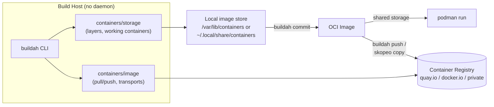

# Buildah

## Overview

Buildah is a command-line tool for building Open Container Initiative (OCI) and Docker-compatible container images without requiring a background daemon, a container runtime, or root privileges. It is part of the same daemonless container tooling family as [Podman](Podman.md) and [Podman](Podman.md), sharing the `containers/storage` and `containers/image` libraries so images built with Buildah are immediately usable by `podman run` with no conversion step. Where [Docker-Images-and-Dockerfile](Docker-Images-and-Dockerfile.md) describes the Dockerfile format itself, this note covers the tool that can consume that same Dockerfile — or build images procedurally from shell scripts — with a smaller attack surface than the Docker daemon.

> [!IMPORTANT]
> Buildah has no daemon and no client-server split: every `buildah` invocation runs as a normal process under the calling user, and rootless builds are a first-class use case, not an afterthought. This makes it the preferred image-build tool for CI runners and hardened build hosts where running `dockerd` as root is undesirable.

## Concepts

- **Daemonless**: `buildah` is a single static-ish binary that manipulates image layers and container filesystems directly via `containers/storage`. There is no long-running privileged process listening on a socket (contrast with the Docker Engine's `dockerd`).
- **Working container**: Buildah's core abstraction. `buildah from` creates a *working container* — a mutable filesystem checkout of a base image that you can inspect, mount, and modify with ordinary shell commands before committing it back to an image layer.
- **Two build modes**: `buildah bud` (Build Using Dockerfile) parses a Dockerfile/Containerfile just like `docker build`; the scriptable API (`from`/`run`/`copy`/`config`/`commit`) lets you build images with a shell script instead of a Dockerfile, useful when build logic needs loops, conditionals, or external tooling that a Dockerfile can't express cleanly.
- **OCI vs Docker image format**: Buildah defaults to producing OCI-format images but can emit legacy Docker v2 schema 2 images with `--format docker` for compatibility with older registries or tools.
- **Rootless storage**: rootless Buildah stores images and layers under `~/.local/share/containers/storage` using the `fuse-overlayfs` or native overlay driver, keeping build state isolated per user.

## Architecture



Because Buildah, Podman, and Skopeo all read/write the same `containers/storage` graph, an image built with `buildah bud -t myapp .` is immediately visible to `podman images` and runnable with `podman run myapp` — no `docker load`/`docker save` round trip is needed.

## Installation

| Distro family | Command |
|---|---|
| RHEL / CentOS / Fedora / Rocky (dnf) | `sudo dnf install -y buildah` |
| Debian / Ubuntu (apt) | `sudo apt update && sudo apt install -y buildah` |
| Verify | `buildah --version` |

> [!NOTE]
> Rootless operation needs subordinate UID/GID ranges configured for your user. Check with `grep "^$(whoami):" /etc/subuid /etc/subgid`; if empty, an admin must add entries (e.g. `sudo usermod --add-subuids 100000-165535 --add-subgids 100000-165535 <user>`).

## Configuration

Buildah reads the same shared configuration files used by Podman, under `/etc/containers/` (system-wide) or `~/.config/containers/` (per-user, rootless):

```conf
# /etc/containers/registries.conf (excerpt)
unqualified-search-registries = ["registry.access.redhat.com", "docker.io"]

[[registry]]
location = "docker.io"
# Optional: force this registry to be pulled via a mirror
# blocked = false
# insecure = false
```

```conf
# /etc/containers/storage.conf (excerpt)
[storage]
driver = "overlay"
graphroot = "/var/lib/containers/storage"     # root builds
# rootless default: ~/.local/share/containers/storage

[storage.options.overlay]
mount_program = "/usr/bin/fuse-overlayfs"     # needed for rootless overlay
```

```conf
# ~/.config/containers/policy.json (excerpt) — signature verification policy
{
  "default": [{ "type": "insecureAcceptAnything" }],
  "transports": {
    "docker": {
      "quay.io/mycorp": [{ "type": "reject" }]
    }
  }
}
```

## Commands

| Command | Purpose |
|---|---|
| `buildah bud -t <name>:<tag> .` | Build image from a Dockerfile/Containerfile (alias: `buildah build`) |
| `buildah from <image>` | Create a working container from a base image, print its name |
| `buildah run <container> -- <cmd>` | Run a command inside the working container's filesystem |
| `buildah copy <container> <src> <dest>` | Copy files from host into the working container |
| `buildah config --entrypoint '["/app"]' <container>` | Set image metadata (entrypoint, cmd, env, labels, ports) |
| `buildah commit <container> <image>` | Snapshot the working container into a new image layer |
| `buildah images` | List local images |
| `buildah containers` | List working containers |
| `buildah rm <container>` | Delete a working container |
| `buildah rmi <image>` | Delete an image |
| `buildah push <image> docker://<registry>/<repo>:<tag>` | Push image to a registry |
| `buildah mount <container>` | Mount a working container's rootfs and print the path (for direct inspection) |
| `buildah unshare` | Enter a user namespace for rootless operations needing elevated FS access |

## Examples

**1. Build directly from a Dockerfile (drop-in `docker build` replacement):**

```bash
buildah bud -f Dockerfile -t registry.example.com/myapp:1.0 .
buildah images
```

**2. Scriptable build — no Dockerfile at all:**

```bash
#!/usr/bin/env bash
set -euo pipefail

ctr=$(buildah from registry.access.redhat.com/ubi9/ubi-minimal:latest)

buildah run "$ctr" -- microdnf install -y python3 && microdnf clean all
buildah copy "$ctr" ./app/ /opt/app/
buildah config --workingdir /opt/app "$ctr"
buildah config --entrypoint '["python3", "server.py"]' "$ctr"
buildah config --port 8080 "$ctr"
buildah config --label maintainer="ops@example.com" "$ctr"

buildah commit "$ctr" registry.example.com/myapp:1.0
buildah rm "$ctr"
```

This pattern is useful when build steps need loops, external secret lookups, or conditional logic a Dockerfile's linear `RUN` instructions can't express cleanly.

**3. Push the built image and inspect it with Skopeo:**

```bash
buildah push registry.example.com/myapp:1.0 docker://registry.example.com/myapp:1.0
skopeo inspect docker://registry.example.com/myapp:1.0
```

**4. Rootless build inside CI (no daemon, no `--privileged`):**

```bash
buildah unshare buildah bud --format docker -t myapp:ci .
```

**5. Run the resulting image with Podman — no export/import needed:**

```bash
podman run --rm -p 8080:8080 registry.example.com/myapp:1.0
```

> [!NOTE]
> **📸 Screenshot**
> _Capture: terminal output of `buildah bud -t myapp .` showing layer-by-layer build progress, followed by `podman images` listing the newly built image — demonstrating the shared image store between the two tools._

## Best Practices

- Prefer multi-stage Dockerfiles (`FROM ... AS build`) with Buildah just as with Docker — it fully supports multi-stage builds and only ships the final stage's layers.
- Use minimal base images (`ubi9-minimal`, `alpine`, distroless) to shrink attack surface and image size.
- Run builds rootless by default; reserve root/`--privileged` builds for cases that truly need host device access.
- Pin base image digests (`FROM image@sha256:...`) instead of floating tags for reproducible builds.
- Use `buildah bud --layers=false --squash` for smaller published images when intermediate layer caching isn't needed for that pipeline.
- In CI, combine Buildah (build) + Skopeo (inspect/copy/sign) + Podman (test-run) rather than reaching for a Docker-in-Docker sidecar.

## Security Considerations

Aligns with CIS Docker/Container Benchmark image-build guidance:

- **No privileged daemon**: eliminates the classic "root daemon socket = root on the host" risk class that motivates several CIS Docker Benchmark controls (e.g., restricting access to `docker.sock`) — there is no equivalent socket to protect.
- **Rootless by default**: run `buildah unshare` / rootless builds so a compromised build step cannot write outside the user's namespace-mapped UID range.
- **Least-privilege builds**: avoid `--cap-add`, `--privileged`, or host bind-mounts during `buildah run`/`bud` unless the build step genuinely requires them.
- **Signed images**: configure `policy.json` to require signature verification (`sigstoreSigned` or `signedBy`) rather than `insecureAcceptAnything` in production registries, and sign published images with `buildah push --sign-by <gpg-key>` or cosign via Skopeo.
- **Scan before push**: run a vulnerability scanner (e.g., `trivy image myapp:1.0`) against the freshly built image before pushing to a registry.
- **Minimize final image**: strip build tools, package caches, and shells from the final stage; don't leave secrets (`buildah copy` of `.env`, SSH keys) baked into a layer — use `--secret` mounts for build-time-only credentials.
- **Registry TLS**: keep `insecure = false` in `registries.conf` for any registry handling production images; only allow insecure/plain-HTTP registries for isolated local test registries.

## Troubleshooting

| Symptom | Cause | Fix |
|---|---|---|
| `no subuid ranges found for user` | subordinate UID/GID not configured | Add entries via `usermod --add-subuids/--add-subgids`, then `podman system migrate` |
| `error creating overlay mount: invalid argument` (rootless) | Kernel/overlay lacks unprivileged mount support and `fuse-overlayfs` isn't installed | `sudo dnf install fuse-overlayfs` / `sudo apt install fuse-overlayfs` |
| `buildah bud` can't resolve a short image name | Ambiguous unqualified search registries | Set `unqualified-search-registries` in `registries.conf` or use fully-qualified `registry.io/repo:tag` |
| Build succeeds but `podman run` can't find the image | Different storage roots (e.g., one root, one rootless) | Build and run as the same user, or explicitly `--storage-driver`/`--root` match the paths |
| `permission denied` copying files into container | SELinux context mismatch on bind-mounted build context | Add `:z`/`:Z` on relevant mounts, or run `restorecon -R` on the build context directory |
| Push fails with `x509: certificate signed by unknown authority` | Private registry uses a self-signed cert | Add the CA to `/etc/containers/certs.d/<registry>/ca.crt` or trust store |

## References

- Buildah official documentation: https://buildah.io/
- `buildah(1)`, `buildah-bud(1)`, `buildah-from(1)` man pages
- `containers-registries.conf(5)`, `containers-storage.conf(5)`, `containers-policy.json(5)` man pages
- Red Hat: "Building container images with Buildah" — https://developers.redhat.com/blog/tag/buildah
- CIS Docker Benchmark (image build and registry sections) — https://www.cisecurity.org/benchmark/docker

## Related Notes

- [Podman](Podman.md)
- [Docker-Images-and-Dockerfile](Docker-Images-and-Dockerfile.md)
- [Podman](Podman.md)
- [Linux Administration & Server Hardening](../Readme.md) — course hub and map of content
