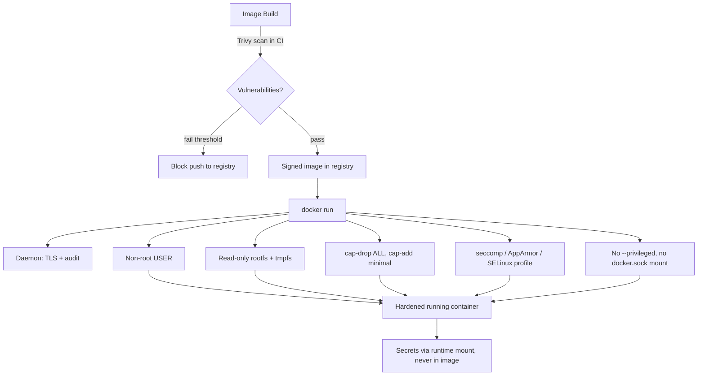

# Container Security Hardening (CIS Docker Benchmark)

## Overview

Default container configurations trust the image, the daemon, and the operator equally — a container started with `docker run -d myapp` typically runs as root, keeps every Linux capability, has a writable root filesystem, and faces no seccomp/AppArmor restriction beyond Docker's stock profile. This note applies the **CIS Docker Benchmark** control-by-control: daemon hardening, non-root `USER`, read-only rootfs, capability dropping, mandatory access control (`--security-opt`), banning `--privileged`, image scanning with Trivy, and secrets handling. It complements [Rootless-Containers](Rootless-Containers.md) (removing root from the host side of the equation) and [Container-Escape-and-Threats](Container-Escape-and-Threats.md) (what happens when these controls are skipped).

> [!IMPORTANT]
> Hardening a container is defense in depth, not a substitute for patching. A hardened container running a vulnerable app is still exploitable — scan images *and* restrict the runtime.

## Concepts

| Control area | Risk if skipped | CIS Docker Benchmark section |
|---|---|---|
| Daemon configuration | Daemon socket exposed, no audit trail | Section 1–2 |
| Non-root `USER` | Container root == easier host root via escape | Section 4.1 |
| Read-only rootfs | Malware persistence, tampering | Section 5.12 |
| Capability dropping | Excess kernel privilege (`CAP_SYS_ADMIN` etc.) | Section 5.3 |
| Seccomp / AppArmor / SELinux | Unrestricted syscalls, MAC bypass | Section 5.21, 5.1 |
| `--privileged` | Full device/kernel access — container ≈ host root | Section 5.4 |
| Image provenance & scanning | Known-CVE packages shipped to prod | Section 4.5, 4.6 |
| Secrets handling | Credentials baked into image layers | Section 5.25 |

## Architecture



## Installation

Install the CIS auditing tool and Trivy scanner.

```bash
# Debian/Ubuntu
sudo apt update
sudo apt install -y docker.io
curl -sfL https://raw.githubusercontent.com/aquasecurity/trivy/main/contrib/install.sh | sudo sh -s -- -b /usr/local/bin

# RHEL/Fedora/Rocky
sudo dnf install -y docker moby-engine
sudo rpm -ivh https://github.com/aquasecurity/trivy/releases/latest/download/trivy_Linux-64bit.rpm

# docker-bench-security (CIS Docker Benchmark checker, both families)
git clone https://github.com/docker/docker-bench-security.git
cd docker-bench-security && sudo ./docker-bench-security.sh
```

## Configuration

### Daemon hardening (`/etc/docker/daemon.json`)

```json
{
  "icc": false,
  "userns-remap": "default",
  "live-restore": true,
  "userland-proxy": false,
  "no-new-privileges": true,
  "log-driver": "json-file",
  "log-opts": { "max-size": "10m", "max-file": "3" },
  "seccomp-profile": "/etc/docker/seccomp-default.json"
}
```

```bash
sudo systemctl restart docker
```

- `icc: false` — disable unrestricted inter-container communication (CIS 2.1); pair with explicit `--link` or user-defined networks.
- `userns-remap: default` — remap container UID 0 to an unprivileged host UID (CIS 2.8), independent of the per-container `USER` control below and the [Rootless-Containers](Rootless-Containers.md) daemon mode.
- Never expose the daemon socket over TCP without TLS (CIS 2.6). If remote access is required, generate mutual-TLS certs and bind `tlsverify=true`.

### Dockerfile: non-root `USER` + minimal base

```dockerfile
FROM node:20-alpine

RUN addgroup -S app && adduser -S app -G app
WORKDIR /app
COPY --chown=app:app . .
RUN npm ci --omit=dev

USER app
EXPOSE 3000
ENTRYPOINT ["node", "server.js"]
```

- Never end a Dockerfile as `root` (CIS 4.1). `USER app` must be the last user directive.
- Prefer minimal bases (`alpine`, `distroless`) to shrink attack surface and scan results.

### Read-only rootfs + tmpfs for writable paths

```bash
docker run -d \
  --name webapp \
  --read-only \
  --tmpfs /tmp:rw,noexec,nosuid,size=64m \
  --tmpfs /run:rw,noexec,nosuid,size=16m \
  myregistry/webapp:1.4.2
```

CIS 5.12 requires containers run with a read-only root filesystem unless the workload genuinely needs to write; scope writable paths to `tmpfs` mounts with `noexec,nosuid`.

### Capability dropping

```bash
docker run -d \
  --name webapp \
  --cap-drop ALL \
  --cap-add NET_BIND_SERVICE \
  myregistry/webapp:1.4.2
```

Drop everything, then add back only what the process needs (CIS 5.3, 5.9). Common minimal add-backs:

| Capability | Needed for |
|---|---|
| `NET_BIND_SERVICE` | Binding to ports < 1024 as non-root |
| `CHOWN` | Rare; changing file ownership at startup |
| `SETUID`/`SETGID` | Dropping privileges internally (e.g. `su-exec`) |

Never add back `SYS_ADMIN`, `SYS_PTRACE`, `SYS_MODULE`, or `DAC_OVERRIDE` unless the workload is explicitly a privileged system tool — these are the capabilities most container escapes rely on (see [Container-Escape-and-Threats](Container-Escape-and-Threats.md)).

### Mandatory access control: seccomp / AppArmor / SELinux

```bash
# Seccomp: custom profile blocking dangerous syscalls (mount, ptrace, reboot, etc.)
docker run -d --security-opt seccomp=/etc/docker/profiles/webapp-seccomp.json myregistry/webapp:1.4.2

# AppArmor (Debian/Ubuntu)
docker run -d --security-opt apparmor=docker-default myregistry/webapp:1.4.2

# SELinux (RHEL/Fedora/Rocky — podman and docker with selinux enabled)
docker run -d --security-opt label=type:container_t myregistry/webapp:1.4.2

# Belt-and-braces: block privilege escalation via setuid binaries
docker run -d --security-opt no-new-privileges:true myregistry/webapp:1.4.2
```

CIS 5.21 requires the default seccomp profile not be disabled (`--security-opt seccomp=unconfined` is a finding). CIS 5.1 requires AppArmor (Debian family) or SELinux (RHEL family) enforcement rather than `unconfined`/`Disabled`.

### Never use `--privileged`

```bash
# CIS 5.4 violation — full device access, capabilities, and MAC bypass
docker run --privileged myregistry/webapp:1.4.2   # DO NOT DO THIS

# If a specific device is genuinely needed, grant only that device
docker run --device=/dev/ttyUSB0 myregistry/webapp:1.4.2
```

`--privileged` disables cgroup device restrictions, grants all capabilities, and disables seccomp/AppArmor/SELinux confinement simultaneously — it is functionally equivalent to running as root on the host. Same reasoning applies to mounting `/var/run/docker.sock` into a container (grants daemon-equivalent host control).

## Commands

```bash
# Audit a running host against the CIS Docker Benchmark
sudo docker run --rm --net host --pid host --userns host --cap-add audit_control \
  -e DOCKER_CONTENT_TRUST=$DOCKER_CONTENT_TRUST \
  -v /etc:/etc:ro -v /var/lib/docker:/var/lib/docker:ro \
  -v /var/run/docker.sock:/var/run/docker.sock:ro \
  docker/docker-bench-security

# Inspect a running container's effective capabilities
docker inspect --format '{{.HostConfig.CapAdd}} / drop: {{.HostConfig.CapDrop}}' webapp

# Confirm rootfs is read-only
docker inspect --format '{{.HostConfig.ReadonlyRootfs}}' webapp

# Scan an image for CVEs with Trivy (fail CI on HIGH/CRITICAL)
trivy image --severity HIGH,CRITICAL --exit-code 1 myregistry/webapp:1.4.2

# Scan the Dockerfile itself for misconfigurations
trivy config .

# Detect secrets accidentally baked into image layers
trivy image --scanners secret myregistry/webapp:1.4.2
```

## Examples

Full hardened `docker run` combining every control above:

```bash
docker run -d \
  --name webapp \
  --read-only \
  --tmpfs /tmp:rw,noexec,nosuid,size=64m \
  --cap-drop ALL \
  --cap-add NET_BIND_SERVICE \
  --security-opt no-new-privileges:true \
  --security-opt apparmor=docker-default \
  --pids-limit 100 \
  --memory 512m --cpus 1 \
  --network app_net \
  -e DB_PASSWORD_FILE=/run/secrets/db_password \
  --mount type=bind,source=/run/secrets/db_password,target=/run/secrets/db_password,ro \
  myregistry/webapp:1.4.2
```

Equivalent hardening in Compose:

```yaml
services:
  webapp:
    image: myregistry/webapp:1.4.2
    read_only: true
    tmpfs:
      - /tmp:rw,noexec,nosuid,size=64m
    cap_drop: ["ALL"]
    cap_add: ["NET_BIND_SERVICE"]
    security_opt:
      - no-new-privileges:true
      - apparmor:docker-default
    pids_limit: 100
    secrets:
      - db_password

secrets:
  db_password:
    file: ./secrets/db_password.txt
```

`secrets:` mounts files at `/run/secrets/<name>` inside the container at runtime — never baked into a layer, never in `ENV` in the Dockerfile, never in `docker inspect` output.

> [!NOTE]
> **📸 Screenshot**
> _Capture: `trivy image --severity HIGH,CRITICAL myregistry/webapp:1.4.2` output showing the vulnerability count table, alongside `docker-bench-security.sh` results showing PASS/WARN/INFO counts for a hardened host._

## Best Practices

- Pin base images by digest (`FROM alpine@sha256:...`) not just tag, so builds are reproducible and scannable.
- Run Trivy (or Grype/Clair) in CI on every image build; fail the pipeline on new HIGH/CRITICAL CVEs.
- Rebuild images regularly even without app changes — base image CVEs get patched upstream.
- Use multi-stage builds so build tools (compilers, package managers) never ship in the runtime image.
- Enforce `USER`, `--cap-drop ALL`, and `--read-only` as CI/admission-controller policy (e.g. Kubernetes Pod Security Admission, OPA/Gatekeeper), not tribal knowledge.
- Set `--pids-limit` and `--memory`/`--cpus` to blunt fork-bomb and resource-exhaustion attacks from a compromised process.
- Prefer rootless daemons or Podman where the threat model allows it — see [Rootless-Containers](Rootless-Containers.md).

## Security Considerations

- **CIS Docker Benchmark** is the canonical checklist used above; run `docker-bench-security` after every daemon or Dockerfile change and track drift over time.
- **NIST SP 800-190** (Application Container Security Guide) frames the same controls around the image, registry, orchestrator, and host layers — use it when justifying controls to auditors.
- Treat `docker.sock` bind-mounts and `--privileged` as equivalent to handing out root on the host; both are common paths in [Container-Escape-and-Threats](Container-Escape-and-Threats.md).
- Enable Docker Content Trust (`DOCKER_CONTENT_TRUST=1`) or Cosign/sigstore signing so only signed images can be pulled/run.
- Rotate any secret that was ever baked into an image layer — layers persist in registries even after a later layer "deletes" the file.
- Log and forward daemon and container audit events (`json-file` with rotation, or a centralized driver) to satisfy CIS 2.x logging controls and support incident response.

## Troubleshooting

| Symptom | Likely cause | Fix |
|---|---|---|
| Container exits immediately after adding `--read-only` | App writes to a path with no tmpfs mount | Add `--tmpfs` for the specific writable path (logs, cache, sockets) |
| `permission denied` after `--cap-drop ALL` | App needs a capability you removed | Identify with `strace`/`capsh --print`, add back only that one capability |
| App fails to bind port 80/443 as non-root | Non-root can't bind < 1024 without `NET_BIND_SERVICE` | `--cap-add NET_BIND_SERVICE`, or run app on port ≥ 1024 behind a reverse proxy |
| Trivy reports vulnerabilities with no fix available | Upstream hasn't patched yet | Track via `.trivyignore` with an expiry date and compensating control, not a silent skip |
| `docker-bench-security` WARN on daemon TLS | Docker socket bound to TCP without `tlsverify` | Bind to unix socket only, or configure mutual TLS per Docker docs |
| Secrets visible via `docker inspect` or `history` | Secret passed as `ENV`/build `ARG` instead of runtime mount | Move to `--mount type=secret` (BuildKit) or Compose `secrets:` |

## References

- CIS Docker Benchmark v1.6.0 — https://www.cisecurity.org/benchmark/docker
- NIST SP 800-190, Application Container Security Guide — https://csrc.nist.gov/publications/detail/sp/800-190/final
- Docker Docs, Security — https://docs.docker.com/engine/security/
- `docker run` reference (`--cap-add`, `--cap-drop`, `--security-opt`, `--read-only`) — https://docs.docker.com/reference/cli/docker/container/run/
- Trivy documentation — https://aquasecurity.github.io/trivy/
- `docker-bench-security` project — https://github.com/docker/docker-bench-security
- `man capabilities`, `man seccomp`

## Related Notes

- [Container-Escape-and-Threats](Container-Escape-and-Threats.md) — how missing hardening controls become working exploits
- [Rootless-Containers](Rootless-Containers.md) — removing root from the daemon/host side entirely
- [Linux Administration & Server Hardening](../Readme.md) — course hub and map of content
