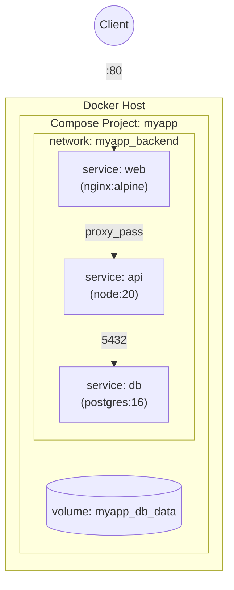

# Docker Compose

## Overview

Docker Compose is the declarative orchestration layer for defining and running multi-container applications on a single host: instead of chaining long `docker run` invocations, you describe services, networks, and volumes in one YAML file and bring the whole stack up or down with a single command. It sits directly on top of the primitives covered in [Docker-Networking](Docker-Networking.md) and [Docker-Volumes-and-Storage](Docker-Volumes-and-Storage.md) — every `networks:` and `volumes:` block in a compose file ultimately creates the same objects those notes describe. Modern Docker ships Compose as a CLI plugin (`docker compose`, the "v2" implementation written in Go), replacing the legacy standalone Python `docker-compose` binary.

> [!IMPORTANT]
> **v1 vs v2**
> The standalone `docker-compose` (Python, hyphenated) is end-of-life. Always use the `docker compose` (space, no hyphen) plugin subcommand — it's bundled with Docker Desktop and `docker-compose-plugin` on Linux. Command syntax is nearly identical, but v2 is faster, supports profiles natively, and is the only version receiving updates.

## Concepts

- **Project**: a compose file (or set of merged files) plus a project name (defaults to the directory name), used to namespace containers, networks, and volumes so multiple stacks don't collide.
- **Service**: a logical component (e.g. `web`, `db`) that maps to one or more containers built from the same image/config. Compose creates one container per service unless you scale it.
- **`depends_on`**: controls **startup order**, not readiness — a database container can be "started" long before its process is accepting connections. Combine with `healthcheck` + `condition: service_healthy` to actually wait for readiness.
- **`.env` file**: a `KEY=value` file in the project directory, auto-loaded by Compose to substitute `${VARIABLE}` references inside the YAML (image tags, ports, credentials) and to set `COMPOSE_PROJECT_NAME`, `COMPOSE_FILE`, etc.
- **Profiles**: tag services (`profiles: ["debug"]`) so they only start when explicitly requested with `--profile`, letting one file serve dev, test, and prod variants.

## Architecture



Compose translates the YAML into standard Docker objects: each `services:` entry becomes a container (attached to a Compose-managed bridge network by default, so services reach each other by service name via embedded DNS), each `networks:`/`volumes:` entry becomes a `docker network`/`docker volume`, and everything is labeled with `com.docker.compose.project=<name>` so `docker compose down` can find and remove exactly what it created.

## Installation

**RHEL / Fedora / Rocky (dnf):**

```bash
sudo dnf install -y dnf-plugins-core
sudo dnf config-manager --add-repo https://download.docker.com/linux/rhel/docker-ce.repo
sudo dnf install -y docker-ce docker-ce-cli containerd.io docker-compose-plugin
sudo systemctl enable --now docker
docker compose version
```

**Debian / Ubuntu (apt):**

```bash
sudo apt update
sudo apt install -y ca-certificates curl
sudo install -m 0755 -d /etc/apt/keyrings
sudo curl -fsSL https://download.docker.com/linux/ubuntu/gpg -o /etc/apt/keyrings/docker.asc
sudo chmod a+r /etc/apt/keyrings/docker.asc
echo "deb [arch=$(dpkg --print-architecture) signed-by=/etc/apt/keyrings/docker.asc] \
  https://download.docker.com/linux/ubuntu $(. /etc/os-release && echo $VERSION_CODENAME) stable" | \
  sudo tee /etc/apt/sources.list.d/docker.list > /dev/null
sudo apt update
sudo apt install -y docker-ce docker-ce-cli containerd.io docker-compose-plugin
docker compose version
```

## Configuration

Minimal file layout for a project:

```text
myapp/
├── .env
├── docker-compose.yml
├── api/
│   └── Dockerfile
└── nginx/
    └── nginx.conf
```

`.env` (loaded automatically from the project root):

```ini
COMPOSE_PROJECT_NAME=myapp
POSTGRES_VERSION=16-alpine
API_IMAGE_TAG=1.4.0
DB_PASSWORD=change_me_use_a_secret_in_prod
HOST_HTTP_PORT=8080
```

`docker-compose.yml` — a three-tier stack (proxy → API → database) using `.env` substitution, healthchecks, `depends_on: condition`, named volumes, and an isolated backend network:

```yaml
services:
  web:
    image: nginx:alpine
    ports:
      - "${HOST_HTTP_PORT:-80}:80"
    volumes:
      - ./nginx/nginx.conf:/etc/nginx/conf.d/default.conf:ro
    depends_on:
      api:
        condition: service_healthy
    networks:
      - frontend
      - backend
    restart: unless-stopped

  api:
    build:
      context: ./api
      dockerfile: Dockerfile
    image: myapp-api:${API_IMAGE_TAG}
    environment:
      DATABASE_URL: postgres://appuser:${DB_PASSWORD}@db:5432/appdb
    healthcheck:
      test: ["CMD", "curl", "-f", "http://localhost:3000/healthz"]
      interval: 10s
      timeout: 3s
      retries: 5
      start_period: 15s
    depends_on:
      db:
        condition: service_healthy
    networks:
      - backend
    restart: unless-stopped

  db:
    image: postgres:${POSTGRES_VERSION}
    environment:
      POSTGRES_DB: appdb
      POSTGRES_USER: appuser
      POSTGRES_PASSWORD: ${DB_PASSWORD}
    healthcheck:
      test: ["CMD-SHELL", "pg_isready -U appuser -d appdb"]
      interval: 5s
      timeout: 3s
      retries: 5
    volumes:
      - db_data:/var/lib/postgresql/data
    networks:
      - backend
    restart: unless-stopped

networks:
  frontend:
  backend:
    internal: true   # db/api unreachable directly from outside the host

volumes:
  db_data:
```

Key structural notes tying back to the sibling notes:

- The `networks:` top-level block declares Docker networks exactly as `docker network create` would (see [Docker-Networking](Docker-Networking.md)); `internal: true` prevents that network from routing to the outside world, isolating the database tier.
- The `volumes:` top-level block declares named volumes exactly as `docker volume create` would (see [Docker-Volumes-and-Storage](Docker-Volumes-and-Storage.md)); bind mounts (like the nginx config above) use host paths directly and don't need a top-level declaration.

## Commands

| Command | Purpose |
|---|---|
| `docker compose up -d` | Create/start all services in detached mode |
| `docker compose up -d --build` | Rebuild images before starting |
| `docker compose down` | Stop and remove containers + default network (keeps named volumes) |
| `docker compose down -v` | Also remove named volumes (destroys data) |
| `docker compose ps` | List project containers and their status/health |
| `docker compose logs -f api` | Follow logs for one service |
| `docker compose logs -f --tail=100` | Follow logs for all services, last 100 lines |
| `docker compose exec api sh` | Open a shell inside a running service container |
| `docker compose restart api` | Restart a single service |
| `docker compose stop` / `start` | Stop/start containers without removing them |
| `docker compose pull` | Pull latest images referenced by `image:` |
| `docker compose build --no-cache` | Force a clean rebuild |
| `docker compose config` | Render final merged/interpolated YAML (validate before deploying) |
| `docker compose top` | Show running processes per service |
| `docker compose scale api=3` / `up -d --scale api=3` | Run multiple replicas of a service |

## Examples

Bring the stack up, watch it become healthy, then inspect it:

```bash
docker compose up -d
docker compose ps
# NAME          IMAGE                COMMAND     STATUS                    PORTS
# myapp-web-1   nginx:alpine         "..."       Up 10s                    0.0.0.0:8080->80/tcp
# myapp-api-1   myapp-api:1.4.0      "..."       Up 9s (healthy)
# myapp-db-1    postgres:16-alpine   "..."       Up 12s (healthy)

docker compose logs -f api
docker compose exec db psql -U appuser -d appdb -c '\dt'
```

Using multiple compose files to override settings per environment:

```bash
# docker-compose.override.yml adds bind-mounted source + debug port for local dev
docker compose -f docker-compose.yml -f docker-compose.override.yml up -d

# docker-compose.prod.yml removes bind mounts, pins tags, adds resource limits
docker compose -f docker-compose.yml -f docker-compose.prod.yml up -d
```

Tearing down cleanly, including orphaned containers from removed services:

```bash
docker compose down --remove-orphans
```

> [!NOTE]
> **📸 Screenshot**
> _Capture: `docker compose ps` output showing all three services in the `(healthy)` state, alongside `docker compose logs -f` streaming interleaved, color-coded logs from `web`, `api`, and `db`._

## Best Practices

- Pin image tags (`postgres:16-alpine`, not `postgres:latest`) for reproducible deploys; drive the tag from `.env` so upgrades are a one-line change.
- Always define `healthcheck` on services other containers `depends_on` — `depends_on` alone only waits for the container process to *start*, not for the application inside to be ready.
- Keep secrets out of the compose file itself; use `.env` (gitignored) for local dev and `docker compose --env-file` or Docker/Swarm/Compose `secrets:` for anything shared or production-bound.
- Split environment-specific overrides into `docker-compose.override.yml` (auto-merged) or explicit `-f` chains rather than duplicating the whole file per environment.
- Use `internal: true` networks to keep backend tiers (databases, caches) unreachable from outside the Docker host, per [Docker-Networking](Docker-Networking.md) segmentation guidance.
- Run `docker compose config` in CI to catch YAML/interpolation errors before deployment.
- Prefer named volumes over host bind mounts for stateful data in production — see [Docker-Volumes-and-Storage](Docker-Volumes-and-Storage.md) for backup and permission implications.

## Security Considerations

Aligns with CIS Docker Benchmark guidance on compose-orchestrated deployments:

- **Least privilege**: add `read_only: true` and `cap_drop: [ALL]` (re-adding only required capabilities) on service definitions where the container doesn't need write access to its filesystem or elevated capabilities — mirrors CIS Docker Benchmark 5.x container runtime controls.
- **No privileged containers**: never set `privileged: true` in a compose file for application services; it defeats container isolation entirely.
- **Secrets hygiene**: don't bake `DB_PASSWORD` or API keys into the image or commit `.env` to version control — add it to `.gitignore`. Prefer `secrets:` (file- or Swarm-backed) over plain `environment:` for credentials, since environment variables are visible via `docker inspect` and `/proc/<pid>/environ`.
- **Network segmentation**: put database/cache services on an `internal: true` network so only the API tier can reach them; don't publish `ports:` on services that only need to be reachable from other services in the same Compose network.
- **Resource limits**: set `deploy.resources.limits` (CPU/memory) even outside Swarm mode where supported, to prevent a single compromised or runaway service from starving the host.
- **Pin digests where feasible**: for production, reference images by digest (`image: myapp-api@sha256:...`) rather than a mutable tag to prevent supply-chain substitution.

## Troubleshooting

| Symptom | Cause | Fix |
|---|---|---|
| `depends_on` didn't wait for DB readiness | No `healthcheck`, or `condition` not set | Add `healthcheck:` to the dependency and `condition: service_healthy` on the dependent |
| `${VAR}` renders literally / empty | `.env` not in project root or file not loaded | Confirm `.env` sits next to the compose file; verify with `docker compose config` |
| "port is already allocated" | Another container/process holds the host port | `docker ps` / `ss -tulpn`, change `HOST_HTTP_PORT` in `.env` |
| Service can't resolve another service by name | Both not on same custom network | Ensure both services list the same entry under `networks:` |
| `down` didn't remove data | Named volumes persist by design | Use `docker compose down -v` (destructive — confirm first) |
| Stale containers after renaming services in YAML | Old containers orphaned | `docker compose up -d --remove-orphans` |
| Changes to compose file not applied | Containers still running with old config | `docker compose up -d` (recreates changed services) or `docker compose up -d --force-recreate` |

## References

- Docker Compose CLI reference: https://docs.docker.com/compose/reference/
- Compose file specification: https://docs.docker.com/reference/compose-file/
- `docker compose` man page: `man docker-compose` (or `docker compose --help`)
- CIS Docker Benchmark (container runtime, secrets, network sections): https://www.cisecurity.org/benchmark/docker

## Related Notes

- [Docker-Networking](Docker-Networking.md) — bridge networks, DNS, and port publishing that Compose's `networks:` block builds on
- [Docker-Volumes-and-Storage](Docker-Volumes-and-Storage.md) — named volumes, bind mounts, and backup strategy for the `volumes:` block
- [Linux Administration & Server Hardening](../Readme.md) — course hub and map of content
