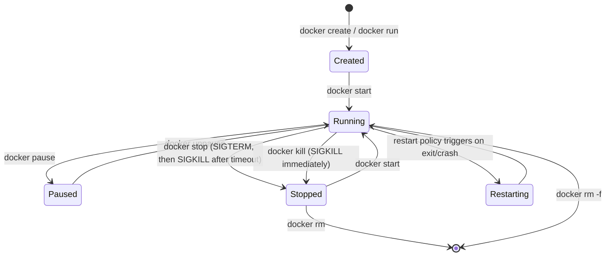

# Docker Container Lifecycle

## Overview

A Docker container is a running (or stopped) instance of an image — the writable layer plus namespace/cgroup isolation created from a read-only template. Managing that instance well means knowing every state it can be in, how to move between states with `docker run`/`stop`/`rm`, how to constrain the resources it consumes, and how to inspect and debug it without ever needing SSH into the box. This note assumes you already have images built per [Docker-Images-and-Dockerfile](Docker-Images-and-Dockerfile.md) and will eventually attach containers to custom networks as covered in [Docker-Networking](Docker-Networking.md).

> [!IMPORTANT]
> **Containers are ephemeral by design**
> A container's writable layer is destroyed on `docker rm`. Anything the application writes that must survive a restart or removal belongs in a named volume or bind mount — never in the container's own filesystem. Treat containers as cattle, not pets.

## Concepts

| Term | Meaning |
|---|---|
| Image | Immutable, layered read-only template (built from a Dockerfile) |
| Container | A running instance of an image: image layers + a thin writable layer + isolated namespaces/cgroups |
| Container ID | 64-char SHA256 (usually shown truncated to 12 chars) |
| Detached mode (`-d`) | Container runs in the background; STDOUT/STDERR go to the log driver |
| Interactive mode (`-it`) | Allocates a pseudo-TTY (`-t`) and keeps STDIN open (`-i`) for a foreground shell/session |
| Exit code | Reported by `docker inspect` / `docker ps -a`; `0` = clean exit, non-zero = error, `137` = SIGKILL (often OOM), `143` = SIGTERM |

## Architecture



Each state maps to fields you can query directly:

```bash
docker inspect -f '{{.State.Status}}' web01
docker inspect -f '{{.State.ExitCode}}' web01
docker inspect -f '{{.State.OOMKilled}}' web01
```

## Installation

Container tooling itself is covered in the platform's install docs; the essentials for this note:

```bash
# RHEL / Rocky / Alma (dnf)
sudo dnf install -y docker-ce docker-ce-cli containerd.io
sudo systemctl enable --now docker

# Debian / Ubuntu (apt)
sudo apt install -y docker-ce docker-ce-cli containerd.io
sudo systemctl enable --now docker

# Verify
docker version
docker info
sudo usermod -aG docker "$USER"   # avoid typing sudo for every docker command; re-login to apply
```

> [!WARNING]
> **`docker` group = root-equivalent**
> Membership in the `docker` group grants effective root on the host (the daemon runs as root and the socket has no further authz by default). Only add trusted admins to this group; see [Docker-Networking](Docker-Networking.md) and rootless-mode notes for hardening options.

## Configuration

### Restart policies

Restart policies are set at `docker run` time (or in a Compose file) and are enforced by the Docker daemon, not by systemd.

| Policy | Behavior |
|---|---|
| `no` (default) | Never restart automatically |
| `on-failure[:max-retries]` | Restart only if the container exits with non-zero status, up to `max-retries` times |
| `always` | Always restart, including after a manual `docker stop` followed by a daemon restart |
| `unless-stopped` | Like `always`, but does **not** restart if the container was explicitly stopped before the daemon last restarted |

```bash
docker run -d --restart unless-stopped --name web01 nginx:1.27
docker update --restart on-failure:5 web01     # change policy on an existing container
```

### Resource limits

Limits are enforced via cgroups (v2 on modern distros). Always cap memory and CPU on shared hosts — an unbounded container can starve the kernel and trigger the OOM killer against unrelated processes.

```bash
docker run -d \
  --name api01 \
  --memory=512m --memory-swap=512m \   # disable swap use beyond the memory cap
  --cpus=1.5 \                         # 1.5 CPU cores worth of time
  --pids-limit=256 \                   # cap forkbomb blast radius
  myorg/api:1.4.0
```

| Flag | Effect |
|---|---|
| `--memory` (`-m`) | Hard memory ceiling; OOM-killed if exceeded |
| `--memory-swap` | Total memory+swap; set equal to `--memory` to disable swap |
| `--memory-reservation` | Soft limit used under host memory pressure |
| `--cpus` | Fractional CPU count (cgroup v2 `cpu.max`) |
| `--cpu-shares` | Relative weight vs. other containers (default 1024), only matters under contention |
| `--pids-limit` | Max PIDs inside the container (prevents fork bombs) |
| `--read-only` | Mounts the root filesystem read-only |

## Commands

```bash
# Run — create + start in one step
docker run -d --name web01 -p 8080:80 nginx:1.27          # detached
docker run -it --rm alpine:3.20 sh                        # interactive, auto-remove on exit
docker run -d --name db01 -e POSTGRES_PASSWORD=change_me \
  -v pgdata:/var/lib/postgresql/data postgres:16

# List
docker ps                 # running containers only
docker ps -a               # all containers, including stopped/exited
docker ps -a --filter status=exited --filter ancestor=nginx:1.27

# Stop / start / restart
docker stop web01                  # SIGTERM, wait 10s, then SIGKILL
docker stop -t 30 web01            # custom grace period (seconds)
docker start web01
docker restart web01

# Remove
docker rm web01                    # container must be stopped first
docker rm -f web01                 # force stop + remove
docker container prune             # remove ALL stopped containers

# Exec — run a command in a running container
docker exec -it web01 bash
docker exec web01 nginx -t
docker exec -u root -it web01 sh   # break out of a non-root default user for debugging

# Logs
docker logs web01
docker logs -f --tail 100 web01    # follow, last 100 lines
docker logs --since 15m web01

# Inspect
docker inspect web01
docker inspect -f '{{json .State}}' web01 | jq .
docker inspect -f '{{.NetworkSettings.IPAddress}}' web01

# Stats (live resource usage)
docker stats web01
docker stats --no-stream --format "table {{.Name}}\t{{.CPUPerc}}\t{{.MemUsage}}"
```

## Examples

Detached, hardened web server with limits and an auto-restart policy:

```bash
docker run -d \
  --name web01 \
  --restart unless-stopped \
  --memory=256m --cpus=0.5 --pids-limit=128 \
  --read-only --tmpfs /var/cache/nginx --tmpfs /run \
  -p 8080:80 \
  nginx:1.27
```

Interactive one-off debugging session that leaves no trace:

```bash
docker run -it --rm \
  --network container:web01 \   # share web01's network namespace to test connectivity
  nicolaka/netshoot
```

Full lifecycle sweep for a stuck container:

```bash
docker inspect -f '{{.State.Status}} exit={{.State.ExitCode}} oom={{.State.OOMKilled}}' web01
docker logs --tail 50 web01
docker stop web01 || docker kill web01
docker rm web01
```

> [!NOTE]
> **📸 Screenshot**
> _Capture: `docker stats` running against 2-3 live containers, showing the CPU %, MEM USAGE/LIMIT, and PIDS columns side by side to illustrate resource-limit enforcement._

## Best Practices

- Always name containers (`--name`) — scripting against auto-generated names is fragile.
- Set `--memory` and `--cpus` on every production container; an unbounded container is a shared-host liability.
- Prefer `unless-stopped` over `always` for services you may deliberately stop for maintenance.
- Use `--rm` for throwaway/debug containers so `docker ps -a` doesn't accumulate cruft.
- Use `docker exec`, never `docker attach`, for ad-hoc shells — `attach` connects to PID 1's console and a stray `Ctrl-C` can kill the main process.
- Send logs to stdout/stderr and let the configured log driver (json-file, journald, syslog) handle rotation and shipping; don't log to files inside the container.
- Run `docker container prune` (and `docker system prune` periodically) to reclaim disk from exited containers.

## Security Considerations

Aligns with CIS Docker Benchmark sections on container runtime and resource controls:

- **CIS 5.10/5.11 — memory & CPU limits**: unbounded containers enable resource-exhaustion DoS against co-located workloads; always set `--memory` and `--cpus`.
- **CIS 5.28 — PIDs cgroup limit**: set `--pids-limit` to blunt fork-bomb style attacks from inside a compromised container.
- **CIS 5.9 — host network namespace**: avoid `--network host` unless required; it removes network isolation entirely.
- **CIS 5.4 — privileged containers**: never use `--privileged` in production; grant only the specific `--cap-add` capability needed (e.g. `NET_BIND_SERVICE`) and drop the rest with `--cap-drop=ALL`.
- **CIS 5.12 — read-only root filesystem**: use `--read-only` plus targeted `--tmpfs`/volume mounts for the few paths that need write access.
- **CIS 5.25 — non-root user**: run as a non-root `USER` in the Dockerfile (see [Docker-Images-and-Dockerfile](Docker-Images-and-Dockerfile.md)) and avoid `--user root` overrides except for short-lived debugging.
- Restart policies are not a substitute for health checks — pair `--restart` with a Dockerfile `HEALTHCHECK` so a hung-but-alive process still gets recycled.
- `docker logs` output is not access-controlled beyond host/socket permissions; avoid logging secrets to stdout.

## Troubleshooting

| Symptom | Likely cause | Check |
|---|---|---|
| Container exits immediately (status `Exited (0)`) | Foreground process finished (e.g. no long-running command) | `docker logs`, confirm the image's `CMD`/entrypoint keeps a process in the foreground |
| Exit code `137` | OOM killed, or external `docker stop`/`kill -9` | `docker inspect -f '{{.State.OOMKilled}}'`; raise `--memory` or fix the leak |
| Exit code `143` | Clean SIGTERM shutdown (normal `docker stop`) | Expected — not an error |
| `docker stop` hangs for 10s every time | App doesn't trap SIGTERM | Add a signal handler, or accept the grace period, or reduce with `-t` |
| `docker exec` says container not running | Container already exited | `docker ps -a`, check logs, `docker start` first |
| Restart-looping container | Crash loop under `on-failure`/`always` | `docker logs`, `docker events --filter container=<name>` to see restart timestamps |
| `docker rm` fails with "container is running" | Forgot to stop first | `docker rm -f <name>` or `docker stop` then `docker rm` |

## References

- Docker Docs — [Run containers](https://docs.docker.com/engine/reference/run/)
- Docker Docs — [docker container CLI reference](https://docs.docker.com/reference/cli/docker/container/)
- Docker Docs — [Restart policies](https://docs.docker.com/engine/containers/start-containers-automatically/)
- Docker Docs — [Runtime resource constraints](https://docs.docker.com/engine/containers/resource_constraints/)
- `man docker-run`, `man docker-inspect`
- CIS Docker Benchmark, Section 5 (Container Runtime)

## Related Notes

- [Docker-Images-and-Dockerfile](Docker-Images-and-Dockerfile.md)
- [Docker-Networking](Docker-Networking.md)
- [Linux Administration & Server Hardening](../Readme.md) — course hub and map of content
