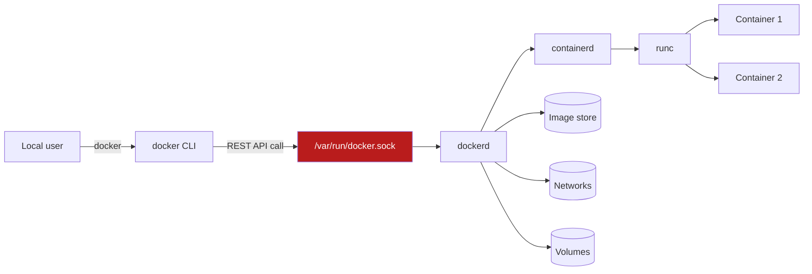

# Docker Engine Installation

## Overview

Docker Engine is the client-server runtime — `dockerd`, the REST API, and the `docker` CLI — that builds and runs containers on Linux. It should always be installed from Docker's own APT/DNF repositories rather than a distro's default packages, since distro-maintained `docker.io`/`docker` packages lag badly behind upstream security fixes. This note picks up right after [Introduction-to-Containers](Introduction-to-Containers.md) and prepares the host for the day-to-day workflow covered in [Docker-Containers-Lifecycle](Docker-Containers-Lifecycle.md).

> [!IMPORTANT]
> **Scope**
> This note covers installing Docker CE (Community Edition) on Debian/Ubuntu and RHEL/CentOS-family hosts, enabling the systemd service, the `docker` group convenience (and its privilege-escalation risk), and verifying the install with `hello-world`. It does not cover Docker Desktop, rootless mode, or Kubernetes — those are separate topics.

## Concepts

| Component | Role |
|---|---|
| `dockerd` | Background daemon; manages images, containers, networks, volumes. Runs as **root** by default. |
| `docker` (CLI) | Client that talks to `dockerd` over a Unix socket (`/var/run/docker.sock`) or TCP. |
| `containerd` | OCI-compliant container runtime that `dockerd` delegates to for actually running containers. |
| `docker-compose-plugin` | `docker compose` subcommand for multi-container YAML stacks. |
| `docker-buildx-plugin` | `docker buildx` — extended, multi-platform image builds. |
| `docker.sock` | Unix socket the daemon listens on; **owning access to it is equivalent to root on the host.** |

## Architecture



The socket is the trust boundary: anything that can write to it can ask `dockerd` (running as root) to bind-mount `/` into a new container and thereby read/write the entire host filesystem as root. This is the basis for the `docker` group risk discussed below.

## Installation

### Debian / Ubuntu (APT)

```bash
# 1. Remove old/conflicting packages
sudo apt remove -y docker docker-engine docker.io containerd runc

# 2. Prerequisites
sudo apt update
sudo apt install -y ca-certificates curl gnupg

# 3. Add Docker's official GPG key
sudo install -m 0755 -d /etc/apt/keyrings
curl -fsSL https://download.docker.com/linux/ubuntu/gpg | \
  sudo gpg --dearmor -o /etc/apt/keyrings/docker.gpg
sudo chmod a+r /etc/apt/keyrings/docker.gpg

# 4. Add the repository (use $(. /etc/os-release && echo $VERSION_CODENAME) to auto-detect)
echo \
  "deb [arch=$(dpkg --print-architecture) signed-by=/etc/apt/keyrings/docker.gpg] \
  https://download.docker.com/linux/ubuntu \
  $(. /etc/os-release && echo $VERSION_CODENAME) stable" | \
  sudo tee /etc/apt/sources.list.d/docker.list > /dev/null

# 5. Install
sudo apt update
sudo apt install -y docker-ce docker-ce-cli containerd.io \
  docker-buildx-plugin docker-compose-plugin
```

For Debian, substitute `download.docker.com/linux/debian` in steps 3-4.

### RHEL / CentOS / Rocky / Alma (DNF)

```bash
# 1. Remove old/conflicting packages
sudo dnf remove -y docker docker-client docker-client-latest docker-common \
  docker-latest docker-latest-logrotate docker-logrotate docker-engine podman runc

# 2. Add the repository
sudo dnf install -y dnf-plugins-core
sudo dnf config-manager --add-repo https://download.docker.com/linux/rhel/docker-ce.repo

# 3. Install
sudo dnf install -y docker-ce docker-ce-cli containerd.io \
  docker-buildx-plugin docker-compose-plugin
```

> [!NOTE]
> On RHEL/CentOS, `firewalld` and SELinux are both active by default. Docker manages its own `iptables`/`nftables` rules and ships an SELinux policy (`container-selinux`) — don't disable either subsystem to "make Docker work"; investigate the specific denial instead (see Troubleshooting).

## Configuration

Enable and start the daemon via systemd on both families — this is identical everywhere systemd is used:

```bash
sudo systemctl enable --now docker
sudo systemctl status docker
```

Key daemon configuration lives in `/etc/docker/daemon.json` (create it if absent). A hardened baseline:

```json
{
  "log-driver": "json-file",
  "log-opts": {
    "max-size": "10m",
    "max-file": "3"
  },
  "live-restore": true,
  "userland-proxy": false,
  "icc": false,
  "no-new-privileges": true
}
```

| Key | Purpose |
|---|---|
| `log-opts` | Caps per-container log size — prevents disk exhaustion from a chatty container. |
| `live-restore` | Containers keep running if `dockerd` restarts/crashes. |
| `icc` | Disables inter-container communication on the default bridge unless explicitly linked. |
| `no-new-privileges` | Blocks setuid/setgid privilege escalation inside containers by default. |

Apply changes with:

```bash
sudo systemctl restart docker
```

## Commands

| Command | Purpose |
|---|---|
| `sudo systemctl enable --now docker` | Start daemon now and on boot |
| `sudo systemctl status docker` | Check daemon health |
| `docker version` | Show client + server (daemon) versions |
| `docker info` | Daemon-wide diagnostics: storage driver, cgroup version, root dir |
| `docker run hello-world` | Pull and run the verification image |
| `sudo usermod -aG docker $USER` | Add current user to the `docker` group (see risk below) |
| `newgrp docker` | Activate the new group membership in the current shell without logging out |
| `journalctl -u docker.service -f` | Tail daemon logs |

## Examples

Verify the engine end-to-end:

```bash
sudo docker run hello-world
```

Expected output includes:

```text
Hello from Docker!
This message shows that your installation appears to be working correctly.
...
```

Check daemon and client details:

```bash
docker version
docker info | grep -iE 'server version|storage driver|cgroup'
```

Grant a non-root user daily-driver access to Docker (convenience, not "security"):

```bash
sudo groupadd docker              # usually already created by the package
sudo usermod -aG docker "$USER"
newgrp docker                     # or log out/in
docker run hello-world            # should now work without sudo
```

> [!NOTE]
> **📸 Screenshot**
> _Capture: terminal output of `sudo docker run hello-world` immediately followed by `docker info | grep -i "storage driver\|cgroup"`, showing a successful pull/run and the daemon's storage driver in one frame._

## Best Practices

- Always install from Docker's official repo (as above), and pin/track a specific minor version in change-controlled environments rather than blindly taking `latest`.
- Keep the engine patched: `sudo apt update && sudo apt upgrade docker-ce` / `sudo dnf upgrade docker-ce` on a regular cadence — CVEs in `runc`/`containerd` are frequent and severe.
- Set `log-opts` limits in `daemon.json` from day one; unbounded JSON logs are a classic disk-fill incident.
- Prefer `docker compose` (plugin) over the deprecated standalone `docker-compose` Python tool.
- In production, consider **rootless Docker** or Podman instead of adding operators to the `docker` group — covered separately, not in scope here.

## Security Considerations

> [!WARNING]
> **The `docker` group is root-equivalent**
> Membership in the `docker` group grants full root access to the host, not merely "container access." A member can run:
> ```bash
> docker run -v /:/hostroot -it alpine chroot /hostroot sh
> ```
> This bind-mounts the entire host filesystem into a container and chroots into it — from there, an attacker (or compromised script) reads `/etc/shadow`, plants SUID binaries, or modifies `/etc/sudoers` as root. CIS Docker Benchmark explicitly calls this out: **"Do not add non-admin/non-devops users to the `docker` group"** in production.

Additional CIS Docker Benchmark / NIST-aligned controls:

| Control | Recommendation |
|---|---|
| Daemon socket exposure | Never bind `dockerd` to `tcp://0.0.0.0` without TLS client-cert auth; keep the default Unix socket. |
| Audit the daemon | Add `/usr/bin/dockerd` and `/var/lib/docker` to `auditd` rules (CIS 1.1.x). |
| Restrict `docker.sock` access | Treat it like `/etc/shadow` — only root and the `docker` group should read/write it; avoid mounting it into containers unless the container is a trusted CI/CD or monitoring agent. |
| Least privilege at runtime | Run containers with `--cap-drop=ALL` and add back only needed capabilities; avoid `--privileged`. |
| Rootless alternative | For multi-tenant or untrusted-user hosts, deploy rootless Docker or Podman so the daemon itself never runs as root. |
| Image provenance | Enable Docker Content Trust (`DOCKER_CONTENT_TRUST=1`) or verify signatures before pulling from third-party registries. |
| SELinux/AppArmor | Keep enforcing (`getenforce` → `Enforcing`) or AppArmor active; do not run with `--security-opt label=disable`. |

## Troubleshooting

| Symptom | Likely cause | Fix |
|---|---|---|
| `Cannot connect to the Docker daemon at unix:///var/run/docker.sock` | Daemon not running, or user lacks socket permission | `sudo systemctl start docker`; confirm group membership with `groups $USER` |
| `permission denied while trying to connect to the Docker daemon socket` | User added to `docker` group but shell session predates it | Run `newgrp docker` or log out/in; verify with `id` |
| `docker: command not found` after install | Repo add failed or wrong distro codename in APT source | Re-check `/etc/apt/sources.list.d/docker.list`; confirm `$VERSION_CODENAME` matches a supported release |
| SELinux denials on volume mounts (`Permission denied` inside container) | Missing `:z`/`:Z` SELinux relabel flag on bind mount | Add `:z` (shared) or `:Z` (private) to the `-v` mount, e.g. `-v /data:/data:Z` |
| Daemon fails to start after `daemon.json` edit | Invalid JSON syntax | Validate with `python3 -m json.tool /etc/docker/daemon.json`; check `journalctl -u docker` for the parse error |
| Disk fills up under `/var/lib/docker` | Unbounded logs or dangling images/layers | Set `log-opts` limits; run `docker system prune -a` (destructive — review first) |

## References

- Docker Docs — [Install Docker Engine](https://docs.docker.com/engine/install/)
- Docker Docs — [Post-installation steps for Linux (docker group)](https://docs.docker.com/engine/install/linux-postinstall/)
- Docker Docs — [`dockerd` reference](https://docs.docker.com/reference/cli/dockerd/)
- CIS Docker Benchmark (Center for Internet Security) — Section 1: Host Configuration
- `man dockerd`, `man docker`

## Related Notes

- [Introduction-to-Containers](Introduction-to-Containers.md) — container fundamentals and Docker's place in the ecosystem
- [Docker-Containers-Lifecycle](Docker-Containers-Lifecycle.md) — day-2 operations: run, stop, inspect, remove
- [Linux Administration & Server Hardening](../Readme.md) — course hub and map of content
