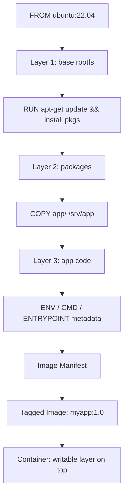

# Docker Images and Dockerfile

## Overview

A Docker image is a read-only, layered filesystem snapshot that becomes a running process when instantiated by [the container runtime](Docker-Containers-Lifecycle.md); the `Dockerfile` is the declarative recipe that builds that image, one instruction and one layer at a time. Understanding how layers cache, how instructions differ semantically, and how multi-stage builds separate build-time tooling from runtime footprint is the difference between a 1.2 GB image full of compilers and a 40 MB distroless image that ships only what production needs. Everything here applies equally to [Buildah](Buildah.md) and other OCI-compliant builders, since the Dockerfile format is now standardized as part of the OCI image spec.

> [!IMPORTANT]
> **Layers are immutable and content-addressed**
> Every instruction that modifies the filesystem (`RUN`, `COPY`, `ADD`) creates a new, immutable layer identified by a SHA256 digest. Layers are shared across images and cached across builds — reordering instructions or changing a file earlier in the Dockerfile invalidates every layer after it.

## Concepts

- **Image**: an ordered stack of read-only layers plus JSON metadata (entrypoint, env, exposed ports, working dir) describing how to run it.
- **Layer**: a single filesystem diff produced by one Dockerfile instruction. Stored once, reused by every image that shares that exact instruction and build context.
- **Union filesystem**: the storage driver (`overlay2` on modern Docker) stacks layers into one merged view at container start, adding a thin writable layer on top for the running container.
- **Manifest**: a JSON document listing an image's layer digests, config digest, and (for multi-arch images) a manifest list mapping architectures to per-arch manifests.
- **Tag**: a mutable pointer (`name:tag`) to an immutable image digest (`name@sha256:...`). Tags can be reassigned; digests never change.
- **Build context**: the set of files sent to the Docker daemon (or BuildKit) at build start — everything in the directory passed to `docker build`, minus what `.dockerignore` excludes.



## Architecture

| Layer type | Created by | Cached? | Typical size impact |
|---|---|---|---|
| Base layer | `FROM` | Yes (pulled once, reused) | Largest single contributor |
| Package layer | `RUN apt-get/dnf install` | Yes, until an earlier layer changes | Medium–large |
| App code layer | `COPY`/`ADD` | Invalidated on any file change in context | Small–medium |
| Metadata-only | `ENV`, `LABEL`, `EXPOSE`, `WORKDIR`, `CMD`, `ENTRYPOINT`, `ARG` | No new filesystem bytes | Zero |

Each `RUN`, `COPY`, and `ADD` line is a cache boundary: Docker hashes the instruction (and, for `COPY`/`ADD`, the source file contents) and reuses the cached layer if nothing changed upstream. This is why **ordering matters** — put the least-frequently-changing instructions first.

## Dockerfile Instructions

| Instruction | Purpose | Notes |
|---|---|---|
| `FROM` | Sets the base image; first instruction (after optional global `ARG`) | Use pinned tags or digests (`FROM alpine:3.20@sha256:...`) for reproducibility |
| `ARG` | Build-time variable, not present in the final image | Scope it above/below `FROM` deliberately; must be re-declared after `FROM` to use post-`FROM` |
| `ENV` | Runtime environment variable, baked into the image and visible to the running container | Increases image metadata; avoid stuffing secrets here — visible via `docker inspect` |
| `RUN` | Executes a command and commits the result as a new layer | Chain related commands with `&&` and clean up in the same layer to avoid bloat |
| `COPY` | Copies files from build context into the image | Preferred over `ADD` for plain file copies — explicit and predictable |
| `ADD` | Like `COPY`, plus auto-extracts local tar archives and can fetch URLs | Avoid URL fetching in `ADD`; use `RUN curl`/`wget` so retries and cleanup are explicit |
| `WORKDIR` | Sets the working directory for subsequent instructions and at runtime | Creates the directory if it doesn't exist; prefer over `RUN cd` |
| `USER` | Sets the UID/GID for subsequent instructions and the container process | Critical hardening control — never leave the final `USER` as root |
| `EXPOSE` | Documents the port(s) the container listens on | Purely informational; does not publish the port (`-p` still required) |
| `VOLUME` | Declares a mount point that gets an anonymous volume if unmapped | Use for data that must survive container removal |
| `CMD` | Default command/arguments for the container | Overridden entirely by any command given to `docker run` |
| `ENTRYPOINT` | Fixed executable for the container | `CMD` becomes default *arguments* to it when both are set |
| `LABEL` | Key-value metadata (maintainer, version, source) | Zero runtime cost; used by scanners and registries |
| `HEALTHCHECK` | Command Docker runs periodically to judge container health | Surfaces in `docker ps` as `healthy`/`unhealthy` |
| `SHELL` | Overrides the default shell used by `RUN` in shell form | Rarely needed; useful on Windows containers |

> [!TIP]
> **CMD vs ENTRYPOINT**
> Use `ENTRYPOINT ["/app/bin"]` with `CMD ["--default-flag"]` when the image *is* a single executable — this lets users override flags at `docker run` time without losing the fixed entrypoint. Use `CMD` alone when the image should behave like a normal shell-invokable default that's easy to fully replace.

## Multi-Stage Builds

Multi-stage builds let you use one (or more) throwaway `FROM` stages for compiling/building, then `COPY --from=<stage>` only the finished artifact into a slim final stage — keeping compilers, headers, and build caches out of the shipped image entirely.

```dockerfile
# syntax=docker/dockerfile:1

# ---- Stage 1: build ----
FROM golang:1.22-bookworm AS builder
WORKDIR /src

# Leverage layer cache: deps change far less often than source
COPY go.mod go.sum ./
RUN go mod download

COPY . .
RUN CGO_ENABLED=0 GOOS=linux go build -ldflags="-s -w" -o /out/app ./cmd/app

# ---- Stage 2: runtime ----
FROM gcr.io/distroless/static-debian12:nonroot AS runtime
LABEL org.opencontainers.image.source="https://example.com/app" \
      org.opencontainers.image.version="1.4.0"

WORKDIR /app
COPY --from=builder /out/app /app/app

ARG BUILD_DATE
ENV APP_ENV=production \
    PORT=8080

EXPOSE 8080
USER nonroot:nonroot

HEALTHCHECK --interval=30s --timeout=3s --retries=3 \
  CMD ["/app/app", "-healthcheck"]

ENTRYPOINT ["/app/app"]
CMD ["--config", "/app/config.yaml"]
```

Key points from the example above:

- Stage 1 downloads Go modules **before** copying source, so a source-only change doesn't re-download every dependency.
- Stage 2 starts from a distroless base with no shell, no package manager, and a built-in unprivileged `nonroot` user — a strong hardening default.
- `COPY --from=builder` pulls only the compiled binary; the ~900 MB Go toolchain never reaches the final image.
- You can target a specific stage during development with `docker build --target builder .`.

## Build Cache and `.dockerignore`

BuildKit (the default builder since Docker 23) resolves cache per-instruction and, for `RUN` commands, supports cache mounts for package managers:

```dockerfile
# syntax=docker/dockerfile:1
FROM debian:12-slim
RUN --mount=type=cache,target=/var/cache/apt \
    --mount=type=cache,target=/var/lib/apt \
    apt-get update && apt-get install -y --no-install-recommends curl ca-certificates
```

`--mount=type=cache` persists the package manager's own cache directory *across builds* without baking it into the image layer — faster rebuilds, smaller layers.

`.dockerignore` trims the build context sent to the daemon, which speeds up builds and prevents accidental inclusion of secrets or bulk data:

```text
.git
.gitignore
node_modules
dist
*.log
.env
.env.*
Dockerfile*
docker-compose*.yml
README.md
.dockerignore
```

> [!WARNING]
> **Build context leaks**
> Anything not excluded by `.dockerignore` is sent to the build daemon and can end up cached or copied into a layer via a careless `COPY . .`. Never rely on a later `RUN rm` to erase a secret — the earlier layer still contains it and remains extractable with `docker history`/`docker save`.

## Tagging

```bash
# Tag an image with a semantic version and 'latest'
docker build -t registry.example.com/team/app:1.4.0 -t registry.example.com/team/app:latest .

# Retag an existing image (creates a new tag pointing at the same image ID)
docker tag registry.example.com/team/app:1.4.0 registry.example.com/team/app:stable

# Push all tags for a repository
docker push registry.example.com/team/app --all-tags

# Pin to an immutable digest for reproducible deploys
docker pull registry.example.com/team/app@sha256:8f3e...  
```

| Tag pattern | Use case | Mutability |
|---|---|---|
| `:latest` | Convenience default; never rely on it in production manifests | Highly mutable |
| `:1.4.0` | Semantic version, human-readable | Mutable unless enforced immutable in the registry |
| `@sha256:...` | Exact content digest | Immutable — the gold standard for production pins |
| `:1.4.0-alpine` | Variant tagging (base image flavor) | Mutable |

## Commands

```bash
docker build -t app:1.0 .                     # Build from Dockerfile in current dir
docker build -f Dockerfile.prod -t app:1.0 .   # Use a specific Dockerfile
docker build --no-cache -t app:1.0 .           # Force full rebuild, ignore cache
docker build --target builder -t app:build .   # Build only a named stage
docker images                                  # List local images
docker image ls --digests                      # Show digests alongside tags
docker history app:1.0                          # Inspect layers and their sizes
docker inspect app:1.0                           # Full image metadata (env, entrypoint, labels)
docker image prune                              # Remove dangling (untagged) images
docker image prune -a --filter "until=720h"     # Remove all unused images older than 30 days
docker save app:1.0 -o app.tar                   # Export image to a tarball
docker load -i app.tar                           # Import image from a tarball
```

## Best Practices

- Pin base images by digest or minor version, not floating tags like `latest`, for reproducible builds.
- Order Dockerfile instructions from least to most frequently changing to maximize cache hits.
- Combine related `RUN` commands with `&&` and clean package caches (`rm -rf /var/lib/apt/lists/*`) in the same layer — a later `RUN rm` does not shrink an earlier layer.
- Use multi-stage builds to keep compilers, dev headers, and test frameworks out of the runtime image.
- Prefer minimal base images (`alpine`, `-slim`, or `distroless`) unless glibc/tooling compatibility requires more.
- Always set a non-root `USER` in the final stage.
- Add a `.dockerignore` before the first build, not after a secret leaks into a layer.
- Use `LABEL` (e.g. OCI annotations) for provenance metadata: source repo, revision, build date.
- Add a `HEALTHCHECK` so orchestrators can detect a wedged process, not just a crashed one.

## Security Considerations

Aligned with CIS Docker Benchmark guidance:

- **CIS 4.1** — Ensure a non-root `USER` is created and set; never leave the final effective user as `root` (UID 0).
- **CIS 4.6 / 4.9** — Do not use `ADD` for remote URLs and do not use `curl | bash` patterns inside `RUN`; fetch, verify checksums/signatures, then install.
- **CIS 4.10** — Do not store secrets (API keys, passwords, private keys) in `ENV`, `ARG`, or `LABEL` — they persist in image history and `docker inspect` output even if "deleted" in a later layer. Use BuildKit secret mounts instead: `RUN --mount=type=secret,id=npmrc ...`.
- **CIS 4.2 / 4.5** — Scan images for known CVEs (`docker scout cves`, `trivy image app:1.0`, or Grype) as part of CI before pushing to a registry.
- Prefer minimal/distroless bases to shrink the attack surface (no shell, no package manager means fewer post-compromise tools available to an attacker).
- Sign images (Docker Content Trust / `cosign`) and enforce verification at pull time in production clusters.
- Set `HEALTHCHECK` and resource limits at the orchestrator level; a Dockerfile default is a floor, not a substitute for runtime hardening (seccomp, AppArmor, read-only root filesystem) covered in [Docker-Containers-Lifecycle](Docker-Containers-Lifecycle.md).

> [!NOTE]
> **📸 Screenshot**
> _Capture: `docker history app:1.0` output showing per-instruction layer sizes, alongside `docker images` showing the final tagged image size — useful for demonstrating multi-stage build savings._

## Troubleshooting

| Symptom | Likely cause | Fix |
|---|---|---|
| Every build re-runs `apt-get install` | A `COPY . .` placed before dependency install invalidates cache | Move dependency-only `COPY`/`RUN` earlier, source code copy last |
| Final image is huge despite multi-stage | Copying from the wrong stage, or base stage itself isn't slim | Verify `COPY --from=<stage>` targets the build stage; check base image size |
| Secret found in image via `docker history` | Secret was set via `ENV`/`ARG` or written then deleted in a later `RUN` | Rebuild without the secret in any layer; rotate the leaked secret; use `--mount=type=secret` |
| `docker build` sends context slowly / large context warning | Missing or incomplete `.dockerignore` | Add `.git`, `node_modules`, build artifacts, and data dirs to `.dockerignore` |
| Container runs as root unexpectedly | No `USER` instruction, or `USER` set before a `RUN` that needs root then never reset | Add explicit non-root `USER` as the last relevant instruction before `ENTRYPOINT` |
| `CMD` arguments ignored at `docker run` | `ENTRYPOINT` in shell form (not exec form) swallows arguments | Use exec form: `ENTRYPOINT ["/app/bin"]`, `CMD ["--flag"]` |

## References

- Docker Docs — Dockerfile reference: https://docs.docker.com/reference/dockerfile/
- Docker Docs — Best practices for writing Dockerfiles: https://docs.docker.com/build/building/best-practices/
- Docker Docs — BuildKit cache mounts: https://docs.docker.com/build/cache/
- OCI Image Format Specification: https://github.com/opencontainers/image-spec
- CIS Docker Benchmark (latest version, Center for Internet Security)
- `man docker-build`, `man dockerfile` (via `docker build --help`)

## Related Notes

- [Docker-Containers-Lifecycle](Docker-Containers-Lifecycle.md) — running, managing, and hardening containers built from these images
- [Buildah](Buildah.md) — daemonless, OCI-compliant alternative for building the same Dockerfile format
- [Docker-Engine-Installation](Docker-Engine-Installation.md) — installing the Docker Engine and CLI used to build these images
- [Introduction-to-Containers](Introduction-to-Containers.md) — container fundamentals and how images fit into the runtime model
- [Linux Administration & Server Hardening](../Readme.md) — course hub and map of content
