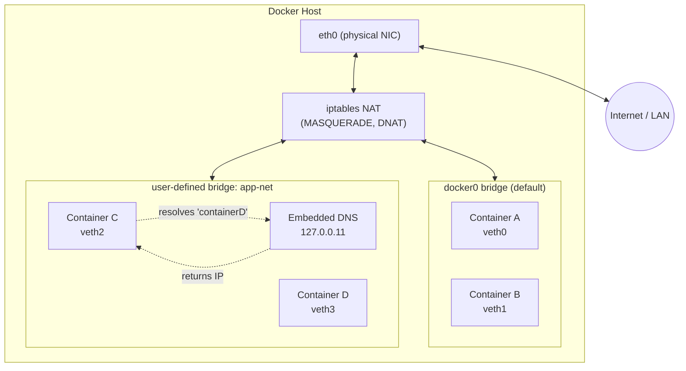

# Docker Networking

## Overview

Docker networking connects containers to each other, to the host, and to the outside world using pluggable drivers implemented on top of Linux bridges, `iptables`/`nftables` NAT rules, and network namespaces. Understanding which driver to use — and how the embedded DNS server resolves container names — is a prerequisite for reasoning about the lifecycle covered in [Docker-Containers-Lifecycle](Docker-Containers-Lifecycle.md) and for wiring up multi-service stacks in [Docker-Compose](Docker-Compose.md). Most single-host deployments only ever need a **user-defined bridge network**; overlay and macvlan exist for clustering and for handing containers a real LAN identity.

> [!IMPORTANT]
> **Default bridge vs. user-defined bridge**
> The default `bridge` network (created automatically as `docker0`) does **not** provide automatic DNS resolution between containers — you must link them manually or use `--link` (deprecated). Any **user-defined** bridge network gets Docker's embedded DNS server for free, so containers resolve each other by name. Always create a custom network instead of relying on the default one.

## Concepts

Docker's networking is implemented via the **Container Network Model (CNM)**, which defines three building blocks: a **sandbox** (the container's network namespace), an **endpoint** (a veth pair connecting the sandbox to a network), and a **network** (a group of endpoints that can communicate, e.g. a Linux bridge). Drivers plug into this model.

| Driver | Scope | Use case | Isolation | DNS resolution |
|---|---|---|---|---|
| `bridge` | Single host | Default; general-purpose container-to-container comms | NAT'd, isolated from host network | Yes (user-defined only) |
| `host` | Single host | Max network performance, no NAT overhead | None — shares host's network namespace | N/A (uses host resolv.conf) |
| `none` | Single host | Fully isolated containers (batch jobs, security sandboxes) | Total — no interfaces except loopback | N/A |
| `overlay` | Multi-host (Swarm) | Multi-host container communication in a cluster | VXLAN-encapsulated, per-network | Yes |
| `macvlan` | Single/multi host | Containers need their own MAC/IP on the physical LAN | Appears as a distinct physical device | Yes (user-defined) |
| `ipvlan` | Single/multi host | Like macvlan but shares one MAC (L2 switch port limits) | Shares host MAC, separate IPs | Yes (user-defined) |

## Architecture



On a user-defined bridge, Docker injects each container's name and any `--network-alias` into the embedded DNS server (`127.0.0.11`), so `ping app-db` just works. The default bridge has no such registration — hence its poor ergonomics for multi-container apps.

## Installation

No separate package is required beyond the Docker Engine itself (`docker-ce` / `docker.io`); the bridge, host, and none drivers are built in. Two features need extra setup:

```bash
# Overlay networks require Swarm mode to be initialized
docker swarm init --advertise-addr <MANAGER-IP>

# Macvlan/ipvlan require a parent interface with promiscuous-capable NIC
# and, for VMs, the hypervisor vSwitch set to allow promiscuous/forged transmits
ip link show eth0
```

> [!NOTE]
> **Kernel modules**
> Overlay networking depends on the `vxlan` kernel module; macvlan depends on `macvlan`/`8021q`. Both ship in mainstream RHEL and Debian kernels, but confirm with `lsmod | grep -E 'vxlan|macvlan'` on minimal/hardened images.

## Configuration

### Creating a user-defined bridge

```bash
docker network create \
  --driver bridge \
  --subnet 172.20.0.0/16 \
  --gateway 172.20.0.1 \
  --opt com.docker.network.bridge.name=br-appnet \
  app-net
```

### Publishing ports (bridge/none, not needed for host)

```bash
# Map host:container — binds to all host interfaces by default
docker run -d -p 8080:80 nginx

# Bind only to a specific host IP (recommended — avoids exposing to 0.0.0.0)
docker run -d -p 127.0.0.1:8080:80 nginx

# Publish all EXPOSEd ports to random high host ports
docker run -d -P nginx

# Explicit protocol
docker run -d -p 53:53/udp -p 53:53/tcp coredns/coredns
```

`-p` writes a `DNAT` rule into the `DOCKER` iptables chain; it bypasses `ufw`/`firewalld` rules unless those are explicitly configured to see Docker's chains (see Security Considerations).

### Macvlan (own IP on the physical LAN)

```bash
docker network create -d macvlan \
  --subnet 192.168.1.0/24 \
  --gateway 192.168.1.1 \
  -o parent=eth0 \
  lan-net

docker run -d --network lan-net --ip 192.168.1.50 nginx
```

> [!WARNING]
> **Host-to-container isolation on macvlan**
> By default, the Linux kernel refuses traffic between a macvlan sub-interface and its parent interface — **the Docker host itself cannot reach containers on a macvlan network** directly. Work around it with an extra macvlan shim interface on the host, or use `ipvlan` in L2 mode if host reachability is required.

### Daemon-wide defaults (`/etc/docker/daemon.json`)

```json
{
  "iptables": true,
  "ip-forward": true,
  "icc": false,
  "userland-proxy": false,
  "default-address-pools": [
    { "base": "172.30.0.0/16", "size": 24 }
  ]
}
```

`icc: false` disables inter-container communication on the *default* bridge unless explicitly linked — a hardening step recommended by the CIS Docker Benchmark. Reload with `systemctl restart docker` (Debian/RHEL both use systemd units).

## Commands

| Command | Purpose |
|---|---|
| `docker network ls` | List all networks |
| `docker network create -d <driver> <name>` | Create a network |
| `docker network inspect <name>` | Show subnet, gateway, connected containers, IPAM |
| `docker network connect <net> <container>` | Attach a running container to another network |
| `docker network disconnect <net> <container>` | Detach a container from a network |
| `docker network rm <name>` | Delete an unused network |
| `docker network prune` | Remove all unused networks |
| `docker run --network <name> ...` | Run a container attached to a specific network |
| `docker run --network-alias <alias> ...` | Add an extra DNS name on a user-defined network |
| `docker port <container>` | Show published port mappings for a running container |

## Examples

**Multi-container app with private DNS (no Compose):**

```bash
docker network create backend-net

docker run -d --name db --network backend-net \
  -e POSTGRES_PASSWORD=changeme postgres:16

docker run -d --name api --network backend-net \
  -p 127.0.0.1:3000:3000 myapp/api:latest
# Inside 'api' container, DB is reachable simply as: postgresql://db:5432
```

**Attaching a running container to a second network (e.g., adding it to a monitoring network without restart):**

```bash
docker network connect monitoring-net api
docker exec api getent hosts prometheus
```

**Inspecting which containers sit on a network and their IPs:**

```bash
docker network inspect backend-net --format \
  '{{range .Containers}}{{.Name}} {{.IPv4Address}}{{"\n"}}{{end}}'
```

**Firewalld: allow the docker0 zone to route out (RHEL-family)**

```bash
firewall-cmd --permanent --zone=trusted --change-interface=docker0
firewall-cmd --reload
```

**UFW: coexisting with Docker's iptables rules (Debian-family)**

```bash
# UFW does not see Docker's DOCKER-USER chain by default; add explicit rules there
ufw allow 8080/tcp
# Then edit /etc/ufw/after.rules to add DOCKER-USER jump rules per Docker docs
```

> [!NOTE]
> **📸 Screenshot**
> _Capture: `docker network inspect app-net` output in a terminal, showing the `IPAM` block, `Containers` map with names/IPs, and `Options` — useful as a reference for reading real network inspection output._

## Best Practices

- Never use the default `bridge` network for application containers — always create a user-defined network per application/stack for DNS and isolation.
- Bind published ports to `127.0.0.1` (or an internal IP) when a reverse proxy or load balancer, not the container, should be the public-facing endpoint.
- Use one network per trust boundary (e.g., `frontend-net`, `backend-net`) and only attach containers that must talk to each other — least-privilege for network topology, mirroring [Docker-Compose](Docker-Compose.md)'s multi-network stacks.
- Prefer `--network-alias` over hardcoded IPs in application config; container IPs change on restart, DNS names don't.
- Avoid `--network host` in multi-tenant or production environments — it removes all network namespace isolation and lets the container bind any host port.
- For Swarm overlay networks carrying sensitive traffic, create them with `--opt encrypted` to enable IPsec encryption of inter-node VXLAN traffic.

## Security Considerations

Aligns with **CIS Docker Benchmark** section 6 (Docker Daemon Configuration Files) and section 5 (Container Runtime):

- **Disable inter-container communication on the default bridge** (`icc: false` in `daemon.json`) so containers cannot reach each other unless explicitly linked or on a shared user-defined network (CIS 2.1 equivalent).
- **Set `userland-proxy: false`** where not needed — reduces attack surface from the userland proxy process handling port forwarding, relying on `iptables` DNAT instead.
- **Do not publish ports to `0.0.0.0` unnecessarily** — bind to `127.0.0.1` or an internal-only IP and let a hardened reverse proxy (nginx, Traefik) terminate public traffic.
- **Restrict `--network host` and `--privileged`** via a Docker daemon authorization plugin or Kubernetes-equivalent PodSecurity policy — both defeat network namespace isolation (CIS 5.9/5.4).
- **Encrypt overlay traffic** (`--opt encrypted`) for Swarm networks crossing untrusted host-to-host links.
- **Audit `iptables -L DOCKER -n` / `DOCKER-USER` chain** regularly; Docker rewrites `iptables` on daemon restart and can silently reopen ports if firewall rules were manually added without going through `DOCKER-USER`.
- **Segment macvlan/ipvlan networks** with VLAN tagging at the switch when containers get real LAN presence — they otherwise bypass host-based firewalling entirely.

## Troubleshooting

| Symptom | Likely cause | Fix |
|---|---|---|
| `Error starting userland proxy: listen tcp 0.0.0.0:80: bind: address already in use` | Host port already bound by another process/container | `ss -tlnp \| grep :80`, stop conflicting service or change host port |
| Containers can't resolve each other by name | Both containers on the **default** bridge network | Create/use a user-defined bridge network instead |
| `docker network rm` fails with "has active endpoints" | A (possibly stopped) container is still attached | `docker network disconnect -f <net> <container>` then remove |
| Host cannot reach a macvlan container's IP | Kernel blocks macvlan parent↔child traffic by design | Add a macvlan shim interface on host, or use `ipvlan` L2 mode |
| Firewall rules added with `ufw`/`firewalld` don't apply to container traffic | Docker manipulates `iptables` directly, often bypassing front-end firewall tools | Add rules to `DOCKER-USER` chain (ufw) or bind Docker's zone (firewalld), per Configuration section |
| Overlay network containers on different nodes can't communicate | Required Swarm ports blocked between hosts | Open TCP/UDP 7946 and UDP 4789 (VXLAN) between manager/worker nodes |
| `docker network inspect` shows no containers but `docker ps` shows one attached | Inspecting the wrong network name/scope (local vs swarm) | Confirm with `docker network ls` scope column and re-run inspect |

## References

- Docker Docs — [Networking overview](https://docs.docker.com/network/)
- Docker Docs — [Bridge network driver](https://docs.docker.com/network/drivers/bridge/)
- Docker Docs — [Macvlan network driver](https://docs.docker.com/network/drivers/macvlan/)
- Docker Docs — [Overlay network driver](https://docs.docker.com/network/drivers/overlay/)
- `man docker-network`, `man docker-run` (PORT section)
- CIS Docker Benchmark, Section 5 (Container Runtime) and Section 6 (Docker Daemon Configuration Files)

## Related Notes

- [Docker-Containers-Lifecycle](Docker-Containers-Lifecycle.md) — container states and lifecycle commands that networks attach to
- [Docker-Compose](Docker-Compose.md) — declarative multi-container networks and service discovery
- [Linux Administration & Server Hardening](../Readme.md) — course hub and map of content
