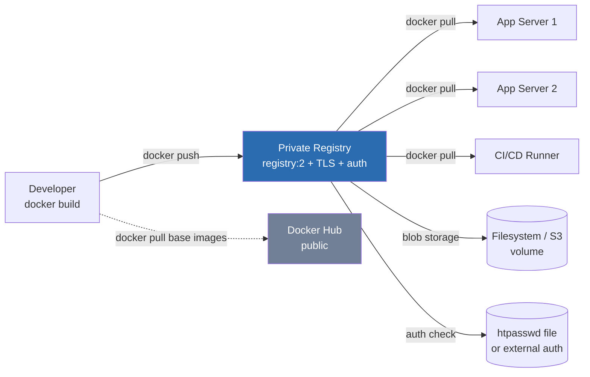

# Docker Registry

## Overview

A registry is the storage-and-distribution layer for container images — Docker Hub is the public default, but production environments typically run a self-hosted registry (`registry:2`, Harbor, or a cloud provider's ECR/ACR/GCR) to keep proprietary images off the internet and under access control. Images built from a [Docker-Images-and-Dockerfile](Docker-Images-and-Dockerfile.md) are pushed to a registry by tag or digest, then pulled onto any host that needs to run them; the registry sits alongside the hardening practices in [Container-Security-Hardening](Container-Security-Hardening.md) as the gatekeeper for what code ever reaches a container runtime. This note covers Docker Hub basics, standing up a private `registry:2` with TLS and authentication, and the tag-vs-digest distinction that matters for reproducible deployments.

> [!IMPORTANT]
> Never run a registry over plain HTTP on anything but `localhost`. Docker's client refuses to push/pull from an "insecure registry" over HTTP unless you explicitly whitelist it in `daemon.json` — treat needing that whitelist as a sign your TLS setup isn't done yet, not as a shortcut to take in production.

## Concepts

| Term | Meaning |
|---|---|
| Registry | A service that stores and serves container images via the OCI Distribution / Docker Registry HTTP API v2 |
| Repository | A named collection of an image's tags, e.g. `myapp` or `library/nginx` |
| Tag | A mutable, human-readable pointer to an image, e.g. `myapp:1.4`, `myapp:latest` |
| Digest | An immutable SHA-256 content hash of the image manifest, e.g. `myapp@sha256:abc123…` |
| Manifest | JSON document describing an image's layers, config, and (for multi-arch) a manifest list/index |
| Namespace | Prefix grouping images by user/org, e.g. `docker.io/library/`, `myregistry.example.com/team/` |
| Blob | A layer or config object stored content-addressably inside the registry |

Registries implement the same wire protocol whether they're Docker Hub, `registry:2`, Harbor, Quay, or a cloud registry — this is why `docker login`, `docker push`, and `docker pull` work identically against all of them once you point at the right hostname.

## Architecture



A typical flow: base images come from Docker Hub, get built into an application image, pushed to the private registry, and pulled by every host or CI runner that needs to run it. The registry itself is just a container (or a managed service) backed by persistent storage and an auth layer in front of it.

## Installation

### Debian/Ubuntu and RHEL/Fedora — identical (registry runs as a container)

```bash
# Docker Engine must already be installed; the registry itself is just an image
docker --version

# Create a working directory for certs, auth, and data
sudo mkdir -p /opt/registry/{certs,auth,data}
```

Because the registry runs inside a container, the host distro (RHEL-family vs Debian-family) only matters for the Docker Engine install and firewall step — the registry setup itself is distro-agnostic.

## Configuration

### 1. Generate a TLS certificate

Use a real CA-signed cert in production (Let's Encrypt via certbot, or an internal PKI). For lab/self-signed testing:

```bash
sudo openssl req -newkey rsa:4096 -nodes -sha256 \
  -keyout /opt/registry/certs/domain.key \
  -x509 -days 365 \
  -out /opt/registry/certs/domain.crt \
  -subj "/CN=registry.example.com" \
  -addext "subjectAltName=DNS:registry.example.com"
```

If self-signed, every client that pulls from this registry must trust the cert:

```bash
# Debian/Ubuntu
sudo cp /opt/registry/certs/domain.crt /usr/local/share/ca-certificates/registry.crt
sudo update-ca-certificates

# RHEL/Fedora
sudo cp /opt/registry/certs/domain.crt /etc/pki/ca-trust/source/anchors/registry.crt
sudo update-ca-trust
```

### 2. Create basic-auth credentials

```bash
sudo apt install -y apache2-utils        # Debian/Ubuntu (provides htpasswd)
sudo dnf install -y httpd-tools          # RHEL/Fedora  (provides htpasswd)

docker run --rm --entrypoint htpasswd httpd:2.4 \
  -Bbn deploy 'ChangeMeStrongPassphrase!' > /opt/registry/auth/htpasswd
```

`-B` forces bcrypt hashing — required, since the registry rejects weaker htpasswd hash types.

### 3. Run the registry with TLS + auth

```bash
docker run -d \
  --name registry \
  --restart=always \
  -p 443:443 \
  -v /opt/registry/data:/var/lib/registry \
  -v /opt/registry/certs:/certs \
  -v /opt/registry/auth:/auth \
  -e REGISTRY_HTTP_ADDR=0.0.0.0:443 \
  -e REGISTRY_HTTP_TLS_CERTIFICATE=/certs/domain.crt \
  -e REGISTRY_HTTP_TLS_KEY=/certs/domain.key \
  -e REGISTRY_AUTH=htpasswd \
  -e REGISTRY_AUTH_HTPASSWD_REALM="Registry Realm" \
  -e REGISTRY_AUTH_HTPASSWD_PATH=/auth/htpasswd \
  registry:2
```

### 4. Open the firewall port

```bash
# RHEL/Fedora — firewalld
sudo firewall-cmd --permanent --add-port=443/tcp
sudo firewall-cmd --reload

# Debian/Ubuntu — ufw
sudo ufw allow 443/tcp
```

### Docker Compose equivalent

```yaml
services:
  registry:
    image: registry:2
    container_name: registry
    restart: always
    ports:
      - "443:443"
    volumes:
      - ./data:/var/lib/registry
      - ./certs:/certs
      - ./auth:/auth
    environment:
      REGISTRY_HTTP_ADDR: 0.0.0.0:443
      REGISTRY_HTTP_TLS_CERTIFICATE: /certs/domain.crt
      REGISTRY_HTTP_TLS_KEY: /certs/domain.key
      REGISTRY_AUTH: htpasswd
      REGISTRY_AUTH_HTPASSWD_REALM: "Registry Realm"
      REGISTRY_AUTH_HTPASSWD_PATH: /auth/htpasswd
```

## Commands

| Command | Purpose |
|---|---|
| `docker login [registry]` | Authenticate; omit registry for Docker Hub |
| `docker logout [registry]` | Remove stored credentials for a registry |
| `docker tag <src> <dst>` | Create a new tag pointing at the same image ID |
| `docker push <image>:<tag>` | Upload an image to a registry |
| `docker pull <image>:<tag>` | Download an image from a registry |
| `docker pull <image>@sha256:<digest>` | Pull an exact, immutable image by digest |
| `docker inspect --format='{{.RepoDigests}}' <image>` | Show the digest of a locally pulled image |
| `docker manifest inspect <image>:<tag>` | Inspect a remote manifest without pulling |
| `docker image ls --digests` | List local images with their digests |
| `docker rmi <image>` | Remove a local image |

## Examples

### Docker Hub — login, tag, push

```bash
docker login -u myuser
# Password: <enter or pipe from a secrets manager>

docker build -t myapp:1.4 .
docker tag myapp:1.4 myuser/myapp:1.4
docker push myuser/myapp:1.4
```

### Private registry — login, tag, push, pull

```bash
docker login registry.example.com
docker tag myapp:1.4 registry.example.com/team/myapp:1.4
docker push registry.example.com/team/myapp:1.4

# On another host
docker pull registry.example.com/team/myapp:1.4
```

### Pin a deployment to a digest instead of a tag

Tags like `:latest` or `:1.4` are mutable — someone can push a new image under the same tag. Digests are content-addressed and never change:

```bash
docker pull registry.example.com/team/myapp@sha256:9f3a1c2e0b7d...

# In a Compose file or Kubernetes manifest, prefer:
image: registry.example.com/team/myapp@sha256:9f3a1c2e0b7d...
```

### Store credentials securely instead of interactively

```bash
echo "$REGISTRY_PASSWORD" | docker login registry.example.com -u deploy --password-stdin
```

> [!TIP]
> Use `--password-stdin` in scripts and CI pipelines — passing `-p <password>` on the command line leaks the secret into shell history and `ps` output.

> [!NOTE]
> **📸 Screenshot**
> _Capture: a terminal showing `docker login registry.example.com`, `docker push`, and `docker manifest inspect` output side by side, demonstrating a successful authenticated push and the resulting digest._

## Best Practices

- Tag images with a meaningful, immutable scheme (semver, git SHA) — reserve `:latest` for local dev only, never for deployments.
- Deploy from digests (`@sha256:...`) in production manifests so what runs is byte-for-byte what was tested.
- Run a garbage-collection pass periodically to reclaim space from untagged blobs:
  ```bash
  docker exec registry bin/registry garbage-collect /etc/docker/registry/config.yml
  ```
- Put the registry behind a reverse proxy (nginx/Traefik) for rate limiting, request logging, and easier cert renewal via Let's Encrypt.
- Enable image scanning (Trivy, Docker Scout, Clair, or Harbor's built-in scanner) as part of the push pipeline, not as an afterthought.
- Replicate or back up the registry's storage volume — losing it means losing every image that isn't also cached on a running host.

## Security Considerations

- **TLS is mandatory** — CIS Docker Benchmark and NIST SP 800-190 both require encrypted transport for registry traffic; never add a production registry to `insecure-registries` in `daemon.json`.
- **Strong authentication** — basic auth with bcrypt is a minimum; prefer a real identity provider (LDAP/OIDC via Harbor) or token-based auth for anything beyond a small team.
- **Least-privilege repository access** — use per-project robot accounts / read-only pull tokens for CI and deployment hosts rather than sharing admin credentials.
- **Content trust / image signing** — enable Docker Content Trust (`DOCKER_CONTENT_TRUST=1`) or Notary/Sigstore/cosign so pulls verify a cryptographic signature, not just a hostname.
- **Vulnerability scanning gate** — reject pushes of images with known critical CVEs; integrate scanning into the CI push step.
- **Network exposure** — place the registry behind a VPN or internal network ACL; do not expose the push API to the public internet unless it must serve external consumers.
- **Audit logging** — capture registry access logs (who pulled/pushed what, when) and ship them to central logging for incident response.
- **Immutable tags** — where the registry implementation supports it (Harbor, ECR), enable tag immutability to prevent a compromised or careless push from silently replacing a production tag.

## Troubleshooting

| Symptom | Likely Cause | Fix |
|---|---|---|
| `x509: certificate signed by unknown authority` | Client doesn't trust the registry's cert | Import cert into system CA trust store (`update-ca-certificates` / `update-ca-trust`) and restart Docker |
| `http: server gave HTTP response to HTTPS client` | Registry running plain HTTP, client expects TLS | Fix registry TLS config, or add to `insecure-registries` only for isolated lab use |
| `unauthorized: authentication required` | Not logged in, or wrong credentials/realm | `docker login registry.example.com` again; verify htpasswd entry with `htpasswd -v` |
| `denied: requested access to the resource is denied` | Authenticated but lacking push/pull rights on that repo | Check registry's authorization/RBAC config (Harbor projects, token scopes) |
| Push hangs or times out on large layers | MTU/proxy issue or registry behind an underpowered reverse proxy | Check reverse proxy `client_max_body_size` (nginx) and network MTU |
| Registry disk filling up | Old layers never garbage-collected | Run `registry garbage-collect`, or set retention/replication policy in Harbor |
| `manifest unknown` on pull | Tag doesn't exist yet, or wrong repository path/case | Confirm exact tag with `docker manifest inspect` against the registry catalog API (`GET /v2/_catalog`) |

## References

- Docker Docs — Deploy a registry server: https://docs.docker.com/registry/deploying/
- Docker Docs — Registry configuration reference: https://docs.docker.com/registry/configuration/
- OCI Distribution Specification: https://github.com/opencontainers/distribution-spec
- `docker-login(1)`, `docker-push(1)`, `docker-pull(1)`, `docker-tag(1)` man pages
- CIS Docker Benchmark, Section 5 (Container Runtime) and Section 2 (Docker Daemon Configuration)
- NIST SP 800-190, Application Container Security Guide

## Related Notes

- [Docker-Images-and-Dockerfile](Docker-Images-and-Dockerfile.md) — building the images this note pushes and pulls
- [Container-Security-Hardening](Container-Security-Hardening.md) — scanning, signing, and runtime hardening for registry-sourced images
- [Linux Administration & Server Hardening](../Readme.md) — course hub and map of content
