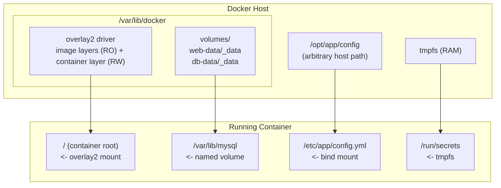

# Docker Volumes and Storage

## Overview

Every container's writable layer disappears the moment `docker rm` runs, so any data that must outlive a container — databases, uploaded files, TLS certificates — has to live outside that layer. Docker gives three mechanisms for this: named volumes, bind mounts, and `tmpfs` mounts, each with different lifecycle, portability, and performance trade-offs. Understanding these alongside the `overlay2` storage driver that backs the container filesystem itself is essential before moving on to [Docker-Containers-Lifecycle](Docker-Containers-Lifecycle.md) or orchestrating multi-container persistence with [Docker-Compose](Docker-Compose.md).

> [!IMPORTANT]
> **Mental model**
> The container's root filesystem (the union of image layers + a thin writable layer) is **ephemeral by design**. Volumes and bind mounts are the only supported ways to persist or share data across container restarts, recreations, and hosts. Never rely on `docker commit` as a backup strategy.

## Concepts

| Mechanism | Managed by | Location | Survives `docker rm`? | Typical use |
|---|---|---|---|---|
| **Named volume** | Docker | `/var/lib/docker/volumes/<name>/_data` | Yes | Databases, app state, anything Docker should own |
| **Anonymous volume** | Docker | Same as named, random hash name | Yes (until pruned) | Implicit `VOLUME` in Dockerfile, throwaway state |
| **Bind mount** | You (host path) | Any host path you specify | Yes (it's just a host directory) | Source code in dev, config files, host log directories |
| **tmpfs mount** | Kernel (RAM) | In-memory, never touches disk | No — gone on container stop | Secrets, caches, PID files that shouldn't be written to disk |

Key distinctions:

- **Named volumes** are fully managed by the Docker daemon. You reference them by name, Docker decides the on-disk path, and a volume driver plugin can back them with NFS, cloud block storage, etc. This is the preferred mechanism in production.
- **Bind mounts** map an exact host path into the container. Docker has no idea what's in it and does no lifecycle management — great for injecting host config or live-reloading source code, risky because the container can write anywhere on the host path you gave it, including following symlinks outside it.
- **tmpfs mounts** exist only in host memory and the kernel page cache; they're wiped when the container stops. Use them for sensitive data you don't want persisted to disk (session tokens, decrypted secrets) or for high-churn temp files.

## Architecture



`overlay2` is the storage driver for the container's *root filesystem* — it stacks read-only image layers under one thin writable layer using the kernel's OverlayFS. Volumes, bind mounts, and tmpfs are separate mount points layered on top of that root filesystem; they bypass overlay2 entirely, which is exactly why they perform better for write-heavy workloads like databases.

## Installation

Verify the storage driver in use (Docker defaults to `overlay2` on any modern kernel with the required filesystem support — ext4 or xfs with `d_type=true`):

```bash
docker info --format '{{.Driver}}'
# overlay2
```

RHEL/CentOS/Rocky note — XFS must be formatted with `ftype=1` for overlay2 to work:

```bash
# Check ftype on an XFS-backed /var/lib/docker
xfs_info /var/lib/docker | grep ftype
# ftype=1   <- required; ftype=0 forces Docker to fall back to a legacy driver
```

Debian/Ubuntu ext4 filesystems support overlay2 out of the box — no extra steps needed.

## Configuration

### Named volumes

```bash
# Create explicitly (optional — Docker auto-creates on first use)
docker volume create db-data

# Attach to a container
docker run -d --name mysql \
  -v db-data:/var/lib/mysql \
  -e MYSQL_ROOT_PASSWORD=changeme \
  mysql:8.0

# Modern --mount syntax (more explicit, preferred in scripts/Compose)
docker run -d --name mysql \
  --mount type=volume,source=db-data,target=/var/lib/mysql \
  -e MYSQL_ROOT_PASSWORD=changeme \
  mysql:8.0
```

### Bind mounts

```bash
docker run -d --name nginx \
  --mount type=bind,source=/opt/site/html,target=/usr/share/nginx/html,readonly \
  nginx:alpine
```

### tmpfs mounts

```bash
docker run -d --name app \
  --mount type=tmpfs,target=/run/secrets,tmpfs-size=64m,tmpfs-mode=1770 \
  myapp:latest
```

### Volume drivers

Docker ships the `local` driver by default. Third-party drivers (installed as plugins) let volumes live on NFS, iSCSI, or cloud block storage so data survives even if the whole host is replaced.

```bash
# NFS-backed volume using only the built-in local driver's options
docker volume create --driver local \
  --opt type=nfs \
  --opt o=addr=10.0.0.5,rw,nfsvers=4 \
  --opt device=:/exports/db-data \
  nfs-db-data

# List installed volume plugins
docker plugin ls
```

## Commands

```bash
docker volume ls                          # list all volumes
docker volume inspect db-data             # show mountpoint, driver, labels
docker volume rm db-data                  # remove an unused volume
docker volume prune                       # remove ALL unused (dangling) volumes
docker volume prune --filter "label!=keep" # prune except labeled volumes

docker system df -v                       # disk usage breakdown incl. volumes

docker inspect --format \
  '{{ range .Mounts }}{{ .Type }} {{ .Source }} -> {{ .Destination }}{{"\n"}}{{ end }}' \
  mysql                                    # list a running container's mounts
```

## Examples

### Backup a named volume to a tar archive

```bash
docker run --rm \
  -v db-data:/source:ro \
  -v "$(pwd)":/backup \
  alpine \
  tar czf /backup/db-data-$(date +%F).tar.gz -C /source .
```

### Restore into a fresh volume

```bash
docker volume create db-data-restored

docker run --rm \
  -v db-data-restored:/target \
  -v "$(pwd)":/backup \
  alpine \
  tar xzf /backup/db-data-2026-07-22.tar.gz -C /target
```

### Compose-defined volumes (portable across RHEL/Debian hosts)

```yaml
services:
  db:
    image: postgres:16
    volumes:
      - db-data:/var/lib/postgresql/data
      - ./init.sql:/docker-entrypoint-initdb.d/init.sql:ro
    tmpfs:
      - /tmp

volumes:
  db-data:
    driver: local
```

> [!TIP]
> **Scheduled backups**
> Wrap the backup command in a cron entry or systemd timer on the host so volume snapshots run automatically — see the general backup patterns covered for [Docker-Compose](Docker-Compose.md) stacks.

## Best Practices

- Prefer **named volumes** over bind mounts for anything Docker should manage long-term (databases, message queues) — they're portable across hosts and easier to back up as a unit.
- Use **bind mounts** only for host-authored input (configs, TLS certs, source code in dev) — never as a general persistence mechanism for app-generated data.
- Mount volumes **read-only** (`:ro`) wherever the container only needs to read (config files, static assets).
- Label volumes (`docker volume create --label`) so `prune` filters and backup scripts can target them selectively.
- Never store databases on bind-mounted network filesystems without verifying file-locking semantics — many DBs (SQLite, some MySQL configs) corrupt data on NFS without proper locking support.
- Keep `/var/lib/docker` on its own filesystem/LVM volume in production so image/container growth can't fill the root partition.

## Security Considerations

- CIS Docker Benchmark 5.x recommends **not mounting sensitive host directories** (`/`, `/etc`, `/boot`, the Docker socket `/var/run/docker.sock`) into containers — a bind-mounted docker socket grants root-equivalent host access.
- Bind mounts inherit the **host's file permissions and SELinux/AppArmor context**; on SELinux systems (RHEL family) add `:z` or `:Z` to relabel content for container access instead of disabling enforcement:
  ```bash
  docker run -v /opt/data:/data:Z myapp:latest
  ```
- Use `tmpfs` for secrets and short-lived sensitive data so nothing sensitive is ever written to persistent disk or included in a volume backup.
- Set `tmpfs-mode` and volume-mount ownership deliberately — default root ownership inside a container mount can leak into a host bind-mount path if the container runs as root without a `USER` directive.
- Encrypt volume backups at rest (`gpg`, `age`, or an encrypted destination bucket) since a tarball of a database volume is a full data dump.
- Run `docker volume prune` cautiously in production — it silently deletes any volume not currently referenced by a container, which can destroy data from stopped-but-not-deleted stacks. Always inspect the affected list with `docker volume ls -f dangling=true` first.

> [!WARNING]
> **Anonymous volume leaks**
> Containers built from images with a Dockerfile `VOLUME` instruction create an anonymous volume on every `docker run` if you don't bind it explicitly. Over time these accumulate as orphaned volumes consuming disk — audit with `docker volume ls -f dangling=true` regularly.

> [!NOTE]
> **📸 Screenshot**
> _Capture: output of `docker system df -v` showing the volumes table with reclaimable space, alongside `docker volume ls -f dangling=true` listing orphaned anonymous volumes._

## Troubleshooting

| Symptom | Likely cause | Fix |
|---|---|---|
| `Error response from daemon: error while creating mount source path` | Bind-mount host path doesn't exist | Create the directory on the host before `docker run`, or use `--mount` (fails loudly) instead of `-v` (auto-creates silently) |
| Container writes are invisible on the host bind mount | SELinux denial (RHEL family) | Add `:Z`/`:z` suffix, or check `ausearch -m avc -ts recent` |
| `overlay2` reports "no space left on device" but `df` shows free space | Inode exhaustion, or Docker's data root on a full partition | `df -i /var/lib/docker`; consider moving `data-root` in `/etc/docker/daemon.json` |
| Data vanished after container restart | Data was written to the container's writable layer, not a mounted volume | Re-check the Dockerfile/Compose file for a missing `volumes:`/`-v` entry on that path |
| Volume backup tar is empty | Backed up the wrong mountpoint or volume was never populated (container never started) | `docker volume inspect` to confirm `Mountpoint`, verify container actually wrote data first |
| Slow database performance inside container | Bind mount from a slow network filesystem, or overlay2 metadata overhead | Move DB storage to a named volume on local disk backed by ext4/xfs |

## References

- Docker Docs — [Manage data in Docker](https://docs.docker.com/storage/)
- Docker Docs — [Volumes](https://docs.docker.com/storage/volumes/)
- Docker Docs — [Bind mounts](https://docs.docker.com/storage/bind-mounts/)
- Docker Docs — [tmpfs mounts](https://docs.docker.com/storage/tmpfs/)
- Docker Docs — [overlay2 storage driver](https://docs.docker.com/storage/storagedriver/overlayfs-driver/)
- CIS Docker Benchmark — Section 5: Container Runtime (volume and mount restrictions)
- `man docker-volume`, `man docker-run` (Mount and Volume sections)

## Related Notes

- [Docker-Containers-Lifecycle](Docker-Containers-Lifecycle.md) — container create/start/stop/rm lifecycle these volumes attach across
- [Docker-Compose](Docker-Compose.md) — declaring volumes, tmpfs, and bind mounts at the stack level
- [Linux Administration & Server Hardening](../Readme.md) — course hub and map of content
