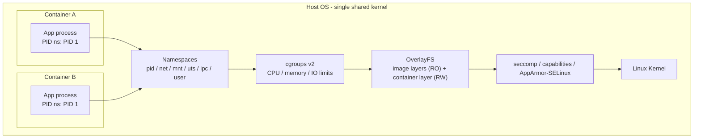
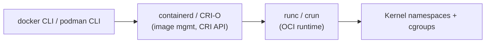

# Introduction to Containers

## Overview

Containers package an application with its dependencies into a single, portable unit that shares the host kernel instead of virtualizing hardware, which makes them dramatically lighter and faster to start than traditional virtual machines. This note lays the conceptual groundwork — namespaces, cgroups, union filesystems, the OCI standard, and the runtime landscape — before you install a runtime in [Docker-Engine-Installation](Docker-Engine-Installation.md) or compare the lighter-weight system-container approach in [LXC-Linux-Containers](../Virtualization/LXC-Linux-Containers.md). Understanding *why* containers are isolated the way they are is essential for hardening them later: every escape technique and every mitigation in this course maps back to one of the kernel primitives described here.

> [!IMPORTANT]
> A container is **not** a lightweight VM. It is one or more host processes wrapped in kernel namespaces and constrained by cgroups. If the kernel has a vulnerability or is misconfigured, container isolation can be bypassed entirely — unlike a VM, which is isolated by a hypervisor enforcing hardware-level boundaries.

## Concepts

**Image vs. container**

- An **image** is an immutable, read-only template: a filesystem snapshot plus metadata (entrypoint, exposed ports, env vars, labels) describing how to run it. Images are built in layers and stored in a registry (Docker Hub, Quay, a private registry, GHCR).
- A **container** is a running (or stopped) *instance* of an image: the image's read-only layers plus one thin writable layer on top, wrapped in namespaces/cgroups. Many containers can run from the same image simultaneously, each with its own writable layer and isolated view of the system.

This is the same relationship as a class and an object, or a `.iso` and a running VM — except the container shares the host's kernel rather than booting its own.

**OCI — Open Container Initiative**

The OCI (hosted by the Linux Foundation) defines vendor-neutral specs so that images and runtimes are interchangeable:

| Spec | Defines |
|---|---|
| **image-spec** | Layout of an image: layer tarballs, config JSON, manifest, digests |
| **runtime-spec** | How a compliant runtime unpacks a "bundle" (rootfs + `config.json`) and executes it as a container |
| **distribution-spec** | The HTTP API a registry must implement (push/pull, `/v2/` endpoints) |

Because of OCI, an image built by `docker build`, `podman build`, or `buildah` can be run by any OCI-compliant runtime (runc, crun, gVisor, Kata) — there is no vendor lock-in at the image layer.

## Architecture

Four Linux kernel primitives make containers possible. None of them were designed "for containers" — Docker (2013) simply combined pre-existing kernel features.

| Primitive | Purpose | Kernel mechanism |
|---|---|---|
| **Namespaces** | Isolate *what a process can see* | `pid`, `net`, `mnt`, `uts`, `ipc`, `user`, `cgroup` namespaces |
| **cgroups (v2)** | Limit *what a process can consume* | CPU, memory, I/O, PID count accounting/throttling |
| **Union/overlay filesystem** | Layer read-only image data with a writable diff | `overlayfs` (lowerdir/upperdir/merged) |
| **Capabilities + seccomp + LSM** | Restrict *what a process is allowed to do* even as root-in-container | Linux capabilities, seccomp-bpf, AppArmor/SELinux |



**Namespaces** give each container its own view of PIDs, network interfaces, mount points, hostname, IPC objects, and (with user namespaces) UID/GID mappings — a process with UID 0 inside the container can map to an unprivileged UID on the host.

**cgroups v2** (the unified hierarchy, default on RHEL 9+/Debian 11+/Ubuntu 22.04+) enforce resource ceilings so one container cannot starve others — this is what `docker run --memory` and `--cpus` configure under the hood.

**OverlayFS** stacks image layers: each `RUN`/`COPY` instruction in a Dockerfile becomes an immutable layer; the running container gets one writable layer on top. This is why containers start in milliseconds — no filesystem copy is needed, only a new overlay mount — and why deleting a container discards unsaved writable-layer data.

## Containers vs. Virtual Machines

| Aspect | Containers | Virtual Machines |
|---|---|---|
| Isolation boundary | Linux kernel (namespaces/cgroups) | Hypervisor (KVM, ESXi, Hyper-V) |
| Kernel | Shared with host | Own kernel per VM |
| Startup time | Milliseconds–seconds | Tens of seconds–minutes |
| Typical image size | MBs–low hundreds of MBs | GBs |
| Density per host | Dozens–hundreds | Single digits–tens |
| OS flexibility | Must match host kernel (Linux-on-Linux) | Any guest OS |
| Attack surface if compromised | Shared kernel = higher blast-radius risk | Hypervisor escape required = smaller blast radius |
| Typical use case | Microservices, CI/CD, stateless apps | Full OS isolation, legacy apps, multi-tenant hosting |

> [!TIP]
> They are complementary, not competing: most production clusters (EKS, GKE, OpenShift) run containers **inside** VMs, getting the hypervisor's hard security boundary around the host plus the container's density and packaging benefits.

## Container Runtime Landscape

| Layer | Tool(s) | Role |
|---|---|---|
| High-level runtime / CLI | Docker Engine, Podman, nerdctl | User-facing CLI, image build, networking, volumes |
| Container engine daemon | `dockerd`, `containerd`, CRI-O | Image pull, storage, lifecycle management via CRI (for Kubernetes) |
| Low-level (OCI) runtime | `runc`, `crun` | Actually creates namespaces/cgroups and `exec`s the process |
| Sandboxed/hardened runtime | `gVisor` (`runsc`), `Kata Containers` | Adds a userspace kernel or lightweight VM layer for stronger isolation |
| System containers | LXC/LXD | Boots a full init system per container — see [LXC-Linux-Containers](../Virtualization/LXC-Linux-Containers.md) |



**Docker** popularized the daemon-based model (`dockerd` running as root, single point of control). **Podman** is daemonless and rootless-by-default, talking directly to `runc`/`crun` per container — a meaningful security improvement covered in [Docker-Engine-Installation](Docker-Engine-Installation.md). **CRI-O** and `containerd` are the runtimes Kubernetes actually uses via the Container Runtime Interface (CRI); Docker itself is no longer used as a Kubernetes runtime (`dockershim` was removed in Kubernetes 1.24).

## Commands

Quick checks to see these primitives in action (safe to run once a runtime is installed):

```bash
# Verify cgroup version in use
mount | grep cgroup2

# List namespaces a running process belongs to
ls -l /proc/<PID>/ns/

# Inspect an image's OCI-compliant manifest
docker inspect --format='{{json .RootFS}}' <image> | jq

# View the overlay mounts backing a running container
mount | grep overlay

# Show a container's cgroup resource limits (Docker)
docker inspect --format='{{.HostConfig.Memory}} {{.HostConfig.NanoCpus}}' <container>

# Same idea with Podman (daemonless, rootless by default)
podman inspect --format='{{.HostConfig.Memory}}' <container>
```

## Best Practices

- Prefer **rootless** container execution (Podman by default, Docker with `dockerd-rootless.sh`) so a container escape does not hand the attacker host root.
- Pin images by **digest** (`image@sha256:...`), not just a mutable `:latest` tag, for reproducible and auditable deployments.
- Keep images minimal (distroless, `-slim`, or Alpine bases) to shrink the attack surface and image size.
- Treat the writable container layer as ephemeral — persist real data in named volumes or bind mounts, never inside the container layer.
- Scan images for CVEs (`trivy`, `grype`, Docker Scout) as part of CI before they reach a registry.

## Security Considerations

Aligning with CIS Docker/Kubernetes Benchmark themes:

- **Namespaces are not a complete security boundary.** A container running as UID 0 without a remapped user namespace is still root with respect to unmapped kernel resources (e.g., unpatched kernel CVEs, `/proc`, some device nodes). Enable `userns-remap` (Docker) or rely on Podman's default rootless user namespaces.
- **Drop Linux capabilities** you don't need: `docker run --cap-drop=ALL --cap-add=NET_BIND_SERVICE ...` rather than running with the full default capability set.
- **Apply seccomp and AppArmor/SELinux profiles** — Docker's default seccomp profile already blocks ~44 dangerous syscalls (e.g., `clone` with certain flags, `mount`); do not run with `--security-opt seccomp=unconfined` in production.
- **Never mount `/var/run/docker.sock` into a container** — it is equivalent to granting root on the host.
- **Set resource limits** (`--memory`, `--cpus`, `--pids-limit`) to blunt fork-bomb and resource-exhaustion attacks from a compromised container.
- **Keep the host kernel patched.** Because the kernel is the shared isolation boundary, an unpatched kernel LPE (e.g., a namespace or cgroup escape CVE) undermines every container on the host simultaneously — this is the single biggest structural difference from VM isolation.

> [!WARNING]
> Running a container with `--privileged` disables nearly all of the above isolation (all capabilities, no seccomp, device access) and should be treated as equivalent to giving the workload root on the bare host. Avoid it outside of trusted CI/build scenarios.

> [!NOTE]
> **📸 Screenshot**
> _Capture: `docker inspect --format='{{json .HostConfig}}' <container> | jq` output showing CapAdd/CapDrop, SecurityOpt, and resource limit fields for a hardened vs. default container, side by side._

## Troubleshooting

| Symptom | Likely cause | Check |
|---|---|---|
| `docker: permission denied` on socket | User not in `docker` group / rootless not configured | `groups $USER`; consider Podman rootless instead of adding users to `docker` group (root-equivalent) |
| Container exits immediately | Entrypoint process (PID 1) exited; containers don't stay alive without a foreground process | `docker logs <container>`; check `CMD`/`ENTRYPOINT` |
| "No space left on device" despite free disk | Overlay layers or dangling images/volumes accumulating | `docker system df`; `docker system prune` |
| Container can't reach network | Wrong network namespace/driver, or host firewall (firewalld/ufw) blocking the bridge | `docker network inspect bridge`; check `iptables`/`nft` rules |
| `cgroup: cgroup2` mount errors on older distros | Host still on cgroup v1 hybrid mode | `cat /sys/fs/cgroup/cgroup.controllers` (empty = not v2) |

## References

- Open Container Initiative specifications: https://github.com/opencontainers
- Docker Docs — "What is a Container?": https://docs.docker.com/guides/docker-concepts/the-basics/what-is-a-container/
- `man 7 namespaces`, `man 7 cgroups`, `man 7 capabilities`
- CIS Docker Benchmark (Center for Internet Security)
- Kubernetes docs — Container Runtime Interface (CRI): https://kubernetes.io/docs/concepts/architecture/cri/

## Related Notes

- [Docker-Engine-Installation](Docker-Engine-Installation.md) — installing and configuring the Docker Engine runtime
- [LXC-Linux-Containers](../Virtualization/LXC-Linux-Containers.md) — system-container alternative to application containers
- [Linux Administration & Server Hardening](../Readme.md) — course hub and map of content
