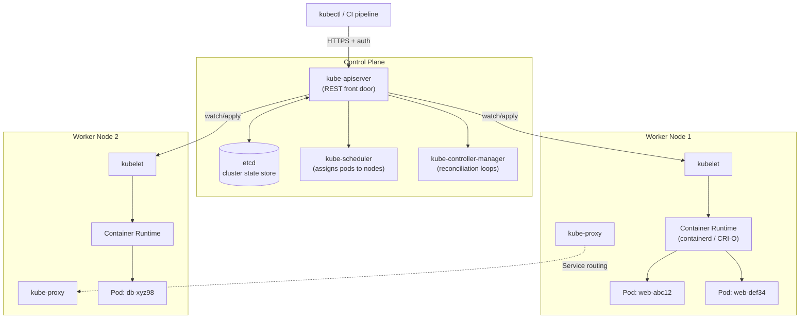

# Kubernetes Basics

## Overview

Kubernetes (K8s) is a container orchestration platform that schedules, scales, and heals containerized workloads across a cluster of machines, picking up where a single-host tool like [Docker-Compose](Docker-Compose.md) runs out of road. Where Compose describes "these containers on this box," Kubernetes describes a *desired state* — replica counts, resource limits, network exposure — and continuously reconciles the running cluster toward it, restarting failed pods and rescheduling them onto healthy nodes. It works with any OCI-compliant runtime, including [Podman](Podman.md) via CRI-O, so the container images built in earlier modules carry over unchanged. This note covers cluster architecture, the core object model (pods/deployments/services), everyday `kubectl` usage, and the local lab tools (minikube, kind) used to practice before touching a production cluster.

> [!IMPORTANT]
> **Kubernetes is an orchestrator, not a container runtime**
> Kubernetes never runs containers directly — it delegates to a **Container Runtime Interface (CRI)** implementation (containerd or CRI-O) on each node. Learning K8s does not replace learning Docker/Podman fundamentals; it sits on top of them.

## Concepts

| Term | Definition |
|---|---|
| **Pod** | Smallest deployable unit — one or more containers sharing a network namespace and storage volumes. Containers in a pod share `localhost`. |
| **Deployment** | Manages a set of identical pod replicas via a ReplicaSet; handles rolling updates and rollbacks. |
| **Service** | Stable virtual IP + DNS name that load-balances traffic to a dynamic set of pods (pods are ephemeral; Services are not). |
| **Namespace** | Logical partition of a cluster for multi-tenancy (`default`, `kube-system`, custom). |
| **ConfigMap / Secret** | Externalized configuration and sensitive data injected into pods as env vars or mounted files. |
| **Ingress** | HTTP(S) routing rules exposing Services outside the cluster, typically via an Ingress controller (NGINX, Traefik). |
| **PersistentVolume (PV) / PersistentVolumeClaim (PVC)** | Cluster-managed storage abstraction decoupling pods from the underlying disk/CSI driver. |
| **Label / Selector** | Key-value tags on objects (`app: web`) used by Services and Deployments to identify which pods they target. |
| **kubelet** | Node agent that registers the node and runs pods per instructions from the control plane. |
| **etcd** | Distributed key-value store holding the entire cluster state — the single source of truth. |

## Architecture

Every cluster splits into a **control plane** (the brain) and one or more **worker nodes** (where workloads actually run). In managed clusters (EKS, GKE, AKS) the control plane is hidden from the operator; in self-managed and lab clusters you see and configure it directly.



**Control plane components:**

- **kube-apiserver** — the only component that talks to `etcd` directly; validates and processes all REST requests (from `kubectl`, controllers, and kubelets alike).
- **etcd** — must be backed up and secured; anyone with `etcd` access effectively has root over the cluster.
- **kube-scheduler** — binds unscheduled pods to nodes based on resource requests, taints/tolerations, and affinity rules.
- **kube-controller-manager** — runs reconciliation loops (Deployment controller, Node controller, etc.) that continuously drive actual state toward desired state.

**Node components:**

- **kubelet** — talks to the API server, ensures the containers described in its assigned PodSpecs are running and healthy.
- **kube-proxy** — programs `iptables`/`IPVS` rules on each node to implement Service virtual IPs.
- **Container runtime** — containerd or CRI-O, invoked through the CRI; this is where Podman/Docker-built OCI images actually get pulled and run.

## Installation

Production clusters are provisioned with `kubeadm`, a managed cloud service, or tools like Terraform/Ansible — out of scope here. For learning and local development, use **minikube** or **kind**, both of which run a full single- or multi-node cluster inside containers/VMs on your workstation.

```bash
# --- minikube (single VM/container acting as one node, driver-flexible) ---
# RHEL/Fedora
sudo dnf install -y conntrack
curl -LO https://storage.googleapis.com/minikube/releases/latest/minikube-linux-amd64
sudo install minikube-linux-amd64 /usr/local/bin/minikube

# Debian/Ubuntu
sudo apt update && sudo apt install -y conntrack
curl -LO https://storage.googleapis.com/minikube/releases/latest/minikube-linux-amd64
sudo install minikube-linux-amd64 /usr/local/bin/minikube

minikube start --driver=docker      # or --driver=podman
minikube status
```

```bash
# --- kind (Kubernetes IN Docker — spins up nodes as containers, fast + CI-friendly) ---
curl -Lo ./kind https://kind.sigs.k8s.io/dl/latest/kind-linux-amd64
chmod +x ./kind && sudo mv ./kind /usr/local/bin/kind

kind create cluster --name lab
kind get clusters
```

```bash
# --- kubectl CLI (needed regardless of which lab tool you pick) ---
curl -LO "https://dl.k8s.io/release/$(curl -L -s https://dl.k8s.io/release/stable.txt)/bin/linux/amd64/kubectl"
sudo install -o root -g root -m 0755 kubectl /usr/local/bin/kubectl
kubectl version --client
```

> [!TIP]
> **minikube vs kind**
> Use **minikube** when you want addon parity with a real cluster (dashboard, ingress, metrics-server, LoadBalancer emulation via `minikube tunnel`). Use **kind** when you want fast, disposable, multi-node clusters for CI pipelines or testing Kubernetes manifests themselves — it starts in seconds and is the tool the upstream Kubernetes project itself uses for conformance testing.

## Configuration

Kubernetes objects are declared as YAML manifests applied against the API server. A minimal Deployment + Service pair:

```yaml
# deployment.yaml
apiVersion: apps/v1
kind: Deployment
metadata:
  name: web
  labels:
    app: web
spec:
  replicas: 3
  selector:
    matchLabels:
      app: web
  template:
    metadata:
      labels:
        app: web
    spec:
      containers:
        - name: web
          image: nginx:1.27-alpine
          ports:
            - containerPort: 80
          resources:
            requests:
              cpu: "100m"
              memory: "64Mi"
            limits:
              cpu: "250m"
              memory: "128Mi"
          readinessProbe:
            httpGet:
              path: /
              port: 80
            initialDelaySeconds: 3
```

```yaml
# service.yaml
apiVersion: v1
kind: Service
metadata:
  name: web-svc
spec:
  selector:
    app: web        # routes to any pod carrying this label
  ports:
    - port: 80
      targetPort: 80
  type: ClusterIP    # NodePort / LoadBalancer for external access
```

Your `kubeconfig` (`~/.kube/config`) holds cluster endpoints and auth credentials; `minikube start` and `kind create cluster` both write to it automatically and switch your current context.

## Commands

| Command | Purpose |
|---|---|
| `kubectl get pods -A` | List pods across all namespaces |
| `kubectl apply -f deployment.yaml` | Create/update objects from a manifest (declarative) |
| `kubectl delete -f deployment.yaml` | Remove objects defined in a manifest |
| `kubectl get deploy,svc,pods -o wide` | Wide-format status of common object types |
| `kubectl describe pod <name>` | Full event history and status — first stop for debugging |
| `kubectl logs <pod> -f` | Stream a container's stdout/stderr |
| `kubectl logs <pod> -c <container>` | Logs from a specific container in a multi-container pod |
| `kubectl exec -it <pod> -- /bin/sh` | Interactive shell inside a running container |
| `kubectl scale deploy/web --replicas=5` | Imperative scaling |
| `kubectl rollout status deploy/web` | Watch a rolling update progress |
| `kubectl rollout undo deploy/web` | Roll back to the previous ReplicaSet |
| `kubectl port-forward svc/web-svc 8080:80` | Tunnel a local port into the cluster for quick testing |
| `kubectl get events --sort-by=.metadata.creationTimestamp` | Chronological cluster events, useful for scheduling failures |
| `kubectl config get-contexts` / `use-context <ctx>` | List/switch between cluster contexts |
| `kubectl top pods` | Live CPU/memory usage (requires metrics-server) |

## Examples

```bash
# Full lab loop: create cluster, deploy, expose, test, tear down
kind create cluster --name demo
kubectl apply -f deployment.yaml
kubectl apply -f service.yaml

kubectl get pods -w                       # watch pods reach Running
kubectl port-forward svc/web-svc 8080:80 &
curl -s http://localhost:8080 | head -n5   # nginx welcome page

kubectl scale deploy/web --replicas=5
kubectl rollout status deploy/web

kind delete cluster --name demo
```

```bash
# Debugging a CrashLoopBackOff
kubectl get pods                          # spot the failing pod
kubectl describe pod <pod>                # check Events section for root cause
kubectl logs <pod> --previous             # logs from the crashed instance
```

## Best Practices

- **Set resource `requests` and `limits`** on every container — an unbounded pod can starve its node and trigger OOM kills for neighbors.
- **Use readiness/liveness probes** so Services never route traffic to a pod that isn't actually ready, and kubelet restarts pods that hang.
- **Prefer Deployments over bare Pods** in every case except one-off debugging — bare pods are not rescheduled if a node dies.
- **Pin image tags** (`nginx:1.27-alpine`), never `:latest`, for reproducible rollouts and rollbacks.
- **Namespace by environment/team** (`dev`, `staging`, `team-payments`) rather than dumping everything into `default`.
- **Keep manifests in git** and apply via CI (GitOps) rather than ad-hoc `kubectl apply` from a laptop.

## Security Considerations

Aligns with the CIS Kubernetes Benchmark:

- **RBAC everywhere** — disable the legacy `ABAC`/always-allow authorizer; grant `Role`/`ClusterRole` bindings on least privilege, never bind `cluster-admin` to a service account casually (CIS 5.1.x).
- **Restrict the API server** — bind to internal networks only where possible; never expose port `6443` to the public internet without strong auth + network policy.
- **Pod Security Standards** — enforce `restricted` profile via Pod Security Admission: no privileged containers, no host namespaces (`hostNetwork`, `hostPID`), `runAsNonRoot: true`, read-only root filesystem where feasible (CIS 5.2.x).
- **Secrets are base64, not encrypted, by default** — enable encryption-at-rest for `etcd` (`EncryptionConfiguration`) and avoid mounting Secrets as env vars where a file mount limits blast radius from process listing.
- **Network Policies** — Kubernetes has no default pod-to-pod isolation; apply a default-deny `NetworkPolicy` per namespace and explicitly allow required traffic (CIS 5.3.2).
- **Image provenance** — scan images (Trivy, Grype) and restrict `imagePullPolicy` sources to trusted registries via admission control (e.g., `ImagePolicyWebhook` or Kyverno).
- **Audit logging** — enable API server audit logs (`--audit-log-path`) and ship them off-cluster; this is your primary forensic trail for `kubectl` abuse.
- **etcd is the crown jewel** — encrypt data at rest, restrict access to control-plane nodes only, and back it up regularly; anyone who reads `etcd` reads every Secret in the cluster.

> [!WARNING]
> **Secrets are not a vault**
> Kubernetes `Secret` objects are base64-encoded, not encrypted, unless you explicitly configure encryption-at-rest and RBAC-restrict who can `get`/`list` them. Treat them as convenience objects, not a substitute for a real secrets manager (Vault, AWS Secrets Manager) for anything sensitive.

## When to Move from Compose to Kubernetes

| Signal | Stay on Compose | Move to Kubernetes |
|---|---|---|
| Number of hosts | Single host is enough | Multiple hosts, need scheduling across them |
| Scaling needs | Manual `docker compose up --scale` | Automatic scaling, self-healing, rolling updates |
| High availability | Not required / acceptable downtime | Need zero-downtime deploys, multi-replica failover |
| Team size | Solo dev / small team | Multiple teams needing namespace isolation, RBAC |
| Ops complexity budget | Low — want simplicity | Have (or can hire) platform engineering capacity |
| Networking needs | Simple bridge network | Service discovery, Ingress, NetworkPolicy across nodes |

If you only need "run these five containers reliably on one box," Kubernetes is usually over-engineering — the operational overhead (etcd backups, RBAC, upgrades, CNI plugins) is real and ongoing. Reach for it when you need multi-node scheduling, declarative self-healing at scale, or you're already deploying to a managed K8s service (EKS/GKE/AKS) where that overhead is absorbed by the provider.

> [!NOTE]
> **📸 Screenshot**
> _Capture: `kubectl get pods,deploy,svc -o wide` output after `kubectl apply -f deployment.yaml` on a fresh `kind` cluster, showing 3 Running replicas and the ClusterIP Service._

## Troubleshooting

| Symptom | Likely Cause | Fix |
|---|---|---|
| Pod stuck `Pending` | Insufficient node resources or unsatisfied scheduling constraints | `kubectl describe pod <pod>` → check Events for `FailedScheduling` |
| `ImagePullBackOff` | Wrong image name/tag, private registry auth missing | Verify image exists; add `imagePullSecrets` for private registries |
| `CrashLoopBackOff` | App crashes on startup | `kubectl logs <pod> --previous`; check probes are not too aggressive |
| Service has no endpoints | Label selector mismatch between Service and pod | `kubectl get endpoints <svc>`; compare `spec.selector` vs pod labels |
| `kubectl` hangs / connection refused | Wrong context or API server unreachable | `kubectl config current-context`; `kubectl cluster-info` |
| Node `NotReady` | kubelet down or network plugin (CNI) failure | `kubectl describe node <node>`; check kubelet logs on the node |

## References

- Kubernetes official documentation — https://kubernetes.io/docs/home/
- `kubectl` reference — https://kubernetes.io/docs/reference/kubectl/
- minikube docs — https://minikube.sigs.k8s.io/docs/
- kind (Kubernetes IN Docker) — https://kind.sigs.k8s.io/
- CIS Kubernetes Benchmark — https://www.cisecurity.org/benchmark/kubernetes
- Kubernetes Pod Security Standards — https://kubernetes.io/docs/concepts/security/pod-security-standards/

## Related Notes

- [Docker-Compose](Docker-Compose.md) — single-host multi-container orchestration, the natural predecessor to Kubernetes
- [Podman](Podman.md) — daemonless container runtime whose images run unchanged as Kubernetes pods
- [Linux Administration & Server Hardening](../Readme.md) — course hub and map of content
