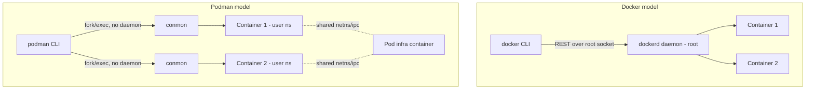

# Podman

## Overview

Podman (Pod Manager) is a daemonless, rootless-by-default container engine that implements the Open Container Initiative (OCI) spec and exposes a command line nearly identical to Docker's, so `alias docker=podman` covers most day-to-day workflows. Unlike Docker, Podman has no long-running background daemon owning every container's process tree — each container is a direct child of the `podman` command (or of `conmon`, its lightweight monitor), which removes a single point of failure and a socket that traditionally required root to reach. Podman also natively understands Kubernetes-style **pods** (shared network/IPC namespace for a group of containers) and integrates directly with `systemd` for unit-managed lifecycle, making it the default container runtime on RHEL 8+, Fedora, and CentOS Stream. See [Buildah](Buildah.md) for the companion image-build tool and [Rootless-Containers](Rootless-Containers.md) for the user-namespace mechanics that make rootless mode secure.

> [!IMPORTANT]
> Podman is not a drop-in binary replacement for Docker under the hood — it is architecturally different (no daemon, fork/exec model, rootless-first). Compatibility is at the **CLI and API** level (Docker-compatible REST socket available via `podman system service`), not at the implementation level. Test Compose files and CI pipelines before assuming 1:1 behavior.

## Concepts

| Concept | Docker | Podman |
|---|---|---|
| Daemon | `dockerd` background process, root-owned socket | None — `podman` is a fork/exec CLI, no persistent daemon |
| Default privilege | Root (daemon runs as root; containers often root inside) | Rootless by default (maps to unprivileged user via user namespaces) |
| Pods | Not native (Compose "services" ≠ shared netns) | Native — a pod is a first-class object sharing network/IPC/UTS namespace |
| systemd integration | Indirect (docker.service manages the daemon) | Direct — containers/pods generate their own systemd units (Quadlet, `generate systemd`) |
| API socket | Unix socket, root-owned by default | Optional Docker-compatible socket per-user via `podman system service` |
| Image build | `docker build` (built into daemon) | Delegated to [Buildah](Buildah.md) (`podman build` calls Buildah's library) |
| Compose | `docker compose` (native plugin) | `podman-compose` or Docker Compose pointed at Podman's socket |

Rootless containers rely on the same building blocks covered in [Rootless-Containers](Rootless-Containers.md): user namespaces, `subuid`/`subgid` ranges, `slirp4netns`/`pasta` for networking, and `fuse-overlayfs` for the storage driver when the kernel overlay driver lacks user-namespace support.

## Architecture



Each Podman container is monitored by a separate `conmon` process, so killing `podman` itself does not kill running containers — they are reparented, unlike a daemon crash in Docker taking every container down with it. A **pod** always contains an invisible "infra" container that holds the shared network namespace; application containers join it.

## Installation

```bash
# RHEL / Fedora / CentOS Stream (podman is default, often preinstalled)
sudo dnf install -y podman podman-compose podman-docker

# Debian / Ubuntu
sudo apt update && sudo apt install -y podman podman-compose

# Verify
podman --version
podman info --format '{{.Host.Security.Rootless}}'
```

`podman-docker` on RHEL provides a `/usr/bin/docker` shim and `docker.service`/`docker.socket` aliases so tools expecting the Docker CLI/socket work unmodified.

## Configuration

Rootless mode needs a subordinate UID/GID range for the user namespace mapping — check/add it before running containers as an unprivileged account:

```bash
# Confirm ranges exist (added automatically for new users by useradd on RHEL/Fedora)
grep "^$(whoami):" /etc/subuid /etc/subgid

# If missing, allocate 65536 IDs starting at 100000
sudo usermod --add-subuids 100000-165535 --add-subgids 100000-165535 "$(whoami)"
```

Key config files (per-user under `~/.config/containers/`, system-wide under `/etc/containers/`):

```ini
; ~/.config/containers/storage.conf
[storage]
driver = "overlay"

[storage.options.overlay]
mount_program = "/usr/bin/fuse-overlayfs"
```

```toml
# ~/.config/containers/containers.conf (excerpt)
[containers]
netns = "slirp4netns"

[engine]
cgroup_manager = "systemd"
```

Enable lingering so rootless containers/systemd user units keep running after logout (required for user-level Quadlet/`generate systemd` units):

```bash
sudo loginctl enable-linger "$(whoami)"
```

## Commands

| Task | Command |
|---|---|
| Run a container | `podman run -d --name web -p 8080:80 nginx:latest` |
| List running containers | `podman ps` |
| List all containers | `podman ps -a` |
| Stop / remove | `podman stop web && podman rm web` |
| Create a pod | `podman pod create --name mypod -p 8080:80` |
| Add container to pod | `podman run -d --pod mypod --name web nginx:latest` |
| Inspect pod | `podman pod ps` / `podman pod inspect mypod` |
| Generate systemd unit (legacy) | `podman generate systemd --new --files --name web` |
| Check rootless status | `podman info --format '{{.Host.Security.Rootless}}'` |
| Docker-compatible socket | `systemctl --user enable --now podman.socket` |

## Examples

### Pod with a shared network namespace

```bash
# Create a pod exposing one host port, shared by both containers
podman pod create --name webstack -p 8080:80

podman run -d --pod webstack --name app myapp:latest
podman run -d --pod webstack --name nginx nginx:latest

# Containers reach each other over localhost inside the pod
podman exec nginx curl -s http://localhost:3000/health
```

### systemd integration via `podman generate systemd`

```bash
podman run -d --name web -p 8080:80 nginx:latest
podman generate systemd --new --files --name web > ~/.config/systemd/user/container-web.service
systemctl --user daemon-reload
systemctl --user enable --now container-web.service
```

### Quadlet (recommended, Podman 4.4+ / systemd-native)

Quadlet lets you describe a container declaratively as a `.container` unit file; `systemd-generator` turns it into a real systemd unit at boot, no imperative `generate systemd` step needed.

```ini
# ~/.config/containers/systemd/web.container
[Unit]
Description=Nginx web container (Quadlet)
After=network-online.target

[Container]
Image=docker.io/library/nginx:latest
PublishPort=8080:80
Volume=web-data.volume:/usr/share/nginx/html:Z

[Service]
Restart=on-failure

[Install]
WantedBy=default.target
```

```bash
systemctl --user daemon-reload
systemctl --user start web.service
systemctl --user status web.service
```

> [!TIP]
> Quadlet is the direction Red Hat and the Podman project are pushing — it survives `podman system reset`, supports `.pod`, `.volume`, `.network`, and `.kube` unit types, and avoids the "regenerate after every image update" problem that plagues `podman generate systemd`.

> [!NOTE]
> **📸 Screenshot**
> _Capture: `systemctl --user status web.service` output showing the Quadlet-generated unit active/running, alongside `podman ps` confirming the container it manages._

## Best Practices

- Prefer **rootless** Podman for any workload that doesn't strictly need host-level privileges (bind to ports <1024, raw device access, etc.).
- Use **Quadlet** over `podman generate systemd` for anything long-lived — declarative units survive image updates without regeneration.
- Group tightly-coupled containers (app + sidecar, app + local proxy) into a **pod** instead of wiring ad hoc `--network` links.
- Run `podman auto-update` labels (`io.containers.autoupdate=registry`) with Quadlet + a `podman-auto-update.timer` for controlled image refresh instead of `:latest` drift.
- Store secrets with `podman secret create` rather than baking them into images or environment variables in unit files.
- Enable `loginctl enable-linger` for any user whose rootless containers must survive logout/reboot.

## Security Considerations

- **Rootless by default** avoids the single biggest Docker CIS finding (CIS Docker Benchmark 1.1: "root-owned daemon socket" / broad root attack surface) — no daemon means no root-owned socket to protect in the default case.
- Even rootless containers should still run **as a non-root user inside** the container image (`USER` directive) — user namespace remapping is defense in depth, not a substitute for in-container least privilege.
- Restrict capabilities explicitly: `podman run --cap-drop=ALL --cap-add=NET_BIND_SERVICE ...` rather than relying on the reduced rootless default set alone.
- Apply SELinux volume labeling (`:Z` for private, `:z` for shared) on RHEL/Fedora hosts — this is the equivalent of a CIS Docker Benchmark control (5.x, mandatory access control) and Podman honors it natively.
- If you enable `podman system service` (Docker-compatible API socket), scope it to the user session (`systemctl --user enable --now podman.socket`) — never expose it as a root-owned TCP socket without TLS + auth in front of it.
- Keep `podman`, `crun`/`runc`, and `conmon` patched — CVEs in the OCI runtime (e.g., `runc` container-breakout issues) affect Podman exactly as they affect Docker since both consume the same runtime layer.

## Troubleshooting

| Symptom | Likely Cause | Fix |
|---|---|---|
| `newuidmap: not setgid` / permission errors | Missing subuid/subgid range | `sudo usermod --add-subuids ... --add-subgids ...` then re-login |
| Rootless container can't bind port 80/443 | Unprivileged ports <1024 blocked by kernel default | Use `-p 8080:80` or lower `net.ipv4.ip_unprivileged_port_start` |
| Containers vanish after logout | No lingering session for the user | `sudo loginctl enable-linger $(whoami)` |
| `Error: netavark/slirp4netns` networking failures | Missing `slirp4netns`/`pasta`/`netavark` package | `sudo dnf install slirp4netns netavark` (or `apt install slirp4netns`) |
| Quadlet unit not appearing under `systemctl --user` | File not in `~/.config/containers/systemd/` or `daemon-reload` skipped | Move file, run `systemctl --user daemon-reload` |
| Permission denied on bind-mounted volume | Missing SELinux label | Add `:Z` (private) or `:z` (shared) to the volume mount |

## References

- Podman official documentation — https://docs.podman.io/
- Podman GitHub — https://github.com/containers/podman
- `man podman`, `man podman-generate-systemd`, `man podman-systemd.unit` (Quadlet)
- Red Hat: "Podman rootless containers" — https://www.redhat.com/sysadmin/rootless-podman
- CIS Docker Benchmark (applicable control mapping for OCI runtimes) — https://www.cisecurity.org/benchmark/docker

## Related Notes

- [Buildah](Buildah.md) — daemonless image-building tool that Podman calls internally for `podman build`
- [Rootless-Containers](Rootless-Containers.md) — user namespace, subuid/subgid, and slirp4netns/pasta mechanics underlying Podman's rootless mode
- [Linux Administration & Server Hardening](../Readme.md) — course hub and map of content
