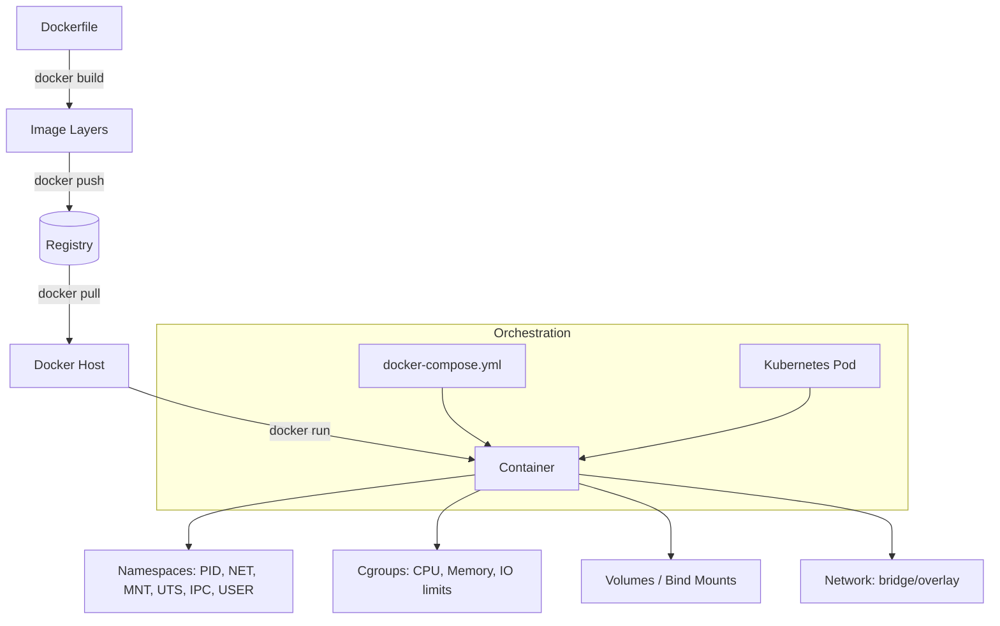

# Containers

## Overview

Containers package an application with its dependencies into a single, portable unit that shares the host kernel instead of virtualizing an entire OS — the workhorse pattern behind modern application delivery, CI/CD pipelines, and Kubernetes. This module walks the full stack: Docker Engine installation, image building, container lifecycle, networking, storage, Compose orchestration, private registries, the rootless Podman/Buildah alternative, and the security controls needed to run containers safely in production, closing with a taste of Kubernetes. It builds directly on [Virtualization](../Virtualization/Readme.md) concepts and feeds into Security Hardening and System Monitoring and Logging once workloads move into orchestrated environments.

> [!IMPORTANT]
> A container is **not** a lightweight VM. It is one or more isolated processes on the *same kernel* as the host, using namespaces (isolation) and cgroups (resource limits). A kernel exploit or a misconfigured privileged container can break out to the host — treat container security with the same rigor as host security, not as an afterthought.

## Learning Objectives

- Explain the difference between containers and virtual machines, and the kernel primitives (namespaces, cgroups, capabilities) that make containers possible
- Install and configure Docker Engine on both RHEL-family and Debian-family distributions
- Write, build, and optimize Dockerfiles into minimal, layered images
- Manage the full container lifecycle: create, start, stop, exec, logs, inspect, remove
- Configure Docker networking modes (bridge, host, none, overlay) and container-to-container communication
- Persist and share data correctly using volumes, bind mounts, and tmpfs
- Orchestrate multi-container applications declaratively with Docker Compose
- Push, pull, and secure images against a private registry
- Run daemonless, rootless containers with Podman and build images with Buildah
- Harden container deployments against the CIS Docker Benchmark and recognize common escape techniques
- Describe core Kubernetes objects (Pod, Deployment, Service) and how they relate to the containers built earlier in the module

## Topics Covered

| Note | What it covers |
|---|---|
| [Introduction-to-Containers](Introduction-to-Containers.md) | Containers vs VMs, namespaces, cgroups, OCI standards, the container ecosystem |
| [Docker-Engine-Installation](Docker-Engine-Installation.md) | Installing Docker CE on RHEL/Debian, daemon config, post-install `docker` group setup |
| [Docker-Images-and-Dockerfile](Docker-Images-and-Dockerfile.md) | Dockerfile syntax, layers, multi-stage builds, `.dockerignore`, image optimization |
| [Docker-Containers-Lifecycle](Docker-Containers-Lifecycle.md) | `run`/`start`/`stop`/`exec`/`logs`/`inspect`/`rm`, restart policies, health checks |
| [Docker-Networking](Docker-Networking.md) | Bridge/host/none/overlay drivers, custom networks, DNS, port publishing |
| [Docker-Volumes-and-Storage](Docker-Volumes-and-Storage.md) | Volumes vs bind mounts vs tmpfs, storage drivers, backup/restore patterns |
| [Docker-Compose](Docker-Compose.md) | Compose YAML schema, multi-service apps, `.env` files, `docker compose` v2 CLI |
| [Docker-Registry](Docker-Registry.md) | Docker Hub, private registry deployment, image signing, TLS auth |
| [Podman](Podman.md) | Daemonless architecture, Docker-compatible CLI, pods, systemd integration |
| [Buildah](Buildah.md) | Scriptable image builds without a Dockerfile, layer-by-layer control |
| [Rootless-Containers](Rootless-Containers.md) | `rootless mode`, subuid/subgid mapping, user namespaces, `slirp4netns` |
| [Container-Security-Hardening](Container-Security-Hardening.md) | CIS Docker Benchmark, seccomp, AppArmor/SELinux, image scanning, secrets |
| [Container-Escape-and-Threats](Container-Escape-and-Threats.md) | Privileged containers, Docker socket exposure, kernel CVEs, real escape techniques |
| [Kubernetes-Basics](Kubernetes-Basics.md) | Pods, Deployments, Services, `kubectl`, minikube/kind lab setup |

## Practical Labs

1. **From Dockerfile to running service** — Write a multi-stage Dockerfile for a small web app, build it, tag it, and run it with a bind-mounted config file and a custom bridge network alongside a database container. Verify inter-container DNS resolution with `docker exec ... ping db`.
2. **Compose up a three-tier stack** — Define a `docker-compose.yml` with a frontend, API, and database service, each with named volumes, environment files, and a health-checked dependency order (`depends_on: condition: service_healthy`). Tear down and bring back up, confirming data persists via volumes.
3. **Rootless Podman + CIS hardening pass** — Install Podman rootless, run the same stack as an unprivileged user, then run `docker-bench-security` (or Podman's equivalent checks) against it. Remediate at least three findings (e.g., drop `CAP_NET_RAW`, add `--read-only`, apply a seccomp profile) and re-scan to confirm the fixes.

## Best Practices

- Pin base images to a digest or specific tag (`node:20.11-alpine`, not `node:latest`) for reproducible builds
- Use multi-stage builds to keep final images minimal — no compilers or build tools in the runtime layer
- Run one process per container; use an init system or `--init` only when a process needs to reap zombies
- Prefer named volumes over bind mounts for portable, Docker-managed persistence; use bind mounts only for local dev
- Set explicit resource limits (`--memory`, `--cpus`) on every production container to prevent noisy-neighbor effects
- Use `docker compose` (v2, Compose Specification) rather than the deprecated standalone `docker-compose` v1 binary
- Tag and version images deliberately; never rely on `latest` in production deployments
- Prefer rootless Podman or a rootless Docker daemon in multi-tenant or CI environments

## Security Considerations

Container security maps closely to the **CIS Docker Benchmark** — covered in depth in [Container-Security-Hardening](Container-Security-Hardening.md) — and should be layered on top of standard host hardening from Security Hardening.

| Control | Why it matters |
|---|---|
| Never run `--privileged` in production | Grants all Linux capabilities and device access — a near-total sandbox bypass |
| Drop unneeded capabilities (`--cap-drop=ALL --cap-add=<needed>`) | Minimizes what a compromised process can do inside the container |
| Never bind-mount `/var/run/docker.sock` into a container | Root-equivalent control of the whole Docker host (see [Container-Escape-and-Threats](Container-Escape-and-Threats.md)) |
| Run as a non-root user (`USER` in Dockerfile, or `--user`) | Limits blast radius even if the container is compromised |
| Enable user namespace remapping (`userns-remap`) or rootless mode | Maps container root to an unprivileged host UID |
| Apply seccomp and AppArmor/SELinux profiles | Restricts syscalls and file access beyond default namespace isolation |
| Scan images for CVEs (`trivy`, `grype`, Docker Scout) before deploy | Catches vulnerable packages baked into layers |
| Use read-only root filesystems (`--read-only`) with explicit `tmpfs` for writable paths | Prevents in-container tampering and malware persistence |
| Keep Docker/Podman and the kernel patched | Container isolation is only as strong as the shared kernel |

> [!WARNING]
> Exposing the Docker daemon socket over TCP without TLS (`-H tcp://0.0.0.0:2375`) gives anyone who can reach that port unauthenticated root on the host. Always use the Unix socket, or TLS client-cert auth (`--tlsverify`) if remote access is required.

> [!NOTE]
> **📸 Screenshot**
> _Capture: output of `docker run --rm -it --cap-drop=ALL --security-opt=no-new-privileges alpine sh` next to `docker inspect` showing `CapAdd`/`CapDrop` — illustrates a hardened container invocation._

## Troubleshooting

- **Container exits immediately** — check `docker logs <container>`; the main process likely exited (no foreground process, or a crash). Use `docker inspect --format='{{.State.ExitCode}}'` to confirm the code.
- **Cannot connect between containers** — verify both are on the same user-defined network (`docker network inspect`); the default bridge doesn't provide automatic DNS resolution between containers.
- **Permission denied on a mounted volume** — check UID/GID mismatch between the host directory owner and the container process user; align them or use `:Z`/`:z` SELinux labels on RHEL-family hosts.
- **"Cannot connect to the Docker daemon"** — confirm the daemon is running (`systemctl status docker`) and the user is in the `docker` group (or use `sudo`); for Podman, confirm rootless setup with `podman info`.
- **Disk filling up from dangling images/volumes** — run `docker system df` to see usage, then `docker system prune -a --volumes` (review carefully before pruning volumes in production).
- **Rootless Podman networking fails** — check `slirp4netns` is installed and subuid/subgid ranges are configured in `/etc/subuid` and `/etc/subgid` for the user.

## References

- Docker official documentation — https://docs.docker.com/
- Podman official documentation — https://docs.podman.io/
- Buildah official documentation — https://buildah.io/
- CIS Docker Benchmark — https://www.cisecurity.org/benchmark/docker
- OCI (Open Container Initiative) specifications — https://opencontainers.org/
- Kubernetes documentation — https://kubernetes.io/docs/home/
- `man docker`, `man podman`, `man docker-compose`

## Related Notes

- [Introduction-to-Containers](Introduction-to-Containers.md)
- [Docker-Engine-Installation](Docker-Engine-Installation.md)
- [Docker-Images-and-Dockerfile](Docker-Images-and-Dockerfile.md)
- [Docker-Containers-Lifecycle](Docker-Containers-Lifecycle.md)
- [Docker-Networking](Docker-Networking.md)
- [Docker-Volumes-and-Storage](Docker-Volumes-and-Storage.md)
- [Docker-Compose](Docker-Compose.md)
- [Docker-Registry](Docker-Registry.md)
- [Podman](Podman.md)
- [Buildah](Buildah.md)
- [Rootless-Containers](Rootless-Containers.md)
- [Container-Security-Hardening](Container-Security-Hardening.md)
- [Container-Escape-and-Threats](Container-Escape-and-Threats.md)
- [Kubernetes-Basics](Kubernetes-Basics.md)
- [Linux Administration & Server Hardening](../Readme.md) — course hub and map of content
