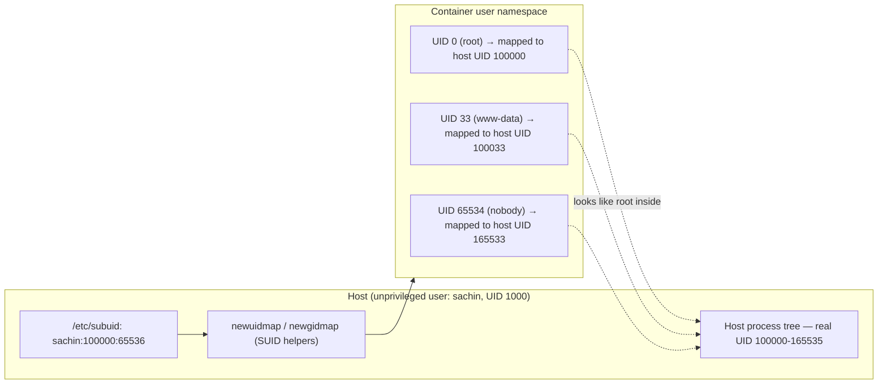
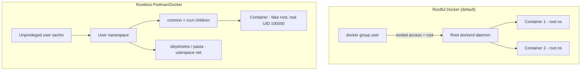

# Rootless Containers

## Overview

Rootless containers let an unprivileged Linux user build, run, and manage containers without a root-owned daemon or SUID binaries in the path, shrinking the blast radius of a container escape to whatever that user account can already touch. The technique underpins [Podman](Podman.md)'s daemonless design and is one of the highest-leverage controls covered in [Container-Security-Hardening](Container-Security-Hardening.md), since it removes the "root-equivalent daemon" attack surface that classic Docker relies on. It depends entirely on the kernel's user namespace feature plus the `subuid`/`subgid` allocation system, both of which are explained in depth below.

> [!IMPORTANT]
> **Rootless is not "run Docker as your normal user"**
> Rootless containers remap container UID 0 to an *unprivileged* host UID via user namespaces — the process never actually holds root on the host, even though `whoami` inside the container says `root`. Simply adding your user to the `docker` group (`usermod -aG docker`) grants root-equivalent host access through the daemon socket and is the opposite of rootless — treat that group membership as a privilege escalation path, not a convenience.

## Concepts

**User namespaces (`user_ns`)** are a Linux kernel isolation primitive (since 3.8) that let a process have a *different* view of UIDs/GIDs than the rest of the system. Inside the namespace a process can be UID 0 ("root"); outside, the kernel maps that UID to an unprivileged host UID. Capabilities (`CAP_SYS_ADMIN`, `CAP_NET_ADMIN`, etc.) granted "as root" inside the namespace are valid only within it — they do not confer any privilege on the host.

**subuid / subgid** are the delegation mechanism that makes multi-UID remapping possible. `/etc/subuid` and `/etc/subgid` assign each real user a range of UIDs/GIDs it is allowed to map into containers it starts, so a container with multiple users (e.g. `root`, `www-data`, `nobody`) can have each mapped to a distinct, non-colliding host UID — without ever needing root to set up the mapping (via the `newuidmap`/`newgidmap` SUID helpers, which only perform the mapping the subuid file already authorizes).



| Term | Meaning |
|---|---|
| User namespace | Kernel construct isolating UID/GID views between host and container |
| subuid/subgid range | Block of host UIDs/GIDs (default 65536) a user may delegate to namespaces |
| `newuidmap`/`newgidmap` | Small SUID-root helpers (shadow-utils) that write `/proc/<pid>/uid_map` on the user's behalf, honoring subuid limits |
| Rootless Podman | Fully daemonless; each container is a child process of the invoking user, no elevated component at all |
| Rootless Docker | Optional mode; `dockerd` itself runs unprivileged per-user via `rootlesskit`, replacing the traditional root daemon |
| Slirp4netns / pasty | Userspace networking stacks used because rootless processes cannot create host-level bridges or manipulate `iptables` directly |

## Architecture

Rootful Docker uses a single root-owned `dockerd` daemon reachable over a Unix socket (`/var/run/docker.sock`) that anyone in the `docker` group can talk to — a compromise of the daemon, the socket, or a container that mounts the socket is host root. Rootless Podman has no persistent daemon: `podman run` forks `conmon` and the container's `runc`/`crun` process directly as children of your shell, all inside a user namespace you own.

Rootless Docker keeps the client/daemon architecture but moves `dockerd` itself into a per-user namespace using `rootlesskit`, and substitutes `slirp4netns` (or the faster `pasta`) for kernel bridge networking, since unprivileged users cannot create `veth`/bridge interfaces or write `iptables` rules.



## Installation

### Podman (rootless by default — RHEL/Fedora family)

```bash
sudo dnf install -y podman
# Verify subuid/subgid entries exist (usually auto-created on user creation)
grep "^$(whoami):" /etc/subuid /etc/subgid
# If missing, allocate a range as root:
sudo usermod --add-subuids 100000-165535 --add-subgids 100000-165535 "$(whoami)"
podman system migrate   # apply new ranges to existing storage
```

### Podman (rootless — Debian/Ubuntu family)

```bash
sudo apt update && sudo apt install -y podman uidmap
grep "^$(whoami):" /etc/subuid /etc/subgid
# Debian/Ubuntu allocate ranges automatically at useradd time via /etc/login.defs
# (SUB_UID_MIN/COUNT, SUB_GID_MIN/COUNT); verify, don't assume.
```

### Rootless Docker (both families, official install script)

```bash
# Disable and stop any existing rootful Docker daemon first
sudo systemctl disable --now docker.service docker.socket

sudo apt install -y uidmap dbus-user-session   # Debian/Ubuntu prerequisites
# RHEL/Fedora: sudo dnf install -y shadow-utils

curl -fsSL https://get.docker.com/rootless | sh
# Follow the printed instructions to export DOCKER_HOST and add
# systemd --user paths, e.g.:
systemctl --user enable --now docker
sudo loginctl enable-linger "$(whoami)"   # keep daemon alive after logout
```

## Configuration

```conf
# /etc/subuid  — format: username:starting_subuid:count
sachin:100000:65536

# /etc/subgid  — format: username:starting_subgid:count
sachin:100000:65536
```

```bash
# Point the docker CLI at the rootless socket for this user
export DOCKER_HOST=unix:///run/user/$(id -u)/docker.sock
echo 'export DOCKER_HOST=unix:///run/user/'"$(id -u)"'/docker.sock' >> ~/.bashrc

# Podman needs no DOCKER_HOST — it talks to conmon directly per invocation
podman info --format '{{.Host.Security.Rootless}}'   # -> true
```

```ini
# ~/.config/containers/storage.conf (Podman) — pin storage driver for rootless
[storage]
driver = "overlay"
graphroot = "/home/sachin/.local/share/containers/storage"

[storage.options.overlay]
mount_program = "/usr/bin/fuse-overlayfs"
```

> [!TIP]
> **`fuse-overlayfs` matters**
> Rootless overlay mounts on older kernels (<5.11) require `fuse-overlayfs` because unprivileged users cannot call the native `overlay` mount syscall directly. Kernel 5.11+ supports rootless native overlayfs, removing this dependency — check with `podman info | grep -A2 graphDriverName`.

## Commands

```bash
# Confirm rootless status and user-namespace mapping
podman info --format '{{.Host.Security.Rootless}}'
podman unshare cat /proc/self/uid_map

# Run a container rootless (identical UX to rootful)
podman run --rm -it alpine:3.20 id
# uid=0(root) gid=0(root) — but check the HOST view:
podman inspect --format '{{.State.Pid}}' <container_id> | xargs -I{} cat /proc/{}/status | grep ^Uid

# Rootless Docker equivalent
docker context use rootless
docker run --rm -it alpine:3.20 id

# Inspect subuid/subgid delegation in use
podman unshare cat /proc/self/gid_map
loginctl show-user "$(whoami)" --property=Linger
```

## Examples

```bash
# Bind-mount a host directory rootless — ownership maps through subuid range
mkdir -p ~/data && echo hello > ~/data/file.txt
podman run --rm -v ~/data:/data:Z alpine:3.20 cat /data/file.txt

# Run rootless with a non-default port (rootless can't bind <1024 without capability)
podman run --rm -p 8080:80 nginx:alpine
# Binding 80:80 directly fails with "permission denied" — this is expected rootless behavior
```

```yaml
# podman-compose / docker-compose service designed for rootless use
services:
  web:
    image: nginx:alpine
    ports:
      - "8080:80"        # avoid privileged ports on the host side
    volumes:
      - ./site:/usr/share/nginx/html:ro,Z
    user: "1000:1000"    # explicit non-root inside the container too
```

> [!NOTE]
> **📸 Screenshot**
> _Capture: terminal output of `podman info --format '{{.Host.Security.Rootless}}'` returning `true`, alongside `podman unshare cat /proc/self/uid_map` showing the subuid-derived mapping — good evidence for a hardening audit report._

## Best Practices

- Prefer **Podman** for new deployments — it is rootless-first and daemonless by design, versus Docker where rootless is a bolt-on mode requiring extra setup and losing some features (no restart policies across reboot without lingering, limited overlay networking).
- Always run `loginctl enable-linger <user>` for rootless Docker/Podman services that must survive logout or start at boot.
- Combine rootless execution with an in-container non-root `USER` directive — rootless protects the *host*, but a container still running as UID 0 *inside* the namespace has more capabilities within that namespace than a properly dropped-privilege process.
- Keep subuid/subgid ranges non-overlapping per user (`/etc/subuid`/`/etc/subgid` should never assign the same range to two accounts) — overlapping ranges defeat isolation between rootless users on a shared host.
- Use `podman generate systemd` or native Podman `quadlet` `.container` units instead of ad-hoc `podman run` in cron/rc.local for reproducible, restart-aware rootless services.

## Security Considerations

- **CIS Docker Benchmark 1.1.x / 5.x** explicitly recommends running the daemon rootless and never adding users to the `docker` group casually, since group membership is equivalent to root — rootless removes this control entirely by not requiring the group.
- Rootless containers still share the **host kernel** — a kernel-level exploit (e.g., a `user_ns` privilege-escalation CVE) can still escape the namespace. Rootless narrows the *default* attack surface; it is not a substitute for seccomp/AppArmor/SELinux profiles, which should still be applied (see [Container-Security-Hardening](Container-Security-Hardening.md)).
- Because unprivileged users can create user namespaces at will on many distros, `sysctl kernel.unprivileged_userns_clone` (Debian/Ubuntu) or the equivalent RHEL policy should be reviewed — hardening guides sometimes disable unprivileged user namespaces system-wide, which will also break rootless Podman/Docker for regular users unless explicitly re-enabled for trusted accounts.
- Rootless networking via `slirp4netns`/`pasta` avoids `NET_ADMIN` on the host but adds a userspace network stack that historically had performance and, occasionally, isolation-relevant bugs — keep it patched via the distro package manager.
- File ownership inside rootless volumes maps to the *subuid range*, not literal host UIDs — an `ls -l` on a bind mount from outside the namespace will show large, unfamiliar UIDs (e.g. `100000`) instead of `root`; this is expected and should not be "fixed" by chowning to real root.

## Benefits and Limitations

| Aspect | Rootless benefit | Rootless limitation |
|---|---|---|
| Daemon compromise | No root daemon to compromise (Podman) or daemon itself runs unprivileged (Docker) | Rootless Docker still has more moving parts (rootlesskit) than plain rootless Podman |
| Privileged ports (<1024) | N/A | Cannot bind directly without `CAP_NET_BIND_SERVICE` delegation or a reverse proxy |
| Bridge networking | Userspace slirp4netns/pasta avoids host iptables/bridge manipulation | Historically slower throughput than native bridge (pasta narrows this gap significantly) |
| Multi-user isolation | subuid/subgid ranges keep different local users' containers from colliding | Requires careful `/etc/subuid`/`/etc/subgid` administration at scale |
| Kernel attack surface | Removes SUID-daemon and docker-group escalation paths | Kernel exploits and `user_ns` CVEs still apply — not a full sandbox replacement |
| Systemd integration | `loginctl enable-linger` + `podman generate systemd`/quadlets give near-parity with rootful | Needs linger explicitly enabled; some corp environments disable it by policy |

## Troubleshooting

```bash
# "newuidmap: write to uid_map failed: Operation not permitted"
# -> subuid/subgid range missing or too small
grep "^$(whoami):" /etc/subuid /etc/subgid
sudo usermod --add-subuids 100000-165535 --add-subgids 100000-165535 "$(whoami)"
podman system migrate

# Containers vanish after SSH logout
loginctl show-user "$(whoami)" --property=Linger
sudo loginctl enable-linger "$(whoami)"

# "cannot mount overlay: permission denied" on older kernels
uname -r   # if <5.11, ensure fuse-overlayfs is installed and configured
which fuse-overlayfs

# Rootless port binding fails on 80/443
sudo sysctl net.ipv4.ip_unprivileged_port_start=80   # lower the privileged-port floor (understand the tradeoff first)
# or bind high ports and front with a rootful/systemd-socket-activated proxy instead
```

## References

- Podman documentation — Rootless Containers: https://docs.podman.io/en/latest/markdown/podman.1.html
- Docker documentation — Rootless mode: https://docs.docker.com/engine/security/rootless/
- `man subuid`, `man subgid`, `man newuidmap`, `man user_namespaces`
- CIS Docker Benchmark — sections on daemon privilege and rootless configuration
- Red Hat: "A Practical Introduction to Container Terminology" and Podman rootless docs (access.redhat.com)

## Related Notes

- [Podman](Podman.md)
- [Container-Security-Hardening](Container-Security-Hardening.md)
- [Introduction-to-Containers](Introduction-to-Containers.md)
- [Docker-Engine-Installation](Docker-Engine-Installation.md)
- [Linux Administration & Server Hardening](../Readme.md) — course hub and map of content
