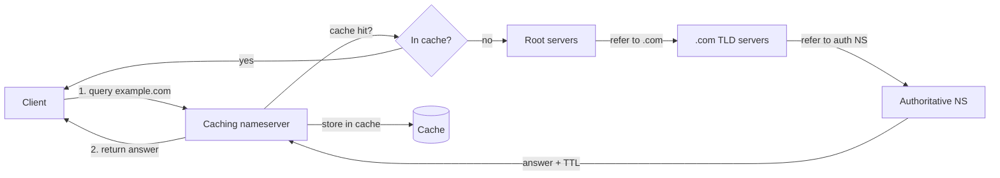

# Caching Nameserver

A **caching nameserver** stores the results of DNS queries temporarily (for the duration of each record's TTL) to speed up subsequent lookups and reduce load on upstream authoritative servers. This note covers building one with **BIND** (Berkeley Internet Name Domain / `named`) on a Red Hat–family system (CentOS/RHEL/Rocky/Fedora), from hostname setup through `named.conf`, firewalling, and verification.

## Overview

A caching resolver does not hold authoritative zone data of its own. Instead it performs **recursion** on behalf of clients — walking the DNS hierarchy from the root servers down to the authoritative server for a name — and then **caches** the answer. Every later request for the same record within its TTL is served straight from memory.

| Property | Caching nameserver |
| --- | --- |
| Holds authoritative zones? | No |
| Performs recursion? | Yes |
| Answers from cache? | Yes (until TTL expires) |
| Typical placement | LAN gateway, branch office, workstation subnet |
| Primary benefit | Lower latency, less WAN/upstream traffic |
| Main risk | Open resolver → DNS amplification abuse |

> [!NOTE]
> This build targets the classic BIND layout on Red Hat–family systems (`/etc/named.conf`, `/var/named/`). Paths differ on Debian/Ubuntu, where BIND lives under `/etc/bind/`.

## Concepts

### How recursive caching resolution works



On a cache **miss**, the resolver does the full recursive walk and stores the answer. On a **hit**, it replies immediately from the cache, which is why the second query for any name is dramatically faster.

## Configuration

### Set the hostname

Display the current hostname:

```bash
hostname
```

Open the hostname configuration file:

```bash
vim /etc/hostname
```

Set it to the DNS server's fully qualified name:

```text
ns1.armour.local
```

Reboot so the change is applied system-wide:

```bash
reboot
```

Confirm the hostname after reboot:

```bash
hostname
```

### Check the resolver configuration

View `/etc/resolv.conf` to see which upstream resolvers the host currently uses:

```bash
cat /etc/resolv.conf
```

Example content:

```text
nameserver 8.8.8.8
nameserver 8.8.4.4
```

### Install BIND

Check whether BIND is already installed:

```bash
rpm -qa | grep bind
```

Install the BIND package:

```bash
yum install bind
```

Verify the installation:

```bash
rpm -qa | grep bind
```

Inspect package metadata and contents:

```bash
rpm -qi bind
```

```bash
rpm -ql bind
```

List configuration files shipped by the package:

```bash
rpm -qc bind
```

```bash
rpm -qd bind
```

## Key Configuration Files

BIND's on-disk layout separates the daemon configuration from the zone/working data.

| Path | Purpose |
| --- | --- |
| `/etc/named.conf` | Main BIND configuration: options, zones, logging, ACLs, security policy |
| `/etc/named.iscdlv.key` | TSIG key for secure server-to-server communication (dynamic updates, zone transfers) |
| `/etc/named.rfc1912.zones` | Default local zones per RFC 1912 (localhost, loopback reverse, etc.) |
| `/etc/named.root.key` | DNSSEC root trust anchor used to validate root responses |
| `/var/named/` | BIND working directory (zone files and cache data) |

Working-directory tree:

```text
/var/named/
├── data/            # cache_dump.db, named_stats.txt, named.recursing, named.secroots
├── dynamic/         # dynamically generated / updated zone files
├── named.ca         # root hints (list of root servers)
├── named.empty      # empty zone for non-existent/unresponsive zones
├── named.localhost  # forward zone for localhost (127.0.0.1)
├── named.loopback   # reverse zone for 127.0.0.1
└── slaves/          # zone files transferred from a master (slave setups)
```

### /etc/named.conf

- Main configuration file for BIND.
- Defines server options, zones, logging settings, access control lists (ACLs), and security policies.
- Example settings it controls:
    - Which IP addresses and ports to listen on.
    - Allowed clients for DNS queries.
    - Path to zone files.

### /etc/named.iscdlv.key

- Contains a TSIG (Transaction Signature) key used for secure communication between DNS servers.
- Primarily used for:
    - DNS dynamic updates.
    - Zone transfers between servers.
- This file is often autogenerated and managed by BIND itself.

### /etc/named.rfc1912.zones

- Contains the configuration for default zones as defined by RFC 1912.
- Defines common zones like:
    - `localhost`
    - `0.0.127.in-addr.arpa` (for loopback address reverse lookups)
    - `255.in-addr.arpa` (for broadcast address reverse lookups)
- Helps resolve local network issues and reverse DNS lookups.

### /etc/named.root.key

- Holds the root trust anchor key for DNSSEC (DNS Security Extensions).
- Used to validate responses from the root DNS servers.
- If this key is missing or outdated, DNSSEC validation will fail.

### /var/named

This is the working directory for BIND, where zone files and cache data are stored.

| Subpath | Role |
| --- | --- |
| `/var/named/data` | BIND-generated data: `cache_dump.db` (cached records), `named_stats.txt` (statistics), `named.recursing` (recursive query log), `named.secroots` (secure root data) |
| `/var/named/dynamic` | Dynamically generated zone files for DNS updates |
| `/var/named/named.ca` | List of root DNS servers; loaded at startup to seed the root server list |
| `/var/named/named.empty` | Empty zone for queries to non-existent zones; prevents needless root traffic |
| `/var/named/named.localhost` | Forward zone for localhost (127.0.0.1) |
| `/var/named/named.loopback` | Reverse lookup zone for 127.0.0.1 |
| `/var/named/slaves` | Zone files transferred from master servers (slave/secondary setups) |

View the root hints file:

```bash
cat /var/named/named.ca
```

## Network Configuration

### CentOS 7 — network interface configuration

Open the interface configuration file:

```bash
vim /etc/sysconfig/network-scripts/ifcfg-enp0s3
```

Example:

```ini
TYPE=Ethernet
BOOTPROTO=static
DEFROUTE=yes
IPV4_FAILURE_FATAL=no
IPV6INIT=no
IPV6_AUTOCONF=yes
IPV6_DEFROUTE=yes
IPV6_PEERDNS=yes
IPV6_PEERROUTES=yes
IPV6_FAILURE_FATAL=no
IPV6_ADDR_GEN_MODE=stable-privacy
NAME=enp0s3
UUID=92a9be99-ddba-4e75-a601-a385f8dcb88f
DEVICE=enp0s3
ONBOOT=yes
IPADDR=192.168.1.37
PREFIX=24
GATEWAY=192.168.1.1
DNS1=127.0.0.1
PROXY_METHOD=none
BROWSER_ONLY=no
```

> [!TIP]
> Setting `DNS1=127.0.0.1` points the server at its own caching resolver, so the machine benefits from its cache too.

### NetworkManager keyfile configuration

```bash
vim /etc/NetworkManager/system-connections/enp0s3.nmconnection
```

Example:

```ini
[connection]
id=enp0s3
uuid=5dabe1f1-79aa-3751-8ba8-b0f01d817434
type=ethernet
autoconnect-priority=-999
interface-name=enp0s3
timestamp=1730811905

[ethernet]

[ipv4]
address1=192.168.1.31/24,192.168.1.1
address2=192.168.1.32/24
address3=192.168.1.33/24
address4=192.168.1.34/24
dns=127.0.0.1
method=manual

[ipv6]
addr-gen-mode=eui64
method=disabled

[proxy]
```

## Configure BIND (named.conf)

### Base caching configuration

```bash
vim /etc/named.conf
```

```conf
//
// named.conf
//
// Provided by Red Hat bind package to configure the ISC BIND named(8) DNS
// server as a caching only nameserver (as a localhost DNS resolver only).
//
// See /usr/share/doc/bind*/sample/ for example named configuration files.
//

options {
	listen-on port 53 { 127.0.0.1; 192.168.1.32; 192.168.1.41; 192.168.1.42; };
	listen-on-v6 port 53 { ::1; };
	directory 	"/var/named";
	dump-file 	"/var/named/data/cache_dump.db";
	statistics-file "/var/named/data/named_stats.txt";
	memstatistics-file "/var/named/data/named_mem_stats.txt";
	secroots-file	"/var/named/data/named.secroots";
	recursing-file	"/var/named/data/named.recursing";
	allow-query     { localhost; 192.168.1.0/24; };

	/*
	 - If you are building an AUTHORITATIVE DNS server, do NOT enable recursion.
	 - If you are building a RECURSIVE (caching) DNS server, you need to enable
	   recursion.
	 - If your recursive DNS server has a public IP address, you MUST enable access
	   control to limit queries to your legitimate users. Failing to do so will
	   cause your server to become part of large scale DNS amplification
	   attacks. Implementing BCP38 within your network would greatly
	   reduce such attack surface
	*/
	recursion yes;

	dnssec-validation yes;

	managed-keys-directory "/var/named/dynamic";
	geoip-directory "/usr/share/GeoIP";

	pid-file "/run/named/named.pid";
	session-keyfile "/run/named/session.key";

	/* https://fedoraproject.org/wiki/Changes/CryptoPolicy */
	include "/etc/crypto-policies/back-ends/bind.config";
};

logging {
        channel default_debug {
                file "data/named.run";
                severity dynamic;
        };
};

zone "." IN {
	type hint;
	file "named.ca";
};

include "/etc/named.rfc1912.zones";
include "/etc/named.root.key";
```

### Using ACLs for cleaner access control

Rather than repeating literal IP lists, define named ACLs once and reference them in `options`. This keeps `listen-on` and `allow-query` readable and consistent.

```bash
vim /etc/named.conf
```

```conf
//
// named.conf
//
// Provided by Red Hat bind package to configure the ISC BIND named(8) DNS
// server as a caching only nameserver (as a localhost DNS resolver only).
//
// See /usr/share/doc/bind*/sample/ for example named configuration files.
//

acl ns_ip_add {
	127.0.0.1;
	192.168.1.32;
	192.168.1.40;
	192.168.1.41;
	192.168.1.42;
};

acl mynetwork {
	127.0.0.1;
	192.168.1.0/24;
};

options {
	listen-on port 53 { ns_ip_add; };
	listen-on-v6 port 53 { ::1; };
	directory 	"/var/named";
	dump-file 	"/var/named/data/cache_dump.db";
	statistics-file "/var/named/data/named_stats.txt";
	memstatistics-file "/var/named/data/named_mem_stats.txt";
	secroots-file	"/var/named/data/named.secroots";
	recursing-file	"/var/named/data/named.recursing";
	allow-query     { localhost; mynetwork; };

	/*
	 - If you are building an AUTHORITATIVE DNS server, do NOT enable recursion.
	 - If you are building a RECURSIVE (caching) DNS server, you need to enable
	   recursion.
	 - If your recursive DNS server has a public IP address, you MUST enable access
	   control to limit queries to your legitimate users. Failing to do so will
	   cause your server to become part of large scale DNS amplification
	   attacks. Implementing BCP38 within your network would greatly
	   reduce such attack surface
	*/
	recursion yes;

	dnssec-validation yes;

	managed-keys-directory "/var/named/dynamic";
	geoip-directory "/usr/share/GeoIP";

	pid-file "/run/named/named.pid";
	session-keyfile "/run/named/session.key";

	/* https://fedoraproject.org/wiki/Changes/CryptoPolicy */
	include "/etc/crypto-policies/back-ends/bind.config";
};

logging {
        channel default_debug {
                file "data/named.run";
                severity dynamic;
        };
};

zone "." IN {
	type hint;
	file "named.ca";
};

include "/etc/named.rfc1912.zones";
include "/etc/named.root.key";
```

> [!WARNING]
> `recursion yes` combined with a public IP and a wide `allow-query` turns the box into an **open resolver**. Open resolvers are routinely abused for DNS amplification DDoS. Always constrain `allow-query`/`allow-recursion` to your own networks (as shown with `mynetwork`).

## Firewall Configuration

Allow DNS traffic on TCP and UDP port 53 with firewalld:

```bash
firewall-cmd --permanent --add-port=53/tcp
```

```bash
firewall-cmd --permanent --add-port=53/udp
```

```bash
firewall-cmd --reload
```

> This will permanently open both TCP and UDP port 53 for DNS queries.

## Commands

### Manage the BIND service

Check service status:

```bash
systemctl status named.service
```

Start the service and enable it at boot:

```bash
systemctl start named.service
```

```bash
systemctl enable named.service
```

Restart after configuration changes:

```bash
systemctl restart named.service
```

Restart the firewall if you changed its rules:

```bash
systemctl restart firewalld.service
```

### Verify listening ports

```bash
netstat -nltup | grep named
```

```bash
netstat -nltup | grep 53
```

### Test resolution with dig

Query the resolver on the loopback interface:

```bash
dig google.com @127.0.0.1
```

Query it on its LAN address:

```bash
dig google.com @192.168.1.32
```

## Best Practices

- **Never run an open resolver.** Restrict `allow-query` and `allow-recursion` to trusted networks only.
- **Keep DNSSEC validation on** (`dnssec-validation yes`) so tampered responses are rejected.
- **Point the server at itself** (`DNS1=127.0.0.1`) so the local host also benefits from the cache.
- **Enable the service at boot** with `systemctl enable named.service`.
- **Validate before restart** with `named-checkconf` (see [Forward-Zone](Forward-Zone.md)) to avoid a failed reload.
- **Rate-limit responses** (`rate-limit { responses-per-second …; };`) to blunt amplification abuse where recursion must be exposed.

## Security Considerations

| Threat | Mitigation |
| --- | --- |
| DNS amplification / open resolver abuse | Restrict `allow-query`/`allow-recursion`; implement BCP38 ingress filtering |
| Cache poisoning / spoofing | Enable DNSSEC validation; use source-port randomization (BIND default) |
| Zone transfer leakage | Not applicable to a pure cache, but keep `allow-transfer` closed |
| Information disclosure via version banner | Set `version "none";` in `options` to hide the BIND version |
| Unauthorized recursion from the Internet | Bind `listen-on` to internal interfaces only |

> [!IMPORTANT]
> The comment block inside `named.conf` explicitly warns against open recursive resolvers. Treat it as policy: if the server has a public IP, access control is mandatory, not optional.

## Troubleshooting

| Symptom | Likely cause | Check |
| --- | --- | --- |
| `named` fails to start | Syntax error in `named.conf` | `named-checkconf /etc/named.conf` |
| Clients get `SERVFAIL` | DNSSEC validation failing / stale `named.root.key` | Review logs in `/var/named/data/named.run` |
| No answers from LAN clients | Firewall or `allow-query` blocking | `firewall-cmd --list-ports`; check ACLs |
| Port 53 not listening | Service down or `listen-on` misconfigured | `netstat -nltup \| grep 53` |
| Slow first lookups, fast repeats | Normal cache warm-up behaviour | Compare repeated `dig` query times |

## References

- BIND 9 Administrator Reference Manual (ISC).
- RFC 1912 — Common DNS Operational and Configuration Errors.
- RFC 1035 — Domain Names: Implementation and Specification.
- BCP 38 (RFC 2827) — Network Ingress Filtering.

## Related

- [Linux Administration & Server Hardening](../Readme.md) — Linux administration & server hardening hub.
- [DNS-Server-Types](DNS-Server-Types.md) — where the caching role fits among nameserver types.
- [Forwarders-Nameserver](Forwarders-Nameserver.md) — forwarders pair naturally with a caching resolver.
- [Master-Nameserver](Master-Nameserver.md) — the authoritative counterpart to a cache.
- [Dns-Client-Tools](Dns-Client-Tools.md) — `dig`/`host`/`nslookup` for testing the cache.
- [Forward-Zone](Forward-Zone.md) — validating configuration with `named-checkconf`/`named-checkzone`.
