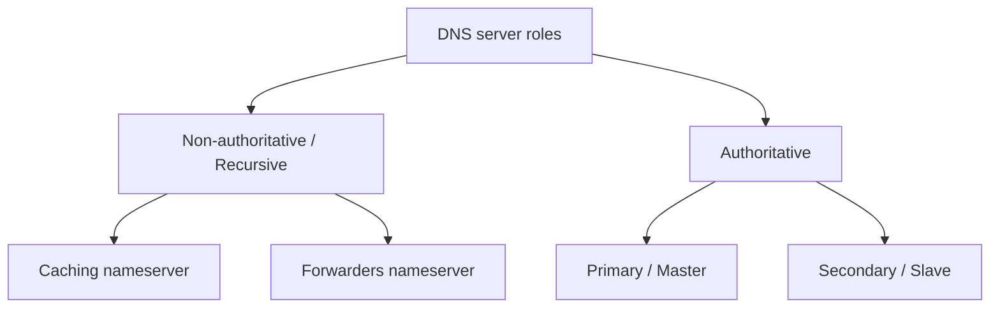

# DNS Server Types

DNS servers fall into two broad families based on **what they know** and **how they answer**: *non-authoritative (recursive)* servers, which find answers by asking other servers, and *authoritative* servers, which hold the definitive records for the zones they serve. This note summarizes each role and shows a minimal configuration for it.

## Overview

| Role | Holds original records? | Resolves by asking others? | Typical use |
| --- | --- | --- | --- |
| Caching nameserver | No | Yes (recursion + cache) | LAN resolver, latency reduction |
| Forwarding nameserver | No | No — forwards to another resolver | Centralized egress, ISP/upstream reliance |
| Primary (master) | Yes — source of truth | No | Zone authority, editable records |
| Secondary (slave) | Yes — copy of master | No | Redundancy, load distribution |

## Concepts



## Non-Authoritative (Recursive) Nameserver

Non-authoritative nameservers are responsible for resolving DNS queries by contacting other nameservers to find the answer. They do not store original DNS records but rely on other sources.

### Caching Nameserver

Caching nameservers temporarily store DNS query results to improve resolution time and reduce the load on authoritative servers.

Example command to test DNS resolution using a caching nameserver:

```bash
dig example.com @8.8.8.8
```

> See [Caching-Nameserver](Caching-Nameserver.md) for a full BIND caching-resolver build.

### Forwarders Nameserver

Forwarding nameservers receive DNS queries and pass them to another nameserver (usually a caching or authoritative server) for resolution.

Example command to configure a forwarding nameserver:

```bash
echo "nameserver 8.8.8.8" >> /etc/resolv.conf
```

> See [Forwarders-Nameserver](Forwarders-Nameserver.md) for BIND `forwarders { … };` configuration.

## Authoritative Nameserver

Authoritative nameservers store and provide responses for DNS queries about domains they are responsible for. They hold the actual DNS records.

### Primary Nameserver

The primary nameserver is the main source for DNS zone data and is responsible for updates and changes to DNS records.

Example of a `named.conf` configuration for a primary nameserver:

```conf
zone "example.com" {
        type master;
        file "/etc/bind/db.example.com";
    };
```

### Secondary Nameserver

The secondary nameserver obtains its zone data from the primary nameserver and acts as a backup in case the primary is unavailable.

Example of a `named.conf` configuration for a secondary nameserver:

```conf
zone "example.com" {
        type slave;
        file "/etc/bind/db.example.com";
        masters { 192.168.1.1; };
    };
```

> [!NOTE]
> `type master` marks the server as authoritative source of truth for the zone; `type slave` pulls a read-only copy from the `masters` list via zone transfer (AXFR/IXFR).

## Best Practices

- Run at least **two authoritative servers** (one primary, one or more secondary) so a single failure never takes a zone offline.
- Keep **recursion disabled** on authoritative servers exposed to the Internet — mixing roles invites cache poisoning and amplification abuse.
- Restrict **zone transfers** (`allow-transfer`) to the specific secondary IPs only.
- Use a caching or forwarding resolver on internal networks; never point end clients directly at authoritative servers.

## Security Considerations

| Role | Key risk | Mitigation |
| --- | --- | --- |
| Caching / recursive | Open resolver → DNS amplification | Restrict `allow-query`/`allow-recursion` to trusted nets |
| Forwarding | Trust in upstream resolver | Use trusted forwarders; enable DNSSEC validation |
| Primary | Unauthorized zone edits / transfers | Lock down `allow-update`, `allow-transfer`; use TSIG |
| Secondary | Stale or tampered zone copy | TSIG-authenticated transfers; monitor serial/SOA |

## References

- RFC 1034 / RFC 1035 — Domain Names: Concepts, Facilities, and Implementation.
- RFC 8499 — DNS Terminology (authoritative, recursive, forwarder, primary/secondary definitions).
- ISC BIND 9 Administrator Reference Manual — zone types (`master`, `slave`, `hint`, `forward`).
- CIS Benchmarks / NIST SP 800-81 — Secure Domain Name System (DNS) deployment guidance.

## Related

- [Linux Administration & Server Hardening](../Readme.md) — Linux administration & server hardening hub.
- [Caching-Nameserver](Caching-Nameserver.md) — building a recursive caching resolver.
- [Forwarders-Nameserver](Forwarders-Nameserver.md) — configuring forwarders in BIND.
- [Master-Nameserver](Master-Nameserver.md) — authoritative primary/master role.
- [Slave-DNS-Server](Slave-DNS-Server.md) — authoritative secondary/slave role.
- [Dns-Client-Tools](Dns-Client-Tools.md) — tools to test each server type.
