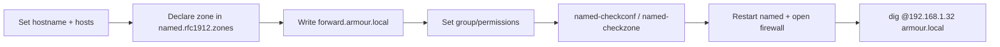

# Forward Zone

A **forward zone** maps hostnames to IP addresses (the `name → address` direction of DNS). This note walks through defining an authoritative forward zone for `armour.local` on a BIND server: setting the hostname, declaring the zone in `named.rfc1912.zones`, writing the zone file, fixing permissions, validating, opening the firewall, and testing resolution.

## Overview

| Step | File / command | Purpose |
| --- | --- | --- |
| Identity | `/etc/hostname`, `/etc/hosts` | Name the DNS server itself |
| Declare zone | `/etc/named.rfc1912.zones` | Register `armour.local` as a master zone |
| Zone data | `/var/named/forward.armour.local` | Define A/NS/CNAME/MX/TXT records |
| Permissions | `chgrp` / `chmod` | Let `named` read the zone file |
| Validate | `named-checkconf`, `named-checkzone` | Catch syntax errors before reload |
| Expose | `ufw` / `firewalld` | Allow port 53 |
| Test | `dig` | Confirm resolution |



## Configuration

### Set hostname

Set the hostname for the DNS server:

```bash
vim /etc/hostname
```

> Example content:

```text
ns1.armour.local
```

### Edit hosts file

Add the hostname mapping in `/etc/hosts`:

```bash
vim /etc/hosts
```

> Example content:

```text
127.0.0.1   localhost ns1 ns1.armour.local
::1         localhost localhost6 ns1 ns1.armour.local
192.168.1.32 ns1 ns1.armour.local
```

### Edit DNS zones configuration

Edit the `named.rfc1912.zones` file to define the forward zone:

```bash
vim /etc/named.rfc1912.zones
```

> Example content:

```conf
// named.rfc1912.zones:
//
// Provided by Red Hat caching-nameserver package
//
// ISC BIND named zone configuration for zones recommended by
// RFC 1912 section 4.1 : localhost TLDs and address zones
// and https://tools.ietf.org/html/rfc6303
// (c)2007 R W Franks
//

zone "localhost.localdomain" IN {
	type master;
	file "named.localhost";
	allow-update { none; };
};

zone "localhost" IN {
	type master;
	file "named.localhost";
	allow-update { none; };
};

zone "1.0.0.0.0.0.0.0.0.0.0.0.0.0.0.0.0.0.0.0.0.0.0.0.0.0.0.0.0.0.0.0.ip6.arpa" IN {
	type master;
	file "named.loopback";
	allow-update { none; };
};

zone "1.0.0.127.in-addr.arpa" IN {
	type master;
	file "named.loopback";
	allow-update { none; };
};

zone "0.in-addr.arpa" IN {
	type master;
	file "named.empty";
	allow-update { none; };
};

zone "armour.local" IN {
	type master;
	file "forward.armour.local";
	allow-update { none; };
};
```

### Create the forward zone file

Copy the example zone file and modify it:

```bash
cd /var/named/
```

```bash
cp -v named.localhost forward.armour.local
```

```bash
vim /var/named/forward.armour.local
```

> Example content:

```text
$TTL 1D
@	IN SOA	ns1.armour.local. root.armour.local. (
					20250313	; serial
					3600		; refresh
					1800		; retry
					604800		; expire
					86400 )		; minimum
@				IN	NS	ns1.armour.local.
ns1				IN	A	192.168.1.32
armour.local.	IN	A	192.168.1.32
www				IN	CNAME	armour.local.
router			IN	A	192.168.1.1
emp1			IN	A	192.168.1.200
emp2			IN	A	192.168.1.201

; Mail exchange
@				IN	MX	10 mail.armour.local.
mail			IN	A	192.168.1.50

; Text record for SPF
@				IN	TXT	"v=spf1 mx a ~all"

; Additional Services
ftp				IN	CNAME	armour.local.
dev				IN	A	192.168.1.100
fileserver		IN	A	192.168.1.110
db				IN	A	192.168.1.120
test			IN	A	192.168.1.130
vpn				IN	A	192.168.1.140
git				IN	A	192.168.1.150
webapp			IN	A	192.168.1.160
logs			IN	A	192.168.1.170
```

> [!IMPORTANT]
> Increment the **serial** number every time you edit the zone file. Secondary servers only pull updates when the serial increases — a common date-based convention is `YYYYMMDDnn`.

### Set permissions

Set the correct permissions for the zone file:

```bash
chgrp named /var/named/forward.armour.local
```

```bash
chmod 640 /var/named/forward.armour.local
```

Restart the `named` service:

```bash
systemctl restart named.service
```

## Validation

### Check configuration

Check the configuration for syntax errors:

```bash
named-checkconf
```

```bash
named-checkconf /etc/named.conf
```

```bash
named-checkconf /etc/named.rfc1912.zones
```

```bash
named-checkconf /etc/named.root.key
```

### Verify the forward zone

Verify the forward zone file:

```bash
named-checkzone armour.local /var/named/forward.armour.local
```

> Output example:

```text
zone armour.local/IN: loaded serial 20250313
OK
```

> [!TIP]
> Always run `named-checkconf` and `named-checkzone` **before** restarting `named`. A syntax error in a zone file can prevent the whole daemon from loading.

## Firewall Configuration

Allow DNS traffic through the firewall.

**UFW:**

```bash
ufw allow 53/tcp
```

```bash
ufw allow 53/udp
```

**Firewalld:**

```bash
firewall-cmd --add-port=53/tcp --permanent
```

```bash
firewall-cmd --add-port=53/udp --permanent
```

```bash
firewall-cmd --reload
```

## Test Resolution

Test forward DNS resolution with `dig`:

```bash
dig @192.168.1.32 armour.local
```

```bash
dig @192.168.1.32 emp1.armour.local
```

```bash
dig @192.168.1.32 ftp.armour.local
```

```bash
dig mx @192.168.1.32 armour.local
```

## Explanation

- `zone "armour.local" IN { ... }`
    - This creates a **forward zone** for the `armour.local` domain.
    - The `file` parameter points to the forward zone file (`forward.armour.local`).

- **Zone Records:**

| Record | Meaning |
| --- | --- |
| `SOA` | Start of Authority record |
| `NS` | Nameserver record |
| `A` | IPv4 address record |
| `CNAME` | Alias record |
| `MX` | Mail exchange record |
| `TXT` | Text record for SPF configuration |

- **Test Commands:**
    - `dig @192.168.1.31` – Queries the DNS server directly.
    - `named-checkzone` – Checks the validity of the zone file.

## References

- RFC 1035 — master (zone) file format and resource records.
- RFC 1912 — Common DNS Operational and Configuration Errors (serial numbering, SOA timers).
- ISC BIND 9 Administrator Reference Manual — writing authoritative zone files.
- `named-checkconf(1)`, `named-checkzone(1)` — configuration and zone validation utilities.

## Related

- [Linux Administration & Server Hardening](../Readme.md) — Linux administration & server hardening hub.
- [Master-Nameserver](Master-Nameserver.md) — the authoritative master server this zone lives on.
- [Reverse-Zone](Reverse-Zone.md) — the PTR companion to this forward zone.
- [Multiple-Zone-Configuration](Multiple-Zone-Configuration.md) — hosting several zones on one server.
- [Dns-Client-Tools](Dns-Client-Tools.md) — `dig` and friends used to test the zone.
- [DNS-Server-Types](DNS-Server-Types.md) — where authoritative forward zones fit overall.
