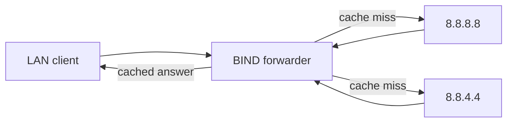

# Forwarders Nameserver

A **forwarders nameserver** hands queries it cannot answer locally to a defined set of upstream resolvers instead of recursing through the DNS hierarchy itself. This centralizes egress DNS traffic, improves cache hit rates across a network, and lets you rely on fast, trusted public resolvers. This note configures forwarders in BIND's `named.conf` and verifies them with `dig` and `tcpdump`.

## Overview

With `forwarders` set, the server's resolution path changes: rather than talking to the root and TLD servers, it asks the listed upstream resolvers and caches their answers.



| Term | Meaning |
| --- | --- |
| `forwarders` | Upstream resolvers to forward unresolved queries to |
| `forward only` | (optional) Never recurse directly — always use forwarders |
| `recursion yes` | Required so the server accepts recursive client queries |

## Configuration

### Edit configuration for forwarders

Edit the `named.conf` file:

```bash
vim /etc/named.conf
```

Here's an example `named.conf` configuration file for setting up forwarders:

```conf
//
// named.conf
//
// Provided by Red Hat bind package to configure the ISC BIND named(8) DNS
// server as a caching only nameserver (as a localhost DNS resolver only).
//
// See /usr/share/doc/bind*/sample/ for example named configuration files.
//

acl ns_ip_add {
	127.0.0.1;
	192.168.1.32;
	192.168.1.40;
	192.168.1.41;
	192.168.1.42;
};

acl mynetwork {
	127.0.0.1;
	192.168.1.0/24;
};

options {
	listen-on port 53 { ns_ip_add; };
	listen-on-v6 port 53 { ::1; };
	directory 	"/var/named";
	dump-file 	"/var/named/data/cache_dump.db";
	statistics-file "/var/named/data/named_stats.txt";
	memstatistics-file "/var/named/data/named_mem_stats.txt";
	secroots-file	"/var/named/data/named.secroots";
	recursing-file	"/var/named/data/named.recursing";
	allow-query     { localhost; mynetwork; };

	/*
	 - If you are building an AUTHORITATIVE DNS server, do NOT enable recursion.
	 - If you are building a RECURSIVE (caching) DNS server, you need to enable
	   recursion.
	 - If your recursive DNS server has a public IP address, you MUST enable access
	   control to limit queries to your legitimate users. Failing to do so will
	   cause your server to become part of large scale DNS amplification
	   attacks. Implementing BCP38 within your network would greatly
	   reduce such attack surface
	*/
	recursion yes;

	forwarders {
		8.8.8.8;
		8.8.4.4;
	};

	dnssec-validation yes;

	managed-keys-directory "/var/named/dynamic";
	geoip-directory "/usr/share/GeoIP";

	pid-file "/run/named/named.pid";
	session-keyfile "/run/named/session.key";

	/* https://fedoraproject.org/wiki/Changes/CryptoPolicy */
	include "/etc/crypto-policies/back-ends/bind.config";
};

logging {
        channel default_debug {
                file "data/named.run";
                severity dynamic;
        };
};

zone "." IN {
	type hint;
	file "named.ca";
};

include "/etc/named.rfc1912.zones";
include "/etc/named.root.key";
```

### Explanation of forwarders

- `forwarders { 8.8.8.8; 8.8.4.4; };`
    - This section tells the DNS server to forward queries it can't resolve locally to Google's public DNS servers (**8.8.8.8** and **8.8.4.4**).
    - Forwarders improve resolution time and efficiency by caching frequently used queries.

> [!WARNING]
> `recursion yes` plus a public IP and an over-broad `allow-query` makes the server an **open resolver**, which is abused in DNS amplification attacks. The ACLs (`mynetwork`) here scope recursion to the local network — keep it that way.

### Restart the BIND service

```bash
systemctl restart named.service
```

## Commands

Use `dig` to test DNS queries:

```bash
dig google.com
```

### Capture DNS traffic using tcpdump

Capture DNS traffic on port 53 using `tcpdump`:

```bash
tcpdump -t udp
```

```bash
tcpdump -i enp0s3 port 53
```

```bash
tcpdump -n udp port 53
```

```bash
tcpdump -t udp -i enp0s3 port 53
```

```bash
tcpdump -n -t udp -i enp0s3 port 53
```

> [!NOTE]
> **📸 Screenshot**
> _Capture: tcpdump on port 53 showing outbound queries from the BIND server to forwarders 8.8.8.8 and 8.8.4.4, and their responses returning_

## Best Practices

- Use `forward only;` when the server must **never** recurse directly (e.g., firewalled networks that only permit DNS egress through approved resolvers).
- List at least two forwarders for redundancy, as shown with `8.8.8.8` and `8.8.4.4`.
- Keep `dnssec-validation yes` so forwarded answers are still validated end-to-end.
- Restrict `allow-query`/`allow-recursion` to internal networks to avoid becoming an open resolver.

## Troubleshooting

| Symptom | Check |
| --- | --- |
| Queries time out | Confirm forwarders are reachable: `dig google.com @8.8.8.8` |
| No forwarding seen | Watch traffic with `tcpdump -n udp port 53` while running a `dig` |
| `SERVFAIL` on all names | Validate config: `named-checkconf /etc/named.conf`; review `/var/named/data/named.run` |
| Clients rejected | Verify the querying host is inside the `mynetwork` ACL |

## References

- ISC BIND 9 Administrator Reference Manual — `forwarders` and `forward` statements.
- RFC 5625 — DNS Proxy Implementation Guidelines.
- BCP 38 / RFC 2827 — Network Ingress Filtering (mitigating DNS amplification source spoofing).
- NIST SP 800-81 — Secure DNS Deployment Guide (recursion and access-control hardening).

## Related

- [Linux Administration & Server Hardening](../Readme.md) — Linux administration & server hardening hub.
- [Caching-Nameserver](Caching-Nameserver.md) — caching pairs naturally with forwarding.
- [DNS-Server-Types](DNS-Server-Types.md) — role overview across nameserver types.
- [Master-Nameserver](Master-Nameserver.md) — the authoritative counterpart.
- [Dns-Client-Tools](Dns-Client-Tools.md) — `dig` and other tools to test forwarding.
