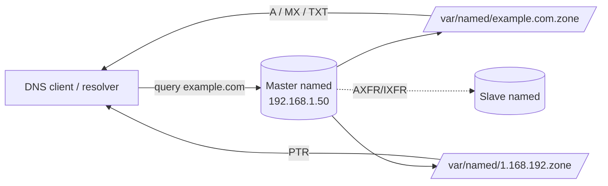

# Master Nameserver

## Overview

A **master** (primary) nameserver is the authoritative source of truth for one or more DNS zones: it loads its records from local **zone files** on disk, answers authoritative queries for those zones, and serves as the origin from which any **slave** (secondary) servers pull copies via zone transfer. This note builds a master server with [BIND](https://www.isc.org/bind/) (`named`) on a Red Hat / CentOS style host, defining both a **forward zone** (`example.com` — name to IP) and a **reverse zone** (`1.168.192.in-addr.arpa` — IP to name) for the `192.168.1.0/24` network.

> [!NOTE]
> Commands below use `yum`/`/etc/named.*` paths typical of RHEL/CentOS/Rocky/AlmaLinux. On Debian/Ubuntu the package is `bind9`, the service is `named` (or `bind9`), and config lives under `/etc/bind/`.

## Concepts

| Term | Meaning |
|------|---------|
| Authoritative | The server holds the definitive records for a zone (not a cached copy). |
| Master / Primary | Loads a zone from a local zone file; the editable origin of the data. |
| Slave / Secondary | Loads the zone by transfer (AXFR/IXFR) from a master; read-only replica. |
| Zone file | A text file of resource records for one zone, stored under `/var/named`. |
| SOA | Start of Authority — serial, refresh, retry, expire, and minimum-TTL timers for the zone. |
| Forward zone | Maps hostnames to addresses (`A`, `AAAA`, `CNAME`, `MX`, `TXT`, …). |
| Reverse zone | Maps addresses back to hostnames via `PTR` records in the `in-addr.arpa` tree. |

## Architecture



## Configuration

### Edit `named.conf`

Edit the main BIND configuration file:

```bash
vim /etc/named.conf
```

Sample master configuration. The `options` block controls the listeners and query ACL; each `zone` block declares an authoritative zone and the file it loads from. Recursion is disabled because this is an **authoritative** server, not a caching resolver.

```conf
//
// named.conf
//
// Provided by Red Hat bind package to configure the ISC BIND named(8) DNS
// server as a caching-only nameserver (as a localhost DNS resolver only).
//
// See /usr/share/doc/bind*/sample/ for example named configuration files.
//
// See the BIND Administrator's Reference Manual (ARM) for details about the
// configuration located in /usr/share/doc/bind-{version}/Bv9ARM.html

options {
	listen-on port 53 { 127.0.0.1; 192.168.1.50; };
	listen-on-v6 port 53 { ::1; };
	directory 	"/var/named";
	dump-file 	"/var/named/data/cache_dump.db";
	statistics-file "/var/named/data/named_stats.txt";
	memstatistics-file "/var/named/data/named_mem_stats.txt";
	recursing-file  "/var/named/data/named.recursing";
	secroots-file   "/var/named/data/named.secroots";
	allow-query     { localhost; 192.168.1.0/24; };

	// Disable recursion for authoritative server
	recursion no;
	dnssec-enable yes;
	dnssec-validation yes;

	/* Path to ISC DLV key */
	bindkeys-file "/etc/named.root.key";

	managed-keys-directory "/var/named/dynamic";

	pid-file "/run/named/named.pid";
	session-keyfile "/run/named/session.key";
};

logging {
        channel default_debug {
                file "data/named.run";
                severity dynamic;
        };
};

// Root Zone
zone "." IN {
	type hint;
	file "named.ca";
};

// Forward Zone for example.com
zone "example.com" IN {
	type master;
	file "/var/named/example.com.zone";
	allow-update { none; };
};

// Reverse Zone for 192.168.1.0/24
zone "1.168.192.in-addr.arpa" IN {
	type master;
	file "/var/named/1.168.192.zone";
	allow-update { none; };
};

include "/etc/named.rfc1912.zones";
include "/etc/named.root.key";
```

> [!IMPORTANT]
> `allow-query { localhost; 192.168.1.0/24; };` restricts who may query the server. Leaving an authoritative server open to the internet with recursion enabled turns it into a **DNS amplification** reflector — keep `recursion no;` on authoritative-only servers and scope `allow-query` to trusted networks (aligns with CIS and BCP38 guidance).

### Create the Forward Zone File

Create the forward zone file `/var/named/example.com.zone`:

```bash
vim /var/named/example.com.zone
```

Example content — the `SOA` timers, the authoritative `NS`, and the `A` records that map names to addresses:

```conf
$TTL 86400
@   IN  SOA  ns1.example.com. admin.example.com. (
            2025031101 ; Serial
            3600       ; Refresh
            1800       ; Retry
            604800     ; Expire
            86400 )    ; Minimum TTL
@       IN  NS    ns1.example.com.
ns1     IN  A     192.168.1.50
www     IN  A     192.168.1.100
```

### Create the Reverse Zone File

Create the reverse zone file `/var/named/1.168.192.zone`:

```bash
vim /var/named/1.168.192.zone
```

Example content — `PTR` records map the host octet back to a fully-qualified hostname:

```conf
$TTL 86400
@   IN  SOA  ns1.example.com. admin.example.com. (
            2025031101 ; Serial
            3600       ; Refresh
            1800       ; Retry
            604800     ; Expire
            86400 )    ; Minimum TTL
@       IN  NS    ns1.example.com.
50      IN  PTR   ns1.example.com.
100     IN  PTR   www.example.com.
```

> [!TIP]
> Increment the **serial** in the `SOA` every time you edit a zone file. Slaves only transfer a zone when the master's serial is higher than their copy. A common convention is `YYYYMMDDnn` (date + change counter).

### Set File Permissions

Ensure the `named` user owns the zone files and that they are not world-readable:

```bash
chown named:named /var/named/example.com.zone
```

```bash
chown named:named /var/named/1.168.192.zone
```

```bash
chmod 640 /var/named/example.com.zone
```

```bash
chmod 640 /var/named/1.168.192.zone
```

## Commands

Start the service now and enable it to start on boot:

```bash
systemctl start named.service
```

```bash
systemctl enable named.service
```

Validate configuration and zone syntax before (and after) restarting — a bad zone file will prevent `named` from loading that zone:

```bash
named-checkconf /etc/named.conf
named-checkzone example.com /var/named/example.com.zone
named-checkzone 1.168.192.in-addr.arpa /var/named/1.168.192.zone
```

## Examples

Use `dig` to confirm the server resolves both forward and reverse queries:

```bash
dig @192.168.1.50 example.com
dig @192.168.1.50 www.example.com
dig -x 192.168.1.100
```

> [!NOTE]
> **📸 Screenshot**
> _Capture: dig output showing the ANSWER SECTION with an A record for www.example.com resolving to 192.168.1.100_

## Firewall Configuration

Allow DNS traffic (TCP and UDP port 53) through the host firewall.

- **UFW:**

```bash
ufw allow 53/tcp
ufw allow 53/udp
```

- **Firewalld:**

```bash
firewall-cmd --add-port=53/tcp --permanent
firewall-cmd --add-port=53/udp --permanent
firewall-cmd --reload
```

> [!NOTE]
> DNS uses **UDP/53** for ordinary queries and **TCP/53** for responses larger than the UDP limit and for zone transfers (AXFR). Both must be open for a fully functional authoritative server.

## Explanation

- `zone "example.com" IN { type master; ... }`
    - This sets up a master DNS server for the **example.com** zone.
    - The `file` parameter points to the zone file containing the DNS records.
- `zone "1.168.192.in-addr.arpa" IN { type master; ... }`
    - This sets up reverse DNS resolution for the IP range **192.168.1.0/24**.
- `dig` commands are used to verify that the DNS server is correctly resolving names and addresses.

## Best Practices

- Bump the `SOA` serial on every zone edit; automate it or you will silently break slave replication.
- Keep at least one slave for redundancy and to survive master downtime.
- Validate with `named-checkconf` / `named-checkzone` in a pre-restart hook or CI check.
- Keep zone files under version control so changes are auditable and reversible.

## Security Considerations

- **Disable recursion** on authoritative servers (`recursion no;`) to avoid becoming an amplification/cache-poisoning vector.
- **Scope `allow-query`** (and `allow-transfer`, see [Slave-DNS-Server](Slave-DNS-Server.md)) to trusted subnets rather than `any`.
- **Restrict zone transfers** — an open AXFR leaks your entire internal namespace to attackers (see DNS-Enumeration).
- **Sign zones with DNSSEC** where integrity of responses matters; `dnssec-validation yes;` validates upstream data.
- Run `named` as the unprivileged `named` user and keep zone files `640 named:named`.

## Troubleshooting

| Symptom | Check |
|---------|-------|
| `named` won't start | `named-checkconf /etc/named.conf` and `journalctl -u named` for the failing zone/line. |
| Zone not loading | `named-checkzone <zone> <file>` — usually a missing trailing dot or a bad serial. |
| Client gets SERVFAIL | Confirm the zone is `type master` and the file is readable by `named`. |
| No answer over the network | Firewall (UDP/TCP 53) and `listen-on` / `allow-query` scope. |

## References

- ISC BIND 9 Administrator Reference Manual (ARM) — `/usr/share/doc/bind-*/Bv9ARM.html`
- RFC 1035 — Domain Names: Implementation and Specification
- RFC 1912 — Common DNS Operational and Configuration Errors

## Related
- [Forward-Zone](Forward-Zone.md) — forward (A) zone child note
- [Reverse-Zone](Reverse-Zone.md) — reverse (PTR) zone child note
- [Multiple-Zone-Configuration](Multiple-Zone-Configuration.md) — serving multiple zones
- [Slave-DNS-Server](Slave-DNS-Server.md) — secondary that transfers from this master
- [DNS-Server-Types](DNS-Server-Types.md) — master/slave/caching/forwarding role overview
- DNS-Enumeration — zone data is the enum/AXFR target
- [Linux Administration & Server Hardening](../Readme.md) — Linux administration & server hardening hub
