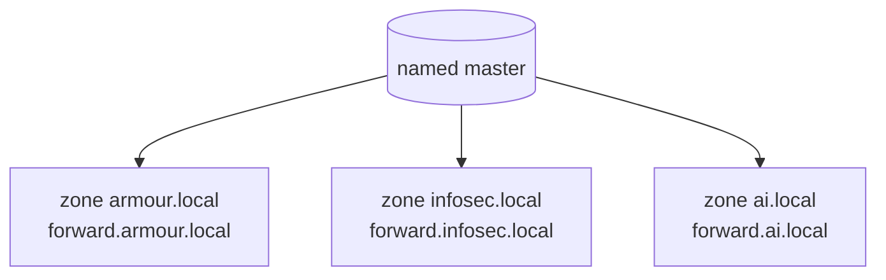

# Multiple Zone Configuration

## Overview

A single BIND master can be authoritative for **many independent zones** at once. Each zone is declared in `named.rfc1912.zones` (or `named.conf`) and backed by its own zone file under `/var/named`. This note extends an existing `armour.local` master with two additional forward zones — `infosec.local` and `ai.local` — following the same declare → create file → set permissions → validate → reload → test cycle for each.

> [!NOTE]
> The workflow is identical per zone; only the zone name, file name, `$ORIGIN`, and records change. Get one zone right and the rest are copy-and-adjust.

## Concepts

| Element | Role |
|---------|------|
| `named.rfc1912.zones` | Where additional `zone { … }` blocks are declared (included by `named.conf`). |
| `type master;` | Marks this server authoritative and loading from a local file. |
| `file "forward.<zone>";` | Path (relative to `/var/named`) of the zone's record file. |
| `allow-update { none; };` | Disables dynamic DNS updates for the zone (static zone file only). |
| `$ORIGIN` | Base domain appended to any non–fully-qualified name in the file. |



## Configuration

### Zone: `infosec.local`

#### Declare the Zone

Edit `named.rfc1912.zones` to add the `infosec.local` zone:

```bash
vim /etc/named.rfc1912.zones
```

Example content:

```conf
zone "infosec.local" IN {
	type master;
	file "forward.infosec.local";
	allow-update { none; };
};
```

#### Create the Forward Zone File

Copy an existing forward zone file as a template, then edit it:

```bash
cp -v /var/named/forward.armour.local /var/named/forward.infosec.local
```

```bash
vim /var/named/forward.infosec.local
```

Example content:

```conf
$TTL 1D
$ORIGIN infosec.local.
@	IN SOA	ns1.armour.local. root.armour.local. (
					002	; serial
					1D	; refresh
					1H	; retry
					1W	; expire
					3H )	; minimum
@					IN	NS	ns1.armour.local.
infosec.local.				IN	A	192.168.1.40
www					IN	CNAME	infosec.local.

; Mail exchange
@					IN	MX	10 mail.armour.local.

; Text record for SPF
@					IN	TXT	"v=spf1 mx a ~all"

; Additional Services
ftp					IN	A	192.168.1.112
dev					IN	A	192.168.1.111
fileserver				IN	A	192.168.1.110
db					IN	A	192.168.1.120
test					IN	A	192.168.1.130
vpn					IN	A	192.168.1.140
git					IN	A	192.168.1.150
webapp					IN	A	192.168.1.160
logs					IN	A	192.168.1.170
```

#### Set Permissions

```bash
chgrp named /var/named/forward.infosec.local
```

```bash
chmod 640 /var/named/forward.infosec.local
```

#### Validate Configuration

```bash
named-checkconf /etc/named.conf
```

```bash
named-checkconf /etc/named.rfc1912.zones
```

```bash
named-checkzone infosec.local /var/named/forward.infosec.local
```

Example output:

```text
zone infosec.local/IN: loaded serial 20250324
OK
```

#### Reload BIND

```bash
systemctl restart named.service
```

#### Test Resolution

```bash
dig infosec.local
```

```bash
dig mx infosec.local
```

```bash
dig txt infosec.local
```

Example output:

```text
; <<>> DiG 9.11.13-RedHat-9.11.13-5.el7 <<>> infosec.local
;; ANSWER SECTION:
infosec.local.		86400	IN	A	192.168.1.200
```

### Zone: `ai.local`

#### Declare the Zone

Edit `named.rfc1912.zones` to add the `ai.local` zone:

```bash
vim /etc/named.rfc1912.zones
```

Example content:

```conf
zone "ai.local" IN {
	type master;
	file "forward.ai.local";
	allow-update { none; };
};
```

#### Create the Forward Zone File

Copy the `infosec.local` zone file and edit it:

```bash
cp -v /var/named/forward.infosec.local /var/named/forward.ai.local
```

```bash
vim /var/named/forward.ai.local
```

Example content:

```conf
$TTL 1D
$ORIGIN ai.local.
@	IN SOA	ns1.armour.local. root.armour.local. (
					002	; serial
					1D	; refresh
					1H	; retry
					1W	; expire
					3H )	; minimum
@				IN	NS	ns1.armour.local.
ai.local.			IN	A	192.168.1.201
www				IN	CNAME	ai.local.

; Mail exchange
@				IN	MX	10 mail.armour.local.

; Text record for SPF
@				IN	TXT	"v=spf1 mx a ~all"

; Additional Services
ftp				IN	A	192.168.1.112
dev				IN	A	192.168.1.111
fileserver			IN	A	192.168.1.110
db				IN	A	192.168.1.120
webapp				IN	A	192.168.1.160
logs				IN	A	192.168.1.170
```

#### Set Permissions

```bash
chgrp named /var/named/forward.ai.local
```

```bash
chmod 640 /var/named/forward.ai.local
```

#### Validate Configuration

```bash
named-checkconf /etc/named.conf
```

```bash
named-checkconf /etc/named.rfc1912.zones
```

```bash
named-checkzone ai.local /var/named/forward.ai.local
```

Example output:

```text
zone ai.local/IN: loaded serial 20250325
OK
```

#### Reload BIND

```bash
systemctl restart named.service
```

#### Test Resolution

```bash
dig ai.local
```

```bash
dig mx ai.local
```

```bash
dig txt ai.local
```

Example output:

```text
; <<>> DiG 9.11.13-RedHat-9.11.13-5.el7 <<>> ai.local
;; ANSWER SECTION:
ai.local.		86400	IN	A	192.168.1.201
```

## Firewall Configuration

Allow DNS traffic through the firewall.

- **UFW:**

```bash
ufw allow 53/tcp
```

```bash
ufw allow 53/udp
```

- **Firewalld:**

```bash
firewall-cmd --add-port=53/tcp --permanent
```

```bash
firewall-cmd --add-port=53/udp --permanent
```

```bash
firewall-cmd --reload
```

## The `$ORIGIN` Directive

The `$ORIGIN` directive in a DNS zone file sets the base domain name for any **relative** records defined in the file.

```conf
$ORIGIN ai.local.
```

- The `$ORIGIN` directive defines the **default domain name** for the zone file.
- Any DNS records that **do not end with a period (`.`)** are automatically appended with the `$ORIGIN` value.

### Example

Given this snippet from the `forward.ai.local` zone file:

```conf
$ORIGIN ai.local.
@	IN	SOA	ns1.armour.local. root.armour.local. (
				002	; serial
				1D	; refresh
				1H	; retry
				1W	; expire
				3H )	; minimum
@			IN	NS	ns1.armour.local.
ai.local.		IN	A	192.168.1.201
www			IN	CNAME	ai.local.
ftp			IN	A	192.168.1.112
```

1. `@` refers to the current `$ORIGIN`, which is `ai.local.`
2. `www IN CNAME ai.local.` becomes `www.ai.local.`
3. `ftp IN A 192.168.1.112` becomes `ftp.ai.local.`

Without `$ORIGIN` you would have to write every name in fully-qualified form:

```conf
www.ai.local.	IN	CNAME	ai.local.
ftp.ai.local.	IN	A	192.168.1.112
```

### Purpose of `$ORIGIN`

- Avoids repeating the full domain name on every record.
- Simplifies the zone file and makes it easier to manage.
- Ensures consistency and reduces errors.

> [!TIP]
> A trailing dot means "fully qualified — do not append `$ORIGIN`." Forgetting the dot on an `NS`, `CNAME`, or `MX` target is the single most common zone-file bug.

## Best Practices

- Give each zone its own serial and bump it on every edit — one stale serial breaks that zone's slave replication independently of the others.
- Name zone files predictably (`forward.<zone>`, `reverse.<zone>`) so operations scale as zones multiply.
- Run `named-checkzone` for **every** zone after any change; a single broken file only stops its own zone from loading, which is easy to miss.

## Security Considerations

- Each new zone widens the authoritative namespace an attacker can enumerate; scope `allow-query` and `allow-transfer` per zone (see DNS-Enumeration).
- Keep `allow-update { none; };` unless you specifically need dynamic DNS — open updates allow record injection.
- Keep every zone file `640 named:named`.

## Troubleshooting

| Symptom | Check |
|---------|-------|
| One zone missing, others fine | `named-checkzone <zone> <file>` for the broken one; check its serial and trailing dots. |
| `named` won't restart at all | `named-checkconf` — a syntax error in one `zone { }` block blocks the whole reload. |
| Name resolves to the wrong host | Missing `$ORIGIN` or missing trailing dot appending the origin unexpectedly. |

## References

- RFC 1035 — Domain Names: Implementation and Specification
- RFC 1912 — Common DNS Operational and Configuration Errors
- ISC BIND 9 Administrator Reference Manual

## Related
- [Master-Nameserver](Master-Nameserver.md) — parent master server config
- [Forward-Zone](Forward-Zone.md) — per-zone forward config
- [Reverse-Zone](Reverse-Zone.md) — per-zone reverse config
- [Slave-DNS-Server](Slave-DNS-Server.md) — replicating multiple zones to a secondary
- [DNS-Server-Types](DNS-Server-Types.md) — server role overview
- DNS-Enumeration — multiple zones widen the enum surface
- [Linux Administration & Server Hardening](../Readme.md) — Linux administration & server hardening hub
