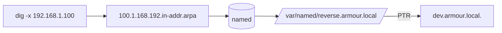

# Reverse Zone

## Overview

A **reverse zone** answers the opposite question of a forward zone: given an IP address, what hostname owns it? BIND implements this with `PTR` (pointer) records held in a specially-named zone under the `in-addr.arpa` tree. This note adds a reverse zone for the `192.168.1.0/24` network — declared as `1.168.192.in-addr.arpa` (the network octets reversed) — to an existing `armour.local` master.

> [!NOTE]
> Reverse DNS is not just cosmetic: mail servers, SSH `UseDNS`, logging pipelines, and many security tools perform reverse lookups. Missing or mismatched `PTR` records commonly cause mail rejection and slow SSH logins.

## Concepts

| Element | Purpose |
|---------|---------|
| `in-addr.arpa` | The special DNS tree used for IPv4 reverse mapping. |
| Reversed octets | `192.168.1.0/24` → zone `1.168.192.in-addr.arpa`; the network portion is written most-significant-last. |
| `PTR` record | Maps the final octet(s) back to a fully-qualified hostname (with a trailing dot). |
| `SOA` / `NS` | Same authority and timer semantics as a forward zone. |



## Configuration

### Declare the Reverse Zone

Edit `named.rfc1912.zones` to define the reverse zone:

```bash
vim /etc/named.rfc1912.zones
```

Example content — the reverse zone is added alongside the RFC 1912 defaults and the existing forward zone:

```conf
// named.rfc1912.zones:
//
// Provided by Red Hat caching-nameserver package
//
// ISC BIND named zone configuration for zones recommended by
// RFC 1912 section 4.1 : localhost TLDs and address zones
// and http://www.ietf.org/internet-drafts/draft-ietf-dnsop-default-local-zones-02.txt
// (c)2007 R W Franks
//

zone "localhost.localdomain" IN {
	type master;
	file "named.localhost";
	allow-update { none; };
};

zone "localhost" IN {
	type master;
	file "named.localhost";
	allow-update { none; };
};

zone "1.0.0.0.0.0.0.0.0.0.0.0.0.0.0.0.0.0.0.0.0.0.0.0.0.0.0.0.0.0.0.0.ip6.arpa" IN {
	type master;
	file "named.loopback";
	allow-update { none; };
};

zone "1.0.0.127.in-addr.arpa" IN {
	type master;
	file "named.loopback";
	allow-update { none; };
};

zone "0.in-addr.arpa" IN {
	type master;
	file "named.empty";
	allow-update { none; };
};

zone "armour.local" IN {
	type master;
	file "forward.armour.local";
	allow-update { none; };
};

zone "1.168.192.in-addr.arpa" IN {
	type master;
	file "reverse.armour.local";
	allow-update { none; };
};
```

### Create the Reverse Zone File

Change into the zone directory:

```bash
cd /var/named/
```

Copy the forward zone file as a starting point and edit it for reverse mapping:

```bash
cp -v /var/named/forward.armour.local /var/named/reverse.armour.local
```

```bash
vim /var/named/reverse.armour.local
```

Example content — note that each `PTR` maps only the **host octet** to a fully-qualified name:

```conf
$TTL 1D
@	IN SOA	ns1.armour.local. root.armour.local. (
					20250313	; serial
					3600		; refresh
					1800		; retry
					604800		; expire
					86400 )		; minimum
@			IN	NS	ns1.armour.local.
@			IN	PTR	ns1.armour.local.

32			IN	PTR	ns1.armour.local.
1			IN	PTR	router.armour.local.
200			IN	PTR	emp1.armour.local.
201			IN	PTR	emp2.armour.local.
```

> [!TIP]
> Every hostname on the right-hand side of a `PTR` must be fully qualified and end with a trailing dot, or BIND will append the zone origin and produce a broken name such as `ns1.armour.local.1.168.192.in-addr.arpa.`.

### Set Permissions

Set correct ownership and mode on the reverse zone file:

```bash
chgrp named /var/named/reverse.armour.local
```

```bash
chmod 640 /var/named/reverse.armour.local
```

## Commands

Restart BIND to load the new zone:

```bash
systemctl restart named.service
```

Check the main configuration for syntax errors:

```bash
named-checkconf /etc/named.conf
```

Verify the reverse zone file loads cleanly:

```bash
named-checkzone 1.168.192.in-addr.arpa /var/named/reverse.armour.local
```

Example output:

```text
zone 1.168.192.in-addr.arpa/IN: loaded serial 20250313
OK
```

## Firewall Configuration

Allow DNS traffic through the firewall.

- **UFW:**

```bash
ufw allow 53/tcp
```

```bash
ufw allow 53/udp
```

- **Firewalld:**

```bash
firewall-cmd --add-port=53/tcp --permanent
```

```bash
firewall-cmd --add-port=53/udp --permanent
```

```bash
firewall-cmd --reload
```

## Examples

Test reverse DNS resolution with `dig -x`:

```bash
dig -x 192.168.1.32
```

```bash
dig -x 192.168.1.200
```

Example output:

```text
; <<>> DiG 9.11.13-RedHat-9.11.13-5.el7 <<>> -x 192.168.1.100
;; ANSWER SECTION:
100.1.168.192.in-addr.arpa. 86400 IN PTR dev.armour.local.
```

> [!NOTE]
> **📸 Screenshot**
> _Capture: dig -x output showing a PTR record for 192.168.1.100 resolving to dev.armour.local_

## Explanation

- `zone "1.168.192.in-addr.arpa" IN { ... }`
    - This creates a reverse zone for the `192.168.1.x` network.
    - The `file` parameter points to the reverse zone file (`reverse.armour.local`).
- PTR Records:
    - `PTR` – Maps an IP address to a hostname.
- Test Commands:
    - `dig -x 192.168.1.100` – Queries the DNS server for reverse resolution.
    - `named-checkzone` – Checks the validity of the reverse zone file.

## Best Practices

- Keep forward and reverse records consistent — every `A` record that matters should have a matching `PTR` (forward-confirmed reverse DNS).
- Increment the `SOA` serial on every edit so slaves replicate the change.
- One reverse zone per `/24` keeps naming and delegation simple; use classless delegation (RFC 2317) only when you own less than a full octet.

## Security Considerations

- Reverse zones reveal internal host naming; restrict `allow-transfer` so attackers can't AXFR the whole `in-addr.arpa` map (see DNS-Enumeration).
- Do not rely on `PTR` records for authentication — they are set by whoever controls the address block and are trivially spoofable in untrusted networks.
- Keep the reverse file `640 named:named`, same as forward zones.

## Troubleshooting

| Symptom | Check |
|---------|-------|
| `dig -x` returns NXDOMAIN | Zone name octets reversed correctly? `PTR` present for that host octet? |
| Zone fails to load | `named-checkzone 1.168.192.in-addr.arpa /var/named/reverse.armour.local`. |
| PTR resolves to a mangled name | Missing trailing dot on the target hostname. |
| Slave has no reverse zone | Confirm `allow-transfer` on master includes the slave and serial was bumped. |

## References

- RFC 1035 — Domain Names (PTR records, in-addr.arpa)
- RFC 2317 — Classless IN-ADDR.ARPA delegation
- ISC BIND 9 Administrator Reference Manual

## Related
- [Forward-Zone](Forward-Zone.md) — forward (A) companion zone
- [Master-Nameserver](Master-Nameserver.md) — parent master server config
- [Multiple-Zone-Configuration](Multiple-Zone-Configuration.md) — hosting several zones
- [Slave-DNS-Server](Slave-DNS-Server.md) — replicating reverse zones to a secondary
- DNS-Enumeration — PTR/reverse lookups in enumeration
- [Linux Administration & Server Hardening](../Readme.md) — Linux administration & server hardening hub
