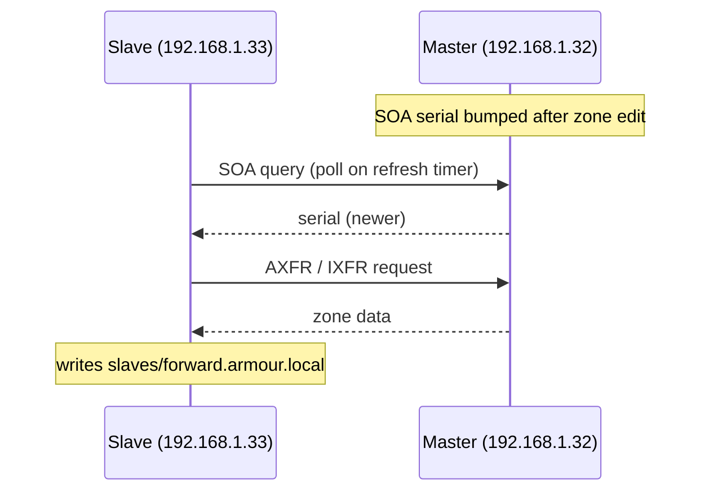

# Slave DNS Server

## Overview

This guide covers the configuration of a **master (primary)** DNS server and a **slave (secondary)** DNS server using **BIND** (Berkeley Internet Name Domain). The master loads its zones from local files and answers authoritatively; the slave holds no local zone data of its own — it pulls a read-only copy of each zone from the master over a **zone transfer** (AXFR/IXFR) and serves it identically. Running a slave gives you redundancy, load distribution, and continued name resolution if the master goes down.

## Server Details

| Role | IP Address | Description |
|-------|------------|-------------|
| Master DNS | 192.168.1.32 | Primary DNS server (`ns1.armour.local`) |
| Slave DNS | 192.168.1.33 | Secondary DNS server (`ns2.armour.local`) |
| Domain Name | `armour.local` | Example domain (also `infosec.local`, `ai.local`) |

## Concepts

| Term | Meaning |
|------|---------|
| `type master;` | Loads the zone from a local file; the authoritative origin. |
| `type slave;` | Loads the zone by transfer from a master; stored under `slaves/`. |
| `allow-transfer { ip; };` | On the master: which servers may pull the zone via AXFR. |
| `masters { ip; };` | On the slave: where to fetch the zone from. |
| AXFR / IXFR | Full / incremental zone transfer, triggered when the master's `SOA` serial increases. |



## Master DNS Configuration

### Step 1: Set the Hostname

Set the hostname for the master DNS server:

```bash
hostnamectl set-hostname ns1.armour.local
```

### Step 2: Install BIND

Install the BIND package:

```bash
yum install bind
```

### Step 3: Configure the DNS Zones

Edit the zone configuration file:

```bash
vim /etc/named.rfc1912.zones
```

Example configuration — note `allow-transfer` restricts transfers to the slave's IP (`192.168.1.33`):

```conf
zone "armour.local" IN {
    type master;
    file "forward.armour.local";
    allow-update { none; };
    allow-transfer { 192.168.1.33; };
};

zone "infosec.local" IN {
    type master;
    file "forward.infosec.local";
    allow-update { none; };
    allow-transfer { 192.168.1.33; };
};

zone "ai.local" IN {
    type master;
    file "forward.ai.local";
    allow-update { none; };
    allow-transfer { 192.168.1.33; };
};
```

> [!IMPORTANT]
> `allow-transfer { 192.168.1.33; };` is what makes this a controlled master/slave pair. Never leave zone transfers open to `any` — an unrestricted AXFR hands your entire internal namespace to anyone who asks (see DNS-Enumeration).

### Step 4: Create the Zone Files

Create the forward lookup zone files.

#### Forward Zone for `armour.local`

```bash
vim /var/named/forward.armour.local
```

Example content:

```conf
$TTL 1D
@	IN SOA	ns1.armour.local. root.armour.local. (
					20250313	; serial
					3600		; refresh
					1800		; retry
					604800		; expire
					86400 )		; minimum
@				IN	NS	ns1.armour.local.
@				IN	NS	ns2.armour.local.
ns1				IN	A	192.168.1.32
ns2				IN	A	192.168.1.33
armour.local.	IN	A	192.168.1.32
www				IN	CNAME	armour.local.
router			IN	A	192.168.1.1
emp1			IN	A	192.168.1.200
emp2			IN	A	192.168.1.201

; Mail exchange
@				IN	MX	10 mail.armour.local.
mail			IN	A	192.168.1.50

; Text record for SPF
@				IN	TXT	"v=spf1 mx a ~all"

; Additional Services
ftp				IN	CNAME	armour.local.
dev				IN	A	192.168.1.100
fileserver		IN	A	192.168.1.110
db				IN	A	192.168.1.120
test			IN	A	192.168.1.130
vpn				IN	A	192.168.1.140
git				IN	A	192.168.1.150
webapp			IN	A	192.168.1.160
logs			IN	A	192.168.1.170
```

#### Forward Zone for `infosec.local`

```bash
vim /var/named/forward.infosec.local
```

Example content:

```conf
$TTL 1D
$ORIGIN infosec.local.
@	IN SOA	ns1.armour.local. root.armour.local. (
					002	; serial
					1D	; refresh
					1H	; retry
					1W	; expire
					3H )	; minimum
@					IN	NS	ns1.armour.local.
@					IN	NS	ns2.armour.local.
infosec.local.				IN	A	192.168.1.40
www					IN	CNAME	infosec.local.

; Mail exchange
@					IN	MX	10 mail.armour.local.

; Text record for SPF
@					IN	TXT	"v=spf1 mx a ~all"

; Additional Services
ftp					IN	A	192.168.1.112
dev					IN	A	192.168.1.111
fileserver				IN	A	192.168.1.110
db					IN	A	192.168.1.120
test					IN	A	192.168.1.130
vpn					IN	A	192.168.1.140
git					IN	A	192.168.1.150
webapp					IN	A	192.168.1.160
logs					IN	A	192.168.1.170
```

#### Forward Zone for `ai.local`

```bash
vim /var/named/forward.ai.local
```

Example content:

```conf
$TTL 1D
$ORIGIN ai.local.
@	IN SOA	ns1.armour.local. root.armour.local. (
					002	; serial
					1D	; refresh
					1H	; retry
					1W	; expire
					3H )	; minimum
@				IN	NS	ns1.armour.local.
@				IN	NS	ns2.armour.local.
ai.local.			IN	A	192.168.1.201
www				IN	CNAME	ai.local.

; Mail exchange
@				IN	MX	10 mail.armour.local.

; Text record for SPF
@				IN	TXT	"v=spf1 mx a ~all"

; Additional Services
ftp				IN	A	192.168.1.112
dev				IN	A	192.168.1.111
fileserver			IN	A	192.168.1.110
db				IN	A	192.168.1.120
webapp				IN	A	192.168.1.160
logs				IN	A	192.168.1.170
```

### Step 5: Configure Firewall Rules (Firewalld)

Allow DNS traffic (TCP and UDP port 53):

```bash
firewall-cmd --permanent --add-port=53/tcp
```

```bash
firewall-cmd --permanent --add-port=53/udp
```

```bash
firewall-cmd --reload
```

### Step 6: Validate Configuration

Check the configuration and zone files:

```bash
named-checkconf
```

```bash
named-checkconf /etc/named.conf
```

```bash
named-checkconf /etc/named.rfc1912.zones
```

```bash
named-checkzone armour.local /var/named/forward.armour.local
```

```bash
named-checkzone infosec.local /var/named/forward.infosec.local
```

```bash
named-checkzone ai.local /var/named/forward.ai.local
```

### Step 7: Start and Enable BIND

Start the service and enable it on boot:

```bash
systemctl restart named.service
```

```bash
systemctl enable named.service
```

## Slave DNS Configuration

### Step 1: Set the Hostname

Set the hostname for the slave DNS server:

```bash
hostnamectl set-hostname ns2.armour.local
```

### Step 2: Install BIND

Install the BIND package:

```bash
yum install bind
```

### Step 3: Configure `/etc/hosts`

Edit the `/etc/hosts` file:

```bash
vim /etc/hosts
```

Example content:

```conf
127.0.0.1   localhost ns2 ns2.armour.local
::1         localhost localhost6 ns2 ns2.armour.local
192.168.1.33 ns2 ns2.armour.local
```

### Step 4: Configure `/etc/named.conf`

Edit the `/etc/named.conf` file:

```bash
vim /etc/named.conf
```

Example content — the slave listens on its own IP and serves the `192.168.1.0/24` subnet:

```conf
//
// named.conf
//
// Provided by Red Hat bind package to configure the ISC BIND named(8) DNS
// server as a caching only nameserver (as a localhost DNS resolver only).
//
// See /usr/share/doc/bind*/sample/ for example named configuration files.
//

options {
	listen-on port 53 { 127.0.0.1; 192.168.1.33; };
	listen-on-v6 port 53 { ::1; };
	directory 	"/var/named";
	dump-file 	"/var/named/data/cache_dump.db";
	statistics-file "/var/named/data/named_stats.txt";
	memstatistics-file "/var/named/data/named_mem_stats.txt";
	secroots-file	"/var/named/data/named.secroots";
	recursing-file	"/var/named/data/named.recursing";
	allow-query     { localhost; 192.168.1.0/24; };

	/*
	 - If you are building an AUTHORITATIVE DNS server, do NOT enable recursion.
	 - If you are building a RECURSIVE (caching) DNS server, you need to enable
	   recursion.
	 - If your recursive DNS server has a public IP address, you MUST enable access
	   control to limit queries to your legitimate users. Failing to do so will
	   cause your server to become part of large scale DNS amplification
	   attacks. Implementing BCP38 within your network would greatly
	   reduce such attack surface
	*/
	recursion yes;

	dnssec-validation yes;

	managed-keys-directory "/var/named/dynamic";
	geoip-directory "/usr/share/GeoIP";

	pid-file "/run/named/named.pid";
	session-keyfile "/run/named/session.key";

	/* https://fedoraproject.org/wiki/Changes/CryptoPolicy */
	include "/etc/crypto-policies/back-ends/bind.config";
};

logging {
        channel default_debug {
                file "data/named.run";
                severity dynamic;
        };
};

zone "." IN {
	type hint;
	file "named.ca";
};

include "/etc/named.rfc1912.zones";
include "/etc/named.root.key";
```

### Step 5: Configure the Zones on the Slave

Edit the zone configuration file. Each zone is `type slave`, points at the master, and stores its copy under `slaves/`:

```bash
vim /etc/named.rfc1912.zones
```

Example content:

```conf
zone "armour.local" IN {
    type slave;
    masters { 192.168.1.32; };
    file "slaves/forward.armour.local";
};

zone "infosec.local" IN {
    type slave;
    masters { 192.168.1.32; };
    file "slaves/forward.infosec.local";
};

zone "ai.local" IN {
    type slave;
    masters { 192.168.1.32; };
    file "slaves/forward.ai.local";
};
```

> [!NOTE]
> The `file "slaves/…"` paths must be writable by `named` because the slave writes the transferred zone there. The `slaves/` directory ships with the BIND package and is owned by `named`.

### Step 6: Configure Firewall Rules (Firewalld)

Allow DNS traffic (TCP and UDP port 53):

```bash
firewall-cmd --permanent --add-port=53/tcp
```

```bash
firewall-cmd --permanent --add-port=53/udp
```

```bash
firewall-cmd --reload
```

### Step 7: Validate Configuration

Check the configuration files:

```bash
named-checkconf
```

```bash
named-checkconf /etc/named.conf
```

```bash
named-checkconf /etc/named.rfc1912.zones
```

### Step 8: Start and Enable BIND

Start the service and enable it on boot:

```bash
systemctl restart named.service
```

```bash
systemctl enable named.service
```

### Step 9: Test DNS Resolution

Query each zone directly against the slave (`@192.168.1.33`):

```bash
dig armour.local @192.168.1.33
```

```bash
dig infosec.local  @192.168.1.33
```

```bash
dig ai.local  @192.168.1.33
```

> [!NOTE]
> **📸 Screenshot**
> _Capture: dig armour.local @192.168.1.33 returning the same ANSWER SECTION as the master, confirming the zone transferred successfully_

## Best Practices

- Bump the master's `SOA` serial on **every** zone edit — the slave only transfers when the serial increases.
- List every slave in `allow-transfer` and every master in the slave's `masters { }`.
- Tune the `SOA` `refresh`/`retry`/`expire` timers so slaves poll frequently enough for your change cadence without hammering the master.
- Add `also-notify` / keep `notify yes` so the master pushes NOTIFY messages and slaves update near-instantly instead of waiting for the refresh timer.

## Security Considerations

- **Restrict `allow-transfer`** to known slave IPs (or better, TSIG keys) — open AXFR is a top DNS enumeration finding.
- **Authenticate transfers with TSIG** in untrusted networks so a spoofed source IP can't impersonate the master or the slave.
- Keep authoritative servers non-recursive; the sample enables `recursion yes;` for a lab resolver — set `recursion no;` on internet-facing authoritative servers to avoid amplification abuse.
- Scope `allow-query` to trusted subnets and keep `dnssec-validation yes;` to validate upstream data.

## Troubleshooting

Check the service status:

```bash
systemctl status named.service
```

Check that `named` is listening on port 53:

```bash
netstat -nltup | grep named
```

Test external and slave resolution:

```bash
dig google.com
```

```bash
dig google.com @192.168.1.33
```

| Symptom | Likely cause / check |
|---------|----------------------|
| Slave has empty/old zone | Master serial not bumped, or slave IP not in `allow-transfer`; check `journalctl -u named` for `transfer failed`. |
| `slaves/` file not written | Directory not writable by `named`, or SELinux denial (`ausearch -m avc -c named`). |
| Slave answers SERVFAIL | Transfer never completed; verify TCP/53 is open between the two hosts. |
| Both servers disagree | Serial mismatch — force a refresh with `rndc retransfer <zone>` on the slave. |

## Conclusion

This completes the setup of a master and slave DNS server using BIND. Confirm that each zone resolves identically from both servers and that firewall rules permit TCP/UDP 53 between the master, the slave, and clients.

## References

- ISC BIND 9 Administrator Reference Manual — zone transfers, `allow-transfer`, TSIG
- RFC 5936 — DNS Zone Transfer Protocol (AXFR)
- RFC 1996 — A Mechanism for Prompt Notification of Zone Changes (NOTIFY)
- RFC 2845 — Secret Key Transaction Authentication for DNS (TSIG)

## Related
- [Master-Nameserver](Master-Nameserver.md) — master this slave replicates from
- [Multiple-Zone-Configuration](Multiple-Zone-Configuration.md) — the zones transferred here
- [Reverse-Zone](Reverse-Zone.md) — reverse zones also replicate to the slave
- [DNS-Server-Types](DNS-Server-Types.md) — master/slave/caching/forwarding role overview
- DNS-Enumeration — zone transfers (AXFR) are an enumeration vector
- [Linux Administration & Server Hardening](../Readme.md) — Linux administration & server hardening hub
