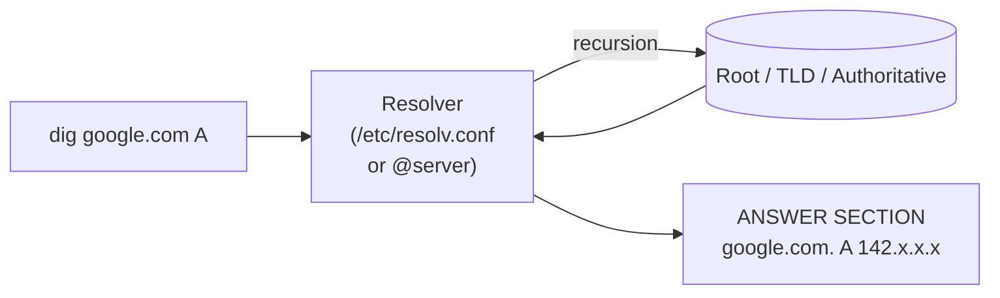

# dig

## Overview

`dig` (Domain Information Groper) is the reference DNS lookup tool shipped with BIND's client utilities (`bind-utils`). It queries DNS servers for host addresses, mail exchanges, name servers, and any other record type, and prints a verbose, structured answer that mirrors the wire format. Because its output is precise and scriptable, `dig` is the tool of choice for verifying a nameserver you have just configured (see [Master-Nameserver](Master-Nameserver.md) and [Slave-DNS-Server](Slave-DNS-Server.md)) and for DNS reconnaissance during an engagement (see DNS-Enumeration).

This note covers everyday `dig` usage: querying specific record types, controlling output verbosity, batching lookups from a file, and performing reverse (`PTR`) lookups.

> [!TIP]
> By default `dig` queries the resolver(s) listed in `/etc/resolv.conf`. Append `@<server>` to any query to bypass that and ask a specific server directly — invaluable when testing your own authoritative server versus a public resolver.

## Concepts

`dig`'s answer is divided into named sections. Understanding them makes the output-control flags below intuitive:

| Section | Contents |
|---------|----------|
| Header / comments | Opcode, status (`NOERROR`, `NXDOMAIN`, `SERVFAIL`), flags, and section counts. |
| Question | The exact name and record type that was asked for. |
| Answer | The records that directly answer the query (the part you usually want). |
| Authority | The authoritative name servers for the zone. |
| Additional | Glue records and other helpful extras (e.g. `A` records for `NS` targets). |
| Stats | Query time, the server that answered, and the timestamp. |

### Common DNS Record Types

| Type | Purpose |
|------|---------|
| `A` | IPv4 address of a host. |
| `AAAA` | IPv6 address of a host. |
| `NS` | Authoritative name servers for the zone. |
| `MX` | Mail exchange servers (with priority). |
| `SOA` | Start of Authority — zone serial and timer values. |
| `TXT` | Free-form text records (SPF, DKIM, verification tokens). |
| `PTR` | Reverse mapping from IP address to hostname. |
| `HINFO` | Host information (CPU/OS); rarely published today. |
| `ANY` | Requests all record types the server will return. |



## Basic `dig` Commands

### Perform a Basic DNS Lookup

Use `dig` without any arguments to get the 13 root servers:

```bash
dig
```

### Lookup a Specific Domain

Query DNS records for a specific domain:

```bash
dig google.com
```

### Query a Specific DNS Server

Query `google.com` using a specific DNS server:

```bash
dig google.com @64.6.64.6
```

> [!TIP]
> Use `@<server>` to compare answers from two resolvers — for example your freshly configured master (`@192.168.1.32`) against a public resolver — to confirm your zone data is being served correctly.

## Query Specific DNS Record Types

The record type can be given either after the domain (`dig google.com A`) or before it (`dig A google.com`); both forms are equivalent.

### A Record (IPv4)

Query the IPv4 address of a domain:

```bash
dig google.com A
```

or:

```bash
dig A google.com
```

### AAAA Record (IPv6)

Query the IPv6 address of a domain:

```bash
dig google.com AAAA
```

or:

```bash
dig AAAA google.com
```

### NS Record (Name Server)

Query the name server for a domain:

```bash
dig google.com NS
```

or:

```bash
dig ns google.com
```

### MX Record (Mail Exchange)

Query the mail exchange server for a domain:

```bash
dig google.com MX
```

### SOA Record (Start of Authority)

Query the SOA record for a domain:

```bash
dig google.com SOA
```

### TXT Record (Text)

Query TXT records for a domain:

```bash
dig google.com TXT
```

### ANY Record (All available records)

Retrieve all available DNS records for a domain:

```bash
dig google.com ANY
```

### HINFO Record (Host Information)

Query the HINFO record for a domain:

```bash
dig armourinfosec.com HINFO
```

> [!NOTE]
> Many resolvers now answer `ANY` queries with a minimal `HINFO`/`RRSET` refusal (RFC 8482) to curb reflection/amplification abuse, so `dig <domain> ANY` may return far less than every record. Query specific types when you need reliable results.

## Shortened Output

### Short Answer Format

`+short` strips everything except the answer values — ideal for scripting and quick checks.

Display a simplified output:

```bash
dig google.com +short
```

A Record in short format:

```bash
dig armourinfosec.com A +short
```

AAAA Record in short format:

```bash
dig armourinfosec.com AAAA +short
```

NS Record in short format:

```bash
dig armourinfosec.com NS +short
```

MX Record in short format:

```bash
dig armourinfosec.com MX +short
```

ANY Record in short format:

```bash
dig google.com ANY +short
```

## Customizing Output

`dig` builds its output from independent section toggles. Prefix a section name with `no` to hide it, or use `+noall` to clear everything and then re-enable only the sections you want.

| Flag | Effect |
|------|--------|
| `+short` | Answer values only (no sections). |
| `+noall` | Suppress every section (a clean slate to build on). |
| `+answer` | Show the answer section. |
| `+question` | Show the question section. |
| `+nocomments` | Hide the header comment lines. |
| `+noquestion` | Hide the question section. |
| `+noauthority` | Hide the authority section. |
| `+noadditional` | Hide the additional section. |
| `+nostats` | Hide the trailing statistics. |

Suppress all output:

```bash
dig google.com +noall
```

Display only the answer section:

```bash
dig google.com +noall +answer
```

Display the question and answer sections:

```bash
dig google.com +noall +answer +question
```

Suppress comments, questions, authority, additional, and stats sections:

```bash
dig google.com +nocomments +noquestion +noauthority +noadditional +nostats
```

## Bulk DNS Lookup

### Create a File with Domains

Create a file named `domain_list.txt`:

```bash
vim domain_list.txt
```

Example content:

```text
google.com
facebook.com
armourinfosec.com
youtube.com
```

### Query Multiple Domains from a File

Use `dig` to query all domains listed in the file:

```bash
dig -f domain_list.txt
```

### Shortened Output for Multiple Domains

Get a simplified output for all domains:

```bash
dig -f domain_list.txt +short
```

### Save Output to a File

Save the output to a file:

```bash
dig -f domain_list.txt +short > ip_add_list.txt
```

## Reverse DNS Lookup

### Reverse Lookup (PTR Record)

A reverse lookup resolves an IP address back to a hostname via its `PTR` record. `dig -x` builds the `in-addr.arpa` query name for you (see [Reverse-Zone](Reverse-Zone.md) for how the server side is configured).

Find the hostname associated with an IP address:

```bash
dig -x 8.8.8.8
```

or:

```bash
dig -x 8.8.8.8 PTR
```

Shortened reverse lookup output:

```bash
dig -x 8.8.8.8 +short
```

## Reverse Lookup Using Bulk IPs

### Create a File with IP Addresses

Create a file named `ip_add_list2.txt`:

```bash
vim ip_add_list2.txt
```

Example content:

```text
8.8.8.8
64.6.64.6
8.8.4.4
1.1.1.1
20.20.20.20
```

### Generate `-x` Format

`dig -f` reads one query per line, so each IP must be prefixed with `-x` before it can be batch-resolved.

Convert IPs to `-x` format using `awk`:

```bash
awk '$0="-x " $0' ip_add_list2.txt > ip_add_list3.txt
```

Convert IPs to `-x` format using `sed`:

```bash
cat ip_add_list2.txt | sed -e "s/.*/-x &/" > ip_add_list4.txt
```

### Query Reverse DNS for Multiple IPs

Perform reverse lookups using the modified file:

```bash
dig -f ip_add_list3.txt +short
```

Query reverse DNS from an IP list file:

```bash
dig -f ip_add_list4.txt +short
```

## Best Practices

- Use `+short` in scripts and `+noall +answer` for readable-but-concise interactive checks.
- Always confirm a new zone with `dig <name> @<your-server>` before relying on the default resolver, which may still be serving a cached answer.
- Watch the header `status:` field — `NOERROR` with an empty answer, `NXDOMAIN`, and `SERVFAIL` mean very different things when troubleshooting.

## Security Considerations

- `dig` is a primary DNS reconnaissance tool: record enumeration, `NS`/`MX`/`TXT` harvesting, and reverse-sweep mapping all start here. Restrict what your own servers reveal — scope `allow-query` and lock down `allow-transfer` (see DNS-Enumeration).
- Attempt a zone transfer against a target with `dig AXFR <domain> @<server>`; a server that answers is misconfigured and hands over its entire namespace.
- Prefer specific record queries over `ANY` — many resolvers refuse `ANY` (RFC 8482), and blasting `ANY` at open resolvers is a known DNS amplification/reflection vector.

## Troubleshooting

| Symptom | Likely cause / check |
|---------|----------------------|
| `connection timed out; no servers could be reached` | Wrong `@server`, or UDP/TCP 53 blocked by a firewall between you and the resolver. |
| `status: NXDOMAIN` | The name genuinely does not exist in the zone — check spelling and the `$ORIGIN`/trailing dots on the server. |
| `status: SERVFAIL` | The authoritative server failed (bad zone load, failed transfer, or DNSSEC validation failure). |
| Empty answer but `NOERROR` | The name exists but has no record of that type; try a different type or `ANY`. |
| Reverse lookup returns nothing | No `PTR` record for that address, or the reverse zone is not delegated to the server you queried. |

## References

- ISC BIND 9 Administrator Reference Manual — `dig` and the `bind-utils` client tools
- RFC 1035 — Domain Names: Implementation and Specification
- RFC 8482 — Providing Minimal-Sized Responses to DNS Queries That Have QTYPE=ANY

## Related
- [host](host.md) — sibling DNS client tool
- [nslookup](nslookup.md) — sibling DNS client tool
- [Dns-Client-Tools](Dns-Client-Tools.md) — parent DNS client tools note
- [Master-Nameserver](Master-Nameserver.md) — verify a master server's zones with `dig`
- [Reverse-Zone](Reverse-Zone.md) — server-side setup behind `dig -x` lookups
- DNS-Enumeration — `dig` is core to DNS enumeration
- [Linux Administration & Server Hardening](../Readme.md) — Linux administration & server hardening hub
