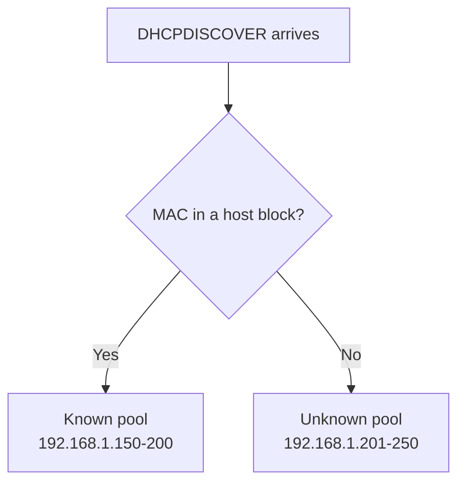

# Allow for Known and Unknown Clients

## Overview

The ISC DHCP server can treat **known** and **unknown** clients differently, drawing each class of client from its own address pool. A client is *known* when its MAC address is declared in a `host` block; every other client is *unknown*. This lets you, for example, give trusted (registered) devices addresses from one range and quarantine guest/unregistered devices in another, all within a single subnet.

## Concepts

| Class | Definition | Matched by |
| --- | --- | --- |
| **Known client** | MAC address is declared in a `host {}` block | `allow known-clients;` |
| **Unknown client** | MAC address is **not** declared anywhere | `allow unknown-clients;` |

A **pool** is the mechanism that scopes these permissions. A `pool {}` block wraps a `range` plus its own `allow`/`deny` rules, so a single subnet can host multiple pools with different admission policies. When a request arrives, the server evaluates each pool's permit list and leases from the first pool whose policy admits the client.



## Configuration

Open the DHCP configuration file for editing:

```bash
vim /etc/dhcp/dhcpd.conf
```

### Split Known and Unknown Clients Into Separate Pools

This example assigns IP addresses from `192.168.1.150 - 192.168.1.200` to known clients and `192.168.1.201 - 192.168.1.250` to unknown clients:

```bash
authoritative;

# Specify network address and subnet mask
subnet 192.168.1.0 netmask 255.255.255.0 {
    # Specify default gateway
    option routers 192.168.1.1;

    # DNS servers for name resolution
    option domain-name-servers 8.8.8.8, 8.8.4.4;

    # Specify broadcast address
    option broadcast-address 192.168.1.255;

    # Default lease time
    default-lease-time 600;

    # Max lease time
    max-lease-time 7200;

    # Pool for known clients
    pool {
        range 192.168.1.150 192.168.1.200;
        allow known-clients;
    }

    # Pool for unknown clients
    pool {
        range 192.168.1.201 192.168.1.250;
        allow unknown-clients;
    }
}

# Define known clients
host win11 {
    hardware ethernet 08:00:27:d6:86:94;
}

host win11-2 {
    hardware ethernet 08:00:27:fd:a8:e3;
}
```

### Restart DHCP Service

After modifying the configuration file, restart the DHCP service:

```bash
systemctl restart dhcpd.service
```

## Directive Reference

| Directive | Effect |
| --- | --- |
| `pool { range ...; }` | Defines a range of IP addresses that the DHCP server can assign. |
| `allow known-clients` | Allows only known clients (defined by `host` blocks) to receive an IP from this pool. |
| `allow unknown-clients` | Allows unknown clients (not defined in `host` blocks) to receive an IP from this pool. |

**Effect of the example above:**

- Known clients are assigned IPs from `192.168.1.150 - 192.168.1.200`.
- Unknown clients are assigned IPs from `192.168.1.201 - 192.168.1.250`.
- Known and unknown clients are handled separately for better network management.

## Commands

Validate and apply the split-pool configuration:

```bash
# Syntax-check the config before restarting
dhcpd -t -cf /etc/dhcp/dhcpd.conf
```

```bash
# Confirm which pool each client landed in
cat /var/lib/dhcpd/dhcpd.leases
```

> [!NOTE]
> **📸 Screenshot**
> _Capture: dhcpd.leases output showing a registered MAC leasing an address in the 192.168.1.150-200 known pool while an unregistered MAC leases from the 192.168.1.201-250 unknown pool_

## Best Practices

> [!TIP]
> Register every trusted device with a `host` block so it lands in the known pool; anything unregistered automatically falls into the unknown pool, giving you a natural onboarding boundary.

- Size the unknown pool conservatively — it is the range exposed to any device that connects, so a small pool limits how many unregistered hosts can be online at once.
- Validate changes with `dhcpd -t -cf /etc/dhcp/dhcpd.conf` before restarting.
- Keep the known and unknown ranges non-overlapping and clearly documented so future edits do not blur the boundary.

## Security Considerations

> [!WARNING]
> Known/unknown classification keys on the **MAC address**, which is trivially spoofable. An attacker who learns a registered MAC can impersonate a known client. Treat this as a management convenience, not an access-control boundary — pair it with switch-level 802.1X or port security for real authentication.

- Isolating unknown clients in their own pool (and ideally their own VLAN) limits the blast radius of an untrusted device.
- Combine with deny lists to actively block specific misbehaving MACs regardless of pool.

## Troubleshooting

| Symptom | Check |
| --- | --- |
| Known device lands in the unknown pool | Confirm its MAC is declared exactly in a `host` block (case/format). |
| Unknown clients get no address | Ensure the unknown pool has a valid `range` and `allow unknown-clients;`. |
| Neither pool leases | Run `dhcpd -t` for syntax errors; check `journalctl -u dhcpd.service`. |

## References

- ISC DHCP `dhcpd.conf(5)` manual page — `pool`, `allow`, and `deny` statements.
- Bundled reference config: `/usr/share/doc/dhcp-server/dhcpd.conf.example`.

## Related
- [DHCP-Server](DHCP-Server.md) — parent DHCP server setup
- [White-or-Allow-list-Clients](White-or-Allow-list-Clients.md) — allow-listing companion policy
- [Black-or-Deny-list-Clients](Black-or-Deny-list-Clients.md) — deny-listing companion policy
- [Reserve-IP-Address](Reserve-IP-Address.md) — pin fixed leases to hosts
- [Linux Administration & Server Hardening](../Readme.md) — Linux administration & server hardening hub
