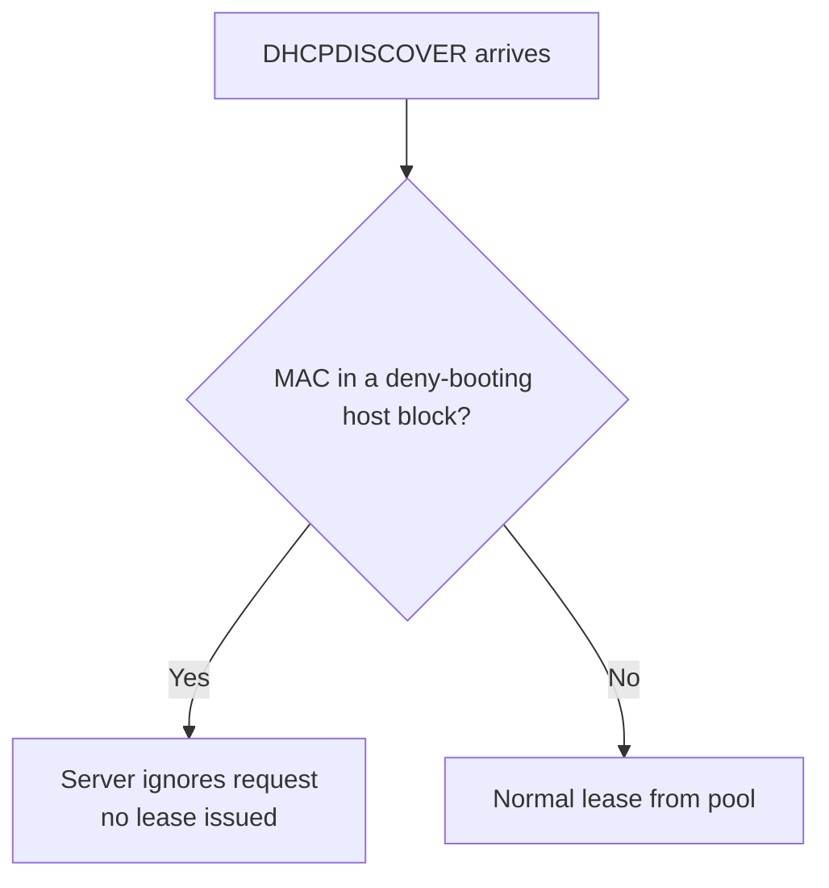

# Black or Deny list Clients

## Overview

You can prevent specific clients from receiving an IP address from the DHCP server by adding them to a deny list using the `deny booting` directive. This is useful for blocking unauthorized or misbehaving devices from obtaining a lease on the network, without changing the address ranges served to everyone else.

## Concepts

Each blocked device is described by a `host {}` block that matches on its MAC address and carries `deny booting;`. When a matching client sends a DHCP request, the server ignores it — no offer, no lease.



## Configuration

- Open the DHCP configuration file for editing:

```bash
vim /etc/dhcp/dhcpd.conf
```

### Deny a Single Client

- This example denies the client with MAC address `08:00:27:ab:46:cf` from getting an IP address:

```bash
authoritative;

# Specify network address and subnet mask
subnet 192.168.1.0 netmask 255.255.255.0 {
    # Specify the range of lease IP address
    range 192.168.1.50 192.168.1.50;
    range 192.168.1.61 192.168.1.210;
    range 192.168.1.231 192.168.1.250;

    # Specify default gateway
    option routers 192.168.1.1;

    # DNS servers for name resolution
    option domain-name-servers 8.8.8.8, 8.8.4.4;

    # Specify broadcast address
    option broadcast-address 192.168.1.255;

    # Default lease time
    default-lease-time 600;

    # Max lease time
    max-lease-time 7200;
}

# Deny specific client from obtaining IP
host win11 {
    hardware ethernet 08:00:27:ab:46:cf;
    deny booting;
}
```

### Deny Multiple Clients

- You can deny multiple clients by adding separate `host` blocks for each MAC address:

```conf
host win11 { hardware ethernet 08:00:27:d6:86:94; deny booting;}
host win11-2 { hardware ethernet 08:00:27:ab:46:cf; deny booting;}
```

### Restart DHCP Service

- After modifying the configuration file, restart the DHCP service:

```bash
systemctl restart dhcpd
```

## Directive Reference

| Directive | Effect |
| --- | --- |
| `hardware ethernet` | The MAC address of the client device. |
| `deny booting` | Prevents the client from receiving an IP address from the DHCP server. |

**Effect:** When a client with a matching MAC address sends a DHCP request, the server will ignore it.

**This is useful for:**

- Blocking unauthorized devices.
- Managing network access.

## Commands

Validate the deny-list changes and confirm the blocked client never gets a lease:

```bash
# Syntax-check the config before restarting
dhcpd -t -cf /etc/dhcp/dhcpd.conf
```

```bash
# The denied MAC should be absent from the leases database
cat /var/lib/dhcpd/dhcpd.leases
```

```bash
# Watch the server ignore the denied DHCPDISCOVER in real time
journalctl -u dhcpd -f
```

> [!NOTE]
> **📸 Screenshot**
> _Capture: journalctl -u dhcpd output showing a DHCPDISCOVER from the denied MAC 08:00:27:ab:46:cf being ignored with no DHCPOFFER sent in response_

## Best Practices

> [!TIP]
> Keep a comment beside each denied `host` block noting *why* the device was blocked and *when* — deny lists accumulate over time and become unmaintainable without context.

- Validate the configuration with `dhcpd -t -cf /etc/dhcp/dhcpd.conf` before restarting.
- Prefer a positive allow-list model for high-security segments (see Related); deny lists only block MACs you already know about.

## Security Considerations

> [!WARNING]
> `deny booting` matches on the **MAC address**, which any attacker can spoof. A blocked device can simply change its MAC to bypass the deny list. Use this as a lightweight administrative control, not as a security boundary — enforce real device authentication with 802.1X / port security at the switch.

- A deny list is inherently reactive: it only stops threats you have already identified. For untrusted networks, combine it with an allow-list or known/unknown pool split.

## Troubleshooting

| Symptom | Check |
| --- | --- |
| Denied device still gets a lease | Confirm the MAC matches exactly and the service was restarted. |
| `dhcpd` won't start after edit | Run `dhcpd -t` for a syntax error in the new `host` block. |
| Need to see who is leasing | `cat /var/lib/dhcpd/dhcpd.leases`, then `journalctl -u dhcpd`. |

## References

- ISC DHCP `dhcpd.conf(5)` manual page — `host`, `hardware ethernet`, and `deny booting` statements.
- Bundled reference config: `/usr/share/doc/dhcp-server/dhcpd.conf.example`.
- IEEE 802.1X and switch port-security guidance for enforcing device identity beyond MAC filtering.

## Related
- [DHCP-Server](DHCP-Server.md) — parent DHCP server setup
- [White-or-Allow-list-Clients](White-or-Allow-list-Clients.md) — inverse allow-list policy
- [Allow-for-Known-and-Unknown](Allow-for-Known-and-Unknown.md) — known/unknown client handling
- [Reserve-IP-Address](Reserve-IP-Address.md) — pin fixed leases to hosts
- [Linux Administration & Server Hardening](../Readme.md) — Linux administration & server hardening hub
