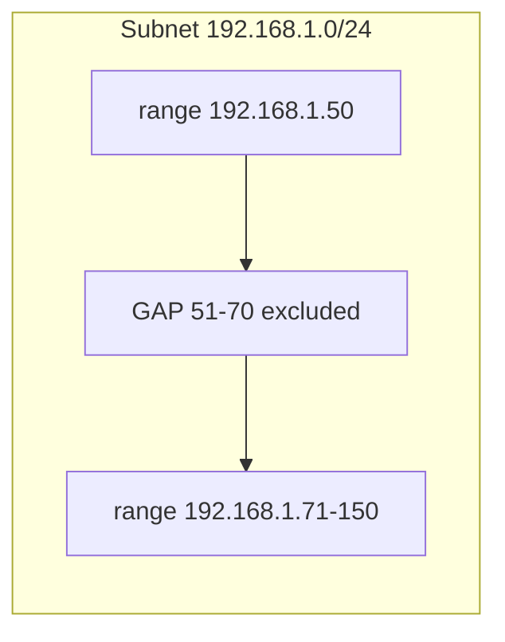

# Configure DHCP Exclusion Range

## Overview

You can define an exclusion range in the DHCP configuration file to prevent certain IP addresses within the subnet from being assigned to clients. The ISC DHCP server has no explicit *exclude* keyword — instead, you carve the pool into multiple `range` statements that skip over the addresses you want to keep out of dynamic allocation. Any address inside the subnet but outside every `range` is effectively excluded.

## Concepts

| Term | Meaning |
| --- | --- |
| **Range** | A contiguous block of addresses the server *may* lease. |
| **Exclusion** | Any subnet address left out of all `range` statements — never handed out dynamically. |
| **Why exclude** | Reserve addresses for routers, printers, servers, or static/manual assignments so DHCP never collides with them. |



## Configuration

- Open the DHCP configuration file for editing:

```bash
vim /etc/dhcp/dhcpd.conf
```

You can define multiple `range` statements to exclude specific IP addresses within the subnet.

### Example 1: Exclude `192.168.1.51` to `192.168.1.70`

This example configures an exclusion between `192.168.1.51` and `192.168.1.70`:

```bash
authoritative;

# Specify network address and subnet mask
subnet 192.168.1.0 netmask 255.255.255.0 {
    # Specify the range of lease IP address
    range 192.168.1.50 192.168.1.50;
    range 192.168.1.71 192.168.1.150;

    # Specify default gateway
    option routers 192.168.1.1;

    # DNS servers for name resolution
    option domain-name-servers 8.8.8.8, 8.8.4.4;

    # Specify broadcast address
    option broadcast-address 192.168.1.255;

    # Default lease time
    default-lease-time 600;

    # Max lease time
    max-lease-time 7200;
}
```

### Example 2: Exclude `192.168.1.51` to `192.168.1.60` and `192.168.1.211` to `192.168.1.230`

You can adjust the ranges to exclude multiple IP ranges by defining separate `range` statements:

```bash
authoritative;

# Specify network address and subnet mask
subnet 192.168.1.0 netmask 255.255.255.0 {
    # Specify the range of lease IP address
    range 192.168.1.50 192.168.1.50;
    range 192.168.1.61 192.168.1.210;
    range 192.168.1.231 192.168.1.250;

    # Specify default gateway
    option routers 192.168.1.1;

    # DNS servers for name resolution
    option domain-name-servers 8.8.8.8, 8.8.4.4;

    # Specify broadcast address
    option broadcast-address 192.168.1.255;

    # Default lease time
    default-lease-time 600;

    # Max lease time
    max-lease-time 7200;
}
```

### Restart DHCP Service

After making changes to the configuration file, restart the DHCP service:

```bash
systemctl restart dhcpd
```

## How the Exclusions Map

Any address inside the subnet but not covered by a `range` is excluded from dynamic assignment. The gap *between* two `range` statements is the exclusion.

| Example | `range` statements | Excluded gap(s) |
| --- | --- | --- |
| Example 1 | `.50`, `.71–.150` | `.51–.70` (plus everything above `.150`) |
| Example 2 | `.50`, `.61–.210`, `.231–.250` | `.51–.60` and `.211–.230` |

This gives you fine-grained control over IP allocation and avoids conflicts with static IP addresses or reserved devices.

## Commands

Validate the split ranges and confirm no lease lands in an excluded gap:

```bash
# Syntax-check the config before restarting
dhcpd -t -cf /etc/dhcp/dhcpd.conf
```

```bash
# Inspect active leases — no address should fall in an excluded gap
cat /var/lib/dhcpd/dhcpd.leases
```

## Best Practices

> [!TIP]
> Reserve a predictable block (for example the low end `.2–.50`) for static infrastructure and keep every `range` above it. Consistent conventions make the leases database easy to reason about.

- Validate with `dhcpd -t -cf /etc/dhcp/dhcpd.conf` before restarting.
- Document what each excluded gap is for so future edits do not accidentally re-include a statically-assigned address.

## Security Considerations

> [!NOTE]
> Excluding addresses is an availability and correctness control, not an access control — it prevents *collisions* with static hosts, but does nothing to authenticate clients. Pair exclusions with reservations, allow/deny lists, and switch-level protections for a hardened deployment.

## Troubleshooting

| Symptom | Check |
| --- | --- |
| Excluded IP still handed out | Confirm no `range` overlaps the excluded addresses. |
| Clients get no lease | Ensure at least one `range` still contains free addresses. |
| `dhcpd` won't start | Run `dhcpd -t`; check `journalctl -u dhcpd`. |
| Static host conflicts | Cross-check static assignments against the served ranges. |

## References

- ISC DHCP `dhcpd.conf(5)` manual page — `subnet` and `range` statements.
- Bundled reference config: `/usr/share/doc/dhcp-server/dhcpd.conf.example`.

## Related
- [DHCP-Server](DHCP-Server.md) — parent DHCP server setup
- [Reserve-IP-Address](Reserve-IP-Address.md) — complementary static reservation
- [Allow-for-Known-and-Unknown](Allow-for-Known-and-Unknown.md) — client admission policy
- [Linux Administration & Server Hardening](../Readme.md) — Linux administration & server hardening hub
