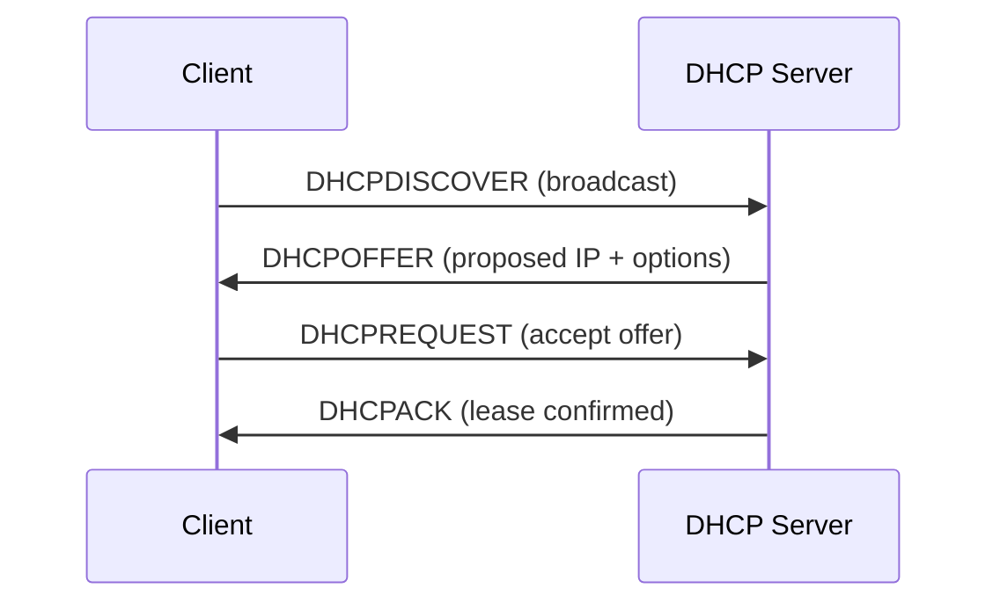
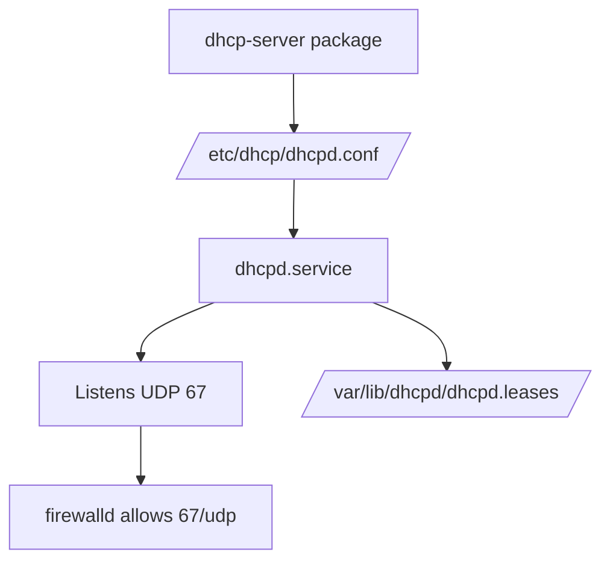

# DHCP Server

## Overview

The **Dynamic Host Configuration Protocol (DHCP)** automatically distributes IP addresses and network parameters (default gateway, DNS servers, broadcast address, lease times) to clients on a network, eliminating error-prone manual configuration. This note is an end-to-end guide to installing, configuring, and operating the ISC DHCP server (`dhcp-server`) on a Red Hat / CentOS / Rocky / AlmaLinux–style system that uses `yum`, `systemd`, and `firewalld`.

> [!NOTE]
> Package and service names shown here (`dhcp-server`, `dhcpd.service`, `firewalld`) target the RHEL family. On Debian/Ubuntu the ISC package is `isc-dhcp-server` and the service is `isc-dhcp-server`, but the `dhcpd.conf` syntax is identical.

## Concepts

| Term | Meaning |
| --- | --- |
| **Lease** | A time-bounded assignment of an IP address to a client, tracked in the leases database. |
| **Scope / subnet** | The `subnet ... netmask ...` block describing an addressable network segment. |
| **Range** | The pool of IP addresses within a subnet that the server may hand out. |
| **`authoritative`** | Declares this server the authority for its networks, allowing it to send `DHCPNAK` to clients holding invalid leases. |
| **Options** | Extra parameters pushed to clients (`routers`, `domain-name-servers`, `broadcast-address`). |
| **Lease time** | How long a client may keep an address before it must renew (`default-lease-time`, `max-lease-time`). |

### DHCP DORA Exchange

DHCP address assignment follows the four-step **DORA** handshake carried over UDP (server port `67`, client port `68`).



## Architecture



## Installation

- List all available repositories to ensure that the DHCP server package is available:

```bash
yum repolist all
```

- Check if the DHCP package is installed:

```bash
rpm -qa | grep dhcp
```

- Install the DHCP server package:

```bash
yum install dhcp-server.x86_64
```

- Check if the DHCP package and the DHCP server are installed:

```bash
rpm -qa | grep dhcp
```

```bash
rpm -qa | grep dhcp-server
```

### Inspect the Installed Package

The `rpm` query flags below help you locate the binary, documentation, and configuration files shipped by the package.

| Command | Purpose |
| --- | --- |
| `rpm -qi dhcp-server` | Display detailed package information |
| `rpm -qd dhcp-server` | List bundled documentation files |
| `rpm -qc dhcp-server` | List configuration files |
| `rpm -ql dhcp-server` | List every file installed by the package |

- Display detailed information about the installed DHCP server package:

```bash
rpm -qi dhcp-server
```

- List the documentation files included with the DHCP server:

```bash
rpm -qd dhcp-server
```

- List the configuration files included with the DHCP server:

```bash
rpm -qc dhcp-server
```

- List all files installed by the DHCP server package:

```bash
rpm -ql dhcp-server
```

## Configuration

- Open the DHCP configuration file for editing:

```bash
vim /etc/dhcp/dhcpd.conf
```

### Sample `dhcpd.conf`

- Below is an example of a basic `dhcpd.conf` configuration file:

```bash

authoritative;

# Specify network address and subnet mask
subnet 192.168.1.0 netmask 255.255.255.0 {
    # Specify the range of lease IP address
    range 192.168.1.50 192.168.1.250;

    # Specify default gateway
    option routers 192.168.1.1;

    # DNS servers for name resolution
    option domain-name-servers 8.8.8.8, 8.8.4.4;

    # Specify broadcast address
    option broadcast-address 192.168.1.255;

    # Default lease time
    default-lease-time 600;

    # Max lease time
    max-lease-time 7200;
}
```

The directives above map to the following behaviour:

| Directive | Role |
| --- | --- |
| `authoritative;` | Marks this server as the authority for the declared subnets. |
| `subnet ... netmask ...` | Declares the network segment being served. |
| `range` | The pool of addresses the server may lease. |
| `option routers` | Default gateway pushed to clients. |
| `option domain-name-servers` | DNS resolvers pushed to clients. |
| `option broadcast-address` | Subnet broadcast address. |
| `default-lease-time` / `max-lease-time` | Lease duration (seconds) if the client does not / does request a specific time. |

> [!TIP]
> A working reference configuration ships with the package. Open it for a fuller set of examples:
> ```bash
> vim /usr/share/doc/dhcp-server/dhcpd.conf.example
> ```

> [!WARNING]
> A subnet with **no** `range` statement serves options but leases no addresses. Every client-facing segment the server is directly attached to must have a matching `subnet` declaration, or `dhcpd` will refuse to start.

## Commands

### Manage the Service

| Action | Command |
| --- | --- |
| Check status | `systemctl status dhcpd.service` |
| Start | `systemctl start dhcpd.service` |
| Restart | `systemctl restart dhcpd.service` |
| Enable at boot | `systemctl enable dhcpd.service` |

- Check Service Status:

```bash
systemctl status dhcpd.service
```

- Start Service:

```bash
systemctl start dhcpd.service
```

- Restart Service:

```bash
systemctl restart dhcpd.service
```

- Enable Service to Start at Boot:

```bash
systemctl enable dhcpd.service
```

### Verify Listening Ports

- Check which ports are open and listening:

```bash
netstat -nltup
```

- Check if DHCP ports are open:

```bash
netstat -nltup | grep dhcp
```

## Update Firewall Rules (firewalld)

- Allow DHCP traffic through `firewalld`:

```bash
firewall-cmd --add-port=67/udp --permanent
```

- Reload the firewall to apply changes:

```bash
firewall-cmd --reload
```

- Check if the DHCP port is open:

```bash
firewall-cmd --list-ports
```

- Alternatively, check the detailed firewall configuration:

```bash
firewall-cmd --list-all
```

> [!TIP]
> `firewalld` also ships a named service for DHCP, which is more descriptive than a raw port rule: `firewall-cmd --add-service=dhcp --permanent`.

## Check DHCP Leases

- Display current DHCP leases:

```bash
cat /var/lib/dhcpd/dhcpd.leases
```

> [!NOTE]
> **📸 Screenshot**
> _Capture: Terminal output of the dhcpd.leases file showing active client leases with IP address, MAC address, lease start/end timestamps, and client hostname_

## Best Practices

- Always run `dhcpd -t -cf /etc/dhcp/dhcpd.conf` to syntax-check the configuration before restarting the service.
- Keep `default-lease-time` short on busy or guest networks so recycled addresses return to the pool quickly; use longer leases on stable infrastructure segments.
- Document every `subnet`, `range`, and reservation so the leases database stays reconcilable with reality.
- Run exactly **one** authoritative DHCP server per broadcast domain unless you have deliberately configured failover peers.

## Security Considerations

> [!IMPORTANT]
> DHCP is unauthenticated by design. Harden the surrounding environment rather than the protocol itself.

- **Rogue DHCP servers**: An attacker on the LAN can answer `DHCPDISCOVER` faster than the legitimate server and hand clients a malicious gateway/DNS (a man-in-the-middle vector). Mitigate with **DHCP snooping** on managed switches, which drops server responses from untrusted ports.
- **Starvation attacks**: Tools that spoof many MAC addresses can exhaust the pool, causing a denial of service. Enforce **port security** (MAC limits per switch port) to contain this.
- **Least exposure**: Bind `dhcpd` only to the interfaces that must serve leases, and restrict `67/udp` to the intended VLANs in `firewalld`.
- **Client control**: Use allow/deny lists and reservations (see Related notes) to constrain which hosts receive addresses.

## Troubleshooting

| Symptom | Likely cause / check |
| --- | --- |
| `dhcpd` fails to start | Run `dhcpd -t` for a syntax error; confirm a `subnet` exists for each served interface. |
| Clients get no address | Verify `67/udp` is open in `firewalld` and the service is `active`. |
| Wrong gateway/DNS on clients | Inspect `option routers` / `option domain-name-servers` in the matching subnet. |
| Address conflicts | Ensure reserved/static IPs sit outside every `range`. |
| Journal detail | `journalctl -u dhcpd.service -e` for runtime errors. |

## References

- ISC DHCP `dhcpd.conf(5)` and `dhcpd(8)` manual pages.
- Bundled reference config: `/usr/share/doc/dhcp-server/dhcpd.conf.example`.
- CIS Benchmarks and NIST SP 800-41 guidance on network service and firewall hardening.

## Related
- [Configure-DHCP-Exclusion-Range](Configure-DHCP-Exclusion-Range.md) — exclude addresses from the pool
- [Reserve-IP-Address](Reserve-IP-Address.md) — pin fixed leases to hosts
- [Allow-for-Known-and-Unknown](Allow-for-Known-and-Unknown.md) — client admission policy
- [White-or-Allow-list-Clients](White-or-Allow-list-Clients.md) — MAC allow-listing
- [Black-or-Deny-list-Clients](Black-or-Deny-list-Clients.md) — MAC deny-listing
- [Readme](../Readme.md) — DHCP module map-of-content
- [Linux Administration & Server Hardening](../Readme.md) — Linux administration & server hardening hub
