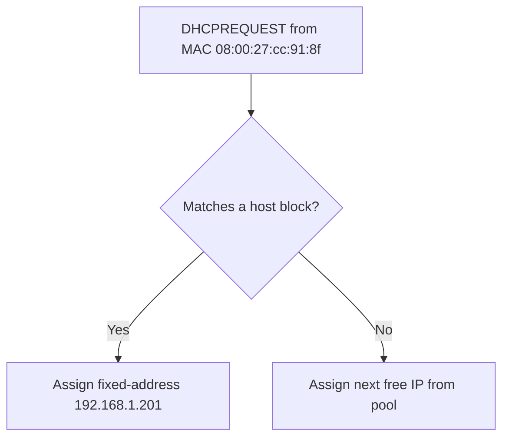

# Reserve IP Address

## Overview

You can reserve specific IP addresses for particular clients based on their MAC addresses in the DHCP configuration file. This ensures that the client **always** gets the same IP address when connecting to the network — a *static lease* (also called a DHCP reservation) that combines the convenience of centrally-managed DHCP with the predictability of a fixed address. Reservations are ideal for printers, servers, NAS units, and any host that other systems reference by IP.

## Concepts

A reservation is a `host {}` block that binds a MAC address (`hardware ethernet`) to a fixed IP (`fixed-address`). When that client requests an address, the server always answers with the reserved IP instead of drawing from the dynamic pool.



## Configuration

- Open the DHCP configuration file for editing:

```bash
vim /etc/dhcp/dhcpd.conf
```

Add a `host` block within (or alongside) the `subnet` configuration to reserve an IP address for a specific MAC address.

### Example 1: Reserve IP Address for a Single Client

This example reserves IP `192.168.1.201` for the client with MAC address `08:00:27:5d:b8:bc`:

```bash
authoritative;

# Specify network address and subnet mask
subnet 192.168.1.0 netmask 255.255.255.0 {
    # Specify the range of lease IP address
    range 192.168.1.50 192.168.1.50;
    range 192.168.1.61 192.168.1.210;
    range 192.168.1.231 192.168.1.250;

    # Specify default gateway
    option routers 192.168.1.1;

    # DNS servers for name resolution
    option domain-name-servers 8.8.8.8, 8.8.4.4;

    # Specify broadcast address
    option broadcast-address 192.168.1.255;

    # Default lease time
    default-lease-time 600;

    # Max lease time
    max-lease-time 7200;
}

# Reserve IP address for specific client
host win11 {
    # MAC address of client for fixed IP
    hardware ethernet 08:00:27:cc:91:8f;
    # Reserved IP address
    fixed-address 192.168.1.201;
}
```

### Example 2: Reserve Multiple IP Addresses

- This example reserves two IP addresses for different clients:

```bash
# Reserve IP for win11
host win11-1 { hardware ethernet 08:00:27:cc:91:8f; fixed-address 192.168.1.201;}
host win11-2 { hardware ethernet 08:00:27:d6:86:94; fixed-address 192.168.1.150;}
```

### Restart DHCP Service

After modifying the configuration file, restart the DHCP service:

```bash
systemctl restart dhcpd.service
```

## Directive Reference

| Directive | Effect |
| --- | --- |
| `hardware ethernet` | The MAC address of the client device. |
| `fixed-address` | The IP address to assign to the specified MAC address. |

**Effect:** When a client with a matching MAC address requests an IP address, the DHCP server will assign the reserved IP.

## Commands

Validate the reservation and confirm the client receives its fixed address:

```bash
# Syntax-check the config before restarting
dhcpd -t -cf /etc/dhcp/dhcpd.conf
```

```bash
# After the client renews, verify the reserved IP was assigned
cat /var/lib/dhcpd/dhcpd.leases
```

> [!NOTE]
> **📸 Screenshot**
> _Capture: dhcpd.leases entry showing MAC 08:00:27:cc:91:8f bound to the reserved fixed-address 192.168.1.201 rather than a dynamic pool address_

## Best Practices

> [!IMPORTANT]
> Reserved IP addresses should be **outside** the DHCP pool range to avoid conflicts. Ensure that the reserved IP addresses are not part of the dynamic IP address range.

- Keep a naming convention in the `host` block labels (`printer-hr`, `nas-01`) so reservations are self-documenting.
- Combine with [Configure-DHCP-Exclusion-Range](Configure-DHCP-Exclusion-Range.md) to carve the reserved addresses out of the dynamic pool.
- Validate with `dhcpd -t -cf /etc/dhcp/dhcpd.conf` before restarting.

## Security Considerations

> [!WARNING]
> A reservation matches on the **MAC address**, which is spoofable. Do not rely on `fixed-address` for access control — an attacker who spoofs a reserved MAC would receive that host's IP. Reservations are for operational predictability; enforce identity with 802.1X / port security.

## Troubleshooting

| Symptom | Check |
| --- | --- |
| Client gets a pool IP, not the reserved one | Confirm the MAC matches exactly and the service was restarted. |
| Address conflict / duplicate IP | Ensure `fixed-address` is not inside any `range`. |
| `dhcpd` won't start | Run `dhcpd -t`; check `journalctl -u dhcpd`. |
| Verify the lease | `cat /var/lib/dhcpd/dhcpd.leases` after the client renews. |

## References

- ISC DHCP `dhcpd.conf(5)` manual page — `host`, `hardware ethernet`, and `fixed-address` statements.
- Bundled reference config: `/usr/share/doc/dhcp-server/dhcpd.conf.example`.

## Related
- [DHCP-Server](DHCP-Server.md) — parent DHCP server setup
- [Configure-DHCP-Exclusion-Range](Configure-DHCP-Exclusion-Range.md) — keep reserved IPs out of the pool
- [Allow-for-Known-and-Unknown](Allow-for-Known-and-Unknown.md) — client admission policy
- [Linux Administration & Server Hardening](../Readme.md) — Linux administration & server hardening hub
