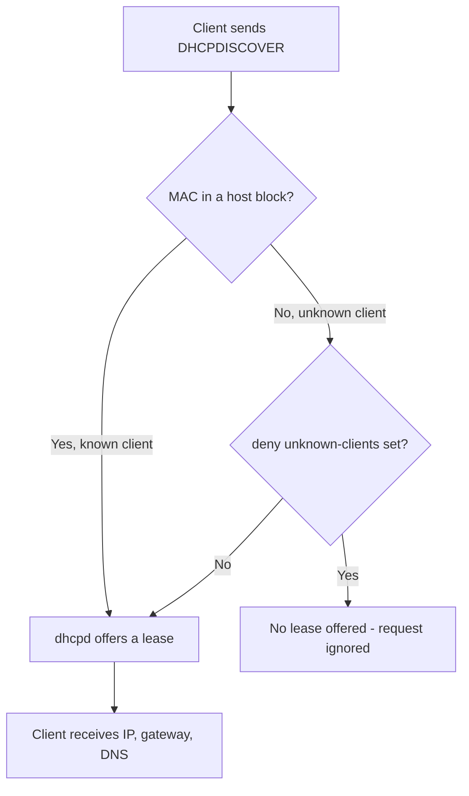

# White or Allow list Clients

## Overview

A DHCP **allow list** (whitelist) restricts address leasing to an explicitly approved set of clients, identified by their MAC (hardware Ethernet) addresses. On the ISC DHCP server (`dhcpd`), this is achieved by declaring each approved device in a `host` block and adding the `deny unknown-clients;` directive to the `subnet` block. Any device whose MAC address is not listed is refused a lease.

This is the inverse of a deny list: instead of blocking a handful of bad actors, you permit only known-good devices and reject everything else — a default-deny posture that aligns with least-privilege network design.

> [!NOTE]
> This note applies to the ISC DHCP server (`isc-dhcp-server` / `dhcpd`). Configuration syntax differs on Kea, `dnsmasq`, and Windows Server DHCP.

## Concepts

| Term | Meaning |
| --- | --- |
| Known client | A client whose `hardware ethernet` (MAC) address matches a `host` declaration in `dhcpd.conf`. |
| Unknown client | A client whose MAC address does not match any `host` declaration. |
| `deny unknown-clients;` | Subnet-scoped directive instructing `dhcpd` to refuse leases to unknown clients. |
| `host` block | A per-device declaration that binds a name and MAC address, marking the client as *known*. |
| Allow list (whitelist) | The resulting policy — only enumerated MAC addresses receive an IP address. |

> [!IMPORTANT]
> MAC-based allow listing is an access-control convenience, not a strong security boundary. MAC addresses are trivially spoofed. Treat it as one layer of defense and pair it with 802.1X / port security on managed switches for real enforcement.

## Architecture

The decision `dhcpd` makes for each incoming `DHCPDISCOVER` is a simple two-step gate: is the client's MAC known, and if not, is unknown-client leasing denied on this subnet?



## Configuration

### Edit the DHCP configuration file

Open the DHCP server configuration file for editing:

```bash
vim /etc/dhcp/dhcpd.conf
```

### Example: allow only specific clients

Declare each approved device in its own `host` block and add `deny unknown-clients;` inside the `subnet` block. The example below permits only the clients with MAC addresses `08:00:27:5d:b8:bc` and `08:00:27:fd:a8:e3` to receive an IP address:

```ini
authoritative;

# Specify network address and subnet mask
subnet 192.168.1.0 netmask 255.255.255.0 {
    # Specify the range of lease IP address
    range 192.168.1.50 192.168.1.50;
    range 192.168.1.61 192.168.1.210;
    range 192.168.1.231 192.168.1.250;

    # Specify default gateway
    option routers 192.168.1.1;

    # DNS servers for name resolution
    option domain-name-servers 8.8.8.8, 8.8.4.4;

    # Specify broadcast address
    option broadcast-address 192.168.1.255;

    # Default lease time
    default-lease-time 600;

    # Max lease time
    max-lease-time 7200;

    # Deny unknown clients from getting an IP address
    deny unknown-clients;
}

# Allow win11 to receive an IP address
host win11 {
    hardware ethernet 08:00:27:5d:b8:bc;
}

# Allow win11-2 to receive an IP address
host win11-2 {
    hardware ethernet 08:00:27:fd:a8:e3;
}
```

### Restart the DHCP service

After modifying the configuration file, apply the changes by restarting the service:

```bash
systemctl restart dhcpd.service
```

> [!TIP]
> Validate configuration syntax before restarting to avoid taking the service down on a typo: `dhcpd -t -cf /etc/dhcp/dhcpd.conf`. The service unit name may be `isc-dhcp-server.service` on Debian/Ubuntu rather than `dhcpd.service`.

### Directive reference

| Directive | Scope | Purpose |
| --- | --- | --- |
| `authoritative;` | global / subnet | Declares this server as the authoritative DHCP source, allowing it to send DHCPNAK to misconfigured clients. |
| `hardware ethernet <MAC>;` | host | The MAC address of the client device; this is what marks the client as *known*. |
| `deny unknown-clients;` | subnet | Prevents any device not explicitly listed in a `host` block from getting an IP address. |
| `range <start> <end>;` | subnet | Pool of addresses available for lease to permitted clients. |

**Effect:** only the clients enumerated in `host` blocks are able to obtain an IP address from the DHCP server. All other devices are silently refused.

## Commands

Operational commands for validating, applying, and observing an allow-list configuration:

| Task | Command |
| --- | --- |
| Test config syntax before applying | `dhcpd -t -cf /etc/dhcp/dhcpd.conf` |
| Restart the DHCP service | `systemctl restart dhcpd.service` |
| Check service status | `systemctl status dhcpd.service` |
| Follow the DHCP log for lease decisions | `journalctl -u dhcpd -f` |
| Find a client's MAC on Linux | `ip link` |
| Find a client's MAC on Windows | `ipconfig /all` |
| Detect rogue DHCP servers on the segment | `nmap --script broadcast-dhcp-discover` |

> [!TIP]
> Always run `dhcpd -t` after editing `dhcpd.conf`. A single syntax error prevents `dhcpd` from starting, which — under an allow-list policy — locks out *every* client, not just the one you edited.

## Best Practices

- Keep one `host` block per device with a descriptive name so audits and troubleshooting are readable.
- Combine allow listing with **fixed-address reservations** when specific devices must always receive the same IP — see [Reserve-IP-Address](Reserve-IP-Address.md).
- Document the source of each approved MAC address (asset inventory, CMDB) so stale entries can be pruned.
- Version-control `/etc/dhcp/dhcpd.conf` so changes are reviewable and reversible.
- Reserve address ranges deliberately; do not let allow-listed hosts and dynamic pools overlap unexpectedly.

## Security Considerations

- **MAC spoofing:** an attacker who observes an approved MAC on the wire can clone it and bypass the allow list. Enforce identity at layer 2 with 802.1X / MAB and switch port security where the network supports it.
- **Rogue DHCP:** allow listing on your server does nothing against a rogue DHCP server on the same broadcast domain. Enable DHCP snooping on managed switches to protect clients.
- **Default-deny alignment:** `deny unknown-clients;` implements a least-privilege network-access model consistent with CIS and NIST guidance — prefer it over deny lists where the client set is known and stable.
- **Fail-safe review:** because unknown clients receive no lease, a missing or fat-fingered `host` entry silently locks a legitimate device out. Review changes carefully and monitor lease grants after edits.

## Troubleshooting

| Symptom | Likely cause | Check |
| --- | --- | --- |
| Approved client gets no IP | MAC typo or missing `host` block | Confirm the client's MAC with `ip link` / `ipconfig /all`; match it exactly in `dhcpd.conf`. |
| All clients denied | Syntax error stopped `dhcpd` | `dhcpd -t -cf /etc/dhcp/dhcpd.conf`; inspect `journalctl -u dhcpd`. |
| Unknown client still gets a lease | `deny unknown-clients;` missing from that subnet, or a second DHCP server answered | Verify the directive is inside the correct `subnet` block; watch for rogue servers with `nmap --script broadcast-dhcp-discover`. |
| Wrong lease values | Edited file not applied | Restart the service and confirm with `systemctl status dhcpd.service`. |

> [!NOTE]
> **📸 Screenshot**
> _Capture: Terminal showing journalctl -u dhcpd output where a known host receives DHCPOFFER while an unknown MAC is logged without a lease_

## References

- ISC DHCP `dhcpd.conf(5)` manual page — `man dhcpd.conf`
- ISC DHCP `dhcpd(8)` manual page — `man dhcpd`
- CIS Benchmarks / NIST SP 800-41 — network access control and default-deny guidance

## Related

- [DHCP-Server](DHCP-Server.md) — parent DHCP server setup and installation
- [Black-or-Deny-list-Clients](Black-or-Deny-list-Clients.md) — inverse deny-list policy for blocking specific MACs
- [Allow-for-Known-and-Unknown](Allow-for-Known-and-Unknown.md) — mixing known and unknown client handling in one server
- [Reserve-IP-Address](Reserve-IP-Address.md) — bind a fixed IP to an allow-listed host
- [Configure-DHCP-Exclusion-Range](Configure-DHCP-Exclusion-Range.md) — carve out addresses from the lease pool
- [Readme](../Readme.md) — DHCP module index
- [Linux Administration & Server Hardening](../Readme.md) — Linux administration & server hardening hub
