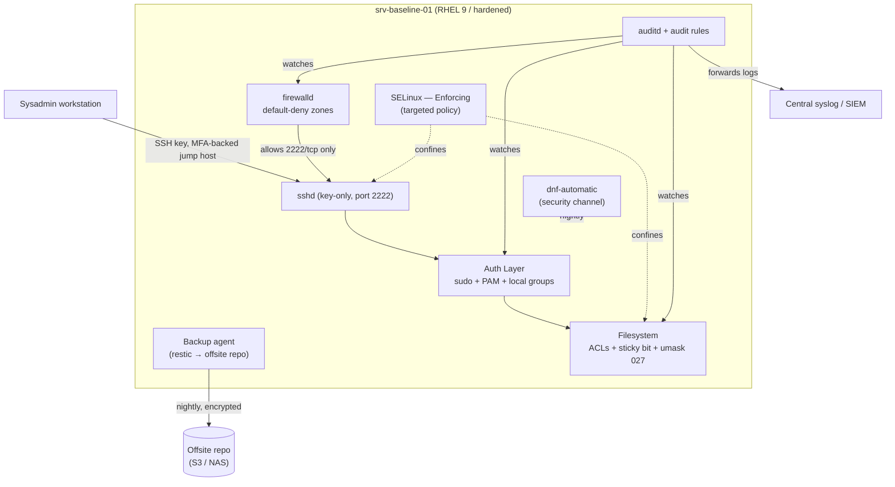
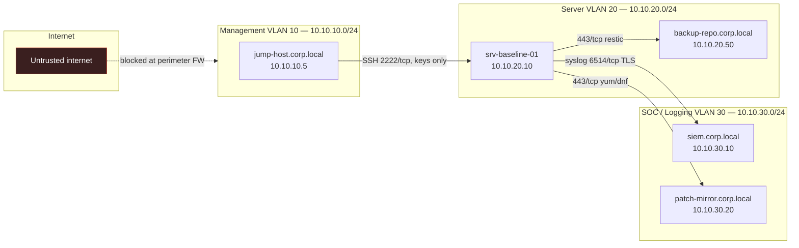

# Project 01 — Enterprise Linux Server Baseline

## Overview

A mid-size company is standing up a new RHEL/CentOS-family server that will act as the **golden image** for every future Linux host in the fleet — the box every auditor, new sysadmin, and compliance scanner will point to first. The goal is a single hardened server that enforces least-privilege administration, encrypted remote access, a default-deny network posture, mandatory access control (SELinux enforcing, or AppArmor on Debian-family hosts), tamper-evident logging via `auditd`, unattended security patching, and a verified backup/restore path — all mapped to CIS Benchmark and NIST 800-53 controls so it can pass an internal audit on day one.

This capstone integrates:
- [Users, Groups & Permissions](../Users-Groups-and-Permissions/Readme.md) — accounts, `sudo`, ACLs, and the principle of least privilege
- [SSH Secure Shell Server](../SSH-Secure-Shell-Server/Readme.md) — key-only remote administration
- [Security, Firewall & Monitoring](../Security-Firewall-and-Monitoring/Readme.md) — `firewalld`, auditing, and intrusion visibility

> [!NOTE]
> **Why this matters**
> Every other project in this course (web, DNS, DHCP, file services) assumes it is deployed *on top of* a host that already looks like this one. Treat this note as the reusable baseline — clone it, then layer the service-specific project on top.

## Architecture



## Network Diagram



## Prerequisites

| Host / Role | Hostname | IP Address | OS | CPU / RAM / Disk | Notes |
|---|---|---|---|---|---|
| Baseline server | `srv-baseline-01` | 10.10.20.10 | RHEL 9 / AlmaLinux 9 | 2 vCPU / 4 GB / 40 GB | Target of this build |
| Jump/bastion host | `jump-host` | 10.10.10.5 | RHEL 9 | 2 vCPU / 2 GB / 20 GB | Only host allowed to reach `sshd` on 2222 |
| Central log server | `siem.corp.local` | 10.10.30.10 | rsyslog + TLS | — | Receives `auditd`/journal forwarding |
| Backup repository | `backup-repo.corp.local` | 10.10.20.50 | restic REST server | 1 TB | Offsite copy also required (S3 bucket) |
| Patch mirror | `patch-mirror.corp.local` | 10.10.30.20 | Red Hat Satellite / local mirror | — | `dnf-automatic` security channel source |
| Admin account | `svc-admin` | — | — | — | Named account, MFA on the jump host, `sudo` via group `wheel` |

## Configuration

### 1. Accounts, groups, and sudo (least privilege)

```bash
# Create a dedicated admin group and a named (non-shared) account per admin
groupadd --gid 3000 sysadmins
useradd -m -u 3001 -G sysadmins -s /bin/bash svc-admin
passwd -l root                       # lock the root password — no direct root login, ever

# Grant sudo via a drop-in, not by editing /etc/sudoers directly
cat <<'EOF' > /etc/sudoers.d/10-sysadmins
%sysadmins ALL=(ALL) ALL
Defaults:%sysadmins timestamp_timeout=5
Defaults:%sysadmins logfile="/var/log/sudo.log"
Defaults    use_pty
EOF
visudo -cf /etc/sudoers.d/10-sysadmins   # syntax-check before it's live
chmod 440 /etc/sudoers.d/10-sysadmins
```

```bash
# Default umask + password aging (CIS 5.4.x)
sed -i 's/^umask.*/umask 027/' /etc/bashrc /etc/profile
cat <<'EOF' >> /etc/login.defs
PASS_MAX_DAYS   90
PASS_MIN_DAYS   7
PASS_WARN_AGE   14
EOF
```

### 2. SSH hardening (`/etc/ssh/sshd_config.d/99-hardening.conf`)

```conf
# 99-hardening.conf — drop-in, keeps distro defaults intact
Port 2222
AddressFamily inet
ListenAddress 10.10.20.10

PermitRootLogin no
PasswordAuthentication no
KbdInteractiveAuthentication no
PubkeyAuthentication yes
AuthenticationMethods publickey

AllowGroups sysadmins
MaxAuthTries 3
LoginGraceTime 30
ClientAliveInterval 300
ClientAliveCountMax 2

X11Forwarding no
AllowTcpForwarding no
PermitEmptyPasswords no

# Restrict source to the bastion only (belt-and-suspenders with firewalld)
Match Address 10.10.10.5
    PermitTTY yes
Match Address *,!10.10.10.5
    DenyUsers *
```

### 3. firewalld — default-deny posture

```bash
firewall-cmd --set-default-zone=drop
firewall-cmd --permanent --new-service=ssh-mgmt
firewall-cmd --permanent --service=ssh-mgmt --set-short="Hardened SSH"
firewall-cmd --permanent --service=ssh-mgmt --add-port=2222/tcp

firewall-cmd --permanent --zone=drop --add-service=ssh-mgmt
firewall-cmd --permanent --zone=drop --add-source=10.10.10.5/32 \
    --add-rich-rule='rule family="ipv4" source address="10.10.10.5" service name="ssh-mgmt" accept'

# Egress for patching, syslog, backup
firewall-cmd --permanent --zone=drop --add-rich-rule='rule family="ipv4" destination address="10.10.30.20" port port="443" protocol="tcp" accept'
firewall-cmd --permanent --zone=drop --add-rich-rule='rule family="ipv4" destination address="10.10.30.10" port port="6514" protocol="tcp" accept'
firewall-cmd --permanent --zone=drop --add-rich-rule='rule family="ipv4" destination address="10.10.20.50" port port="443" protocol="tcp" accept'
firewall-cmd --reload
```

### 4. SELinux — enforcing, targeted policy

```bash
# /etc/selinux/config
sed -i 's/^SELINUX=.*/SELINUX=enforcing/;s/^SELINUXTYPE=.*/SELINUXTYPE=targeted/' /etc/selinux/config

# sshd listening on non-standard port needs an explicit SELinux port label
semanage port -a -t ssh_port_t -p tcp 2222
restorecon -Rv /etc/ssh
```

*Debian/Ubuntu equivalent — AppArmor:*

```bash
aa-enforce /etc/apparmor.d/usr.sbin.sshd
aa-status | grep sshd
```

### 5. auditd — tamper-evident logging (`/etc/audit/rules.d/hardening.rules`)

```conf
## Identity & privilege
-w /etc/passwd -p wa -k identity
-w /etc/group -p wa -k identity
-w /etc/sudoers -p wa -k privilege_escalation
-w /etc/sudoers.d/ -p wa -k privilege_escalation

## Auth events
-w /var/log/faillog -p wa -k logins
-w /var/run/utmp -p wa -k session

## SSH config drift
-w /etc/ssh/sshd_config -p wa -k sshd_config
-w /etc/ssh/sshd_config.d/ -p wa -k sshd_config

## Immutable — makes rule changes require a reboot (CIS 4.1.1.3)
-e 2
```

```bash
augenrules --load
systemctl enable --now auditd

# Forward journal + audit to central SIEM over TLS
cat <<'EOF' >> /etc/rsyslog.d/90-siem-forward.conf
action(type="omfwd" target="siem.corp.local" port="6514" protocol="tcp"
       StreamDriver="gtls" StreamDriverMode="1" StreamDriverAuthMode="x509/name")
EOF
systemctl restart rsyslog
```

### 6. Automatic security updates (`/etc/dnf/automatic.conf`)

```ini
[commands]
upgrade_type = security
random_sleep = 300
download_updates = yes
apply_updates = yes

[emitters]
emit_via = motd,command
```

```bash
systemctl enable --now dnf-automatic.timer
```

### 7. Backup — restic to offsite repo, verified restore

```bash
cat <<'EOF' > /etc/restic/env
RESTIC_REPOSITORY=rest:https://backup-repo.corp.local:8000/srv-baseline-01
RESTIC_PASSWORD_FILE=/etc/restic/passwd
EOF
chmod 600 /etc/restic/env /etc/restic/passwd

# Nightly backup + weekly prune, via systemd timer (not raw cron)
cat <<'EOF' > /etc/systemd/system/restic-backup.service
[Unit]
Description=Restic backup of srv-baseline-01
[Service]
Type=oneshot
EnvironmentFile=/etc/restic/env
ExecStart=/usr/bin/restic backup /etc /home /var/log --tag nightly
ExecStartPost=/usr/bin/restic forget --keep-daily 7 --keep-weekly 4 --prune
EOF

cat <<'EOF' > /etc/systemd/system/restic-backup.timer
[Timer]
OnCalendar=*-*-* 01:30:00
Persistent=true
[Install]
WantedBy=timers.target
EOF
systemctl enable --now restic-backup.timer
```

## Security Controls

| Control | CIS / NIST Reference | Implementation in this build |
|---|---|---|
| No direct root login | CIS 5.2.10, NIST AC-6 | `PermitRootLogin no`; root password locked with `passwd -l` |
| Key-only SSH auth | CIS 5.2.4, NIST IA-5 | `PasswordAuthentication no`; `AuthenticationMethods publickey` |
| Non-default SSH port + source restriction | CIS 5.2.x (org-defined), NIST SC-7 | `Port 2222`; `AllowGroups sysadmins`; `Match Address` block limits to bastion |
| Named, auditable admin accounts | CIS 5.4.1, NIST AC-2 | One `useradd` per admin, no shared `admin` login; `%sysadmins` sudo group |
| `sudo` logging & PTY requirement | CIS 5.3.4, NIST AU-2 | `Defaults use_pty`, `logfile=/var/log/sudo.log` in `/etc/sudoers.d/10-sysadmins` |
| Default-deny firewall | CIS 3.4.1, NIST SC-7(5) | `firewalld` default zone `drop`; explicit allow rules only |
| Mandatory access control enforcing | CIS 1.6.1.2, NIST AC-3, AC-25 | SELinux `enforcing` / targeted (AppArmor `aa-enforce` on Debian hosts) |
| Immutable audit trail | CIS 4.1.1.3, NIST AU-9 | `-e 2` in audit rules; `/etc/audit/rules.d/` watches on identity + sudoers |
| Centralized, encrypted log forwarding | CIS 4.2.1.1, NIST AU-4 | rsyslog `omfwd` with `gtls` to `siem.corp.local:6514` |
| Automated security patching | CIS 1.2.2, NIST SI-2 | `dnf-automatic.timer`, `upgrade_type = security` |
| Password aging policy | CIS 5.4.1.1–.3, NIST IA-5(1) | `PASS_MAX_DAYS 90`, `PASS_MIN_DAYS 7`, `PASS_WARN_AGE 14` in `login.defs` |
| Restrictive default umask | CIS 5.4.4, NIST AC-6 | `umask 027` in `/etc/bashrc` and `/etc/profile` |
| Encrypted, tested backups | NIST CP-9, CP-10 | `restic` repo over TLS to offsite target; restore verified in Validation |

## Deployment Steps

1. Provision `srv-baseline-01` (RHEL 9 minimal install) on VLAN 20 with static IP `10.10.20.10`.
2. Patch to current: `dnf update -y && reboot`.
3. Create `sysadmins` group and named admin accounts; lock the root password (Configuration §1).
4. Install and enroll each admin's SSH public key: `ssh-copy-id -p 22 svc-admin@10.10.20.10` (before the port change).
5. Drop in `/etc/ssh/sshd_config.d/99-hardening.conf` and validate syntax: `sshd -t`.
6. Restart `sshd`, then **from the jump host only**, confirm login on the new port before closing the current session: `ssh -p 2222 svc-admin@10.10.20.10`.
7. Configure `firewalld` zones and rules (Configuration §3); `firewall-cmd --reload`.
8. Set SELinux to `enforcing`, add the `ssh_port_t` label for 2222, `restorecon -Rv /etc/ssh`, reboot to confirm the boot-time relabel is clean.
9. Deploy `auditd` rules, load with `augenrules --load`, enable the service, confirm `auditctl -s` shows `enabled 1`.
10. Configure rsyslog TLS forwarding to `siem.corp.local`; confirm events arrive on the SIEM side.
11. Enable `dnf-automatic.timer` and confirm a dry-run: `dnf-automatic --timer`.
12. Configure the `restic` repository, environment file, and systemd timer; run one manual backup: `systemctl start restic-backup.service`.
13. Run a full restore drill into a scratch directory to prove the backup is usable (Validation §5).
14. Run a CIS-benchmark scan (`openscap` or `oscap-ssg`) against the host and file any deltas as follow-up tickets.

> [!NOTE]
> **📸 Screenshot**
> _Capture: `oscap xccdf eval` CIS-profile summary report showing pass/fail counts for `srv-baseline-01`._

## Validation

1. Root login is refused:
```text
$ ssh -p 2222 root@10.10.20.10
Permission denied (publickey).
```

2. Password auth is refused, key auth succeeds:
```text
$ ssh -p 2222 -o PubkeyAuthentication=no svc-admin@10.10.20.10
Permission denied (publickey).

$ ssh -p 2222 -i ~/.ssh/svc-admin_ed25519 svc-admin@10.10.20.10
Last login: Wed Jul 22 01:40:11 2026 from 10.10.10.5
[svc-admin@srv-baseline-01 ~]$
```

3. Firewall default-deny confirmed from an unauthorized host:
```text
$ nmap -p 2222 10.10.20.10 --source-port 4444 (from non-bastion host)
PORT     STATE    SERVICE
2222/tcp filtered ssh
```

4. SELinux enforcing and sshd running confined:
```text
$ getenforce
Enforcing

$ ps -eZ | grep sshd
system_u:system_r:sshd_t:s0-s0:c0.c1023  1421 ?  00:00:00 sshd
```

5. Audit trail captures a sudoers edit:
```text
$ ausearch -k privilege_escalation -ts recent
type=PATH msg=audit(1753142411.221:88): item=0 name="/etc/sudoers.d/10-sysadmins" ...
type=SYSCALL msg=audit(1753142411.221:88): ... success=yes exit=0 ... comm="visudo"
```

6. Restore drill succeeds and integrity checks pass:
```text
$ restic restore latest --target /tmp/restore-test
restored /etc, /home, /var/log to /tmp/restore-test

$ restic check
using temporary cache in /tmp/restic-check-cache
no errors were found
```

7. `dnf-automatic` applied the last security patch batch:
```text
$ grep -c updated /var/log/dnf.log | tail -1
14 packages upgraded
```

## Future Improvements

- Replace static SSH `Match Address` allow-listing with a short-lived certificate authority (e.g., HashiCorp Vault SSH secrets engine) so keys expire automatically.
- Add `AIDE` file-integrity monitoring alongside `auditd` for a second tamper-detection layer.
- Wrap the manual `oscap` scan into a nightly OpenSCAP + Ansible remediation pipeline for continuous compliance drift detection.
- Integrate `fail2ban` on the jump host to rate-limit and ban repeat auth failures before they reach this server.
- Move secrets (`restic` password, TLS keys) out of flat files and into a proper secrets manager (Vault, SOPS + age).

## References

- CIS Red Hat Enterprise Linux 9 Benchmark
- NIST SP 800-53 Rev. 5 — AC-2, AC-3, AC-6, AU-2, AU-4, AU-9, IA-5, SC-7, SI-2
- Red Hat Enterprise Linux 9 Security Hardening Guide
- `man 5 sshd_config`, `man 8 auditd`, `man 8 semanage`
- restic documentation — https://restic.readthedocs.io

## Related Notes

- [Sudo](../Users-Groups-and-Permissions/Sudo.md)
- [User and Group Management](../Users-Groups-and-Permissions/User-and-Group-Management.md)
- [SSH (Secure Shell) Server](../SSH-Secure-Shell-Server/SSH(Secure-Shell)-Server.md)
- [Change Default SSH Port](../SSH-Secure-Shell-Server/Change-Default-SSH-Port.md)
- [Prevent Root Login via SSH](../SSH-Secure-Shell-Server/Prevent-Root-Login-via-SSH.md)
- [Firewalld](../Security-Firewall-and-Monitoring/Firewalld.md)
- [Reset Root Password and Protect GRUB Boot Loader](../Security-Firewall-and-Monitoring/Reset-Root-Password-and-Protect-GRUB-Boot-Loader.md)
- [Linux Administration & Server Hardening](../Readme.md) — course hub and map of content
